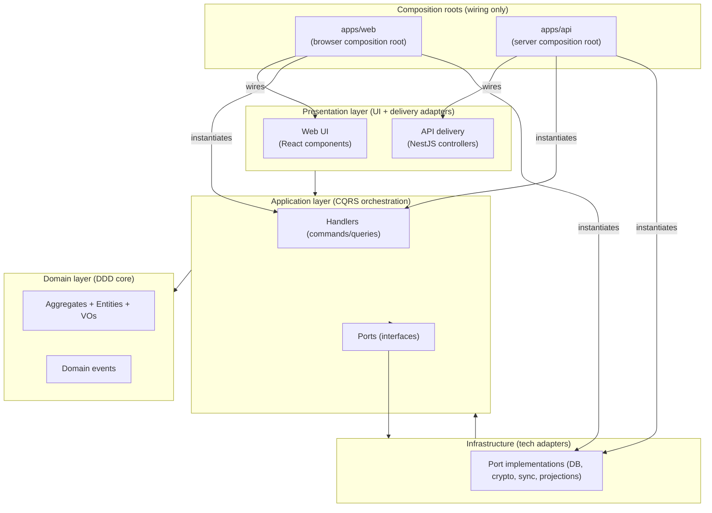
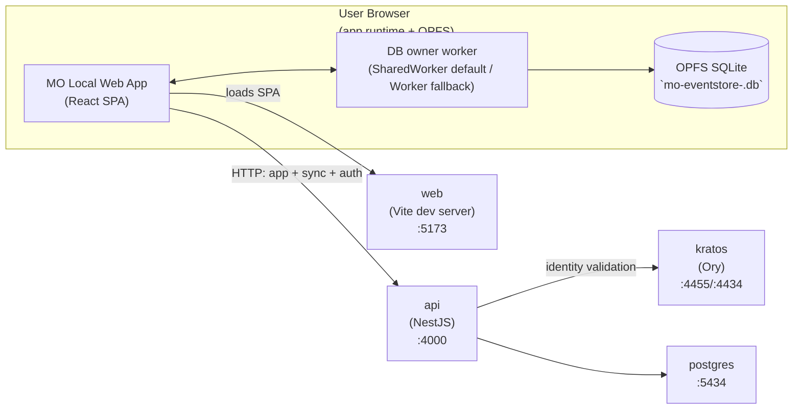

# MO Local Architecture

**Status**: living document  
**Last Updated**: 2026-01-01

This is the top-level architecture overview. Detailed contracts live in topical docs under `docs/architecture/`, and decisions are recorded in `docs/adr/`.

Documentation follows the same design principles as code (cohesion, coupling, single responsibility). This overview stays small and links out to topic-owned docs to avoid “god docs”. See `docs/architecture/README.md`.

## What this system is

MO Local is a local-first, event-sourced app:

- The **source of truth is the local event log** (OPFS SQLite in the browser).
- Derived state (read models, snapshots, search indexes) is **rebuildable** from events.
- Sync is **server-coordinated ordering** over an encrypted record stream; the server stores ciphertext and necessary metadata but **cannot decrypt payloads**.

## Principles (the non-negotiables)

- **DDD layering**: Domain is dependency-free core; Application orchestrates use cases via ports; Infrastructure implements ports; Presentation delivers UX and invokes use cases. See `docs/architecture/layering-and-boundaries.md`.
- **CQRS**: Commands/queries are data-only; handlers contain orchestration logic; derived state is event-driven (no direct read-model writes in handlers). See `docs/architecture/application-layer.md`.
- **Event sourcing as durability boundary**: Persist events first; everything else is cache. See `docs/architecture/infrastructure-layer.md`.
- **Dual-order model**: Publish local commits in `commitSequence`, but rebuild derived state in `effectiveTotalOrder`. See `docs/architecture/workflows.md` and `docs/invariants.md`.
- **ZK encryption boundary**: Payloads/snapshots are encrypted client-side; the server never has user keys. See `docs/security.md` and `docs/security/key-management.md`.
- **Byte preservation (current boundary)**: Synced records are stored/returned as `record_json` TEXT without re-stringifying under the current JS boundary. See `docs/architecture/infrastructure-layer.md`.
- **Recovery-first**: Reset/wipe + restore flows must exist and be safe; diagnostics must be secret-free. See `docs/architecture/failure-modes.md` and `docs/security/incident-response-and-recovery.md`.

## Key invariants (canonical list)

Invariants live in `docs/invariants.md` and are referenced throughout topic docs and tests. The most central ones:

- `INV-001` — Synced events are immutable
- `INV-002` — Derived state uses `effectiveTotalOrder`
- `INV-003` — Publish-after-commit uses `commitSequence`
- `INV-004` — Sync record bytes are preserved
- `INV-006` — ZK encryption boundary

## At a glance

**Runtime units**

- **Browser client**: `apps/web` (React UI + local event store + sync engine + derived state)
- **Server**: `apps/api` (NestJS controllers + sync persistence + auth integration)

**Dependency direction**

`Presentation → Application → Domain`  
`Infrastructure → Application → Domain`

## Layering diagram (simplified)

**Composition roots** (`apps/web`, `apps/api`) are the wiring layer: they instantiate implementations and connect them to ports/handlers. They are **not** “the presentation layer”.

## Deployment (local dev stack today)

**Important nuance**: The event store DB is not in Docker. It lives in the user’s browser via OPFS (SQLite) and is owned by a worker (`@mo/eventstore-web`).

## Where to go next (curated)

- Layering + boundaries: `docs/architecture/layering-and-boundaries.md`
- Core workflows (sync, projections, publish-after-commit): `docs/architecture/workflows.md`
- Serialization/registry/versioning (ALC-301): `docs/architecture/serialization-and-event-specs.md`
- Infrastructure durability + sync boundary contracts: `docs/architecture/infrastructure-layer.md`
- Security model overview: `docs/security.md`
- Runbooks (operational playbooks): `docs/runbooks/`

For the full topic list, browse `docs/architecture/`.

## How this documentation evolves

Doc process and templates live in `docs/README.md`. Architectural changes should update:

- the relevant topic doc(s),
- `docs/invariants.md` + tests (when contracts change),
- an ADR (when a durable decision was made),
- an RFC (when a proposal is still in flux).

## Decisions and proposals

- ADRs: `docs/adr/`
- RFCs: `docs/rfcs/`
- Invariant registry: `docs/invariants.md`
- Security docs: `docs/security/`
