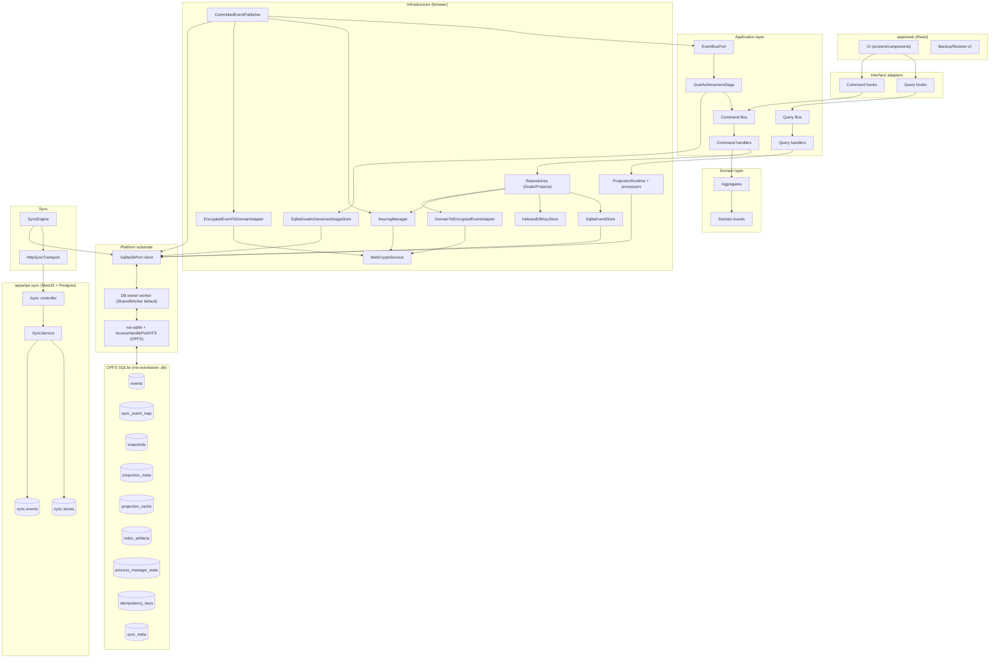

# MO Local Architecture

**Status**: living document  
**Last Updated**: 2025-12-31

This document is the long-lived reference for the architecture implemented so far in this monorepo. It is intentionally grounded in what exists today and captures the key architecture decisions (ADRs) that shaped the current implementation.

This is not a “how to run the app” manual; that belongs in `README.md`.

## 1. Purpose, scope, and audience

**Purpose**

- Provide a single, stable source of truth for architecture: boundaries, contracts, workflows, and decisions.
- Prevent drift: future refactors/features should reference this doc and ADRs first.

**Scope**

- Layers: **Domain**, **Application**, **Infrastructure**, **Interface**.
- Bounded contexts implemented so far: Goals, Projects, Identity (local), Sync (backend).
- Serialization + sync contracts established in ALC-301: versioning ownership, byte-preservation, commit boundary, conflict model.

**Audience**

- Engineers making changes to domain/events, persistence, sync, crypto, projections, or cross-BC coordination.

## 2. Document invariants

- This document describes **architectural contracts** and **decision rationale**, not a directory tour.
- The repo map lives in `README.md` (this doc avoids duplicating file trees).
- Where file paths are referenced, they are grounding-only; if they move, update the reference immediately.

## 3. Layering and boundaries

**Dependency direction**

`Interface → Application → Domain`  
`Infrastructure → Application → Domain`

Hard rules:

- **Domain** has no runtime dependencies and owns invariants.
- **Application** orchestrates use-cases and exposes ports; it does not know SQLite/OPFS/IndexedDB/WebCrypto/HTTP/Postgres.
- **Infrastructure** implements ports and owns all persistence/crypto/sync/projection mechanisms.
- **Interface** is the UI adapter; it does not “reach into” infrastructure directly.

## 4. Glossary (terminology we must keep consistent)

- **aggregateId**: identifier of a Goal/Project aggregate instance.
- **eventType**: stable discriminator string for domain events (e.g. `GoalCreated`).
- **version**: per-aggregate monotonically increasing event version (local OCC uses this).
- **commitSequence**: local, durable commit order (`events.commit_sequence`) assigned on insert.
- **storeId**: local store namespace used for DB + sync; anchored to the local user’s root identity (`userId`).
- **globalSequence**: server-assigned monotonically increasing ordering for a store’s sync stream; persisted locally via `sync_event_map`.
- **effectiveTotalOrder**: deterministic derived-state ordering: first `globalSequence` (synced region), then `pendingCommitSequence` (local-only region).
- **payloadVersion**: schema version for an event payload inside the encrypted envelope.
- **byte-preservation**: a boundary contract that serialized payload bytes must remain stable for already-synced events (see §8.6).

## 5. End-to-end workflows (contracts over mechanisms)

### 5.1 Write path (command → commit)

1. UI dispatches a typed command via a BC command bus (through interface hooks).
2. Application handler loads the aggregate via repository port, checks `knownVersion`, applies domain behavior, and collects uncommitted events.
3. Infrastructure repository:
   - serializes each domain event using the unified eventing runtime (§8.2),
   - encrypts the payload envelope with the aggregate key (AES-GCM + AAD),
   - appends to the local SQLite `events` table via `SqliteDbPort` (durable boundary),
   - and relies on projection processors and post-commit streaming for derivations.

**Contract**

- If `knownVersion` mismatches, the handler fails with `ConcurrencyError` (no silent overwrites on-device).
- “Durable” means “persisted into OPFS-backed SQLite”; anything else must be derivable/replayable.

### 5.2 Read path (projections → read model → UI)

1. Projection processors consume committed encrypted events from the `events` table (and `sync_event_map` when using `effectiveTotalOrder`).
2. They maintain encrypted snapshots + analytics/search indices and expose in-memory projections.
3. Application queries depend only on `*ReadModel` ports; UI subscribes via projection ports.

**Contract**

- UI never reads encrypted tables directly; it consumes read models/projection ports.
- Projections are rebuildable from committed event tables.

### 5.3 Publication path (post-commit → event bus)

1. `CommittedEventPublisher` streams **committed** events from the `events` table ordered by `commitSequence`.
2. It decrypts and rehydrates domain events and publishes them on `EventBusPort`.
3. It persists a cursor per stream to guarantee replayability and avoid double-publish on reload.

**Contract**

- No “publish while persisting pending events” side effects in command handlers.
- Publication is eventually consistent with commits but replay-safe.

### 5.4 Sync path (MO Sync Engine protocol)

1. `SyncEngine` pushes/pulls a store’s encrypted records via HTTP (`/sync/push`, `/sync/pull`) using an explicit DTO contract (server assigns `globalSequence`).
2. Pull persists remote events durably into the local `events` table and records `eventId → globalSequence` in `sync_event_map` (byte-preserved via `recordJson`).
3. Push uses an `expectedHead` precondition; on HTTP 409 “server ahead”, the client fast-forwards (pull missing) and triggers an explicit rebase rebuild for derived state (then retries push).

**Contract**

- Sync is about global ordering and rebase; it is not a domain-level merge protocol.

## 6. Domain layer (`packages/domain`)

### 6.1 Core patterns

- **Value Objects (VOs)**: domain state is expressed through VOs. The canonical primitive representation is the VO's `value`; reconstitution uses `from(...)`.
- **Domain events**: immutable facts (`DomainEvent`) with stable `eventType` and VO-based members.
- **Aggregate roots**: `AggregateRoot` applies events, increments `version`, and collects uncommitted events until persisted.

### 6.2 Value Object conventions

**When to create a VO:**

- Domain concept with validation rules (e.g., `GoalId`, `GoalTitle`, `Timestamp`)
- Identity that needs type safety (prevents mixing `goalId` with `projectId`)
- Value with equality semantics (two `GoalTitle`s with same string are equal)

**When to use primitives:**

- Pure pass-through with no validation (rare)
- Internal intermediate values not exposed in events or aggregates

**VO structure:**

```typescript
export class GoalTitle {
  private constructor(public readonly value: string) {}

  static from(value: string): GoalTitle {
    if (!value || value.trim().length === 0) {
      throw new Error('GoalTitle cannot be empty');
    }
    return new GoalTitle(value.trim());
  }

  equals(other: GoalTitle): boolean {
    return this.value === other.value;
  }
}
```

Rules:

- Private constructor — force use of `from()` factory
- `value` property — canonical primitive representation (used by serialization)
- `from()` — validates and constructs; throws on invalid input
- `equals()` — value-based equality (optional but recommended)
- Immutable — no setters, no mutation methods

### 6.3 Domain event conventions

**Naming:**

- Past tense: `GoalCreated`, `GoalRenamed`, `MilestoneAdded` (not `CreateGoal`)
- Aggregate-prefixed: `Goal*`, `Project*` (aids grep, avoids collisions)
- Describes what happened, not what was requested

**Structure:**

```typescript
export class GoalRenamed extends DomainEvent {
  readonly eventType = goalEventTypes.goalRenamed;

  constructor(
    readonly aggregateId: GoalId,
    readonly title: GoalTitle,
    readonly renamedAt: Timestamp,
    metadata: EventMetadata
  ) {
    super(metadata);
  }
}
```

Rules:

- `eventType` — stable string, defined in `eventTypes.ts` (never change after first persist)
- All fields `readonly` — events are immutable facts
- VO-typed fields — not primitives (e.g., `GoalTitle` not `string`)
- `EventMetadata` — carries `eventId`, `actorId`, `causationId`, `correlationId`

**eventType stability:**

Once an `eventType` string is persisted, it must never change. Renaming requires:

1. New event type with new name
2. Migration/upcaster from old → new
3. Keep old type in registry forever

### 6.4 Aggregate conventions

**Structure:**

```typescript
export class Goal extends AggregateRoot<GoalId> {
  private title: GoalTitle;
  private status: GoalStatus;

  // Command method — validates invariants, applies event
  rename(params: {
    title: GoalTitle;
    renamedAt: Timestamp;
    actorId: ActorId;
  }): void {
    if (this.status === GoalStatus.Archived) {
      throw new Error('Cannot rename archived goal');
    }
    this.applyEvent(
      new GoalRenamed(this.id, params.title, params.renamedAt, {
        eventId: EventId.generate(),
        actorId: params.actorId,
      })
    );
  }

  // Event application — mutates state, no validation
  protected apply(event: DomainEvent): void {
    if (event instanceof GoalRenamed) {
      this.title = event.title;
    }
    // ... other events
  }
}
```

Rules:

- **Command methods** validate invariants, then call `applyEvent()`
- **`apply()`** only mutates state — no validation, no side effects
- **Reconstitution** replays events through `apply()` — must be deterministic
- **No direct state mutation** outside `apply()`

### 6.5 Bounded contexts (implemented)

This document does not enumerate every domain event type (that list becomes stale). Source-of-truth:

- Goals: `packages/domain/src/goals/events/eventTypes.ts`
- Projects: `packages/domain/src/projects/events/eventTypes.ts`

## 7. Application layer (`packages/application`)

### 7.1 Responsibilities

- Define use-case contracts (commands/queries) and their handlers.
- Define outbound ports (`EventStorePort`, `KeyStorePort`, `CryptoServicePort`, `EventBusPort`, read model ports, sync provider ports).
- Enforce the local OCC contract via `knownVersion`.

### 7.2 Local conflict UX contract (OCC)

Local conflicts are immediate and explicit:

- A `ConcurrencyError` indicates the UI attempted a write against a stale aggregate version (e.g. another tab committed first).
- The expected UI behavior is to refresh the aggregate (or re-run the query) and let the user retry.

### 7.3 Cross-BC coordination (sagas)

Sagas coordinate behavior across bounded contexts without collapsing them into one model.

Contracts:

- Sagas subscribe to **committed** domain events via `EventBusPort` (which is fed by post-commit streaming).
- Sagas keep their own minimal state (not projection state) and persist it independently.
- Sagas dispatch commands to other BCs and must be idempotent:
  - idempotency keys should include the **triggering event ID** to allow safe re-runs.
- Sagas may consult read models for bootstrapping or convenience, but must validate against repositories (source of truth) before taking actions.

Current saga:

- `GoalAchievementSaga`: tracks project completion and automatically achieves a goal when all linked projects are completed.
  - It persists saga/process-manager state in `process_manager_state` (encrypted).
  - It uses an idempotency key that includes the triggering event ID for safe replays.
  - On sync rebase, it reconciles by re-bootstrapping from rebuilt read models and may emit compensating commands (e.g. unachieve).

## 8. Infrastructure layer (`packages/infrastructure`)

### 8.1 Storage: OPFS SQLite schema + DB ownership

The web client persists into a single local SQLite database stored in OPFS:

- DB file: `mo-eventstore-<storeId>.db`
- OPFS directory namespace: `mo-eventstore-<storeId>` (used by wa-sqlite’s `AccessHandlePoolVFS`)

#### 8.1.1 Single-writer ownership model

We run SQLite inside a worker and enforce single-writer semantics per `storeId`:

- Default: **SharedWorker** owns the DB and serves all tabs (multi-tab by design).
- Fallback: **Dedicated Worker** owns the DB if SharedWorker is unavailable or fails to initialize.
- Dedicated worker acquires a **Web Locks** exclusive lock: `mo-eventstore:<storeId>` (prevents multiple owners in the presence of multiple dedicated workers).

Initialization is explicit via a hello handshake (`helloOk` / `helloError`). Failures surface with structured context (init stage + OPFS diagnostics) so they are debuggable (not silent timeouts).

#### 8.1.2 `SqliteDbPort` boundary + reactivity

`@mo/eventstore-web` provides a strict async DB boundary (`SqliteDbPort`):

- `query/execute/batch` are worker RPCs (no synchronous DB access).
- `batch()` executes atomically inside a single SQLite transaction.
- `subscribeToTables([...], listener)` provides a table-level invalidation signal used by projections and sync scheduling.

#### 8.1.3 Local schema (v1)

The schema is applied on open via `PRAGMA user_version` and fails fast on unsupported versions.

Core tables:

- `events`: unified encrypted event log for all BCs (partitioned by `aggregate_type`).
- `sync_event_map`: local mapping of `event_id → global_seq` for synced events.
- `sync_meta`: per-store last pulled global sequence (`last_pulled_global_seq`).
- `snapshots`: per-aggregate encrypted snapshot blob + last applied cursors.
- `projection_meta`, `projection_cache`, `index_artifacts`: derived-state runtime persistence.
- `process_manager_state`: saga/process-manager encrypted state (rebuildable/reconcilable).
- `idempotency_keys`: idempotency fence for commands/process managers.

### 8.2 Eventing runtime (ALC-301: unified serialization)

The canonical encode/decode pipeline is `packages/infrastructure/src/eventing/`.

Key concepts:

- **Domain “latest mapping spec”**: each event exports a `PayloadEventSpec` that maps VO fields to JSON primitives (no versioning logic in domain).
- **Persisted payload envelope** (inside ciphertext): `{ payloadVersion, data }`.
- **Per-event migrations/upcasters**: infrastructure-only and keyed by `eventType`.
- **Registry**: maps `eventType` ↔ event spec and handles encode/decode.

Decode (conceptually):

1. decrypt ciphertext bytes (AES-GCM + AAD)
2. decode envelope `{ payloadVersion, data }`
3. upcast `data` to the latest payload version (if needed)
4. decode fields using the spec’s mappers
5. hydrate the domain event via the spec’s ctor and event metadata

Encode mirrors the above in reverse:

1. encode fields using the spec’s mappers (latest mapping)
2. wrap as `{ payloadVersion, data }`
3. encrypt with AAD that binds to `aggregateId`, `eventType`, and `version`

### 8.3 Key management (identity + aggregate keys)

The encryption model relies on a strict separation between:

- **identity keys** (signing + encryption keypairs) used as the user’s local root identity, and
- **per-aggregate symmetric keys** used to encrypt event payloads and snapshots for each aggregate.

Current implementation:

- Keys are stored in IndexedDB and are encrypted at rest using a passphrase-derived KEK (“master key”).
- The KEK is derived from the user’s passphrase + a per-user random salt (PBKDF2). The salt is persisted in local metadata so the same KEK can be re-derived on unlock/restore.
- Backup/restore moves **keys only** (identity + aggregate keys). Event logs and encrypted payloads remain in OPFS SQLite and/or flow via sync.

### 8.4 Crypto and integrity binding

- Each aggregate uses a dedicated symmetric key (`K_aggregate`) from the key store.
- Event payload encryption uses AES-GCM with AAD binding to `{aggregateId, eventType, version}`.
- Snapshots use separate AAD binding (`{aggregateId, "snapshot", version}`) for integrity separation.

### 8.5 Commit boundary and post-commit streaming

**Durable boundary**

- A successful insert into the local `events` table is the on-device durability boundary.

**Post-commit publication**

- `CommittedEventPublisher` streams committed events ordered by `commitSequence`, decrypts/hydrates, publishes them, and checkpoints progress.
- Projections follow the same durability principle: they can be rebuilt from committed data.

### 8.6 Sync engine (browser + API) and byte-preservation

**Browser**

- `SyncEngine` is an explicit pull/push loop over the local `events` table.
- “Pending” means: `events` rows that do not yet have a `sync_event_map` entry.
- Push is triggered reactively from `events` invalidations (debounced), plus a low-frequency fallback interval as a safety net.
- Pull uses long-polling (`waitMs`) and is guarded to avoid pull storms; push is not blocked by pull.

**Server**

- Server assigns a monotonically increasing `globalSequence` per `(owner_identity_id, store_id)` stream.
- Push uses an `expectedHead` precondition; conflicts are HTTP 409 with `{ head, reason: 'server_ahead', missing?: [...] }` to enable fast-forward.
- Server persists the payload as canonical JSON **TEXT** (`record_json`) and returns it as-is in pull responses.

**Byte-preservation contract**

The backend must not change the serialized representation of already-synced records.

- Each sync record includes base64url-encoded ciphertext bytes (never numeric-key “byte objects”).
- The server stores `record_json` as **TEXT** (not `jsonb`) to avoid accidental canonicalization changes.

Constraint:

- This is not a cross-language canonical JSON guarantee; it is a “JS + JSON.stringify” byte-preservation contract at the current boundary.

### 8.7 Cross-device conflict UX contract (sync)

Sync “conflicts” are not domain merges:

- Local OCC conflicts are user-visible at command time.
- Sync conflicts are resolved by global ordering + rebase.
- Resulting behavior is effectively last-write-wins by global ordering when two devices emit incompatible domain events.

## 9. Interface layer (React)

The interface layer exists to keep UI code honest: it adapts UI needs to the Application layer without leaking Infrastructure concerns.

Contracts:

- UI invokes use-cases only through command/query buses and read models/projection ports.
- UI does not depend on SQLite/crypto/persistence directly; those are wired in the composition root and exposed through ports.
- UI should treat `ConcurrencyError` as a recoverable conflict: refresh state and retry.

## 10. Security posture

This system provides **payload confidentiality** and **integrity binding** for domain data; it does not attempt full metadata privacy at the sync boundary.

### 10.1 What is protected

- Domain payload data (goal/project event payloads and snapshots) is encrypted at rest locally and is transported as ciphertext through sync.
- Event payload integrity is bound via AES-GCM AAD (aggregateId + eventType + version), preventing ciphertext replay across aggregates/types/versions.

### 10.2 What is observable / not fully protected

- Sync protocol metadata is plaintext by design: each pushed record contains `aggregateType`, `aggregateId`, `eventType`, `version`, `occurredAt`, and IDs used for causation/correlation.
- Ciphertext length and traffic patterns leak information.

### 10.3 Future mitigations (explicitly out of current scope)

- Define an explicit canonical encoding at the sync boundary for cross-language safety (e.g. a canonical JSON scheme or CBOR) instead of relying on JS object insertion order.
- Reduce metadata leakage by minimizing plaintext args or encrypting additional metadata (requires protocol changes).
- Introduce key rotation/sharing mechanisms (e.g. keyring + epochs) when multi-device and sharing flows mature.

## 11. ADRs (selected)

The ADRs below capture the decisions that define the “frozen contracts” for this architecture.

### ADR ALC-301-01 — Domain stays version-agnostic

- **Context**: Versioning/upcasting was scattered across domain/codecs, creating duplication and unclear ownership.
- **Decision**: Domain exports only “latest mapping specs”; all payload versions and upcasters live in infrastructure.
- **Rationale**: Preserve a clean domain model; keep persistence concerns at the boundary.
- **Consequences**: Infrastructure owns migrations forever; tests must cover registry/runtime correctness.

### ADR ALC-301-02 — Payload version lives inside ciphertext

- **Context**: Materialized event tables do not have a plaintext payload-version column.
- **Decision**: Encrypt an envelope `{ payloadVersion, data }` rather than adding a plaintext `payload_version` column.
- **Rationale**: Keep version from becoming plaintext metadata and reduce schema churn.
- **Consequences**: Decode order is fixed (decrypt → decode envelope → upcast → hydrate).

### ADR ALC-301-03 — Registry-driven serialization (no per-BC codecs)

- **Context**: BC-specific codecs were large, duplicated, and inconsistent.
- **Decision**: Use a single registry/runtime driven by per-event specs.
- **Rationale**: Single source of truth for encode/decode; easier testing; fewer switches.
- **Consequences**: Specs must be explicitly registered (`specs.generated.ts`) until codegen exists.

### ADR ALC-301-05 — Sync records are byte-preserved via TEXT JSON + base64url bytes

- **Context**: We require payload byte stability across push → server persistence → pull. JSON stores may re-encode or reorder content; byte arrays must not be represented as numeric-key objects.
- **Decision**: Push `recordJson` (TEXT) with ciphertext bytes encoded as base64url strings, store it as TEXT on the server (`record_json`), and return it without re-stringifying.
- **Rationale**: Make the “byte-preservation” boundary explicit and testable while we are still JS-only at the edges.
- **Consequences**: Future non-JS boundaries require an explicit canonical encoding decision (e.g. canonical JSON or CBOR).

### ADR ALC-301-06 — Publish only after commit

- **Context**: Publishing “pending events” risks phantom side effects if persistence fails or the app crashes mid-flight.
- **Decision**: Publish from a post-commit stream (`events` ordered by `commitSequence` with a persisted cursor).
- **Rationale**: Crash-safety and replayability.
- **Consequences**: Publication is eventually consistent and requires dedupe/checkpointing.

### ADR ALC-307-01 — Replace LiveStore runtime with MO EventStore + Sync Engine (Shipped)

- **Reference**: ALC-307 and its sub-issues (PRs #24–#33), plus OPFS hardening in ALC-329 (PR #34).
- **Context**: LiveStore’s leader/session/rebase semantics have repeatedly conflicted with our durability + projection cursor requirements (e.g., non-durable `store.query(...)` writes and rebase-driven cursor divergence; see ALC-306). LiveStore also couples durability, reactivity, and sync semantics in ways that are structurally at odds with our E2EE constraint (ciphertext bytes must remain opaque and keys cannot be required “inside DB execution”). React Native support is also not currently covered by LiveStore in a way we want to rely on.
- **Decision**: Replace LiveStore with a platform substrate composed of:
  - `@mo/eventstore-core` (pure types + cursor/order helpers),
  - `@mo/eventstore-web` (OPFS SQLite runtime: worker-owned DB + `SqliteDbPort` + table invalidations),
  - `@mo/sync-engine` (explicit pull/push loop + conflict handling + `onRebaseRequired` trigger),
  - a derived-state runtime in infrastructure (`ProjectionRuntime`, snapshot/index/cache stores) that is eventually consistent and rebuildable under an explicit rebase trigger.

- **Rationale**: Make durability, ordering/cursoring, and rebase behavior explicit and testable; remove hidden rollback semantics; enforce separation of concerns so the substrate can remain reusable while product policies stay in the application/infrastructure composition roots.
- **Consequences**:
  - Infrastructure migrated from LiveStore’s `Store.commit/query/subscribe` to worker-friendly async DB calls + table invalidation.
  - Sync endpoints moved to the replacement contract (server-assigned ordering + idempotent events + base64url ciphertext bytes).
  - Projections/sagas are explicitly rebuildable/reconcilable under rebase (`onRebaseRequired`).
  - React Native support remains a planned future adapter; Domain/Application contracts remain platform-agnostic.

### ADR ALC-314-01 — Derived state uses `effectiveTotalOrder` + explicit rebuild

- **Context**: Remote events can be inserted “before” local pending commits in server order. Derived state must converge deterministically without hidden rollback semantics.
- **Decision**: Derived state that must converge under sync uses `effectiveTotalOrder` (join `events` to `sync_event_map` and order by `globalSequence` then `commitSequence`). When remote arrives while pending exists, `SyncEngine` triggers `onRebaseRequired()` and projections reset/rebuild.
- **Rationale**: Deterministic convergence and debuggable failure recovery.

### ADR ALC-326-01 — Sync scheduling is reactive but bounded

- **Context**: Naive polling and event-driven triggering can create pull storms or delayed pushes.
- **Decision**: `SyncEngine` uses single in-flight pull/push, long-poll pull (`waitMs`), debounced push signals from `events` invalidation, and backoff gating with a low-frequency fallback push interval.

## 12. Failure modes and recovery

### 12.1 Key loss

- If the user loses the passphrase and has no usable key backup, encrypted payloads are unrecoverable by design.
- If aggregate keys are missing (e.g. syncing onto a fresh device without importing keys), projections will skip events for aggregates whose keys are not present; the UI will appear incomplete until keys are restored.

Recovery:

- Restore a key backup that includes identity + aggregate keys, then unlock; projections can replay from committed encrypted events.

### 12.2 Sync divergence

Current behavior:

- The server does not implement event pruning/retention limits in a way that could make old sequences unavailable.

If pruning/retention is introduced:

- The protocol must define what happens when a client’s `since` is behind retention (e.g. “force full resync” or “reset store”), and the UI must surface an explicit recovery path.

### 12.3 Projection corruption or stale indexes

Projections are derived state and are rebuildable from committed event tables.

Recovery:

- Use the derived-state runtime’s rebuild trigger (`onRebaseRequired()` / projection-level rebuild) to clear derived tables and replay from `events` (+ `sync_event_map` when using `effectiveTotalOrder`).
- Note: rebuild requires the relevant aggregate keys; missing keys will cause those aggregates to remain absent.
- If an index artifact is suspected to be corrupted, delete the relevant `index_artifacts` row(s) and rebuild; artifact encryption makes “partial reads” indistinguishable from corruption.

### 12.4 Saga stuck state

Sagas persist their own state (e.g. `achievementRequested = true`). A crash at the wrong time can leave a saga thinking it has pending work.

Recovery:

- On bootstrap, sagas should reconcile against repositories/read models and re-run idempotently.
- Manual recovery is always possible by clearing saga state tables and allowing bootstrap to reconstruct state.

## 13. Testing contracts

These tests are non-negotiable because they protect the serialization + sync invariants.

### 13.1 Serialization roundtrip (registry)

- Every event spec must have a test proving: `encodePersisted(event) → decodePersisted(...) → encodePersisted(decoded)` is stable.
- Adding a new event type requires adding it to the registry test corpus.

### 13.2 Sync byte-preservation

- Tests must assert: `storedText === JSON.stringify(pushed.args)` and `JSON.stringify(pulled.args) === storedText` under the current JS boundary.

### 13.3 OCC (knownVersion)

- Command handler tests must cover `ConcurrencyError` on stale `knownVersion` for both Goals and Projects.

### 13.4 E2E regressions (critical flows)

- Critical online/offline flows must have Playwright coverage (e.g. sync conflict/rebase recovery, key unlock + projections becoming ready).

### 13.5 Test organization

**Directory structure:**

```
packages/<pkg>/
├── src/
│   └── goals/
│       └── GoalRepository.ts
└── __tests__/
    ├── goals/
    │   └── GoalRepository.test.ts
    └── fixtures/
        └── InMemoryKeyStore.ts
```

**Naming:**

- Test files: `<SourceFile>.test.ts`
- Fixtures: descriptive name, in `__tests__/fixtures/`
- Test descriptions: behavior-focused (`'rejects stale knownVersion'` not `'test case 3'`)

### 13.6 What to mock vs use real

| Component     | In unit tests                       | In integration tests |
| ------------- | ----------------------------------- | -------------------- |
| Crypto        | Real (`NodeCryptoService`)          | Real                 |
| Key store     | `InMemoryKeyStore`                  | `InMemoryKeyStore`   |
| SQLite DB     | `SqliteDbPort` test double          | `@mo/eventstore-web` worker (Playwright) |
| Event store   | Real (`SqliteEventStore`)           | Real (`SqliteEventStore`) |
| External APIs | Mock                                | Mock or test server  |

**Rule:** Prefer real implementations when fast enough. Mock at boundaries (HTTP, external services), not internal seams.

### 13.7 Fixture patterns

**In-memory stores:**

```typescript
// __tests__/fixtures/InMemoryKeyStore.ts
export class InMemoryKeyStore implements KeyStorePort {
  private readonly keys = new Map<string, Uint8Array>();
  // ... implement interface
}
```

**Domain factories:**

```typescript
// __tests__/fixtures/goalFactory.ts
export const createTestGoal = (overrides?: Partial<GoalProps>): Goal => {
  return Goal.create({
    id: GoalId.generate(),
    title: GoalTitle.from('Test Goal'),
    createdAt: Timestamp.now(),
    actorId: ActorId.from('test-user'),
    ...overrides,
  });
};
```

## 14. Adding a new payload version (playbook)

Adding a new payload version must preserve the “domain latest spec + infra migrations” split.

1. Add a new payload version in infra migrations for the event type (bump `latestVersion` in the migration plan).
2. Provide a migration step function for `vN → vN+1` in the plan’s `steps`.
3. Ensure `latestVersionOf(eventType)` resolves to the new version.
4. Update the domain event’s `PayloadEventSpec` to represent the **new latest shape** (domain remains latest-only).
5. Add/extend registry tests to cover decoding persisted vN payloads and upcasting to the latest.

Rule:

- Persisted events are upcast on read; no backfill is required unless a new storage backend mandates it.

## 15. Coding conventions

### 15.1 Option\<T\> vs T | null

| Pattern     | Where                      | When                                                     |
| ----------- | -------------------------- | -------------------------------------------------------- |
| `Option<T>` | Domain, Application, Ports | Monadic chaining (`map`, `flatMap`, `fold`) adds clarity |
| `T \| null` | Infrastructure internals   | Simple optional returns without chaining                 |

**Boundary rule:** Port interfaces use `Option<T>`; infrastructure may use `T | null` internally but converts at the boundary.

**Location:** `packages/application/src/shared/Option.ts`

### 15.2 Error handling

**Custom error classes:**

```typescript
// Domain errors — invariant violations
export class GoalAlreadyArchived extends Error { ... }

// Application errors — use-case failures
export class ConcurrencyError extends Error { ... }

// Infrastructure errors — technical failures
export class MissingKeyError extends Error { ... }
export class PersistenceError extends Error { ... }
```

**When to throw vs return:**

| Situation                    | Pattern                        |
| ---------------------------- | ------------------------------ |
| Invariant violation (domain) | Throw                          |
| Not found (query)            | Return `Option<T>` or `null`   |
| Concurrency conflict         | Throw `ConcurrencyError`       |
| Decryption failure           | Throw `MissingKeyError`        |
| Validation failure (command) | Throw with descriptive message |

### 15.3 Type assertions

`as unknown as T` is acceptable only at serialization boundaries:

```typescript
// ✅ OK — protocol boundary, validated right after parsing
const raw: unknown = data;
if (!isWorkerResponse(raw)) throw new Error('Unexpected worker response');
const message: WorkerResponse = raw;

// ✅ OK — registry lookup returns unknown, we validate
const spec = registry.get(eventType) as PayloadEventSpec<T>;

// ❌ NOT OK — bypassing type safety for convenience
const user = data as unknown as User;
```

**Rule:** If you need `as unknown as`, you should be at a boundary with runtime validation nearby.

### 15.4 Async patterns

| Use       | When                                                    |
| --------- | ------------------------------------------------------- |
| `Promise` | Application code, handlers, repositories                |
| Workers   | Long-running IO/compute; keep UI responsive             |

**Rule:** Keep long-running work out of the UI thread; use worker boundaries and bounded background scheduling.

## 16. Follow-ups and future work (post ALC-307 merge)

This section is a living log of inconsistencies and improvement ideas discovered while shipping the ALC-307 LiveStore replacement stack. Treat this as backlog fodder (create Linear issues before acting).

### 16.1 Correctness + recovery

- **Remote insert safety**: `SyncEngine.applyRemoteEvents()` currently uses `INSERT OR IGNORE` into `events`. If we ever hit constraint collisions (e.g. `(aggregate_type, aggregate_id, version)`), we risk silently dropping remote facts. Decide the invariant (are cross-device concurrent writes allowed?) and make the failure mode explicit (surface error, or implement a real per-aggregate rebase strategy).
- **Reset/repair tooling**: keep `db.shutdown` + OPFS wipe as the “escape hatch”; add a documented playbook for when to use it (and what data is lost vs recoverable from sync + key backups).

### 16.2 Performance + storage

- **SQLite PRAGMAs**: re-evaluate `journal_mode` / `synchronous` choices for OPFS durability vs performance once we have profiling numbers.
- **OPFS persistence**: consider calling `navigator.storage.persist()` (and surfacing UI state) so Safari/Chromium are less likely to evict storage under pressure.
- **VFS pool health**: we harden `AccessHandlePoolVFS` capacity handling, but we still need operational guidance and automated cleanup policies for legacy huge pools.

### 16.3 Testing + observability

- **Projection processor coverage**: add focused tests for Goals/Projects derived-state processors (not just runtime ordering) to reduce regression risk.
- **Worker/OPFS diagnostics**: consolidate error logging into a single “diagnostics bundle” that can be copy-pasted by users (storeId, init stage, OPFS dir listing, schema version).

### 16.4 API + protocol evolution

- **Canonical encoding**: if/when we introduce non-JS clients, move off “JS + JSON.stringify” assumptions and adopt a canonical encoding (or a binary format) at the sync boundary.
- **Retention**: define and document how sync retention/pruning interacts with client cursors and recovery (“force resync” / “reset store” paths).

## Appendix A: BC runtime data flow (Mermaid)

This is the canonical “event-sourced BC pipeline” diagram (example instantiation: Goals BC).



Notes:

- Source of truth for `GoalEventType` strings: `packages/domain/src/goals/events/eventTypes.ts`.
