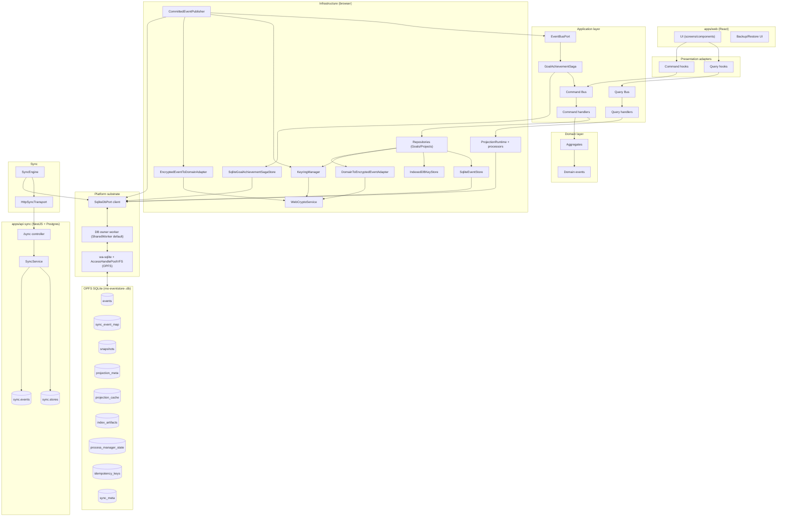

# BC runtime data flow (Mermaid)

**Scope**: One canonical data-flow diagram showing how a bounded context processes events end-to-end.
**Non-goals**: Exhaustive diagrams for every BC; this is an example/template diagram.
**Status**: Living
**Linear**: ALC-334
**Created**: 2026-01-01
**Last Updated**: 2026-01-01

## Invariants

This doc does not define new invariants. It relies on the invariant registry in `docs/invariants.md`.

## Details

This is the canonical “event-sourced BC pipeline” diagram (example instantiation: Goals BC).

Notes:

- Source of truth for `GoalEventType` strings: `packages/domain/src/goals/events/eventTypes.ts`.

## Code Pointers

- `apps/web/src/bootstrap/createAppServices.ts` — concrete wiring of the pipeline

## Open Questions

- [ ] Keep this diagram aligned with the actual wiring in `apps/web` as contexts expand.
