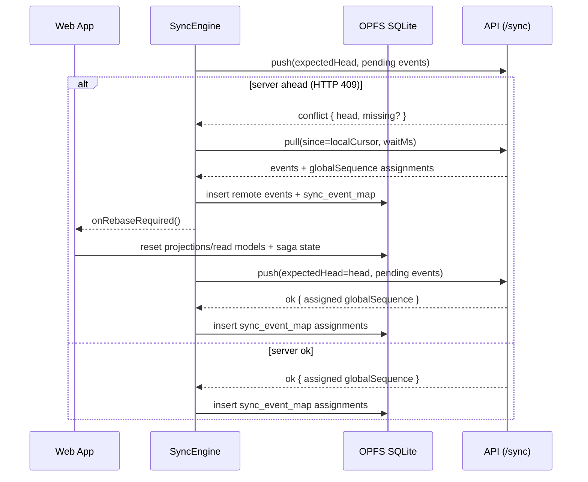
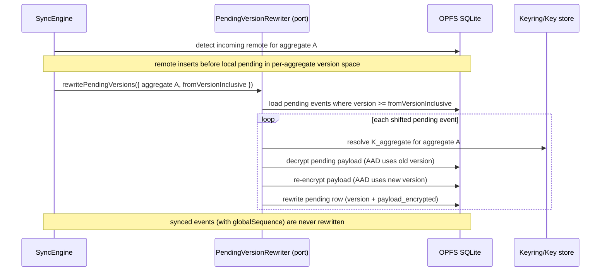

# Infrastructure layer (`packages/infrastructure`)

**Scope**: Platform adapters: OPFS SQLite runtime, eventing runtime, derived state persistence, and sync boundary behavior.
**Non-goals**: UI concerns and domain modeling; also not a complete threat model (see `docs/security/`).
**Status**: Living
**Linear**: ALC-334
**Created**: 2026-01-01
**Last Updated**: 2026-01-01

## Invariants

Relevant invariants in `docs/invariants.md`:

- `INV-001` — Synced events are immutable
- `INV-004` — Sync record bytes are preserved

## Details

### Storage: OPFS SQLite schema + DB ownership

The web client persists into a single local SQLite database stored in OPFS:

- DB file: `mo-eventstore-<storeId>.db`
- OPFS directory namespace: `mo-eventstore-<storeId>` (used by wa-sqlite’s `AccessHandlePoolVFS`)

#### Single-writer ownership model

We run SQLite inside a worker and enforce single-writer semantics per `storeId`:

- Default: **SharedWorker** owns the DB and serves all tabs (multi-tab by design).
- Fallback: **Dedicated Worker** owns the DB if SharedWorker is unavailable or fails to initialize.
- Dedicated worker acquires a **Web Locks** exclusive lock: `mo-eventstore:<storeId>` (prevents multiple owners in the presence of multiple dedicated workers).

Initialization is explicit via a hello handshake (`helloOk` / `helloError`). Failures surface with structured context (init stage + OPFS diagnostics) so they are debuggable (not silent timeouts).

#### `SqliteDbPort` boundary + reactivity

`@mo/eventstore-web` provides a strict async DB boundary (`SqliteDbPort`):

- `query/execute/batch` are worker RPCs (no synchronous DB access).
- `batch()` executes atomically inside a single SQLite transaction.
- `subscribeToTables([...], listener)` provides a table-level invalidation signal used by projections and sync scheduling.

#### Local schema (v1)

The schema is applied on open via `PRAGMA user_version` and fails fast on unsupported versions.

Core tables:

- `events`: unified encrypted event log for all BCs (partitioned by `aggregate_type`).
- `sync_event_map`: local mapping of `event_id → global_seq` for synced events.
- `sync_meta`: per-store last pulled global sequence (`last_pulled_global_seq`).
- `snapshots`: per-aggregate encrypted snapshot blob + last applied cursors.
- `projection_meta`, `projection_cache`, `index_artifacts`: derived-state runtime persistence.
- `process_manager_state`: saga/process-manager encrypted state (rebuildable/reconcilable).
- `idempotency_keys`: idempotency fence for commands/process managers.

### Eventing runtime (ALC-301: unified serialization)

The canonical encode/decode pipeline is `packages/infrastructure/src/eventing/`.

Key concepts:

- **Domain “latest mapping spec”**: each event exports a `PayloadEventSpec` that maps VO fields to JSON primitives (no versioning logic in domain).
- **Persisted payload envelope** (inside ciphertext): `{ payloadVersion, data }`.
- **Per-event migrations/upcasters**: infrastructure-only and keyed by `eventType`.
- **Registry**: maps `eventType` ↔ event spec and handles encode/decode.

Decode (conceptually):

1. decrypt ciphertext bytes (AES-GCM + AAD)
2. decode envelope `{ payloadVersion, data }`
3. upcast `data` to the latest payload version (if needed)
4. decode fields using the spec’s mappers
5. hydrate the domain event via the spec’s ctor and event metadata

Encode mirrors the above in reverse:

1. encode fields using the spec’s mappers (latest mapping)
2. wrap as `{ payloadVersion, data }`
3. encrypt with AAD that binds to `aggregateId`, `eventType`, and `version`

### Key management (identity + aggregate keys)

The encryption model relies on a strict separation between:

- **identity keys** (signing + encryption keypairs) used as the user’s local root identity, and
- **per-aggregate symmetric keys** used to encrypt event payloads and snapshots for each aggregate.

Current implementation:

- Keys are stored in IndexedDB and are encrypted at rest using a passphrase-derived KEK (“master key”).
- The KEK is derived from the user’s passphrase + a per-user random salt (PBKDF2). The salt is persisted in local metadata so the same KEK can be re-derived on unlock/restore.
- Backup/restore moves **identity keys only**. Per-aggregate DEKs are recovered via keyring updates embedded in the event stream after sync pull.

### Crypto and integrity binding

- Each aggregate uses a dedicated symmetric key (`K_aggregate`) from the key store.
- Event payload encryption uses AES-GCM with AAD binding to `{aggregateId, eventType, version}`.
- Snapshots use separate AAD binding (`{aggregateId, "snapshot", version}`) for integrity separation.

**Key categories (K_aggregate vs K_cache)**

| Key type      | Used for                                 | Synced?                            |
| ------------- | ---------------------------------------- | ---------------------------------- |
| `K_aggregate` | Event payloads + snapshots               | No (recovered via keyring updates) |
| `K_cache`     | Projection caches + indexes + saga state | No (device-local only)             |

Notes:

- Losing `K_cache` must be recoverable: it forces a rebuild of derived state, not data loss.
- Target policy (from the LiveStore replacement PRD): caches/indexes use a device-local `K_cache` (not backed up/synced). This keeps key backups minimal and makes “drop cache + rebuild” always safe.
- Current implementation note: `projection_cache` rows are currently encrypted using the aggregate key (`K_aggregate`) in some projectors (e.g. Goal snapshots/analytics cache). Treat this as a correctness-preserving shortcut (still rebuildable), but it is not the final key separation policy.

### Commit boundary and post-commit streaming

**Durable boundary**

- A successful insert into the local `events` table is the on-device durability boundary.

**Post-commit publication**

- `CommittedEventPublisher` streams committed events ordered by `commitSequence`, decrypts/hydrates, publishes them, and checkpoints progress.
- Projections follow the same durability principle: they can be rebuilt from committed data.

### Sync engine (browser + API) and byte-preservation

**Browser**

- `SyncEngine` is an explicit pull/push loop over the local `events` table.
- “Pending” means: `events` rows that do not yet have a `sync_event_map` entry.
- Push is triggered reactively from `events` invalidations (debounced), plus a low-frequency fallback interval as a safety net.
- Pull uses long-polling (`waitMs`) and is guarded to avoid pull storms; push is not blocked by pull.
- Retry safety: any retry attempt that follows a conflict-resolution step (apply remote events, pending-version rewrite) must treat SQLite as the source of truth and re-read pending events before pushing.

**Server**

- Server assigns a monotonically increasing `globalSequence` per `(owner_identity_id, store_id)` stream.
- Push uses an `expectedHead` precondition; conflicts are HTTP 409 with `{ head, reason: 'server_ahead', missing?: [...] }` to enable fast-forward.
- Server persists the payload as canonical JSON **TEXT** (`record_json`) and returns it as-is in pull responses.

**Byte-preservation contract**

The backend must not change the serialized representation of already-synced records.

- Each sync record includes base64url-encoded ciphertext bytes (never numeric-key “byte objects”).
- The server stores `record_json` as **TEXT** (not `jsonb`) to avoid accidental canonicalization changes.

Constraint:

- This is not a cross-language canonical JSON guarantee; it is a “JS + JSON.stringify” byte-preservation contract at the current boundary.

**Immutability boundary (critical)**

- Events that have been **synced** (have a `sync_event_map` / `globalSequence` mapping) are immutable facts:
  - ciphertext bytes and metadata are never rewritten.
- Events that are still **pending** (no `globalSequence`) are durable local drafts and may be rewritten during rebase:
  - per-aggregate version shifts require re-encryption because AAD binds to `{aggregateId, eventType, version}`.
  - per-aggregate “pending rewrite” during rebase is specified in `docs/rfcs/rfc-20260101-pending-version-rewrite-rebase.md` and implemented in the sync stack.

**Protocol types (V1)**

The source-of-truth for the sync protocol types is `packages/sync-engine/src/types.ts`:

- `SyncPullResponseV1`
- `SyncPushRequestV1`
- `SyncPushOkResponseV1`
- `SyncPushConflictResponseV1`

**Sequence diagrams (critical flows)**

Sync with rebase (pull → rebase → push):

AAD re-encryption during rebase (pending version shift):

### Cross-device conflict UX contract (sync)

Sync “conflicts” are not domain merges:

- Local OCC conflicts are user-visible at command time.
- Sync conflicts are resolved by global ordering + rebase.
- Resulting behavior is effectively last-write-wins by global ordering when two devices emit incompatible domain events.

## Code Pointers

- `packages/eventstore-web/src/worker/schema.ts` — local schema (SQLite/OPFS)
- `packages/eventstore-web/src/worker/owner.worker.ts` — DB owner worker + RPC protocol
- `packages/sync-engine/src/types.ts` — sync DTOs (V1)
- `apps/api/src/sync/**` — server-side sync persistence + endpoints

## Open Questions

- [ ] Should we add explicit diagnostics/telemetry when pending rewrite happens (rare collision cases)?
