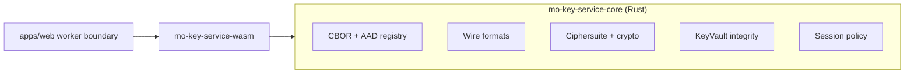

# Key Service Core

**Scope**: Rust core for Key Service formats, crypto, KeyVault integrity, and session policy.
**Non-goals**: WASM bindings, UI integration, or server API wiring.
**Status**: Living
**Linear**: ALC-362
**Created**: 2026-01-09
**Last Updated**: 2026-01-09

## Invariants

- `INV-023` — Scope streams are signed + hash-chained.

## Responsibilities

- Canonical CBOR encoding/decoding for Key Service artifacts (strict structure + limits).
- AAD registry for KeyVault, scope state, and grant wrapping (canonical CBOR bytes).
- KeyVault storage formats + integrity checks (hash-chains and pre-decrypt verification).
- Hybrid KEM + signature ciphersuite plumbing (Ed25519 + ML-DSA, ML-KEM + X25519).
- Session policy enforcement (assurance tiers, TTL, handle lifecycle).

## Component view

## Boundaries and dependencies

- Depends on: cryptographic libraries, CBOR codec, and platform adapters (clock, entropy, storage; async storage is supported for native/desktop).
- Does not depend on: browser APIs, IndexedDB/OPFS, or server transport.
- Consumption: called by `mo-key-service-wasm` and a worker boundary in the web client.

## Data formats and contracts

- Canonical CBOR and AAD registry are specified in `docs/rfcs/rfc-20260107-key-service-core.md`.
- ScopeState and ResourceGrant stream rules (signing + hash chaining) are enforced here.
- KeyVault record containers must be verifiable before decryption.

## Security notes

- Zeroization is best-effort (especially under WASM); handle expiration must wipe state.
- Hybrid verification does not short-circuit; both signature schemes must validate.
- Duplicate record IDs are rejected at append to avoid later vault-bricking.

## Code pointers

- `packages/key-service-core/src/cbor.rs` — canonical CBOR helpers and limits.
- `packages/key-service-core/src/formats.rs` — wire formats and encoding/decoding.
- `packages/key-service-core/src/ciphersuite.rs` — hybrid crypto primitives.
- `packages/key-service-core/src/keyvault.rs` — KeyVault state and integrity checks.
- `packages/key-service-core/src/key_service.rs` — service orchestration and policy.
- `packages/key-service-core/src/session.rs` — session and handle management.

## Open Questions

- None tracked here; see RFCs for open questions and Linear follow-ups.

## Follow-up improvements

- Rust → TypeScript type generation (e.g., `ts-rs`) to reduce IDL drift across language boundaries.
