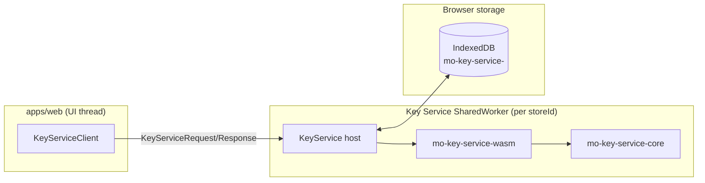

# Key Service Web Boundary

**Scope**: Web worker boundary + WASM integration for the Key Service core.
**Non-goals**: UI flows, sharing UX, or server API wiring.
**Status**: Living
**Linear**: ALC-363
**Created**: 2026-01-09
**Last Updated**: 2026-01-09

## Responsibilities

- Host the Key Service core inside a SharedWorker (per `storeId`) with a minimal request/response protocol.
- Load the `mo-key-service-wasm` wrapper and bridge requests to the Rust core.
- Persist KeyVault storage via IndexedDB and keep runtime state in memory.
- Enforce session lifecycle via worker-only access and platform signals (idle/blur/lock).
  - Dedicated Worker fallback if `SharedWorker` is unavailable.

## Component view

## Protocol and lifecycle

- The worker uses a simple `{v, kind, requestId, payload}` envelope (no Comlink).
- Requests mirror the RFC IDL and are defined in `packages/key-service-web/src/protocol/types.ts`.
- The worker tracks an active session id per connected client to support idle/blur/lock signals.

## Storage behavior

- IndexedDB stores key-value blobs under `mo-key-service-<storeId>`.
- The WASM wrapper maintains an in-memory map and emits a write set after each mutating call.
- The worker persists write sets synchronously with each request before responding.

## Code pointers

- `packages/key-service-wasm/src/lib.rs` — WASM adapter + web storage bridge.
- `packages/key-service-web/src/worker/key-service.worker.ts` — worker boundary and request handling.
- `packages/key-service-web/src/worker/storage.ts` — IndexedDB adapter.
- `packages/key-service-web/src/client.ts` — browser client transport.

## Open Questions

- Do we need an explicit `createVault` IDL message for onboarding, or is vault creation handled elsewhere?
