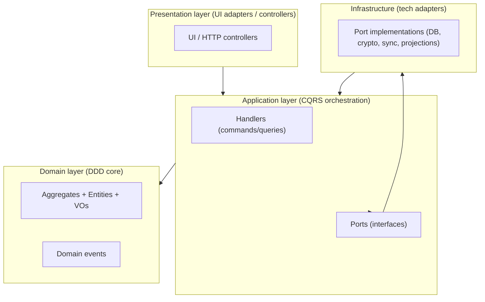
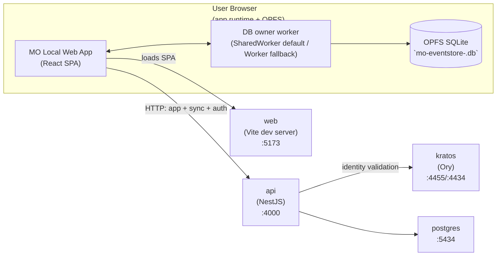

# Layering and boundaries

**Scope**: The DDD/CQRS layering model, dependency direction, and composition root conventions.
**Non-goals**: A full module-by-module walkthrough or coding standards (see `coding-conventions.md`).
**Status**: Living
**Linear**: ALC-334
**Created**: 2026-01-01
**Last Updated**: 2026-01-01

## Invariants

This doc does not define new invariants. It relies on the invariant registry in `docs/invariants.md`.

## Details

**Dependency direction**

`Presentation → Application → Domain`  
`Infrastructure → Application → Domain`

Hard rules:

- **Domain** has no runtime dependencies and owns invariants.
- **Application** orchestrates use-cases and exposes ports; it does not know SQLite/OPFS/IndexedDB/WebCrypto/HTTP/Postgres.
- **Infrastructure** implements ports and owns all persistence/crypto/sync/projection mechanisms.
- **Presentation** is the UI adapter; it does not “reach into” infrastructure directly.

**Composition roots**

- Each deployed **runtime unit** has a **composition root** that wires dependencies and chooses concrete implementations for ports.
  - `apps/web` is the browser client composition root (React UI + local event store + sync engine + derived state).
  - `apps/api` is the server composition root (NestJS controllers + sync persistence + auth integration).
- `apps/api` is not “the web app’s wiring layer”; it is a separate runtime unit with its own (simpler) layering focused on the Sync bounded context.
- Composition roots may “know about everything” (because wiring is cross-layer), but they should contain minimal logic: mostly instantiation, configuration, and lifecycle.

### Layering diagram (simplified)

### Architectural standards (DDD / CQRS / ES)

This repo follows a “DDD core + CQRS orchestration + Event Sourcing persistence” baseline.

- **DDD**
  - Bounded contexts are the unit of modularity (Goals, Projects, Identity, Sync).
  - Aggregates own invariants and are mutated only by applying domain events.
  - Domain model uses value objects (VOs) aggressively (“no primitives” bias for domain meaning).
- **CQRS**
  - Commands and queries are data-only objects (no logic); handlers contain orchestration logic.
  - Command handlers enforce local optimistic concurrency (`knownVersion`) and produce events.
  - Query handlers depend on read models/projections (never on encrypted tables directly).
- **Event sourcing**
  - Facts are captured as immutable domain events and appended to an event log.
  - “Durable” means “persisted to the event log” (local OPFS SQLite); all derived state is rebuildable.
  - Snapshots and projections are caches; correctness comes from replayability.

### Deployment (local dev stack today)

Today’s deployment is a local Docker Compose stack driven by `scripts/dev-stack.sh` and `docker-compose.yml`. This is the source of truth for “what runs where” in development. Production infrastructure will expand this later, but the goal is to keep the same architectural boundaries.

**Services (docker compose)**

- `web` (Node + Vite dev server) exposes the UI on `http://localhost:5173`.
- `api` (Node + NestJS) exposes HTTP on `http://localhost:4000`.
- `postgres` on `localhost:5434` stores server state (`mo_local`, `kratos`).
- `kratos` provides identity/auth (public `http://localhost:4455`, admin `http://localhost:4434`).

**Important nuance**

- The **event store DB is not in Docker**. It lives in the user’s browser via OPFS (SQLite) and is owned by a worker (`@mo/eventstore-web`).

## Code Pointers

- `apps/web/src/bootstrap/createAppServices.ts` — composition root wiring (browser runtime)
- `apps/api/src/main.ts` — server composition root entrypoint
- `packages/application/src/**` — ports + handlers
- `packages/domain/src/**` — aggregates/events/VOs

## Open Questions

- [ ] Keep `docs/architecture/api-runtime.md` aligned with server changes (routes, schema, auth boundary).
