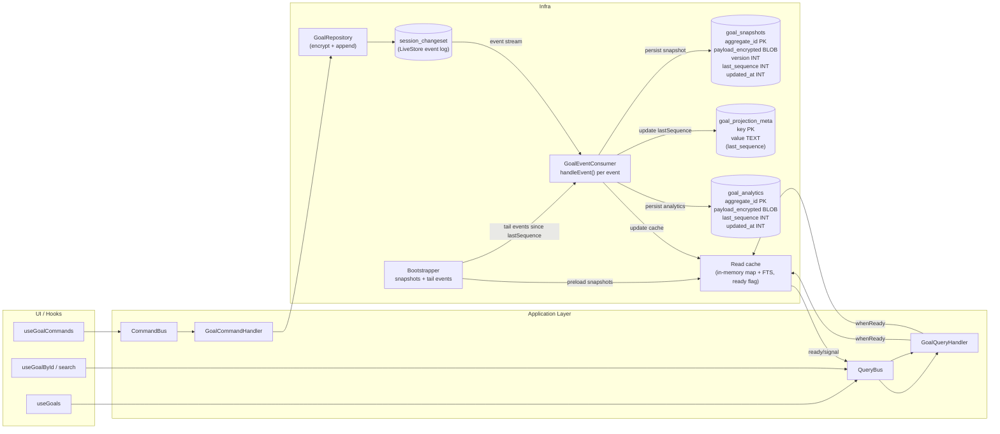

# Local DAL & Projection Mini‑PRD

## 1. Objective

Define a reusable pattern for each bounded context (BC) – starting with Goals – to support:

- Efficient local reads (filtering, sorting, search/FTS) over large numbers of aggregates.
- A pure event‑sourced model with **encrypted events and snapshots** in SQLite/LiveStore.
- Clear‑text projections and indices kept **only in memory** (or inside a dedicated worker).
- Per‑BC segmentation so infra can be enabled/disabled per module (Goals, Tasks, etc.).

This plan replaces the earlier idea of writing decrypted `goals` / `goal_access` tables directly into SQLite for queries.

### 1.1 Current state (ALC‑255 branch)

For the Goals BC, the current branch already has the following pieces wired end‑to‑end:

- **Encrypted event store (canonical log)**
  - `goal_events` table managed by LiveStore (`packages/infrastructure/src/browser/schema.ts`).
  - Events are written via `BrowserLiveStoreEventStore` and `DomainToLiveStoreAdapter` (`LiveStoreEventStore` + `DomainToLiveStoreAdapter`).
  - Payloads are encrypted per aggregate using `WebCryptoService` and per‑goal keys stored in `IndexedDBKeyStore`.

- **Projection / snapshot pipeline**
  - `GoalProjectionProcessor` (`packages/infrastructure/src/browser/projection/GoalProjectionProcessor.ts`) runs in the browser infra layer.
  - On `start()` at unlock/onboarding:
    - Reads `goal_projection_meta` to determine `lastSequence`.
    - Calls `getAllEvents({ since: lastSequence })` on the event store.
    - Decrypts events via `LiveStoreToDomainAdapter` and applies `applyEventToSnapshot` (`GoalProjectionState`) to compute a `GoalSnapshotState` per aggregate.
    - Writes encrypted snapshot JSON into `goal_snapshots` and analytics into `goal_analytics`.
    - Persists the new `lastSequence` in `goal_projection_meta`.
  - During runtime:
    - Subscribes to the LiveStore event stream to react to new events (no duplicate `goal_events` table, no in‑process fast trigger).

- **Read path (snapshot‑backed)**
  - `GoalQueries` (`packages/infrastructure/src/browser/GoalQueries.ts`) is the query façade.
  - It currently:
    - Reads `goal_snapshots` rows via `store.query`.
    - Decrypts each snapshot via a `decryptSnapshot` function wired in `createBrowserServices`.
    - Filters out deleted aggregates and maps to `GoalListItem`.
  - React hooks:
    - `useGoals` and `useGoalById` subscribe to LiveStore (`tables.goal_events.count()`), call into `GoalQueries`, and expose data to React.
    - `useGoalCommands` calls `goalService.handle` and then `goalProjection.flush()` to make local writes visible immediately.

In other words:

- LiveStore’s synced event stream is the canonical encrypted event log; **current implementation still materializes `goal_events`** because `store.events()` is not yet available in our LiveStore version. The table remains the query surface for now.
- `goal_snapshots`, `goal_projection_meta`, and `goal_analytics` are already populated by `GoalProjectionProcessor`.
- The web app already reads goals from snapshots via `GoalQueries`.

What is **not** done yet (and this document is guiding) is:

- Moving the read model to a clear in‑memory projection with a simple “projection changed” signal (today `GoalQueries` decrypts per query directly from `goal_snapshots`).
- Tightening the projection lifecycle semantics (event‑driven during normal runtime + guaranteed catch‑up on unlock) and making them explicit.
- Optionally moving the projection work off the main thread into a dedicated worker in a later iteration.

### 1.2 Target model (this plan)

The target design for Goals (and future BCs) is:

- Keep LiveStore’s encrypted event stream as the **single source of truth**.
- Treat `GoalProjectionProcessor` as the **materializer/reducer**:
  - Event‑driven during normal runtime (subscribed to the in‑process bus and LiveStore tables).
  - Catch‑up on unlock (replay from `goal_events` starting at `lastSequence`).
  - Writes encrypted per‑aggregate snapshots to `goal_snapshots` and aggregates to `goal_analytics`.
- Use an in‑memory projection (clear text) as the primary read model:
  - Seeded from `goal_snapshots` at unlock.
  - Updated incrementally by the projector.
  - Exposed via `GoalQueries`/hooks with a clear “projection changed” signal.

Sections below describe this model in more detail and highlight what is implemented vs still aspirational.

## 2. Constraints & Non‑Goals

**Constraints**

- **Server‑blindness:** only encrypted payloads (events, snapshots) are ever synced. Server never sees goal summaries, slices, priorities, etc.
- **Per‑BC segmentation:** each BC has its own infra slice (tables, workers, DAL). Example: Goals uses `goals_*` tables and a `GoalsProjectionWorker`; Tasks/Projects get their own.
- **Scalability:** must handle 10k–100k aggregates per BC without replaying every event on every app start, and without loading all aggregates into memory at once.
- **Browser‑friendly:** works with LiveStore (SQLite via OPFS) and WebCrypto; projection/indexing must not block the main thread.

**Non‑Goals (for this iteration)**

- Transparent full‑DB encryption (SQLCipher) managed by LiveStore.
- Searchable encryption for summaries (we accept clear‑text summaries in memory for the POC).
- Multiplexing many BCs into a single generic `events`/`snapshots` table (we prefer per‑BC tables for clarity and performance).

## 3. Per‑BC Storage Model

Each BC gets its own event and snapshot tables. For Goals (matching the current implementation in `schema.ts`):

### 3.1 Events (canonical log, syncable)

`goal_events` (SQLite table managed via LiveStore state/materializers):

- `id` – event id (UUIDv7).
- `aggregate_id` – goal id.
- `event_type` – domain event type (e.g. `GoalCreated`).
- `payload_encrypted` – AES‑GCM ciphertext of the event payload.
- `version` – aggregate version for optimistic concurrency.
- `occurred_at` – unix timestamp (ms).
- `sequence` – monotonically increasing global sequence (for sync and ordering).

**Notes**

- This is the **only** data that ever syncs to the backend (via the LiveStore sync provider).
- Encryption: payload is JSON of the domain event payload, encrypted with per‑goal key `K_goal` (or a derived subkey) + AAD (`aggregate_id:event_type:version`).

### 3.2 Snapshots (encrypted checkpoints, not synced)

For Goals, snapshots are currently stored in the `goal_snapshots` table:

- `aggregate_id` – goal id (primary key).
- `payload_encrypted` – AES‑GCM ciphertext of the snapshot payload.
- `version` – aggregate version for this snapshot.
- `last_sequence` – highest `goal_events.sequence` value included in this snapshot.
- `updated_at` – unix timestamp (ms) when this snapshot row was last updated.

**Notes**

- Snapshot payload is a `GoalSnapshotState` (`GoalProjectionState.ts`):  
  `{ id, summary, slice, priority, targetMonth, createdBy, createdAt, deletedAt, version }`, serialized as JSON and encrypted with `K_goal` and an AAD (`aggregate_id:snapshot:version`).
- Snapshots are **never** synced; they are purely a local optimization to avoid replaying long event streams on every unlock.

### 3.3 Why metadata columns are needed

Metadata (`aggregate_id`, `version`, `sequence`, `created_at`) supports:

- Locating the latest snapshot for a given goal quickly.
- Fetching only tail events after a snapshot (`version > snapshotVersion`).
- Incremental sync (`sequence > lastSyncedSequence`).
- Incremental projection updates (`sequence > lastProjectedSequence`).

All domain fields remain inside encrypted blobs and in memory only.

## 4. Projection & Indexing Runtime

### 4.1 Responsibilities (per BC)

For Goals, the projector is `GoalProjectionProcessor` (`packages/infrastructure/src/browser/projection/GoalProjectionProcessor.ts`).

For the POC it runs in the browser infra layer (same process as React). A later iteration can move the same logic into a dedicated worker; the responsibilities are the same:

1. **Bootstrap**
   - Load latest snapshots per `aggregate_id` from `goal_snapshots`.
   - Decrypt them using the per‑goal keys from the keystore.
   - For each aggregate, load events from `goal_events` with `sequence > last_sequence` (per row), decrypt, and apply to reach current state.
   - Build in‑memory projections and indices for the BC:
     - `goalsById: Map<GoalId, GoalListItem>`
     - Optional `goalDetails: Map<GoalId, GoalDetail>` for richer views.
     - FTS index on summary (and other searchable fields).
2. **Incremental update**
   - Subscribe to LiveStore changes (via `tables.goal_events.count()`).
   - On new events:
     - Load & decrypt events from `goal_events` where `sequence > lastProjectedSequence`.
     - Apply them to in‑memory projections.
     - Write/rotate snapshots to `goal_snapshots` and analytics to `goal_analytics` (current code already persists both).
3. **Query handling**
   - Handle read requests from the main thread:
     - `listGoals(filter)` – filter/sort over in‑memory projections.
     - `getGoalById(id)` – lookup in `goalsById`.
     - `searchGoals(term)` – query the in‑memory FTS index and map back to projection entries.

### 4.3 Indexing & Facet Search

The projection runtime maintains **two** kinds of indices:

- **FTS index** (for free‑text search):
  - Documents are identified by `goalId` and contain tokenized `summary` (and any other text fields we want searchable).
  - Updates are **event‑driven**:
    - `GoalCreated` → add a document for that `goalId`.
    - `GoalSummaryChanged` → update the document’s text.
    - `GoalDeleted` → remove or mark the document as deleted.
  - FTS results (`goalId[]`) are mapped back to `goalsById` to obtain `GoalListItem`s.
- **Facet indices** (for slice/date/priority filtering):
  - Option 1 (simple, POC): filter facets directly over `goalsById.values()` in memory (e.g. filter by `slice`, `targetMonth`, `priority`).
  - Option 2 (scalable): maintain small inverted indices, updated alongside the FTS index:
    - `goalsBySlice: Map<Slice, Set<GoalId>>`
    - `goalsByMonth: Map<string /*YYYY-MM*/, Set<GoalId>>`
    - `goalsByPriority: Map<string, Set<GoalId>>`
  - These maps are updated in the same event handlers:
    - On create → insert into the appropriate facet sets.
    - On change events → move `goalId` between sets as needed.
    - On delete → remove `goalId` from all facet sets.

Facet search APIs (`listGoals` with filter parameters) can then either:

- Filter over the projection (`goalsById`) for simpler cases, or
- Use facet indices to very quickly resolve candidate `goalId`s and then hydrate full items from `goalsById`.

### 4.2 Execution context

There are two execution options; the current branch uses the first.

- **P0 / current implementation (ALC‑255) – in‑process projector**
  - `GoalProjectionProcessor` runs in the browser infra layer.
  - It uses:
    - The LiveStore `Store` instance via `createBrowserServices`.
    - `BrowserLiveStoreEventStore` for `getAllEvents`.
    - `IndexedDBKeyStore` + `WebCryptoService` for decrypting events and snapshots.
  - React hooks (`useGoals`, `useGoalById`) rely on LiveStore subscriptions (`tables.goal_events.count()`) and explicit `goalProjection.flush()` calls after commands to stay in sync.

- **P1 / future – dedicated projection worker (optional)**
  - Move `GoalProjectionProcessor` into a dedicated web worker per BC (or a multiplexed infra worker).
  - Worker has access to:
    - The LiveStore `Store` (via adapter‑web’s worker APIs).
    - Crypto primitives and key access through a worker‑safe abstraction.
  - Projection (bootstrap + incremental updates + FTS) runs entirely off the main thread.
  - Communication pattern:
    - Main thread ↔ worker via explicit messages (`init`, `listGoals`, `getGoalById`, `searchGoals`, …).

For this POC, we focus on the P0 in‑process projector and ensure its lifecycle semantics (catch‑up on unlock, event‑driven updates) are solid before introducing a worker.
  - Worker → main thread: response messages with DTOs, plus optional “projection updated” notifications to trigger UI refresh.

## 5. DAL & Hooks API

### 5.1 Infra‑side DAL (per BC)

For Goals, the public infra API exposed to the app is a thin wrapper over the worker:

```ts
// packages/infrastructure/src/goals/GoalQueries.ts (main-thread facade)
export type GoalListItem = {
  id: string
  summary: string
  slice: string
  priority: string
  targetMonth: string
  createdAt: number
}

export interface GoalQueries {
  init(): Promise<void>
  listGoals(filter?: { slice?: string; month?: string; priority?: string }): Promise<GoalListItem[]>
  searchGoals(term: string): Promise<GoalListItem[]>
  getGoalById(id: string): Promise<GoalListItem | null>
}
```

Implementation details (events vs snapshots vs in‑memory projection) remain inside the worker/runtime. The application + UI layers work against `GoalQueries` only.

### 5.2 Hooks

Hooks in `apps/web` keep a simple shape:

- `useGoals(filter?)` → calls `goalQueries.listGoals(filter)`.
- `useGoalById(id)` → calls `goalQueries.getGoalById(id)`.
- `useGoalSearch(term)` → calls `goalQueries.searchGoals(term)`.

Invalidation/refresh is triggered by LiveStore subscriptions and/or explicit “projection updated” messages from the worker.

## 6. Lifecycle Scenarios

### 6.1 App Startup (Goals BC)

1. `AppProvider` creates the LiveStore adapter and store.
2. Infra constructs the Goals projection worker and sends `init()`:
   - Worker reads snapshots from `goals_snapshots`, decrypts them.
   - Worker reads tail events from `goals_events` per aggregate, decrypts & applies.
   - Worker builds in‑memory projections and FTS index.
3. Once ready, `GoalQueries.init()` resolves and hooks can safely call `listGoals` / `searchGoals`.

### 6.2 Handling a Local Command

1. UI dispatches a command (e.g. `CreateGoal`).
2. Application layer uses `IGoalRepository` to persist the new goal events (encrypted) to `goals_events` and, if configured, writes an initial snapshot to `goals_snapshots`.
3. LiveStore materializer updates `goal_events` state; the worker sees the change via subscription (or a direct message from infra) and:
   - Reads the new event(s), decrypts them.
   - Updates in‑memory projections and FTS index.
4. Hooks re‑query the worker and the UI rerenders with new data.

### 6.3 Sync

1. Sync provider pulls encrypted events from the server and appends them to `goals_events` (same schema).
2. Worker receives notification (via LiveStore subscription or explicit sync callback) and:
   - Loads events with `sequence > lastProjectedSequence`.
   - Decrypts and applies them to projections & index.
   - Optionally emits “projection updated” notifications.
3. Hooks see updated projections without needing to know about sync.

### 6.4 Failure Handling & Recovery

**Worker crash / restart**

- The worker keeps `lastProjectedSequence` in memory while it runs.
- To survive crashes or reloads, we also persist `lastProjectedSequence` per BC in a small metadata table (e.g. `goals_projection_meta`) or in LiveStore’s key–value state:
  - On bootstrap, the worker:
    - Reads `lastProjectedSequence` (if present).
    - Rebuilds projections starting from snapshots + events where `sequence > lastSnapshotSequence` and `sequence > lastProjectedSequence` as needed.
  - On successful projection of a batch, the worker updates `lastProjectedSequence` in that metadata table.

**Projection corruption / escape hatch**

- The runtime treats encrypted `goals_events` + `goals_snapshots` as the single source of truth.
- If we detect inconsistency (e.g. invariant failures, checksum mismatch, or explicit “rebuild” command from the UI/dev tools), the worker can:
  - Reset in‑memory state (clear `goalsById`, FTS index, and in‑memory metadata).
  - Optionally reset `lastProjectedSequence` to `0` or to the latest snapshot sequence.
  - Replay from events + snapshots to rebuild projections from scratch.
- For the POC, we will at least:
  - Implement a debug API (`resetAndRebuild`) on the worker.
  - Log rebuild occurrences for diagnostics.

## 7. Security & Threat Model Notes

- **Server‑blindness**: only `goals_events.payload_encrypted` and (optionally) encrypted snapshots are ever sent to the backend. Server never sees clear‑text summaries or search indices.
- **Local at‑rest encryption**:
  - Event payloads and snapshot payloads are encrypted at rest with per‑aggregate keys (`K_goal`).
  - Domain fields (summary, slice, etc.) exist in clear text only in:
    - Worker memory (projections/index).
    - Transient DTOs on the main thread returned from `GoalQueries`.
- **Per‑BC isolation**:
  - Each BC has its own tables and runtime. Unused BCs need not be initialized or synced on a given device.
- **Future hardening options** (out of scope for this mini‑PRD):
  - Encrypting some projection/index structures using a per‑device cache key wrapped by the passphrase KEK or biometric keys.
  - More advanced strategies for snapshot frequency and eviction to reduce decrypted footprint.

### 7.1 Browser security boundaries

Client‑side encryption protects against server compromise and network eavesdropping. It does **not** protect against:

- XSS that executes arbitrary code on the application origin.
- Malicious browser extensions with host permissions for the app origin.
- Physical access to an unlocked device/browser profile.

Mitigations to track (some outside this POC’s immediate scope):

- **P0** – Strict Content Security Policy (CSP) to reduce XSS risk (no inline scripts, tight script src, etc.).
- **P0** – Worker‑based key handling: keep key derivation and keystore access in workers as much as possible; avoid exposing raw keys on the main thread.
- **P1** – Cross‑origin iframe or isolated origin for sensitive crypto operations, to further constrain what origin‑level script can see.
- **P1** – Minimize decrypted data lifetime via:
  - LRU eviction for detailed projections.
  - On‑demand decryption of less‑used aggregates.
  - Explicit “clear projections” hooks for sign‑out/lock flows.

## 8. Open Questions / Next Steps

1. **Snapshot frequency & strategy**
   - POC decision: snapshot on every event; upsert per aggregate; delete snapshot on goal delete. No compaction planned for POC.
2. **Projection footprint & pagination**
   - For the POC, keep the full projection in memory. Future options (pagination/LRU, lazy fields, etc.) are noted but not planned now.
3. **FTS implementation & persistence**
   - POC: add simple in‑memory FTS for summaries (MiniSearch or similar) and persist it like snapshots (serialize + encrypt a blob alongside snapshot data). Facet indexes follow the same pattern.
4. **Worker multiplexing**
   - Start with one worker per BC vs a single “infra worker” handling projections for all BCs behind a simple RPC multiplexer.
5. **LiveStore integration details (revised)**
  - Events:
     - LiveStore already persists the synced event stream internally; we should consume that directly instead of duplicating into a `goal_events` table.
     - Projectors subscribe to the LiveStore event stream for reactivity; no in‑process “fast trigger” bus needed.
  - Snapshots and metadata:
     - We manage `goal_snapshots`, `goal_projection_meta`, `goal_analytics`, and any future projection metadata tables via explicit SQL (`store.query`/`store.commit`) from the projector; they are local‑only and not part of the LiveStore schema exposed to sync.
6. **Migration from current implementation**
   - Current state (ALC‑255):
     - Encrypted events and snapshots are in place (`goal_snapshots`, `goal_projection_meta`, `goal_analytics`); an intermediate `goal_events` table exists but is redundant.
     - `GoalProjectionProcessor` maintains snapshots/analytics and supports catch‑up via `lastSequence`, now with an in‑memory projection map and “projection changed” signal.
   - Next steps:
     - Drop the `goal_events` table/materializer; consume LiveStore’s event stream directly.
     - Remove the in‑process “fast trigger” bus; rely on LiveStore event notifications.
     - Keep snapshot/analytics tables as durable backing for restart and optional future worker offloading.

## 9. Target Runtime Architecture (Goals)



Notes:
- LiveStore’s `session_changeset` is the canonical event log; no duplicate `goal_events` table.
- Bootstrapper loads snapshots and tail events once, then feeds events through the same per-event consumer used for live updates.
- Consumer decrypts/applies each event, persists snapshots/analytics/lastSequence, and updates the in-memory read cache; queries wait on the cache’s ready signal.

## 10. Server Sync & Event Log Strategy (Heads-up)

- **Current constraint**: The installed LiveStore version does **not** expose `store.events()/eventsStream()` yet (implementation pending). We still materialize `goal_events` as a local outbox/tail buffer to drive projections and catch-up.
- **Interim approach**: Treat `goal_events` as a bounded outbox:
  - Append encrypted events via materializer.
  - Projector replays tail (since `lastSequence`) and persists snapshots/analytics/meta.
  - After a successful batch, prune `goal_events` up to `lastSequence` to cap growth (keeps restart/catch-up viable without unbounded table growth).
- **Server sync (upcoming)**:
  - LiveStore handles push/pull of the canonical encrypted event log (`session_changeset`). When `store.events()` becomes available, switch projector to the stream and drop `goal_events` entirely.
  - Sync error handling: once server rejects/conflicts arrive, the projection runtime must handle rebasing/replay from the stream; optimistic fast triggers remain off until then.
  - Event naming: adopt versioned event names (e.g., `v1.goal.event`) before enabling cross-version sync to ease migrations.

Action items when LiveStore `events` API lands:
1. Remove `goal_events` materializer/table and switch projector to `store.events()` with `EventSequenceNumber` cursors.
2. Keep snapshots/analytics as local-only encrypted state; cache remains in-memory.
3. Revisit pruning logic (can delete the outbox entirely when the stream is authoritative).

This mini‑PRD is the reference for shaping ALC‑255 and related infra tasks (projection runtime, worker wiring, and DAL APIs) for the Goals BC. Future BCs (Projects, Tasks, etc.) should reuse the same pattern with their own `*_events`/`*_snapshots` tables and projection runtimes.

## 9. Analytical Materializers (per BC)

Beyond per‑aggregate projections, some use cases require analytics over large event volumes (e.g. “goals per slice per year”). Recomputing these on the fly by scanning 200k+ events would be expensive in both CPU and memory.

Instead, we introduce **analytical materializers** that share the same event stream but maintain aggregated rollup tables.

### 9.1 Analytical pipeline

Per BC (Goals shown as example):

```text
goals_events (encrypted)
    │
    ├──► entity_materializer ──► goals_snapshots (encrypted per-aggregate state)
    │
    ├──► analytical_materializer ──► goals_monthly_totals
    │
    └──► analytical_materializer ──► goals_category_rollups
```

- `entity_materializer` is the projection logic described earlier (snapshots + in‑memory projections).
- `analytical_materializer` consumes the **same decrypted events** and maintains aggregated state in small, BC‑specific tables.

### 9.2 Example analytical tables (Goals)

Shape is illustrative; final schema may evolve.

**`goals_monthly_totals`** (local‑only, per slice/month):

- `year_month` – `TEXT` (`YYYY-MM`).
- `slice` – `TEXT` (Balanced Wheel slice).
- `goal_count` – `INTEGER` (number of non‑deleted goals with targetMonth in that month).
- Optional additional metrics (completed goals, etc.).
- Optionally, an `payload_encrypted` column if we decide to encrypt the rollup payload as a blob; for the POC, plaintext counts are acceptable as local‑only derived data.

**`goals_category_rollups`** (local‑only, per slice/year):

- `year` – `INTEGER`.
- `slice` – `TEXT`.
- `goal_count` – `INTEGER`.
- Optional additional metrics (e.g. average priority, overdue counts).

These tables are intentionally **not generic**; they are tailored to the analytics the UI needs (e.g. wheel/drill‑down views).

### 9.3 Update semantics

Analytical tables are updated by the worker alongside the main projections:

- On `GoalCreated`:
  - Compute the bucket(s) (e.g. `year_month` from targetMonth, `slice` from payload).
  - Increment the corresponding rows in `goals_monthly_totals` and `goals_category_rollups`.
- On `GoalSliceChanged` / `GoalTargetChanged`:
  - Decrement counts in the **old** bucket(s).
  - Increment counts in the **new** bucket(s).
- On `GoalDeleted`:
  - Decrement counts in the relevant buckets.

Because the number of rollup rows is small (number of slices × number of months/years), updates are cheap and queries for analytics views are O(number of buckets), not O(number of events).

### 9.4 In‑memory analytics projection

To keep the UI simple:

- The worker maintains a small in‑memory representation of the rollups (e.g. nested maps keyed by year → month → slice), hydrated from `goals_monthly_totals` / `goals_category_rollups` at startup.
- On DB changes:
  - The analytical materializer updates both the SQLite tables and the in‑memory analytics projection.
  - The worker can emit “analytics updated” notifications for views that subscribe to these aggregates.

This follows the same pattern as the per‑aggregate projection runtime: durable, local‑only rollup tables on disk + in‑memory structures optimized for the UI.
