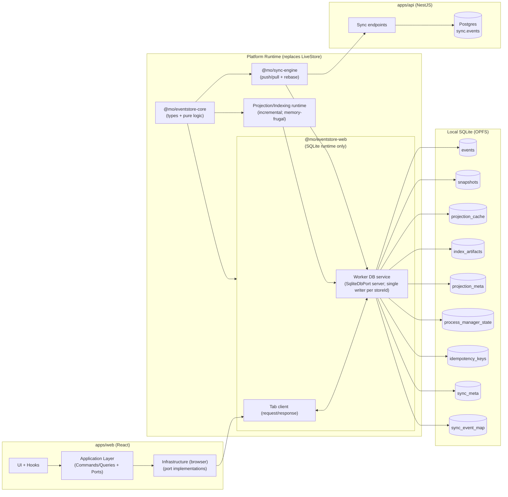
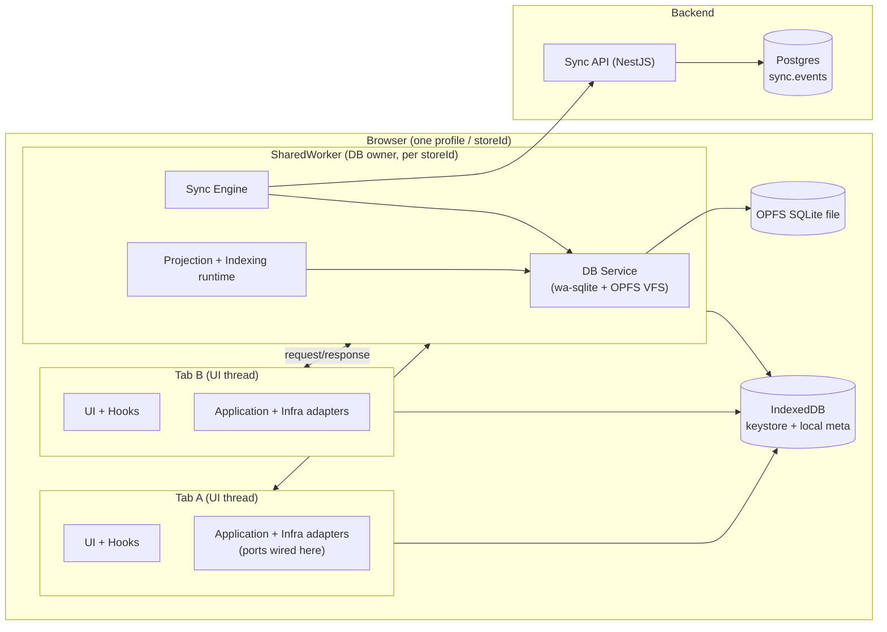
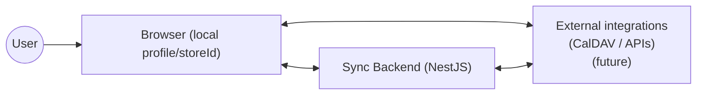
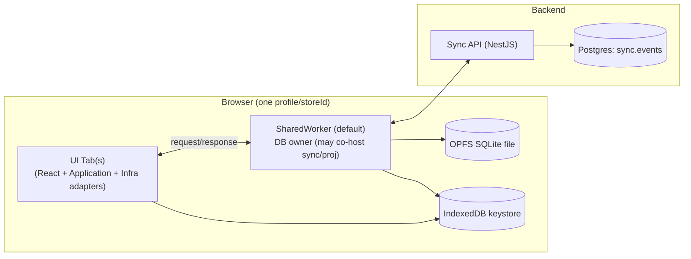
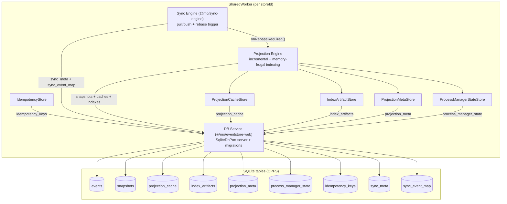
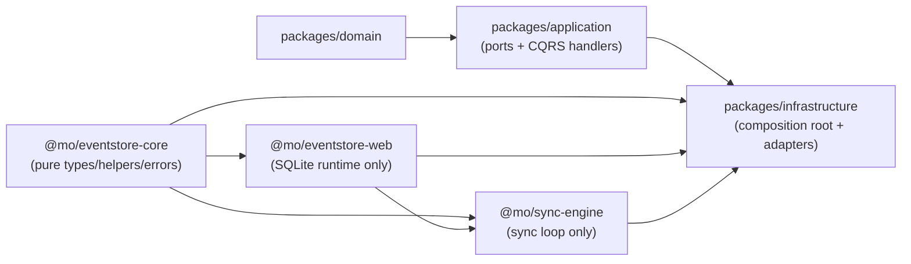
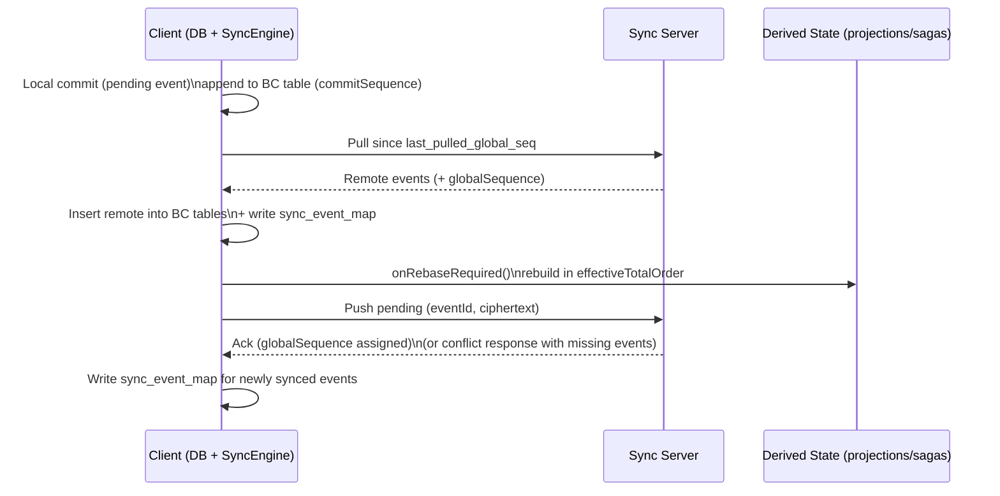
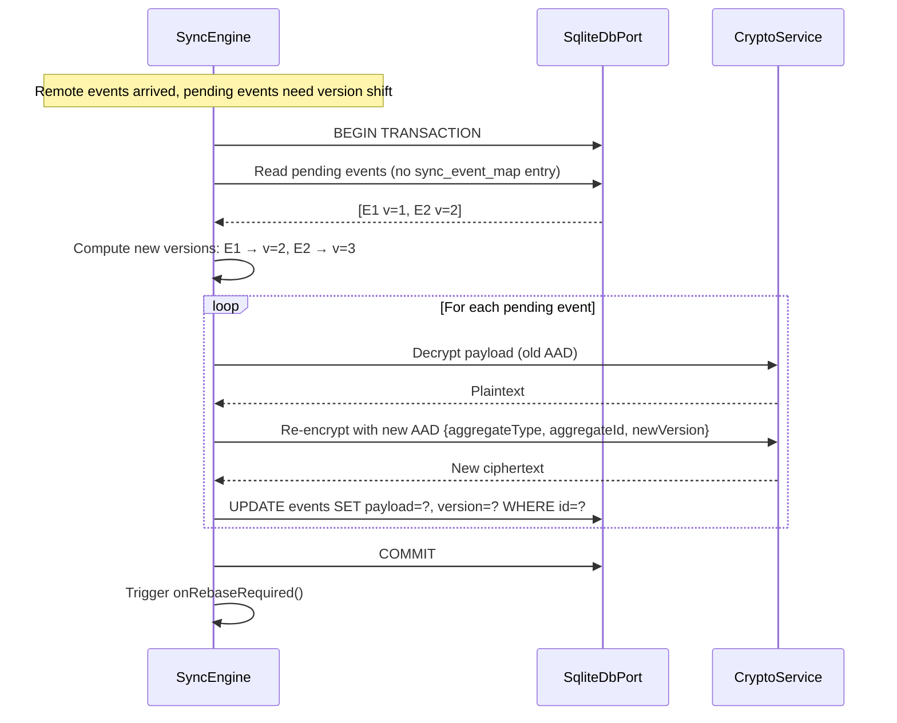
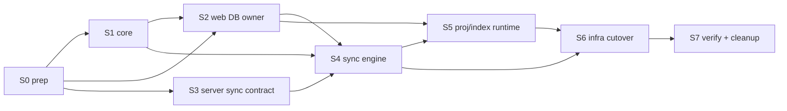

# RFC: Local-First Event Store & Sync Engine (LiveStore Replacement)

**Status**: Implemented
**Linear**: ALC-307
**Related**: ALC-244, ALC-254, ALC-301, ALC-306, ALC-305
**Created**: 2025-12-28
**Last Updated**: 2026-01-06

---

## Glossary (read this first)

- **Rebase**: When remote events arrive while local pending events exist, the effective order changes. Rebase = deterministically rebuilding derived state in the new order (and, for pending events only, possibly re-encrypting due to AAD binding).
- **AAD (Additional Authenticated Data)**: In AES-GCM, extra data bound to ciphertext for integrity. We bind `{aggregateType, aggregateId, version}`; changing any of these requires re-encryption.
- **Projection / derived state**: Read-optimized state built by processing events (snapshots, search indexes, analytics, saga/process-manager state).
- **Cursor**: A bookmark tracking “where we are” in an event stream/order, used to resume processing without reprocessing everything.
- **Worker request/response API (“RPC”)**: Message-based request/response over `MessagePort` between tab(s) and the DB owner worker. This is an in-process adapter pattern, not network calls.
- **Pending event**: A locally committed event that hasn’t been synced yet. Durable locally, but mutable until synced (may be re-encrypted during rebase).
- **Synced event**: An event with a server-assigned `globalSequence` mapping. Immutable; never rewritten.
- **`commitSequence`**: Monotonic local insertion order (SQLite AUTOINCREMENT commit sequence in the local `events` table).
- **`globalSequence`**: Server-assigned global ordering number (stored via `sync_event_map`).
- **`effectiveTotalOrder`**: The deterministic “converged” order used for rebuildable derived state: all synced events ordered by `globalSequence`, then local pending ordered by `commitSequence`.
- **`causationId` / `correlationId`**: Tracing/linking metadata. These are not ordering keys; do not attempt to “sort by causality” (see §6.4.1).

---

## 1. Problem Statement

We are considering replacing LiveStore because it is currently acting as an unstable “platform substrate” in an architecture that has stronger constraints than LiveStore was designed for.

### 1.1 Concrete pain points (grounded in current implementation)

1. **Keyed decryption cannot be a DB concern**
   - Our E2EE model requires client-side key access before state derivation.
   - Any approach that assumes DB-side materializers can decrypt is structurally incompatible.

2. **Non-durable SQL writes in practice**
   - Today we execute critical writes via `Store.query()` (projection meta cursors, snapshots, analytics/search tables, idempotency).
   - We have observed staleness/loss after rebase/cold boots and had to implement rebuild logic as a safety net (see ALC-306).

3. **Sync timing pathologies**
   - The “pull has precedence over push” runtime behavior leads to user-visible latency classes (e.g. ~20s delay on reconnection), requiring custom workarounds in `CloudSyncBackend`.

4. **Complexity mismatch**
   - LiveStore bundles: leader/session split, rebase machinery, materializers, devtools, and worker assumptions.
   - We use a small portion (SQLite + reactive queries + a sync processor contract) while constantly fighting the rest.

### 1.2 Root cause

LiveStore couples together:

- durable log storage
- materialization + rebase behavior
- reactivity
- sync processing semantics

Our architecture (see `docs/architecture.md`) requires these to be separable because:

- encryption keys must never be required inside the DB execution context;
- durability must be explicit and verifiable;
- rebase must be explicit, deterministic, and rebuild-safe (not an opaque library side effect).

---

## 2. Goals, Non-goals, and Constraints

### 2.1 Goals (MVP)

1. **Replace LiveStore runtime dependency** in `apps/web` and `packages/infrastructure` while preserving DDD layering.
2. **Durable local persistence** for:
   - event tables (Goals + Projects),
   - derived tables (snapshots, analytics, search),
   - cursor/meta tables,
   - idempotency keys.
3. **Local-first correctness**
   - offline reads/writes remain fully functional,
   - state derivation is deterministic and rebuildable from committed events.
4. **Sync correctness**
   - remove the “push blocked by long pull” class,
   - eliminate client-side global sequence assignment (no “guess → 409 → retry” loop),
   - keep the ALC-306 scenario covered by automated tests.
5. **Crypto compatibility**
   - keep AES-GCM payload encryption and ALC-301 eventing runtime unchanged,
   - DB layer treats ciphertext as opaque bytes.
6. **Native-compatible contracts (native implementation out of scope)**
   - define platform-agnostic contracts so a native SQLite implementation can be added later without changing Domain/Application.
7. **Non-throwaway substrate**
   - the replacement is intended to become the long-lived core substrate (not a short-lived spike); avoid “temporary” semantics that would force a redesign later.

### 2.2 Non-goals (explicitly out of scope)

- CRDT/semantic merge for conflicting domain edits (future Notes BC).
- Full metadata privacy (“ZK for metadata”) at the sync boundary.
- SQLCipher / full DB encryption at rest (payload encryption remains primary for MVP).
- `@mo/eventstore-native` implementation (React Native is not needed yet; we only keep the interface surface compatible).

### 2.3 Hard constraints from `docs/architecture.md`

- **Application owns ports**. Existing ports stay the public contracts:
  - `EventStorePort` (encrypted events),
  - `IdempotencyStorePort`,
  - read model ports, buses, etc.
- **Commit boundary**: “durable” means “persisted to local SQLite”. Anything else must be derivable/replayable.
- **AAD binding**: payload encryption binds integrity to `{aggregateType, aggregateId, version}`.
  - persisted/synced events must never change `version`;
  - local pending events may require controlled rebasing (re-encryption) before they become synced facts.

---

## 3. Alignment Review (Draft vs. Architecture vs. Codebase)

This section lists the key mismatches in the initial draft and the changes needed to make the PRD implementable against our current codebase.

### 3.1 Port ownership and layering

**Architecture reality**: `packages/application` owns ports; infrastructure implements them.

**Draft issue**: introducing `@mo/eventstore-core` as “the event store interface” risks moving port ownership out of application.

**Decision**: `@mo/eventstore-core` is pure/shared _infrastructure tooling_ (types + helpers). The application ports (`EventStorePort`, `IdempotencyStorePort`) remain in `packages/application`.

### 3.2 Reactive queries (sync vs async APIs)

**Codebase reality**: today we rely on LiveStore’s reactive API (`store.subscribe(...)`) and synchronous `store.query(...)`.

**Draft issue**: a synchronous DB API (`query(): T[]`) is not compatible with a worker-based implementation without cross-origin isolation + Atomics-based messaging. It also over-promises “reactive SQL”.

**Decision**:

- MVP provides _table-level invalidation_ (`subscribeToTables([...], listener)`), not reactive SQL expression evaluation.
- All DB calls are `Promise`-based so we can later move to workers/shared workers without changing call sites.

### 3.3 Rebase semantics

**Codebase reality**: projections already contain defensive “rebuild on cursor mismatch” logic due to LiveStore rebase (ALC-306).

**Draft issue**: “No rebase machinery—append-only with server ordering” is not compatible with (a) local pending events, and (b) server-ahead conflicts. Some form of rebase is required; the key is to make it explicit and deterministic.

**Decision**: rebase exists as an explicit sync-layer event (“remote events inserted while local pending exists”) and triggers deterministic rebuild of derived state. No hidden rollback semantics.

### 3.4 Sync server compatibility

**Codebase reality**: server `/sync/push` and `/sync/pull` currently speak LiveStore-shaped events (`event.v1` + `seqNum`/`parentSeqNum`).

**Draft issue**: this PRD initially tried to preserve the current contract, which forces the client to assign global sequence numbers and handle 409-based “server ahead” conflicts. That preserves the exact class of problems that caused much of the current pain.

**Decision (MVP)**: because this is **not a production app yet** and we control clients, we do **not** need backward compatibility. We will replace the current sync contract with a better one as part of this milestone:

- server-assigned `globalSequence` (no client `seqNum/parentSeqNum` guessing),
- idempotent `eventId` de-duplication,
- explicit conflict response when the server is ahead (still “Git-like”: client must fast-forward before pushing),
- canonical byte encoding across the JSON boundary (no numeric-key byte objects).

### 3.5 Prior draft reconciliation (what changed and why)

This PRD incorporates and replaces earlier unversioned draft text discussed in ALC-307. Key items and their status:

- **Cross-tab coordination via SharedWorker**: kept and expanded (now a first-class default execution model).
- **Events commit independently; projections eventually consistent**: kept; also aligned explicitly with our current “commit boundary” and rebuild strategy.
- **Append-only with server ordering / no local rewriting**: re-scoped.
  - We still want server-order convergence, but the current server API is client-seq based and local pending events exist.
  - Result: we treat rebase as explicit + rebuildable, and we scope a breaking sync contract replacement (server-assigned `globalSequence`) into this milestone (no backward compat required).
- **Reactive queries**: kept in spirit (table-level invalidation) but corrected to an async/worker-friendly surface.
- **Native package**: explicitly deferred; only interface compatibility is required now.

---

## 4. Proposed Solution (High Level)

Replace LiveStore with a minimal stack we fully control:

```
┌─────────────────────────────────────────────────────────────┐
│                     Application Layer                       │
│              (Commands, Queries, Repositories)              │
│  Ports: EventStorePort, IdempotencyStorePort, ReadModels, ...│
└─────────────────────────────────────────────────────────────┘
                              │
                              │ (implemented by Infrastructure)
                              ▼
┌─────────────────────────────────────────────────────────────┐
│                   @mo/eventstore-core                       │
│      Pure TS: cursor types, ordering helpers, errors        │
└─────────────────────────────────────────────────────────────┘
                              │
                              ▼
┌─────────────────────────────────────────────────────────────┐
│                     @mo/eventstore-web                      │
│            (Browser SQLite runtime: wa-sqlite + OPFS)       │
│  • SharedWorker-owned DB (multi-tab)                        │
│  • Durable transactions                                     │
│  • Table-level change notifications                         │
└─────────────────────────────────────────────────────────────┘
                              │
                              ▼
┌─────────────────────────────────────────────────────────────┐
│                     @mo/sync-engine                         │
│     push/pull + conflict handling + explicit rebase         │
└─────────────────────────────────────────────────────────────┘
```

### 4.0 High-level components



Terminology note: “Platform runtime” = the infrastructure runtime that replaces LiveStore (packages and runtime services). We may use “substrate” as informal shorthand in discussion, but **do not** bake “Substrate*” into code identifiers (prefer `Platform*`or`Runtime\*`). It is not “the worker”, though parts of the runtime are deployed into a SharedWorker in the browser (see §4.3).

### 4.1 Runtime data flow — post-LiveStore replacement

This mirrors `docs/architecture.md` Appendix A, but replaces LiveStore-specific runtime components with the new substrate.

Notation: ports have dashed borders; dashed edges labeled `implements` are not data flow (they are type/contract relationships).

```mermaid
flowchart TB

  %% ========= TOP LEVEL =========
  subgraph App["App UI<br>(Web / React)"]
    UI["Screens & Components"]
  end

  subgraph Interface["Interface Layer<br>(Adapters & Context)"]
    IF_CommandAPI["GoalCommand API (hooks)"]
    IF_QueryAPI["GoalQuery API (hooks + subscriptions)"]
  end

  subgraph Application["Application Layer (example: Goals BC)<br>CQRS + Ports"]
    CmdBusPort["CommandBusPort (BusPort&lt;GoalCommand&gt;)"]
    QryBusPort["QueryBusPort (BusPort&lt;GoalQuery&gt;)"]
    CmdHandler["GoalCommandHandler"]
    QryHandler["GoalQueryHandler"]
    Saga["GoalAchievementSaga<br>(process manager)"]

    RepoPort["GoalRepositoryPort (port)"]
    ReadModelPort["GoalReadModelPort (port)"]
    EventStorePort["EventStorePort (port)"]
    IdemPort["IdempotencyStorePort (port)"]
    EventBusPort["EventBusPort (port)"]
  end

  subgraph Domain["Domain Layer (Goals BC)<br>Aggregates + Events"]
    GoalAgg["Goal<br>(Aggregate Root)"]
    GoalEvents["Goal Domain Events"]
  end

  %% ========= INFRA =========
  subgraph Infra["Infrastructure (browser)"]

    subgraph WriteInfra["Persistence + Crypto"]
      GoalRepoImpl["GoalRepository"]
      ToEncrypted["DomainToEncryptedAdapter"]
      CryptoService["WebCryptoService"]
      KeyStore["IndexedDBKeyStore"]
    end

    subgraph ReadInfra["Read models + Publication + Idempotency"]
      ReadModelImpl["GoalReadModel<br>(thin client)"]

      Publisher["CommittedEventPublisher<br>(commitSequence order)"]
      ToDomain["EncryptedToDomainAdapter"]
      InMemoryEventBus["InMemoryEventBus"]
      SimpleBusImpl["SimpleBusImpl<br>(SimpleBus&lt;GoalCommand&gt; / SimpleBus&lt;GoalQuery&gt;)"]

      IdemImpl["SqliteIdempotencyStore"]
      SagaStore["GoalAchievementSagaStore"]
    end

    subgraph DbRuntime["@mo/eventstore-web<br>(SharedWorker-owned SQLite)"]
      SqliteClient["SqliteDbPort (request/response client)"]
      subgraph Worker["SharedWorker DB owner<br>(single writer per storeId)"]
        SqliteServer["SqliteDbPort (server)"]
        SyncEngine["SyncEngine<br>(pull/push, rebase)"]
        ProjEngine["Projection/Indexing runtime<br>(incremental, memory-frugal)"]
      end
    end

    subgraph LocalDb["Local SQLite DB (OPFS)"]
      EventsTbl[(events<br>id + aggregate_type + aggregate_id<br>+ commitSequence)]
      SnapshotsTbl[("snapshots<br>(encrypted blobs)")]
      ProjectionCacheTbl[("projection_cache<br>(encrypted caches)")]
      IndexArtifactsTbl[("index_artifacts<br>(encrypted indexes)")]
      ProjectionMetaTbl[("projection_meta<br>(processor cursors)")]
      ProcMgrStateTbl[("process_manager_state<br>(encrypted saga state)")]

      IdemTbl[(idempotency_keys)]
      SyncMetaTbl[(sync_meta)]
      SyncMapTbl[(sync_event_map<br>eventId → globalSequence)]
    end

  end

  %% ========= SYNC SERVER =========
  subgraph SyncServer["Sync Backend (NestJS + Postgres)"]
    subgraph SyncPresentation["Presentation<br>/sync API"]
      SyncController["SyncController"]
    end
    subgraph SyncPersistence["Persistence<br>(Postgres)"]
      SyncEvents[(sync.events)]
    end
  end

  %% ========= APP FLOW =========
  UI --> IF_CommandAPI --> CmdBusPort --> CmdHandler
  UI --> IF_QueryAPI --> QryBusPort --> QryHandler

  %% Command handler → domain + ports
  CmdHandler --> GoalAgg --> GoalEvents
  CmdHandler --> RepoPort
  CmdHandler --> IdemPort

  %% Query handler → read model port
  QryHandler --> ReadModelPort

  %% Saga subscribes post-commit and dispatches commands
  EventBusPort --> Saga
  Saga -- "dispatch AchieveGoal" --> CmdBusPort
  Saga --> SagaStore
  SagaStore --> ProcMgrStateTbl
  Saga --> IdemPort

  %% Ports implemented in infra (dashed edge is NOT dataflow)
  GoalRepoImpl -. "implements" .-> RepoPort
  ReadModelImpl -. "implements" .-> ReadModelPort
  InMemoryEventBus -. "implements" .-> EventBusPort
  IdemImpl -. "implements" .-> IdemPort
  SimpleBusImpl -. "implements" .-> CmdBusPort
  SimpleBusImpl -. "implements" .-> QryBusPort

  %% Infra uses ports (dataflow)
  GoalRepoImpl --> ToEncrypted --> CryptoService
  ToEncrypted --> KeyStore
  GoalRepoImpl --> EventStorePort

  Publisher --> EventStorePort
  Publisher --> ToDomain --> KeyStore
  Publisher --> EventBusPort

  %% Event store implementation (infra)
  SqliteEventStoreImpl["BrowserSqliteEventStore<br>(EventStorePort impl)"] -. "implements" .-> EventStorePort

  %% SQLite runtime wiring (SharedWorker owner)
  SqliteEventStoreImpl -- "events" --> SqliteClient <--> SqliteServer
  Publisher -- "projection_meta + reads" --> SqliteClient
  IdemImpl -- "idempotency_keys" --> SqliteClient
  SagaStore -- "process_manager_state" --> SqliteClient

  %% NOTE: only the SharedWorker DB owner touches SQLite tables directly.
  %% All other components call into the DB owner via the SqliteDbPort surface (client/server).
  SyncEngine -- "events + sync tables" --> SqliteServer
  ProjEngine -- "snapshots + caches + indexes + meta" --> SqliteServer

  SqliteServer --> EventsTbl
  SqliteServer --> SnapshotsTbl
  SqliteServer --> ProjectionCacheTbl
  SqliteServer --> IndexArtifactsTbl
  SqliteServer --> ProjectionMetaTbl
  SqliteServer --> ProcMgrStateTbl
  SqliteServer --> IdemTbl
  SqliteServer --> SyncMetaTbl
  SqliteServer --> SyncMapTbl

  %% Sync + rebase
  SyncEngine -- "onRebaseRequired()" --> ProjEngine
  SyncEngine -- "PUSH/PULL (base64url bytes)" --> SyncController --> SyncEvents

  %% ========= STYLING =========
  classDef port fill:#FFFFFF,stroke:#555555,stroke-width:1px,stroke-dasharray:4 3;
  class CmdBusPort,QryBusPort,RepoPort,ReadModelPort,EventStorePort,IdemPort,EventBusPort port;

  classDef db fill:#E0F4FF,stroke:#007ACC,stroke-width:1px,color:#000;
  class EventsTbl,SnapshotsTbl,ProjectionCacheTbl,IndexArtifactsTbl,ProjectionMetaTbl,ProcMgrStateTbl,IdemTbl,SyncMetaTbl,SyncMapTbl db;
```



### 4.2 Execution model (what runs where) — make background work explicit

This spec assumes we must support:

- multi-tab safety (single writer to OPFS),
- background projection/index maintenance,
- and no UI stalls from large-volume indexing/rebuilds.

**Decision (default)**: run DB IO + sync + projection/indexing in the **SharedWorker DB owner**, and expose them to tabs via a message-based request/response API (“RPC”).

**Separation of concerns (avoid mixing “DB runtime” with “derived-state compute”)**

Even if these components are co-located in the same worker process, the _design boundaries_ must remain explicit:

1. `@mo/eventstore-web` is the **SQLite runtime only**:
   1. owns the single SQLite connection + migrations
   2. exposes `SqliteDbPort` (server) + notifications
   3. does **not** contain projection/indexing logic
2. `@mo/sync-engine` is the **sync coordinator**:
   1. reads/writes via `SqliteDbPort`
   2. triggers rebase invalidation
3. Projection/indexing runtime is **derived-state compute**:
   1. consumes events in `effectiveTotalOrder`
   2. maintains caches/index artifacts
   3. can be paused/throttled without affecting event durability

**Critical-path isolation (requirements)**

1. Event append transactions must remain small and low-latency.
2. Background indexing/projection work must be cooperative and preemptible:
   1. bounded batches
   2. yield between batches
   3. throttle under UI activity / frequent commits
3. No derived-state compute is allowed to block event commits (correctness relies on rebuildability).

Reason: with table-level invalidation MVP, a single owner that already fans out notifications is the simplest place to also host “background” projection/indexing loops without duplicating work across tabs.

**Placement matrix (default execution model)**

1. Tab (UI thread):
   1. command/query handlers and UI composition
   2. crypto/key access for domain operations (may be proxied to worker if needed later)
   3. thin read model adapters that call worker APIs (request/response clients)
2. SharedWorker (per `storeId`):
   1. SQLite connection owner + migrations + `SqliteDbPort` server
   2. sync loop (`@mo/sync-engine`) + durable cursor state
   3. projection runtime(s): event consumption, rebuilds on rebase, cache/index persistence
   4. background indexing jobs (chunked, resumable)

**Fallback modes**:

1. If SharedWorker is unavailable, a dedicated Worker owns the DB and runs the same background loops.
2. Main-thread DB mode is debug-only; if used, background indexing must be chunked to avoid UI stalls.

### 4.3 Deployment (processes + storage) — Web

This diagram answers “what runs where?” at deployment/runtime level. It is intentionally separate from the DDD runtime diagram.



Notes:

- The SharedWorker is the **single SQLite connection owner** to the OPFS-backed DB file (multi-tab safe).
- Key access is via IndexedDB keystore. Whether crypto runs in tabs or in the worker is an infra decision; the invariant is that encryption/decryption happens in JS, not “inside SQLite”.
- The projection/indexing runtime is shown co-located with the SharedWorker in the default deployment because it is the natural place to run background work **once per storeId** (not once per tab).
  - Co-location is not coupling: projection/indexing code must be separate modules and must be pausable/throttled so it never blocks event commits (§4.2 “Critical-path isolation”).

**Deployment variant (explicit escape hatch): split DB runtime vs compute**

If we observe contention (e.g., large indexing batches starving commits), we can split “DB runtime” and “derived-state compute” into separate workers without changing the contracts:

1. SharedWorker: `@mo/eventstore-web` DB service only (`SqliteDbPort` server).
2. Dedicated Worker: projection/indexing runtime, talking to the DB service via request/response messaging.
3. Sync engine can live in either:
   - DB worker (simpler, fewer hops), or
   - its own worker (calls DB worker), if needed for isolation.

### 4.4 C4-style diagrams (Context → Containers → Components)

These diagrams are intentionally “C4 shaped” (without relying on a C4-specific Mermaid dialect) to make boundaries obvious.

#### 4.4.1 System context (C4: Context)



#### 4.4.2 Containers (C4: Containers)



#### 4.4.3 Components inside the SharedWorker (C4: Components)



---

## 5. Package Breakdown (Implementation Contracts)

### 5.0 Separation of concerns + wiring rules (requirements)

This milestone replaces LiveStore with a substrate that we may later extract as OSS. To keep that possible **and** keep the product in control, the wiring rules below are non-negotiable:

1. **No implicit wiring**: substrate packages must not “auto-discover” projections, handlers, or tables. All runtime graphs are assembled in infrastructure composition roots.
2. **No dependency inversion violations**: Domain/Application must not import substrate packages (`@mo/eventstore-*`, `@mo/sync-engine`). They depend only on application ports.
3. **Kernel vs policy split**:
   - `@mo/eventstore-web` = SQLite runtime only (ownership + migrations + `SqliteDbPort` + notifications).
   - `@mo/sync-engine` = sync loop only (calls DB via `SqliteDbPort`; invokes `onRebaseRequired()`; does not embed projection/index code).
   - projection/index runtime = policies + implementations (relocatable; can be moved to another worker without changing its interface).
4. **Single source of truth**: events are authoritative; derived state is rebuildable and must never block commits (§4.2, §12.1).
5. **Composition root responsibility**: `packages/infrastructure` is where we:
   - choose the deployment topology (SharedWorker-only vs split workers),
   - choose scheduling/throttling policy for background work,
   - bind application ports to substrate implementations.

**Allowed import graph (requirements-level)**



### 5.0.1 Monorepo package layout (concrete, minimal)

The PRD already defines **package responsibilities**. This section pins down the **folder layout** so implementation can start without inventing structure.

**Requirement**: new substrate packages live under `packages/` as first-class packages (siblings to `domain/`, `application/`, `infrastructure/`, `presentation/`).

Proposed layout (normative for this milestone):

- `packages/eventstore-core/` (name: `@mo/eventstore-core`)
  - `src/index.ts` (public exports only)
  - `src/types/**` (cursor + envelope types)
  - `src/errors/**` (error codes + classes)
  - `src/ordering/**` (effective order helpers)
- `packages/eventstore-web/` (name: `@mo/eventstore-web`)
  - `src/index.ts`
  - `src/db/**` (wa-sqlite + OPFS VFS wiring)
  - `src/worker/**` (SharedWorker server + client transport)
  - `src/notifications/**` (table invalidation)
- `packages/sync-engine/` (name: `@mo/sync-engine`)
  - `src/index.ts`
  - `src/protocol/**` (DTOs + codecs; base64url boundary)
  - `src/engine/**` (push/pull, cursoring, conflict handling)

Note: the projection/indexing runtime is a **policy layer** and may remain in `packages/infrastructure` initially (so it can depend on application/domain adapters), as long as its external surface is expressed via ports and it talks to storage only via `SqliteDbPort`.

### 5.1 `@mo/eventstore-core` (pure)

**Purpose**: shared types + pure logic (no platform deps).

**Type style conventions (normative for implementation)**

- Use `Readonly<{}>` for object type aliases and `ReadonlyArray<T>` for arrays in public signatures.
- Do not invent ad-hoc string unions at call sites; prefer `as const` registries + derived types for discriminants and codes.
- Do not add `readonly` modifiers to primitive parameters (e.g. `sql: string`); primitives are immutable by value.

```ts
export type Unsubscribe = () => void;

/**
 * Stable partition key for the unified `events` table.
 * This must never be renamed once persisted.
 */
export const AggregateTypes = {
  goal: 'goal',
  project: 'project',
  // calendar: 'calendar', // future
} as const;

export type AggregateType = (typeof AggregateTypes)[keyof typeof AggregateTypes];

export type CommitCursor = Readonly<{
  commitSequence: number;
  eventId: string;
  version: number;
}>;

export type SyncCursor = Readonly<{
  globalSequence: number;
}>;

/**
 * Cursor type for `effectiveTotalOrder` consumption:
 * - first advance `globalSequence` (synced region),
 * - then advance `pendingCommitSequence` (pending region, where `globalSequence` is null).
 */
export type EffectiveCursor = Readonly<{
  globalSequence: number;
  pendingCommitSequence: number;
}>;

export const ProjectionOrderings = {
  effectiveTotalOrder: 'effectiveTotalOrder',
  commitSequence: 'commitSequence',
} as const;
export type ProjectionOrdering = (typeof ProjectionOrderings)[keyof typeof ProjectionOrderings];

export const CursorComparisons = {
  before: 'before',
  equal: 'equal',
  after: 'after',
} as const;
export type CursorComparison = (typeof CursorComparisons)[keyof typeof CursorComparisons];

export function compareCommitCursor(a: CommitCursor, b: CommitCursor): CursorComparison;

export const PlatformErrorCodes = {
  DbOwnershipError: 'DbOwnershipError',
  DbLockedError: 'DbLockedError',
  WorkerProtocolError: 'WorkerProtocolError',
  CanceledError: 'CanceledError',
  TimeoutError: 'TimeoutError',
  TransactionAbortedError: 'TransactionAbortedError',
  ConstraintViolationError: 'ConstraintViolationError',
  MigrationError: 'MigrationError',
  DecryptionError: 'DecryptionError',
  IndexCorruptionError: 'IndexCorruptionError',
  SyncConflictError: 'SyncConflictError',
} as const;
export type PlatformErrorCode = (typeof PlatformErrorCodes)[keyof typeof PlatformErrorCodes];

export type PlatformError = Readonly<{
  code: PlatformErrorCode;
  message: string;
  /**
   * Optional machine-readable context for debugging/telemetry.
   * Must be JSON-serializable (worker boundary safe).
   */
  context?: Readonly<Record<string, unknown>>;
}>;
```

**Platform-runtime-internal ports (not application ports)**

We define a few platform-runtime-internal ports for event log access and reactive read helpers, with two key clarifications:

1. These are **infrastructure-internal** surfaces (used to implement `packages/application` ports like `EventStorePort`); they are not the application ports themselves.
2. The DB surface must be **async**, because our preferred browser execution model is SharedWorker/Worker + a message-based request/response API (“RPC”).

```ts
export type EventRecord = Readonly<{
  id: string;
  aggregateId: string;
  eventType: string;
  payload: Uint8Array; // encrypted ciphertext (opaque)
  version: number; // per-aggregate version (AAD binding)
  occurredAt: number;
  actorId: string | null;
  causationId: string | null;
  correlationId: string | null;
  epoch: number | null;
  keyringUpdate: Uint8Array | null;

  /** Monotonic local commit order (stable on-device). */
  commitSequence: number;
  /** Server global sequence once synced; null for local-only pending events. */
  globalSequence: number | null;
}>;

export type EventFilter = Readonly<{
  aggregateId?: string;
  eventType?: string;
  /** Process new local commits since this local commitSequence. */
  sinceCommitSequence?: number;
  /** Replay in server order since this global sequence (synced events only). */
  sinceGlobalSequence?: number;
  limit?: number;
}>;

export const EventRecordDerivedKeys = {
  commitSequence: 'commitSequence',
  globalSequence: 'globalSequence',
} as const;
export type EventRecordDerivedKey = (typeof EventRecordDerivedKeys)[keyof typeof EventRecordDerivedKeys];

export interface EventLogPort {
  append(events: ReadonlyArray<Omit<EventRecord, EventRecordDerivedKey>>): Promise<ReadonlyArray<EventRecord>>;
  read(filter: EventFilter): Promise<ReadonlyArray<EventRecord>>;
}

export interface ReactiveQueryPort<T> {
  get(): Promise<T>;
  subscribe(callback: (value: T) => void): Unsubscribe;
}
```

**Size estimate**: still ~300 lines for this package is realistic.

### 5.2 `@mo/eventstore-web` (browser)

**Purpose**: a durable SQLite runtime with minimal reactivity.

```ts
export type SqliteValue = string | number | Uint8Array | null;

export type SqliteTableName = string;

export const ChangeOperations = {
  insert: 'insert',
  update: 'update',
  delete: 'delete',
} as const;
export type ChangeOperation = (typeof ChangeOperations)[keyof typeof ChangeOperations];

export const ChangeHintKinds = {
  tableInvalidated: 'tableInvalidated',
  rowsChanged: 'rowsChanged',
} as const;
export type ChangeHintKind = (typeof ChangeHintKinds)[keyof typeof ChangeHintKinds];

export type ChangeHint =
  | Readonly<{
      kind: typeof ChangeHintKinds.tableInvalidated;
      table: SqliteTableName;
    }>
  | Readonly<{
      kind: typeof ChangeHintKinds.rowsChanged;
      table: SqliteTableName;
      operation: ChangeOperation;
      /**
       * Best-effort row identifiers. Not guaranteed for all tables (e.g. WITHOUT ROWID).
       * If unavailable, the implementation MUST fall back to `tableInvalidated`.
       */
      rowids: ReadonlyArray<number>;
    }>;

export const SqliteStatementKinds = {
  execute: 'execute',
  query: 'query',
} as const;
export type SqliteStatementKind = (typeof SqliteStatementKinds)[keyof typeof SqliteStatementKinds];

export type SqliteStatement =
  | Readonly<{
      kind: typeof SqliteStatementKinds.execute;
      sql: string;
      params?: ReadonlyArray<SqliteValue>;
    }>
  | Readonly<{
      kind: typeof SqliteStatementKinds.query;
      sql: string;
      params?: ReadonlyArray<SqliteValue>;
    }>;

/**
 * Note: the `kind` discriminator is intentional even though callers know the
 * statement order. It lets the DB owner validate that it returned the expected
 * result shape per statement (important across a worker boundary) and keeps the
 * protocol self-describing for debugging and evolution.
 *
 * Call sites may wrap `batch()` in higher-level helpers that return typed tuples
 * (or drop kinds) for ergonomics.
 */
export type SqliteBatchResult =
  | Readonly<{ kind: typeof SqliteStatementKinds.execute }>
  | Readonly<{
      kind: typeof SqliteStatementKinds.query;
      rows: ReadonlyArray<Readonly<Record<string, unknown>>>;
    }>;

export interface SqliteDbPort {
  query<T extends Readonly<Record<string, unknown>>>(
    sql: string,
    params?: ReadonlyArray<SqliteValue>
  ): Promise<ReadonlyArray<T>>;

  execute(sql: string, params?: ReadonlyArray<SqliteValue>): Promise<void>;

  /**
   * Atomically executes statements inside a single SQLite transaction.
   *
   * This is intentionally a *batch* API:
   * - statements cannot depend on prior statement results (no “interactive transaction”),
   * - for multi-step logic, expose a dedicated worker operation (e.g. `eventStore.append`).
   */
  batch(statements: ReadonlyArray<SqliteStatement>): Promise<ReadonlyArray<SqliteBatchResult>>;

  subscribeToTables(tables: ReadonlyArray<SqliteTableName>, listener: () => void): Unsubscribe;

  /**
   * Optional extension point for future performance work (e.g., Notes BC).
   * Implementations may provide best-effort change hints (row ids, ranges, etc.).
   * MVP remains table-level invalidation only.
   */
  subscribeToChanges?(
    tables: ReadonlyArray<SqliteTableName>,
    listener: (hints: ReadonlyArray<ChangeHint>) => void
  ): Unsubscribe;
}

export interface WebSqliteOptions {
  storeId: string;
  dbName: string;
  requireOpfs: boolean;
}

export function createWebSqliteDb(options: WebSqliteOptions): Promise<{
  db: SqliteDbPort;
  shutdown: () => Promise<void>;
}>;
```

**SQLite value mapping (requirements)**

The DB owner service MUST normalize SQLite values at the `SqliteDbPort` boundary so consumers do not guess types:

- `TEXT` → `string`
- `INTEGER` → `number` (only used for values guaranteed to fit JS safe integer range in this product: sequences, cursors, timestamps)
- `BLOB` → `Uint8Array` (ciphertext/index bytes)
- `NULL` → `null`

**DX + hot-path note (implementation guidance)**

- `SqliteDbPort` is intentionally low-level; do not let every call site invent its own SQL/mapping conventions.
  - Provide a small shared helper layer during implementation (e.g., central `SqliteStatement` builders + row mappers) so BLOB handling, parameter binding, and table naming stay consistent.
- Do not rely on “prepared statements” as a spec requirement for MVP.
  - If profiling shows it matters for hot paths (event append, cursor scans), add prepared statement support inside the DB owner as a measured optimization.
- Prefer dedicated worker operations for multi-step write logic (e.g. event append with OCC) rather than issuing chatty sequences of `db.query`/`db.execute` calls from tabs.

#### 5.2.1 Worker messaging protocol (explicit; no Comlink in MVP)

We intentionally use an explicit request/response protocol over `MessagePort` (SharedWorker) / `postMessage` (Worker). This is an in-process adapter, not “network RPC”.

**Requirements**

1. Versioned envelopes (forward evolution without breaking old tabs immediately).
2. Explicit transferables for large `Uint8Array` payloads (send `ArrayBuffer` as transferable where appropriate).
3. Cancellation for long-running requests (query/index build).
4. Typed error taxonomy (machine-readable error codes).

**Shape (requirements-level; normative)**

```ts
export const WorkerEnvelopeKinds = {
  request: 'request',
  response: 'response',
  cancel: 'cancel',
} as const;
export type WorkerEnvelopeKind = (typeof WorkerEnvelopeKinds)[keyof typeof WorkerEnvelopeKinds];

export type WorkerEnvelope =
  | Readonly<{
      v: 1;
      kind: typeof WorkerEnvelopeKinds.request;
      requestId: string;
      payload: WorkerRequest;
    }>
  | Readonly<{
      v: 1;
      kind: typeof WorkerEnvelopeKinds.response;
      requestId: string;
      payload: WorkerResponse;
    }>
  | Readonly<{
      v: 1;
      kind: typeof WorkerEnvelopeKinds.cancel;
      requestId: string;
      targetRequestId: string;
    }>;

/**
 * Handshake messages are control-plane messages: they establish a session
 * (`storeId`, ownership mode, protocol version) before request/response traffic.
 * They are intentionally *not* part of the request/response envelope because:
 * - they do not have `requestId`,
 * - they are processed before subscriptions/requests exist.
 */
export const WorkerHelloKinds = {
  hello: 'hello',
  helloOk: 'hello.ok',
} as const;
export type WorkerHelloKind = (typeof WorkerHelloKinds)[keyof typeof WorkerHelloKinds];

export type WorkerHello =
  | Readonly<{
      v: 1;
      kind: typeof WorkerHelloKinds.hello;
      storeId: string;
      clientInstanceId: string;
    }>
  | Readonly<{
      v: 1;
      kind: typeof WorkerHelloKinds.helloOk;
      protocolVersion: 1;
      ownershipMode: DbOwnershipMode;
      serverInstanceId: string;
    }>;

export const WorkerRequestKinds = {
  dbQuery: 'db.query',
  dbExecute: 'db.execute',
  dbBatch: 'db.batch',
  indexStatus: 'index.status',
  indexEnsureBuilt: 'index.ensureBuilt',
  readModelListWindow: 'readModel.listWindow',
  readModelGetById: 'readModel.getById',
} as const;
export type WorkerRequestKind = (typeof WorkerRequestKinds)[keyof typeof WorkerRequestKinds];

export type WorkerRequest =
  | Readonly<{
      kind: typeof WorkerRequestKinds.dbQuery;
      sql: string;
      params: ReadonlyArray<SqliteValue>;
    }>
  | Readonly<{
      kind: typeof WorkerRequestKinds.dbExecute;
      sql: string;
      params: ReadonlyArray<SqliteValue>;
    }>
  | Readonly<{
      kind: typeof WorkerRequestKinds.dbBatch;
      statements: ReadonlyArray<SqliteStatement>;
    }>
  | Readonly<{ kind: typeof WorkerRequestKinds.indexStatus; indexId: string }>
  | Readonly<{
      kind: typeof WorkerRequestKinds.indexEnsureBuilt;
      indexId: string;
    }>
  | Readonly<{
      kind: typeof WorkerRequestKinds.readModelListWindow;
      readModelId: string;
      params: Readonly<Record<string, unknown>>;
    }>
  | Readonly<{
      kind: typeof WorkerRequestKinds.readModelGetById;
      readModelId: string;
      id: string;
    }>;

export const WorkerResponseKinds = {
  ok: 'ok',
  error: 'error',
} as const;
export type WorkerResponseKind = (typeof WorkerResponseKinds)[keyof typeof WorkerResponseKinds];

export type WorkerResponse =
  | Readonly<{ kind: typeof WorkerResponseKinds.ok; data: unknown }>
  | Readonly<{
      kind: typeof WorkerResponseKinds.error;
      error: import('@mo/eventstore-core').PlatformError;
    }>;
```

**Normativity note**

- The exact string tags (`'db.query'`, `'index.ensureBuilt'`, …) may change during implementation, but the **semantic requirements** in this section are binding: versioned envelopes, explicit transferables, cancellation, and machine-readable error codes.

**Transferable rule (MVP)**

- For `Uint8Array`/ciphertext/index blobs, prefer returning `{ data: { bytes: Uint8Array } }` only if we can guarantee transfer safety; otherwise return a base64url string and decode in the caller. (This is a performance knob and must be measured.)

#### 5.2.2 SharedWorker lifecycle + recovery (edge cases are part of the spec)

The worker protocol types alone are not sufficient; lifecycle behavior must be explicit so engineers do not reinvent it.

**Tab connect / disconnect**

1. On connect, the tab MUST perform a handshake:
   - send `{ v: 1, kind: WorkerHelloKinds.hello, storeId, clientInstanceId }`
   - receive `{ v: 1, kind: WorkerHelloKinds.helloOk, protocolVersion, ownershipMode, serverInstanceId }`
2. The DB owner MUST:
   - track connected ports by `clientInstanceId`,
   - drop per-port subscriptions on disconnect,
   - best-effort cancel in-flight requests for that port (see cancellation semantics below).
3. The DB owner MUST NOT “forget” durability responsibilities when the last tab disconnects:
   - DB file and durable state persist in OPFS regardless of connections,
   - background work may pause when no clients exist (policy), but must never block commits when clients exist.

**Connection recovery**

1. If the worker crashes/restarts, ports will disconnect.
2. The tab client must treat this as a recoverable condition:
   - re-establish the handshake,
   - re-subscribe table invalidations,
   - re-issue any read requests as needed.
3. Any request that was in-flight during disconnect has an **unknown** outcome. Therefore:
   - all write-shaped requests exposed at the worker boundary must be idempotent by construction (unique constraints, “insert or ignore”, stable event ids), or be wrapped by an explicit idempotency key mechanism.

**Atomicity semantics across the message boundary**

We do not support “interactive transactions” across multiple messages in MVP.

1. `db.batch(...)` MUST be executed wholly inside the DB owner as a single atomic unit:
   - either it commits and the response is `ok`,
   - or it rolls back and the response is `error`.
2. If the worker process crashes, SQLite guarantees rollback of the uncommitted transaction.
3. If the tab disconnects mid-request:
   - the worker may complete the transaction but the response may be lost,
   - clients MUST handle this by treating the outcome as unknown and retrying only idempotent operations.

**Cancellation semantics (required)**

1. A `cancel` message is best-effort; it must always produce a response (`CanceledError`) even if the underlying operation could not be interrupted.
2. Long operations (index builds, large queries) must be chunked so cancellation is effective (bounded batches + yield points).

**Execution model**

Earlier iterations treated the worker as “optional”. Given our multi-tab requirements and OPFS safety, we make the **SharedWorker owner** the default and treat “main thread” as debug-only.

```
┌─────────────────────────────────────────┐
│           Main Thread API               │
│  createWebSqliteDb() → db (client)      │
└─────────────────────────────────────────┘
                    │
                    │ (default)
                    ▼
┌─────────────────────────────────────────┐
│       SharedWorker (DB owner)           │
│  • SQLite operations (wa-sqlite)        │
│  • OPFS persistence                     │
│  • Change notifications → all tabs      │
└─────────────────────────────────────────┘
```

**Change notifications**

We keep the prior “dependencies = table names to watch” idea but make it explicit:

- Notifications are **table-level** (MVP), not row-level.
- This is sufficient for our current infra, because projections/read models are already in-memory and rebuilt from tables.

Optionally expose a convenience helper (similar ergonomics, but async):

```ts
export function createReactiveQuery<T>(options: {
  db: SqliteDbPort;
  query: string;
  params?: ReadonlyArray<SqliteValue>;
  dependsOnTables: ReadonlyArray<SqliteTableName>;
}): ReactiveQueryPort<T>;
```

**Dependencies**: `@mo/eventstore-core`, `wa-sqlite` (upstream)  
**Size estimate**: ~600–1,000 lines (worker messaging + notifications + migrations + OPFS handling)

### 5.3 `@mo/eventstore-native` (React Native) — Out of scope

React Native support is not required for the current milestone. We explicitly defer it until we stabilize:

- the durable DB schema,
- sync semantics (especially explicit rebase),
- projection rebuild contracts.

Requirement now: do not bake browser-only assumptions into ports or domain/application; keep the DB API async and capability-based.

### 5.4 `@mo/sync-engine` (pure + infra-facing)

**Purpose**: sync loop and conflict handling without LiveStore.

```ts
export const SyncDirections = {
  pull: 'pull',
  push: 'push',
} as const;
export type SyncDirection = (typeof SyncDirections)[keyof typeof SyncDirections];

export const SyncPauseReasons = {
  user: 'user',
  offline: 'offline',
  backoff: 'backoff',
} as const;
export type SyncPauseReason = (typeof SyncPauseReasons)[keyof typeof SyncPauseReasons];

export const SyncErrorCodes = {
  network: 'network',
  conflict: 'conflict',
  auth: 'auth',
  server: 'server',
  unknown: 'unknown',
} as const;
export type SyncErrorCode = (typeof SyncErrorCodes)[keyof typeof SyncErrorCodes];

export const SyncStatusKinds = {
  idle: 'idle',
  syncing: 'syncing',
  paused: 'paused',
  error: 'error',
} as const;
export type SyncStatusKind = (typeof SyncStatusKinds)[keyof typeof SyncStatusKinds];

export type SyncError = Readonly<{
  code: SyncErrorCode;
  message: string;
  context?: Readonly<Record<string, unknown>>;
}>;

export type SyncStatus =
  | Readonly<{
      kind: typeof SyncStatusKinds.idle;
      lastSuccessAt: number | null;
      lastError: SyncError | null;
    }>
  | Readonly<{
      kind: typeof SyncStatusKinds.syncing;
      direction: SyncDirection;
      lastSuccessAt: number | null;
      lastError: SyncError | null;
    }>
  | Readonly<{
      kind: typeof SyncStatusKinds.paused;
      reason: SyncPauseReason;
      lastSuccessAt: number | null;
      lastError: SyncError | null;
    }>
  | Readonly<{
      kind: typeof SyncStatusKinds.error;
      error: SyncError;
      retryAt: number | null;
      lastSuccessAt: number | null;
    }>;

export interface SyncTransportPort {
  push(batch: SyncPushBatch): Promise<SyncPushResult>;
  pull(
    cursor: import('@mo/eventstore-core').SyncCursor,
    options?: { waitMs?: number; limit?: number }
  ): AsyncIterable<SyncPullBatch>;
  ping(): Promise<void>;
}

export interface SyncEngineOptions {
  db: import('@mo/eventstore-web').SqliteDbPort;
  transport: SyncTransportPort;
  storeId: string;
  onRebaseRequired: () => Promise<void>;
}
```

**Note**: `SyncEngine` does not expose DB-specific types to the application layer; it’s wired in infrastructure composition roots.

**Sync algorithm (target contract; breaking change is in scope)**

We are not trying to “wrap” the existing LiveStore-shaped `/sync/push` contract. The sync engine is designed against the replacement protocol in §7 (server-assigned `globalSequence`, no client `seqNum/parentSeqNum`).

```
┌──────────────────────────────────────────────────────────────┐
│                         Sync Loop                            │
│                                                              │
│  1) Pull remote changes (fast poll on reconnect)             │
│     • cursor = last_pulled_global_seq                        │
│  2) Apply remote events durably                              │
│     • write BC event rows + sync_event_map mappings          │
│  3) If remote applied while local pending exists → rebase    │
│     • call onRebaseRequired()                                │
│     • rebuild derived state deterministically                │
│  4) Push local pending (eventId + ciphertext)                │
│     • include precondition: expected server head             │
│  5) If server head moved → conflict response                 │
│     • pull missing → rebase → retry push                     │
│  6) Enter live polling mode (waitMs)                         │
│                                                              │
│  Key differences vs LiveStore runtime behavior:              │
│  • push is never blocked by long-poll pull                   │
│  • rebase is explicit and deterministic                      │
└──────────────────────────────────────────────────────────────┘
```

**Dependencies**: `@mo/eventstore-core`  
**Size estimate**: ~500–800 lines (transport + retries + state management)

### 5.5 Projection/Indexing runtime (where it lives; module → class breakdown)

Projections and indexes are **BC-specific**. The runtime that schedules them and persists their cursors is **shared infrastructure**.

**Rule (requirements)**:

- BC-specific projection/index implementations live under their BC infrastructure modules (e.g. `packages/infrastructure/src/goals/**`, `packages/infrastructure/src/projects/**`).
- A shared projection/index “runtime kernel” lives in a shared infrastructure location and depends only on:
  - `SqliteDbPort` (storage),
  - shared stores (`ProjectionMetaStore`, `IndexArtifactStore`, `ProjectionCacheStore`, `ProcessManagerStateStore`),
  - and scheduling/throttling policies.
- The shared runtime kernel must not import Domain/Application types for a specific BC; BC plug-ins are injected at composition time.

**Concrete target locations (normative for implementation)**:

- Shared projection/index runtime kernel: `packages/infrastructure/src/platform/derived-state/**`
- Goals derived-state implementations: `packages/infrastructure/src/goals/derived-state/**`
- Projects derived-state implementations: `packages/infrastructure/src/projects/derived-state/**`

**Module → class responsibility map (normative, KISS)**

| Module / folder                                                 | Owns                                          | Key classes (examples; names can vary but responsibilities must not)                                   | SQLite tables touched (via `SqliteDbPort`)                                        |
| --------------------------------------------------------------- | --------------------------------------------- | ------------------------------------------------------------------------------------------------------ | --------------------------------------------------------------------------------- |
| `@mo/eventstore-web`                                            | SQLite ownership + durability + notifications | `WebSqliteDbService` (DB owner), `DbOwnerWorkerServer`, `DbClient`                                     | _all tables_ (only DB owner touches SQLite directly)                              |
| `packages/infrastructure/src/platform/derived-state/runtime/**` | Scheduling + rebuild orchestration            | `ProjectionRuntime` (implements `ProjectionRuntimePort`), `WorkSchedulerPolicy`                        | `projection_meta` (cursors), plus whatever stores call                            |
| `packages/infrastructure/src/platform/derived-state/stores/**`  | Durable derived-state persistence primitives  | `ProjectionMetaStore`, `ProjectionCacheStore`, `IndexArtifactStore`, `ProcessManagerStateStore`        | `projection_meta`, `projection_cache`, `index_artifacts`, `process_manager_state` |
| `packages/infrastructure/src/platform/snapshots/**`             | Snapshot persistence helper(s)                | `SnapshotStore` (shared helper), snapshot codecs per aggregate type                                    | `snapshots`                                                                       |
| `packages/infrastructure/src/goals/derived-state/**`            | Goals read model compute                      | `GoalProjectionProcessor` (plugin), `GoalIndexExtractor` (plugin), optional `GoalProjectionCacheCodec` | uses shared stores; no direct table access                                        |
| `packages/infrastructure/src/projects/derived-state/**`         | Projects read model compute                   | `ProjectProjectionProcessor`, `ProjectIndexExtractor`, optional codecs                                 | uses shared stores; no direct table access                                        |

**Composition root wiring (requirements)**

The composition root (in `packages/infrastructure`) must:

1. Construct the DB owner (`createWebSqliteDb()`), producing a `SqliteDbPort`.
2. Construct shared derived-state stores on top of `SqliteDbPort`.
3. Register BC plug-ins (Goals, Projects) into the shared `ProjectionRuntime` as an explicit array/config.
4. Ensure the sync engine calls `ProjectionRuntime.onRebaseRequired()` when required.

---

## 6. Storage Model (Local) and Ordering

### 6.1 Target local model: one `events` table (avoid per-BC event tables)

We do not need `goal_events`, `project_events`, `xxx_events` as separate physical tables long-term.

**Decision (MVP)**: introduce a single `events` table that stores encrypted domain events for all aggregates/BCs, partitioned by `(aggregate_type, aggregate_id)` to prevent collisions.

Rationale:

- Avoids schema growth that is linear with BC count (table sprawl + duplicated indices + duplicated migrations).
- Makes cross-BC processors (sagas/read models that consume multiple BCs) straightforward without `UNION` across event tables.
- Matches how we already reason about sync ordering: a single per-store log with a server-assigned `globalSequence` mapping.

Derived state tables remain BC-specific where it adds clarity/perf:

- snapshots (can be consolidated later, but not required),
- projection meta (per BC or consolidated with `processor_id` namespacing),
- analytics/search, saga state tables.

**Change**: execute all reads/writes through `SqliteDbPort` (single durable DB), not via LiveStore `Store`.

### 6.1.1 Target local DB schema (MVP)

Current schema definitions (useful for implementation reference) live in:

- Goals: `packages/infrastructure/src/goals/schema.ts`
- Projects: `packages/infrastructure/src/projects/schema.ts`
- Idempotency: `packages/infrastructure/src/livestore/schema.ts`

Target schema additions/changes for the replacement substrate are listed below.

**Events table (`events`)**

- `commit_sequence INTEGER PRIMARY KEY AUTOINCREMENT` (this is our `commitSequence`)
- `id TEXT NOT NULL UNIQUE` (eventId; joins to `sync_event_map.event_id`)
- `aggregate_type TEXT NOT NULL` (partition key / BC scope; stable string like `goal`, `project`)
- `aggregate_id TEXT NOT NULL`
- `event_type TEXT NOT NULL`
- `payload_encrypted BLOB NOT NULL` (ciphertext bytes; opaque)
- `epoch INTEGER NULL`
- `keyring_update BLOB NULL` (ciphertext bytes; opaque)
- `version INTEGER NOT NULL` (per-aggregate OCC + AES-GCM AAD binding)
- `occurred_at INTEGER NOT NULL`
- `actor_id TEXT NULL`
- `causation_id TEXT NULL`
- `correlation_id TEXT NULL`

**MVP indices (to make this non-fragile)**

- Ensure the common read paths are indexed:
  - `INDEX(aggregate_type, aggregate_id, version)` for aggregate rehydration and max-version queries.
  - `INDEX(aggregate_type, commit_sequence)` for “new commits since cursor” scans scoped to a BC/aggregate type.
  - Consider `INDEX(event_type)` if processors filter heavily by eventType rather than aggregate.

**Aggregate type stability (hard requirement)**

- `aggregate_type` is a persisted discriminator. Treat it as a **typed constant** (`AggregateType` from `@mo/eventstore-core`), not a free-form string.
- Once shipped, aggregate type strings must never be renamed. Renames require explicit migrations and multi-client coordination.

**Cutover strategy (local): no local data carry-over required**

This is **not a production app yet** and (critically) we already persist the full event history on the server. Therefore, the default cutover strategy for Goals/Projects is:

1. Treat the new substrate as authoritative for the local SQLite file schema.
2. On first boot into the new substrate, **wipe the local SQLite DB file and resync from the server** (keys remain in IndexedDB; derived tables are rebuildable).
3. Always drop/rebuild device-local derived state (snapshots/projection caches/index artifacts) on cutover; they are optimizations, not user data.

Rationale: implementing and maintaining a “carry over old local SQLite state” path is unnecessary risk and complexity for a controlled milestone.

**Optional preservation path (explicitly not required for MVP)**:

- If we decide that preserving **unsynced local pending events** across the cutover is important, we add a one-time export/import tool as a follow-up decision:
  - export pending events (and any required meta) before the cutover,
  - wipe + resync,
  - re-append pending events under the new event store (which already supports explicit pending vs synced via `sync_event_map`).

### 6.2 Sync metadata (new tables)

We need explicit sync state independent of LiveStore internal tables.

**New tables (MVP)**:

- `sync_meta` (per `storeId`):
  - `store_id TEXT PRIMARY KEY`
  - `last_pulled_global_seq INTEGER NOT NULL`
  - `updated_at INTEGER NOT NULL`
- `sync_event_map`:
  - `event_id TEXT PRIMARY KEY`
  - `global_seq INTEGER NOT NULL UNIQUE`
  - `inserted_at INTEGER NOT NULL`

**Indexing note (non-blocking, but should be explicit)**:

- `sync_event_map(global_seq)` is effectively indexed via the `UNIQUE` constraint; ensure it is used for ordered pulls and joins.
- The `effectiveTotalOrder` query pattern joins `sync_event_map` ↔ `events`; ensure both sides have an index on the join key (`sync_event_map.event_id`, `events.id`) so we do not accidentally introduce an O(n²) join at scale.

Rationale: effective total order is a core query path for deterministic rebuilds; it must remain predictable at scale.

### 6.3 Ordering contract used for deterministic rebuilds

**Important clarification (aligned with current codebase)**

Today, infrastructure assumes `EncryptedEvent.sequence` is a monotonic cursor for:

- projection processors (e.g., `GoalProjectionRuntime.lastSequence`),
- `CommittedEventPublisher` cursoring,
- snapshot rows storing `last_sequence`.

Under LiveStore, that “sequence” was a materialized ordering that could be rewritten during rebase, which forced ALC-306-style rebuild logic.

In the replacement design we distinguish:

- **Local commit order**: stable on-device insertion order (what `events.commit_sequence` provides).
- **Server global order**: `global_seq` assigned by the sync backend (stored in `sync_event_map`).

The system is allowed to show **provisional local state** immediately after a local commit (local commit order), and later converge by rebuilding derived state in server global order once remote events arrive.

For deterministic rebuilds (converged state), the effective total order is **global per `storeId`** (not “per BC table”):

1. all events that have a `global_seq` mapping (join via `sync_event_map`) ordered by `global_seq ASC`,
2. then events without mapping (“local pending”) ordered by their durable local insertion order.

**Implication**: when remote events are pulled and there are local pending events, the effective order changes (remote must apply before pending). This requires an explicit rebase (derived-state rebuild). This is the principled version of the cursor-mismatch rebuild logic added in ALC-306.

### 6.4 Projection + publication ordering contract (make the dual-order model explicit)

The architecture document currently assumes a single “sequence” is used for:

- projection processors and their cursors,
- `CommittedEventPublisher` cursoring/publication.

With an explicit rebase model, we must be explicit about **which ordering** each processor uses, otherwise correctness becomes accidental.

**Definitions**

- `commitSequence` = durable local insertion order (monotonic on-device).
- `globalSequence` = server-assigned global order once synced (nullable before sync).
- `effectiveTotalOrder` = the deterministic application order for converged derived state:
  1. events with a `globalSequence` mapping ordered by `globalSequence ASC`, then
  2. events without a mapping ordered by `commitSequence ASC`.

**Contract**

- Persisted **projections/read models/snapshots** MUST process events in `effectiveTotalOrder` and store their cursor as a cursor in that ordering.
  - On rebase, their cursor may become invalid; they must rebuild deterministically and reset their cursor.
- `CommittedEventPublisher` is a **local-commit publication bus** and MUST publish in `commitSequence` order.
  - It exists to preserve the “post-commit” contract in `docs/architecture.md` (local-first side effects, replay-safe), not to enforce cross-device convergence ordering.
  - Anything that depends on publication MUST tolerate rebase (see §8.9).

#### 6.4.1 Cross-aggregate causality: do not sort by `causationId`

Per-aggregate OCC (`knownVersion`) gives us causal ordering **within** an aggregate. Cross-aggregate causality (e.g., process manager emits Project events “because of” a Goal event) is a **partial order**, not a total order.

**Decision (MVP)**:

- `effectiveTotalOrder` remains a **sequence-based deterministic replay order** (`globalSequence` then pending `commitSequence`). We do **not** attempt to topologically sort events based on `causationId` / `correlationId`.

Rationale:

- `causationId`/`correlationId` are not clocks; they may reference events a given processor has not seen yet, and they do not define a total order across devices.
- “Sorting by causality” introduces ambiguity (missing links, fan-out/fan-in, potential cycles) and makes incremental cursoring much harder.

**How we preserve cross-aggregate correctness instead**

- Any saga/process manager that spans multiple aggregates **must consume from the global `effectiveTotalOrder`** (single cursor) so its behavior is deterministic under rebase.
- Commands emitted by sagas must be **idempotent** and must validate preconditions at the write model boundary (repositories/handlers). If a dependent aggregate state is not yet observed (due to eventual consistency), the saga defers/retries safely.
- `causationId`/`correlationId` are still required for tracing and for idempotency key derivation; they are just not used as ordering keys.

**Implementation-facing shape (requirements-level only)**

```ts
export interface ProjectionProcessorPort {
  readonly ordering: ProjectionOrdering; // from `@mo/eventstore-core`
}
```

### 6.5 Derived state storage strategy (snapshots vs projections)

We should not treat “snapshots” and “projections” as the same kind of storage problem.

Also, for this product’s current local-first design, **the local SQLite DB is not a query engine for user-facing search**: projections are loaded/decrypted and searched in memory; DB persistence is for durability/cold-boot acceleration only.

Important performance constraint:

- We must support large volumes in some BCs (e.g. ~100,000 calendar events) without requiring “load everything into memory” at boot.
- Therefore, “in-memory projections” must be paired with **lazy loading** and **persistent device-local indexes** that allow loading only the relevant slice/window into memory.

#### 6.5.0 Projection/indexing runtime: typed contracts at the boundary (required)

The projection/indexing runtime is “eventually consistent compute” that must never block event commits. To avoid inventing this shape during implementation, we define the minimal runtime boundary as ports here.

```ts
export type ProjectionId = string;
export type ScopeKey = string;

export const ProjectionPhases = {
  idle: 'idle',
  catchingUp: 'catchingUp',
  rebuilding: 'rebuilding',
  failed: 'failed',
} as const;
export type ProjectionPhase = (typeof ProjectionPhases)[keyof typeof ProjectionPhases];

export type ProjectionStatus = Readonly<{
  projectionId: ProjectionId;
  ordering: ProjectionOrdering;
  /** Latest fully applied cursor in the chosen ordering (commit vs effective). */
  lastApplied: CommitCursor | EffectiveCursor | null;
  /** Useful for UI “indexing…” indicators; not a correctness contract. */
  phase: ProjectionPhase;
}>;

export interface ProjectionRuntimePort {
  /** Resolves once the runtime has initialized and can serve reads. */
  whenReady(): Promise<void>;

  /**
   * Resolves once derived state has caught up to “now” for the runtime’s target ordering.
   * This is the freshness barrier that all read-model adapters must use (§9.2).
   */
  flush(): Promise<void>;

  /**
   * Called by the sync engine when remote events arrive while local pending exists.
   * Must deterministically rebuild all derived state that depends on `effectiveTotalOrder`.
   */
  onRebaseRequired(): Promise<void>;

  /** Debug/status only; not a correctness dependency. */
  getStatuses(): Promise<ReadonlyArray<ProjectionStatus>>;
}

export interface IndexingPort {
  /** Ensure the index exists (build incrementally if missing/outdated). */
  ensureBuilt(indexId: string): Promise<void>;
  /** Debug/status only. */
  status(indexId: string): Promise<Readonly<{ indexId: string; phase: IndexBuildPhase }>>;
}

export const IndexBuildPhases = {
  missing: 'missing',
  building: 'building',
  ready: 'ready',
  failed: 'failed',
} as const;
export type IndexBuildPhase = (typeof IndexBuildPhases)[keyof typeof IndexBuildPhases];
```

Notes:

- `EffectiveCursor` is the cursor type for `effectiveTotalOrder` defined in `@mo/eventstore-core` (distinct from `CommitCursor`).
- `IndexingPort` is intentionally separate from `ProjectionRuntimePort` so index lifecycle can be owned by a dedicated SRP class/store.

#### 6.5.1 Snapshots: document-like (encrypted blob) is the right default

Snapshots exist to reduce replay cost for a _single aggregate instance_. They are not a general-purpose query surface.

**Decision (MVP)**:

- Store snapshots as a **single opaque encrypted blob** (`BLOB`) plus the minimum metadata needed for correctness and rebuilds.
- Store snapshots in a **single consolidated table** (e.g. `snapshots`) keyed by `(aggregate_type, aggregate_id)`.
  - Cutover note: snapshots are device-local derived state; we do **not** migrate old snapshot rows across the LiveStore → substrate cutover (wipe/resync is the default).

Rationale:

- Snapshots should be cheap to write and easy to version/upcast (codec-owned).
- Querying inside the snapshot content is an anti-goal (it fights our E2EE boundary and introduces schema churn).
- Encrypted blob avoids JSON bloat and avoids leaking sensitive derived fields into ad-hoc columns.

Minimum snapshot columns (shape, not final naming):

- `(aggregate_type, aggregate_id)` (identity)
- `snapshot_version` (codec version for upcasting)
- `snapshot_encrypted BLOB`
- `last_effective_cursor` (the ordering cursor the snapshot corresponds to; used for rebuild safety)
- `written_at`

#### 6.5.2 Projections/read models: choose relational vs document by query shape

Projections exist to power _reads_, but we must be **memory frugal**: we cannot assume “load all projections into RAM” is viable for large-volume BCs.

**Decision (MVP)**:

- Persisted projection state is a **durable cache**, not the authoritative query surface.
- Therefore, persisted projections SHOULD be stored as **versioned encrypted blobs** (`BLOB`) keyed by `(projection_id, scope_key)` rather than normalized relational tables.
  - Example scope keys: `global`, or `calendar:<calendarId>`, or other stable identifiers defined by the projection.
- For large-volume BCs, persisted projections MUST include a **device-local encrypted index** that supports:
  - incremental rebuild from an ordering cursor (e.g. `effectiveTotalOrder` cursor),
  - lazy range/window loading into memory (e.g., by time range or stable sort key),
  - bounded memory usage.
- Large-volume BC read models MUST support “lean list vs detail”:
  - List queries return a lean view model sufficient for UI lists.
  - Detail loads are on-demand.
  - The infrastructure MUST NOT require retaining full decoded objects for all items in memory (it may keep a small bounded LRU, but correctness must not depend on cache hits).
- Storage SRP (schema + classes):
  - Projection caches and index artifacts have different write/read patterns and lifecycle policies.
  - Use separate storage surfaces (and preferably separate tables): `projection_cache` for general caches and `index_artifacts` for indexes.
  - Even if they share the same underlying SQLite connection, they must be owned by different infra classes (e.g., `ProjectionCacheStore` vs `IndexArtifactStore`).

Rationale:

- Because we do not use SQL for “search”, normalized relational schemas do not buy us much for projections today.
- A blob + versioned codec keeps schemas flexible, keeps encryption boundaries clean, and avoids JSON pitfalls (including byte bloat/canonicalization issues).
- The source of truth remains events; any projection cache can be dropped and rebuilt deterministically.

#### 6.5.3 Lazy loading (concrete requirements; not wishful thinking)

To make “in-memory projections” viable at ~100k+ records, we need **explicit slice/window APIs** and **explicit persisted index artifacts**. The index exists so we do not have to deserialize/decrypt full projection payloads to answer “what should be loaded next”.

**Indexing is incremental (required for large-volume BCs)**

1. Index maintenance is always **incremental**:
   1. It consumes events in `effectiveTotalOrder` from a durable cursor.
   2. It updates index artifacts in bounded batches.
   3. It persists its own progress cursor so it can resume after crash/reload.
2. Full rebuild is a recovery path (e.g., after rebase or corruption), not the steady state.

**Index artifact definition**

1. Each large-volume BC defines one or more persisted index artifacts with:
   1. `index_id` (stable string; used to derive `K_cache`)
   2. `index_version` (codec version)
   3. `index_encrypted BLOB`
   4. `last_effective_cursor` (cursor the index corresponds to)
2. The index is encrypted with `K_cache(index_id)` and an AAD that binds to `{index_id, index_version, last_effective_cursor}`.
3. The encrypted index is stored in `index_artifacts`
   - **Memory-frugal requirement**: index artifacts are **not** automatically loaded “at boot”. They are loaded **on demand** (first use of a feature that requires that index, e.g., calendar window listing or search), and may be **pre-warmed** only under an explicit background policy (idle-time, cancelable, and never blocking commits).

**Memory-frugal indexing (required)**

We must avoid the “decrypt JSON → objects → build index” pattern for large datasets.

1. Persist cache/index payloads as binary payloads (CBOR/MessagePack-like) inside ciphertext (device-local artifacts only).
2. Decrypt to `Uint8Array` and decode only what is needed for indexing:
   1. extract the minimal fields required for tokenization/windowing (e.g., title/body/tags/startTs/endTs),
   2. do not materialize a full domain object graph.
3. Stream records into the tokenizer/indexer without retaining the full dataset:
   1. bounded batch size,
   2. release per-record buffers promptly,
   3. the only unbounded in-memory structure is the index itself (which must be compact by design).

**Scope clarity (avoid accidental MVP bloat)**

- The replacement milestone must ship the **substrate capability**: `index_artifacts` table + stores + background job runner + status reporting + windowed read model shape.
- Implementing a full calendar-grade indexer is **not required** to replace LiveStore for Goals/Projects; it becomes mandatory when we introduce a large-volume BC (Calendar/Notes).

**What the index contains (example: calendar)**

The index payload is a compact, query-friendly structure (not the full record), e.g.:

1. sorted entries by `startTs` containing `(eventId, startTs, endTs, calendarId)` and any other fields required for windowing
2. optional secondary maps for fast filtering (e.g. `calendarId → [range offsets]`)

This makes the _cold-path cost when an index is needed_ “load the index blob” (MBs) rather than “load + decode + index 100k events” (hundreds of MBs). Boot must remain usable without eagerly loading all large indexes.

**Lazy load API surface (requirements)**

1. A read model for a large-volume BC must expose windowed reads:
   1. `listWindow(params)` (time range, cursor-based pagination, or both)
   2. `getById(id)` (on-demand load)
   3. `search(term, params)` (optional; if present it MUST be index-first and MUST NOT require full dataset materialization)
2. The implementation must:
   1. consult the in-memory decrypted index to determine which record IDs belong to the window,
   2. fetch only those items from `events`/snapshots/projection cache rows as needed,
   3. keep at most a small bounded in-memory cache (LRU) for decoded view models (or no cache at all); it must be safe to load → return → discard.

**Background indexing loop (requirements)**

1. Runs in the worker (default execution model; §4.2).
2. Processes events in bounded batches (e.g., 250–1,000 events) and yields between batches.
3. Persists progress as a durable cursor so it can resume after reload/crash.
4. Writes updated encrypted index blobs periodically (not necessarily per-event).
5. Exposes status for UI observability (e.g., `indexing: idle|building|catching_up`, last cursor processed).

#### 6.5.4 Index artifact lifecycle (versioning, corruption, compaction)

Index artifacts are device-local, encrypted, and rebuildable. They are allowed to be rewritten frequently; correctness must not depend on them being present.

1. **Version bumps**
   1. If `index_version` changes and we cannot upcast safely, we drop the old artifact and rebuild incrementally from events.
   2. Version changes must be explicit and tested (no silent schema drift).
2. **Corruption detection**
   1. AES-GCM authentication failure during decrypt is treated as corruption.
   2. Response: delete the corrupted artifact, reset cursor, rebuild.
3. **Partial failures mid-batch**
   1. Index updates run inside bounded transactions.
   2. Cursor persistence is “commit after batch”: do not advance durable cursor unless the artifact write succeeded.
4. **Compaction strategy**
   1. Compaction is optional for MVP.
   2. Trigger ideas (deferred): artifact exceeds size threshold, or N incremental updates since last full rewrite.
   3. Safe default: periodically rewrite a compacted canonical form of the index blob.

**Deferral (explicit)**:

- If/when we introduce truly SQL-driven read models (e.g., very large datasets, complex filtering that is too slow in memory), we can add **explicit relational read models** with carefully chosen indices. That is a future optimization decision, not a default.

---

## 7. Sync Protocol (Breaking, in-scope)

### 7.1 Server endpoints (to be replaced; no backward compat required)

The current endpoints and payloads are LiveStore-shaped and require client-assigned global ordering (`seqNum/parentSeqNum`) with HTTP 409 retries. Since this is **not a production app yet** and we control all clients, we explicitly do **not** require backward compatibility with that contract.

### 7.2 Replacement protocol goals (what “better” means here)

The replacement sync protocol must:

- Assign **global ordering on the server** (no client “guessing” of next global seq).
- Use **idempotent event identities** (`eventId`) so retries are safe and de-duplication is possible.
- Avoid LiveStore runtime pathologies (especially “push blocked by long pull”), even if we still use a Git-like “fast-forward before push” rule.
- Preserve local-first: local commits are durable and immediately visible; sync is asynchronous.
- Preserve our crypto boundary: ciphertext remains opaque bytes; keys never leave the client.

### 7.3 Replacement protocol (MVP)

Define a new contract for `/sync/push` and `/sync/pull` (or new paths, if preferred), with the following properties:

1. **Server-assigned global sequence**
   - Server assigns `globalSequence` for each accepted event.
   - Client never sends `seqNum/parentSeqNum`.

2. **Idempotent `eventId`**
   - Client generates `eventId` (stable across retries) and the server de-duplicates by `eventId`.
   - If the server already has an event with the same `eventId`, it must treat the push as success (returning the previously assigned `globalSequence`).

3. **Push requires being “caught up” (fast-forward before push)**
   - We intentionally keep the Git-like “fast-forward before push” rule: a client must be at the server head before it can push domain events.
   - If the server is ahead, push returns a conflict response that includes the missing remote events (or a cursor to fetch them), so the client can pull → rebase → retry.
   - This preserves correctness under our current per-aggregate versioning + AAD binding constraints without relying on LiveStore’s opaque runtime behaviors.

4. **Client responsibilities**
   - Maintain `last_pulled_global_seq` in `sync_meta`.
   - Insert pulled events into local BC event tables (durably) and insert mappings into `sync_event_map`.
   - Maintain a durable queue of pending events (events without `sync_event_map` entry).
   - If remote events were applied while pending exists, call `onRebaseRequired()` and rebuild derived state deterministically.

**Design requirement**: “push not blocked by pull” means we never block pushes on a 20s long poll; we can still perform a quick pull (wait=0) to learn head when needed.

### 7.4 Ciphertext encoding across the sync boundary (MVP requirement)

**Observation (current pain)**: our encrypted payloads are literal bytes. When those bytes cross a JSON boundary as a `Uint8Array`, they become a large object like:

`"payload":{"0":92,"1":247,"2":167,...}`

This representation is extremely bloated on disk and on the wire, and it is easy to mishandle during decoding (ordering/canonicalization, numeric keys as strings, etc.). This has already caused real issues in our current system even when the server stores this as plain JSON (not `jsonb`).

**Requirement (MVP)**:

- For JSON-based sync endpoints (`/sync/push`, `/sync/pull`), ciphertext and other byte fields (e.g., `payload`, `keyringUpdate`) **must be encoded as a single canonical string**: base64url (URL-safe, no padding) at the sync boundary.
- The encode/decode logic MUST live in one place (the eventing runtime codec). Transports must not implement ad-hoc conversions.
- The local DB remains bytes-first: ciphertext is stored as SQLite **BLOB** (opaque bytes), never as JSON-expanded byte objects.
- Compatibility note: the sync engine may support decoding the legacy “numeric-key object” representation for old events, but it must **never emit** that representation for new events.

### 7.5 Sequence diagrams (critical flows)

**Sync with rebase flow (local commit → pull remote → rebase → push pending)**



**AAD re-encryption during rebase (pending events only)**

Before rebase (pending local versions):

`Pending: [E1 v=1, E2 v=2]`

Remote arrives (synced fact):

`Synced:  [R1 v=1]`

After rebase (converged order requires shifting pending versions):

`Order:   [R1 v=1, E1 v=2, E2 v=3]`

Because AAD binds `{aggregateType, aggregateId, version}`, the pending events must be re-encrypted with the new versions. Synced events are never rewritten.



### 7.6 Server-side changes (apps/api/src/sync) — required details

Section §7 defines a breaking protocol, but the server must implement it as well. This section specifies the required server-side behavior for the MVP.

**Rollout decision (explicit)**: this is a **big-bang cutover** for controlled clients (not a production app yet).

- The server replaces `/sync/push` and `/sync/pull` **in place**.
- The web client switches to the new protocol in the same release/deploy window.
- There is no dual-protocol period. After cutover, only the new protocol is supported.

**Development constraint (explicit)**

We are not doing parallel endpoints or parallel environments for this milestone. During implementation, parts of the system will temporarily be broken until the full stack is ready.

Therefore:

- Do this work on a branch until server + web client are ready together.
- Validate end-to-end using the local docker compose stack and e2e tests.
- Ship the coordinated cutover once, then delete LiveStore wiring.

**Implementation location (grounding)**:

- Current endpoints live in `apps/api/src/sync/presentation/sync.controller.ts` and are LiveStore-shaped today.
- Persistence uses `sync.events` and `sync.stores` via Kysely repositories under `apps/api/src/sync/infrastructure/**`.

#### 7.6.1 Storage requirements (server DB)

We keep the “per storeId ordered log” model, but the ordering is **server-assigned** and events are **idempotent by eventId**.

Minimum server persistence requirements:

1. Maintain a per-`(owner_identity_id, store_id)` monotonic sequence: `global_seq` (can reuse the existing `sync.events.seq_num` column name internally, but the contract name is `globalSequence`).
2. Persist a stable client-generated `event_id` and enforce uniqueness within the stream:
   - uniqueness: `(owner_identity_id, store_id, event_id)` must be unique.
3. Persist the pushed event record in a “bytes-safe” shape:
   - do not store `Uint8Array` JSON “numeric-key objects”,
   - store byte fields as base64url strings at the JSON boundary (or as TEXT columns).

**Recommended MVP table shape** (requirements-level; can be implemented by modifying `sync.events`):

- `owner_identity_id UUID NOT NULL`
- `store_id VARCHAR NOT NULL`
- `global_seq INTEGER NOT NULL` (unique with `(owner_identity_id, store_id, global_seq)`)
- `event_id VARCHAR NOT NULL` (unique with `(owner_identity_id, store_id, event_id)`)
- `record_json TEXT NOT NULL` (JSON text for the pushed record, containing base64url bytes)
- `created_at TIMESTAMPTZ NOT NULL DEFAULT now()`

Rationale: storing a canonical JSON string avoids `jsonb` ordering/canonicalization pitfalls while keeping the schema surface small. We are not optimizing for server-side querying in this milestone; the server is a log.

#### 7.6.2 Endpoint contract (server)

We keep the same paths for simplicity, but the payload is replaced.

**Pull**

- `GET /sync/pull?storeId=...&since=...&limit=...&waitMs=...`
- Response:

```ts
export type SyncPullResponseV1 = Readonly<{
  head: number; // server head globalSequence
  events: ReadonlyArray<{
    globalSequence: number;
    eventId: string;
    /**
     * Canonical JSON text for the pushed record (bytes as base64url strings).
     * Parsing/decoding belongs in `@mo/sync-engine` transport/protocol code.
     */
    recordJson: string;
  }>;
  hasMore: boolean;
  /**
   * Cursor for pagination. If `hasMore` is true, this MUST be the last returned
   * `globalSequence` (pass it as the next `since`).
   */
  nextSince: number | null;
}>;
```

**Push**

- `POST /sync/push`
- Request:

```ts
export type SyncPushRequestV1 = Readonly<{
  storeId: string;
  expectedHead: number; // client’s last seen head (fast-forward rule)
  events: ReadonlyArray<{
    eventId: string; // stable id across retries
    recordJson: string; // canonical JSON text (bytes as base64url strings)
  }>;
}>;
```

- Success response:

```ts
export type SyncPushOkResponseV1 = Readonly<{
  ok: true;
  head: number;
  assigned: ReadonlyArray<{ eventId: string; globalSequence: number }>;
}>;
```

- Conflict response (`409`):

```ts
export type SyncPushConflictResponseV1 = Readonly<{
  ok: false;
  head: number;
  reason: SyncPushConflictReason;
  // Convenience payload to avoid an immediate extra pull roundtrip (bounded by server limit).
  missing?: SyncPullResponseV1['events'];
}>;

export const SyncPushConflictReasons = {
  server_ahead: 'server_ahead',
} as const;
export type SyncPushConflictReason = (typeof SyncPushConflictReasons)[keyof typeof SyncPushConflictReasons];
```

#### 7.6.3 Server algorithm (MVP)

**Push handling (transactional)**

1. Authenticate request and resolve `owner_identity_id`.
2. Ensure store ownership (`sync.stores`) for `(store_id, owner_identity_id)`.
3. Acquire a per-store lock row (e.g., `SELECT ... FROM sync.stores WHERE store_id = ? FOR UPDATE`) to serialize sequence assignment.
4. Read current head (max `global_seq`) for `(owner_identity_id, store_id)`.
5. If `currentHead !== expectedHead`:
   - return `409` conflict with `head = currentHead` and optionally include a bounded `missing` slice (events since `expectedHead`).
6. For each pushed event (in request order):
   1. If an event with `(owner_identity_id, store_id, event_id)` already exists, treat as idempotent success:
      - return the existing `global_seq` for that `event_id`.
   2. Otherwise assign `global_seq = currentHead + 1` and insert the row; advance `currentHead`.
7. Commit transaction and return `{ ok: true, head, assigned }`.

**Pull handling**

1. Authenticate and ensure store ownership.
2. Load events for `(owner_identity_id, store_id)` where `global_seq > since` ordered by `global_seq ASC` limited by `limit`.
3. Compute:
   - `head` as max `global_seq` (or cached),
   - `hasMore` if `limit` was reached and more events exist beyond the page,
   - `nextSince` as the last returned event’s `global_seq` (or `null` if no events returned).
4. Return `recordJson` as the stored JSON TEXT (no re-stringify to avoid accidental canonicalization changes).

---

## 8. Key Design Decisions

### 8.1 No leader/session split

Single durable SQLite DB; no “session DB” semantics.

**Cross-tab clarification**:

- “No leader/session split” does **not** mean “no worker”. It means we do not maintain two databases with different durability semantics (the core failure mode we want to eliminate).
- Multi-tab support is achieved by a **single DB owner** (SharedWorker) plus a message-based request/response API (“RPC”), not by a “session DB”.

**Different users clarification**:

- In the current implementation, `storeId` is anchored to the local identity keys stored in IndexedDB. This is effectively a single local profile per browser storage partition.
- Two tabs being “different users” is not a supported scenario today without a multi-profile feature. If/when we add multi-profile, the DB file and worker channel must be keyed by `storeId` so profiles do not collide.
- **Decision**: DB name and SharedWorker channel name are derived from `storeId` (common convention; enables future multi-profile without collisions).

### 8.2 Explicit durability + explicit rebase (no hidden rollback)

- Event commits are durable immediately (SQLite transaction).
- Rebase is explicit: when pulled remote events affect ordering relative to local pending, infrastructure rebuilds derived state deterministically.
- **Immutability boundary (critical)**:
  - Events that have been **synced** (i.e., have a `globalSequence` mapping / `sync_event_map` row) are immutable facts. Their ciphertext bytes and metadata are never rewritten.
  - Events that are still **pending** are durable local drafts and may be rewritten during rebase (e.g., version shifts that require re-encryption under AES-GCM AAD binding).
    - This is acceptable because we only push when fast-forwarded to the server head (§7.3), so rebase only affects events that have not been published to the server yet.

### 8.3 Worker/shared-worker is in scope

We already know we need safe multi-tab coordination and good perf characteristics in the browser. Given that keys never need to enter the DB execution context, a worker-owned DB is compatible with our crypto model.

**Decision**:

- Default: a **SharedWorker-owned DB per `storeId`**.
  - The SharedWorker owns the single SQLite connection to the OPFS file.
  - Tabs talk to it over message passing (async).
  - The worker emits table-level invalidation events to all tabs.
- Fallback: a dedicated worker + Web Locks if SharedWorker is unavailable.
- Debug: allow an opt-in main-thread DB mode for local debugging.

### 8.4 Cross-tab coordination via SharedWorker

Multiple browser tabs need coordination to prevent OPFS corruption and sync conflicts.

**Decision**: Use SharedWorker as the single SQLite owner. All tabs communicate with the SharedWorker via message passing. This is simpler than LiveStore's leader/session split—no changesets, no rollback machinery.

Fallback behavior (MVP must be explicit, not “best effort”):

- If SharedWorker is unavailable (e.g., Safari limitations / private mode constraints), fall back to a dedicated Worker + Web Locks, or explicitly disable multi-tab for that environment (UI must surface this clearly).
- Native apps are out of scope for now and do not need multi-tab (single instance per device).

**Fallback contract (make ownership explicit)**

We must make DB ownership and multi-tab guarantees observable to the UI layer so we can surface restrictions.

```ts
export type DbOwnershipMode =
  | Readonly<{ type: 'sharedWorker'; workerId: string }>
  | Readonly<{ type: 'dedicatedWorker'; tabId: string; lockHeld: true }>
  | Readonly<{ type: 'mainThread'; singleTabOnly: true }>;
```

### 8.5 Events commit independently; projections are eventually consistent

Events are the immutable source of truth. Snapshots and projections are derived state—optimizations that can lag or be rebuilt from events.

**Decision**:

- Event append is the critical path: fast, single table insert, must succeed
- Projections update asynchronously after event commit (best effort)
- Snapshots are written periodically (e.g., every N events) to reduce replay time
- A staleness monitor detects cursor drift and triggers rebuilds when needed
- Projection failures never block event commits
- Corrupted/stale projections can always be rebuilt from events

```
Event Commit (sync, must succeed)
       │
       ├──► Notify projection runtime (async)
       │         │
       │         ├──► Update indexes
       │         ├──► Maybe write snapshot (if threshold reached)
       │         └──► Staleness check
       │
       └──► Return success to caller
```

### 8.6 Push not blocked by pull

LiveStore blocks pushes during pulls (“pull has precedence”), which caused reconnection delays.

**Decision**: Push and pull are independent. Conflicts are detected and retried, not blocked by long-polls. A fast pull (wait=0) is permitted to learn server head when needed.

### 8.7 Use upstream wa-sqlite, not LiveStore's fork

LiveStore maintains a fork of wa-sqlite with extensions for their materializer replication. Since we do not rely on LiveStore materializers, we can use upstream wa-sqlite directly.

**Decision**: Use upstream wa-sqlite to reduce maintenance burden and stay current with upstream improvements.

### 8.7.1 wa-sqlite VFS fallback + ciphered builds (explicitly deferred)

This PRD targets modern browsers with OPFS support. Two future directions are worth capturing now (so we don’t paint ourselves into a corner), but are **out of scope for MVP**:

1. **Older-browser persistence fallback** (deferred)
   - If we later need wider browser support, wa-sqlite’s `IDBBatchAtomicVFS` is a plausible fallback persistence layer.
   - This impacts performance characteristics and durability semantics and should be introduced only with explicit testing.

2. **DB-at-rest encryption for SQL-queryable read models** (deferred)
   - Our primary confidentiality model remains **event-level encryption** (E2EE) + device-local cache encryption (`K_cache`).
   - If we later decide to run more “read model queries” inside SQLite (instead of in-memory) while keeping derived state encrypted at rest, we may evaluate cipher-enabled SQLite WASM builds.
   - Community efforts like “SQLite3 Multiple Ciphers” can be built for WebAssembly and are reported to work with sqlite-wasm and wa-sqlite, but this typically requires custom WASM builds and (for wa-sqlite) may require build script changes.
   - PowerSync ships such a build in its Web SDK, but it is not positioned as a standalone dependency today.

### 8.8 Keep existing crypto + eventing runtime

- Continue to use the ALC-301 encode/decode pipeline and AES-GCM AAD binding.
- DB and sync treat ciphertext bytes as opaque.

### 8.8.1 Key categories: event facts vs device-local caches (clarify)

We use AES-GCM everywhere, but not all encrypted payloads are in the same “sharing domain”.

**Two key categories exist today (and should remain explicit in the replacement)**:

1. **Per-aggregate keys (`K_aggregate`) — shared across devices via key backup/restore**
   - Used to encrypt **event payloads** (synced facts) and **aggregate snapshots** (device-local optimization, but tied to the same aggregate key).
   - Integrity binding:
     - Events: AAD = `{aggregateType, aggregateId, version}`
     - Snapshots: AAD = `{aggregateId, "snapshot", version}` (separate integrity domain)

2. **Device-local cache/index keys (`K_cache`) — not synced**
   - Used to encrypt **projection caches** and **in-memory index persistence** artifacts (e.g., goals search index, analytics).
   - These keys are generated and stored locally (in the keystore) under stable cache identifiers (e.g. `goal_search_index`, `goal_analytics`).
   - Cache/index payloads are always rebuildable from events; loss/corruption triggers “drop cache and rebuild”.

**Implication for the replacement**:

- Snapshot encryption continues to use `K_aggregate`; projection/index persistence uses `K_cache`.
- The DB layer still stores only bytes (`BLOB`); the distinction is in key derivation + AAD schemes, not in DB schema.

### 8.9 Saga/process-manager state under rebase (missing in initial draft)

The architecture document calls out that sagas/process managers may persist their own state. Under explicit rebase, saga state must be treated as **derived state** with the same rebuild guarantees as projections.

**Decision/requirement**:

- Saga state MUST be rebuildable and/or resettable on rebase. It must never become a “hidden second source of truth” that survives re-ordering of events.
- If sagas issue commands as side effects, they MUST use idempotency keys via `IdempotencyStorePort` so that rebuild/replay does not double-apply external actions.
  - Suggested scheme (MVP): deterministic keys like `{sagaId}:{stepName}:{targetId}`.
  - Rule: record the idempotency key (durably) before performing the side effect.
- `onRebaseRequired()` MUST invalidate saga/process-manager state together with projections (either by rebuilding from events, or by clearing saga tables and restarting from a safe cursor).

**Schema note (avoid BC-specific saga tables in the target model)**:

- The current codebase has BC-specific saga tables (e.g., `goal_achievement_state`, `goal_achievement_projects`).
- In the replacement substrate, saga/process-manager state should be represented as a generic encrypted state store (e.g., `process_manager_state`) keyed by `(process_manager_id, scope_key)` (or stored in `projection_cache` under a reserved `projection_id` namespace).
- This keeps the schema from scaling linearly with “one saga per BC” while preserving durability and rebuild semantics.

### 8.10 Naming conventions (ports, implementations, and tables)

Mixed naming conventions (“some ports have an `I` prefix, some don’t”) creates ongoing friction in a DDD/CQRS codebase where role clarity matters.

**Decision (required for this milestone)**:

- **Application ports** use the `*Port` suffix and avoid the `I` prefix.
  - Examples: `EventStorePort`, `IdempotencyStorePort`, `GoalRepositoryPort`, `GoalReadModelPort`, `EventBusPort`.
- **Infrastructure implementations** use concrete names without `Port` (and without `I`):
  - Examples: `BrowserSqliteEventStore`, `SqliteIdempotencyStore`, `InMemoryEventBus`.
- All existing `I*` port names must be renamed to `*Port` as a single mechanical sweep (no behavior changes, no aliases).
  - Rule: `ISomething` → `SomethingPort`.
  - Generic buses use `BusPort<T>` (prefer `CommandBusPort` / `QueryBusPort` aliases when intent is clearer).

**Table naming**:

- Use simple plural nouns for core substrate tables: `events`, `snapshots`, `projection_cache`, `index_artifacts`, `projection_meta`, `process_manager_state`, `sync_meta`, `sync_event_map`, `idempotency_keys`.
- BC-specific derived/cache tables may remain for now, but prefer names that reflect their role (`*_cache`, `*_state`, `*_meta`) rather than implying they are query authorities.

---

## 9. Big-bang Cutover Plan

### 9.0 Implementation kickoff (what happens when implementation starts)

This PRD is **requirements definition** and includes the architecture decisions needed to implement the LiveStore replacement safely. Engineers implementing this milestone must **not invent** new architecture during execution.

**Non-negotiable rule**: if implementation work discovers a missing requirement or a contradiction, we stop and resolve it by **updating this PRD (and, if needed, adding an ADR)** before proceeding. “We’ll decide later in code” is explicitly not allowed for this substrate.

**Kickoff steps (order matters)**

1. **Lock the invariants** (treat these as fixed for the milestone):
   - single durable `events` table + typed `aggregate_type` discriminator (§6.1),
   - server-assigned `globalSequence` + idempotent `eventId` (breaking sync replacement; no backward compat) (§7.3, §12.1),
   - canonical byte encoding over JSON (base64url; never numeric-key byte objects) (§7.4),
   - explicit rebase → deterministic rebuild of derived state in `effectiveTotalOrder` (§6.3–§6.4, §12.1),
   - background derived-state compute is preemptible and must not block event commits (§4.2).

2. **Big-bang cutover (no dual runtime / no feature flags)**:
   - we do not run LiveStore and the new substrate side-by-side (no “dual runtime” in the app),
   - we do not hide this behind feature flags,
   - we cut over once to the new substrate and delete LiveStore wiring once verification passes.

3. **Implement in the PRD’s dependency order** (no reorder without justification):
   - `@mo/eventstore-core` types/errors/order helpers,
   - `@mo/eventstore-web` SQLite runtime + worker ownership + notifications,
   - `EventStorePort`/idempotency implementation on top of `SqliteDbPort`,
   - `@mo/sync-engine` against the replacement protocol,
   - projection/indexing runtime + rebase rebuild contracts,
   - switch Goals + Projects infra to the new substrate and delete LiveStore wiring after verification.

4. **Quality gates per slice**:
   - unit tests for pure helpers and DB primitives,
   - `apps/e2e` coverage for ALC-306-style rebase scenarios,
   - `yarn lint` + `yarn typecheck` before merge,
   - basic perf sanity against §11.2 targets before removing the LiveStore path.

### 9.1 Getting started (starter-friendly slices)

This work is intentionally decomposed so engineers can contribute without having the full context of LiveStore internals.

**Starter tasks (can be done independently)**

1. **Core types**
   - Create `@mo/eventstore-core` types (`CommitCursor`, `SyncCursor`, `EventRecord`, errors).
2. **Cursor comparison helpers + tests**
   - Implement `compareCommitCursor()` and unit tests.
3. **`SqliteDbPort` contract + mock**
   - Define `SqliteDbPort` and a small mock for unit tests (no wa-sqlite required).
4. **wa-sqlite durability + locking verification harness (decision already made)**
   - This is not a technology evaluation item: wa-sqlite is already selected (§8.7).
   - Build a minimal harness that opens an OPFS DB, creates tables, inserts/queries, and validates:
     - durability across reload/crash,
     - locking constraints under multi-tab (SharedWorker owner),
     - transaction semantics over the worker messaging boundary.

**Integration tasks (require codebase knowledge)**

1. **Implement repositories in a safe engineering sequence**
   - Implement `GoalRepository` against the new substrate first, then `ProjectRepository`.
   - Important: this is an implementation sequence inside a branch; the app cutover still happens once in S6 (no dual runtime).

### 9.2 DRY-up: encrypted aggregate persistence + read-model freshness barriers (infra-only, required for the cutover)

Goals and Projects infrastructure currently repeat many small but correctness-critical behaviors (load → OCC check → encode/encrypt → append → snapshot/projection cursor updates; plus “rebuild when stale” patterns). Duplication is a risk factor: it increases the chance that one BC subtly diverges (cursor semantics, AAD binding, idempotency discipline, or rebase handling).

**Requirement**: as we replace LiveStore, we must extract the repeated persistence mechanics into shared infrastructure building blocks, while keeping each BC’s repository implementation _thin and specific_.

Hard constraints:

- This DRY work is **Infrastructure only**: Domain/Application ports stay unchanged (`GoalRepositoryPort`, `ProjectRepositoryPort`, `EventStorePort`, `IdempotencyStorePort`, read models; current code names may still be `I*` for this milestone).
- No “mega base class” that hides critical semantics. Prefer composition with small, testable helpers.
- No `any`, no unsafe casts; typing must remain strict and explicit.

**Additional requirement (address existing drift risk)**

- A **shared “freshness barrier” contract** must exist and be used consistently by all read models. We have already seen cross-BC drift in this class (e.g., one BC forgetting to `flush()` while another does), which is unacceptable during a substrate swap.
- Concretely: define a single shared interface (infra-only `*Port` naming, e.g. `ProjectionProcessorPort`) for projection processors/runtimes that must be awaited before answering read-model queries:
  - `whenReady(): Promise<void>`
  - `flush(): Promise<void>`
- All application read-model adapters MUST pass through this barrier on every query. This is not an optimization; it is a correctness requirement under “event commit is authoritative, derived state is eventually consistent” (§4.2).

**Target shared building blocks (composition-first)**

1. **`EncryptedEventAppender` (shared helper)**
   - Inputs: event table spec + batch of already-encrypted event records + expected `knownVersion`.
   - Responsibilities:
     - perform OCC checks (per-aggregate version continuity),
     - append event rows transactionally,
     - return the assigned `commitSequence` values.

2. **`EncryptedEventReader` (shared helper)**
   - Inputs: event table spec + aggregate id.
   - Responsibilities:
     - read event rows in `commitSequence` order,
     - return bytes-first event records for decoding in the repository.

3. **`EncryptedSnapshotStore` (shared helper)**
   - Responsibilities:
     - read/write snapshot rows in the same SQLite DB (durable),
     - provide “latest snapshot + cursor” retrieval.

4. **`ProjectionMetaStore` (shared helper)**
   - Responsibilities:
     - durable cursor persistence per processor (goal_projection_meta / project_projection_meta),
     - “staleness detection” primitives used by rebuild logic.

5. **Thin BC repositories**
   - Each BC repository remains responsible for:
     - mapping VO ids ↔ primitive storage representation,
     - rehydrating the aggregate by decoding events (using the existing eventing runtime),
     - choosing snapshot cadence (policy),
     - BC-specific tables/queries (analytics/search tables are projection-owned).

**Typed contracts (infra-internal; required)**

These helpers are described in prose above; their minimal typed surfaces are part of the PRD so implementation does not invent ad-hoc APIs.

```ts
export type AggregateType = string;

export type EventTableSpec = Readonly<{
  table: 'events';
  aggregateType: AggregateType;
}>;

export type KnownVersion = Readonly<{
  aggregateId: string;
  /** Null for “new aggregate” (expect no prior events). */
  version: number | null;
}>;

export type EncryptedEventToAppend = Readonly<{
  eventId: string;
  aggregateId: string;
  eventType: string;
  /** AES-GCM ciphertext bytes; opaque to storage. */
  payload: Uint8Array;
  /** AAD-bound per-aggregate version; must be continuous under OCC. */
  version: number;
  occurredAt: number;
  actorId: string | null;
  causationId: string | null;
  correlationId: string | null;
  epoch: number | null;
  keyringUpdate: Uint8Array | null;
}>;

export type AppendedEncryptedEvent = Readonly<
  EncryptedEventToAppend & {
    commitSequence: number;
    globalSequence: number | null;
  }
>;

export interface EncryptedEventAppender {
  appendForAggregate(
    db: SqliteDbPort,
    spec: EventTableSpec,
    known: KnownVersion,
    events: ReadonlyArray<EncryptedEventToAppend>
  ): Promise<ReadonlyArray<AppendedEncryptedEvent>>;
}

export interface EncryptedEventReader {
  readForAggregate(db: SqliteDbPort, spec: EventTableSpec, aggregateId: string): Promise<ReadonlyArray<EventRecord>>;
}

export interface SnapshotStore {
  get(db: SqliteDbPort, spec: EventTableSpec, aggregateId: string): Promise<Uint8Array | null>;
  put(db: SqliteDbPort, spec: EventTableSpec, aggregateId: string, encrypted: Uint8Array): Promise<void>;
}
```

Note: these are **infrastructure helpers**, not application ports. They exist to keep BC repositories thin and consistent during the cutover.

**`EncryptedAggregateRepository` (infra-only scaffold; required, but transparent)**

To prevent cross-BC divergence during the big-bang cutover (and to keep repositories thin), we will introduce a small scaffold that _wires the shared helpers together_ while leaving all BC-specific decisions explicit via configuration.

- table names/specs (`events`, `snapshots`, …),
- event registry / decoding (type-safe),
- aggregate construction + `apply(event)` semantics,
- snapshot policy.

Hard constraints:

- It must remain an **implementation detail** inside `packages/infrastructure` and must not become a new application port.
- It must be “boring glue”, not a framework: no hidden retries, no hidden rebase behavior, no implicit caching beyond what the calling BC explicitly opts into.
- It must be used by all migrated BC repositories (Goals, Projects, then future BCs) to keep the substrate swap mechanically consistent.

### Phase 1: Core packages

- [ ] Create `@mo/eventstore-core`
- [ ] Create `@mo/eventstore-web` with wa-sqlite + OPFS
- [ ] Create `@mo/sync-engine` with HTTP transport
- [ ] Unit tests for cursor/order helpers and DB primitives

### Phase 2: Integration into current infra

- [ ] Replace LiveStore wiring (`packages/infrastructure/src/browser/wiring/store.ts`) with `createWebSqliteDb`
- [ ] Implement `EventStorePort` using `SqliteDbPort` (no LiveStore `Store`)
- [ ] Replace direct `Store.query()` usage in:
  - repositories,
  - projection runtimes,
  - `CommittedEventPublisher`,
  - idempotency store,
    with `SqliteDbPort`.
- [ ] Integrate `@mo/sync-engine` (replace `CloudSyncBackend`)

**Example: reading events**

Before (LiveStore):

```ts
const events = store.query({
  query: 'SELECT * FROM goal_events WHERE aggregate_id = ?',
  bindValues: [goalId],
});
```

After (`SqliteDbPort`):

```ts
const events = await db.query<GoalEventRow>('SELECT * FROM events WHERE aggregate_type = ? AND aggregate_id = ?', [
  'goal',
  goalId,
]);
```

### Phase 3: Verification

- [ ] `yarn lint`, `yarn typecheck`, unit tests
- [ ] `yarn e2e` including the ALC-306 scenario (`apps/e2e/tests/offline-rebase-goal-edit.test.ts`)
- [ ] perf sanity: cold boot time, commit latency, pull/push latency

**Critical test scenarios (spec-level)**

1. **Offline edit, then sync pulls conflicting remote**
   - Given: Device A offline with pending `E1` for `goalId=X` at `v=1`.
   - When: Device A comes online and pulls remote `R1` for `goalId=X` at `v=1` (synced).
   - Then:
     - `R1` is inserted with `globalSequence` mapping
     - `E1` is re-encrypted as pending with `v=2` (AAD updated)
     - projections rebuild in `effectiveTotalOrder`: `[R1, E1]`
     - `E1` is pushed by `eventId`, server assigns `globalSequence`

2. **SharedWorker unavailable (Safari private mode / restricted env)**
   - Given: environment does not support `SharedWorker`.
   - When: `createWebSqliteDb()` is called.
   - Then:
     - falls back to the defined mode (dedicated worker + lock, or main-thread single-tab)
     - returns `DbOwnershipMode` describing the restriction so UI can warn user.

### Phase 4: Cleanup

- [ ] Remove LiveStore packages from `apps/web`
- [ ] Remove `packages/infrastructure/src/livestore/**` adapters and schema glue
- [ ] Update `docs/architecture.md` to reflect new durability/rebase boundary contracts (new ADR)

---

### 9.3 Story decomposition + dependency graph (implementation planning aid)

Phases describe _what_ changes; stories describe _how to staff and sequence_ it. This section is intentionally explicit so engineers do not invent their own architecture plan.

**Stories (suggested)**

0. **S0 — Prep work (mechanical, reduces LiveStore cognitive load)**
   - Naming cleanup (mechanical rename sweep, no behavior changes):
     - rename all application ports from `I*` to `*Port` (required; not optional),
     - rename platform-runtime-internal `I*` surfaces to `*Port` consistently (`SqliteDbPort`, `SyncTransportPort`, etc.).
   - Remove stale LiveStore assumptions in docs (anything implying dual-runtime/feature flags).
   - Add/maintain a “where to change code” map (see §10.1) so implementation work is not blocked by LiveStore sprawl.

1. **S1 — `@mo/eventstore-core` kernel**
   - Types: `CommitCursor`, `SyncCursor`, `AggregateType`, `PlatformErrorCode`, `PlatformError`
   - Pure helpers: cursor comparison, ordering helpers
   - Unit tests

2. **S2 — `@mo/eventstore-web` DB owner + messaging**
   - `SqliteDbPort` implementation (query/execute/batch)
   - SharedWorker ownership + fallbacks
   - Worker protocol v1 (envelopes, cancellation, error taxonomy)
   - Table invalidation notifications
   - Minimal migrations/bootstrap for substrate tables

3. **S3 — Server sync contract replacement (apps/api)**
   - Replace `/sync/push` + `/sync/pull` payloads (no compat)
   - Update server persistence to support `eventId` idempotency and server-assigned `globalSequence` (§7.6)
   - Unit tests for repository + service behavior

4. **S4 — `@mo/sync-engine` against the new server contract**
   - Transport DTOs + codec (base64url bytes)
   - Pull loop + push loop (not blocking) + conflict handling
   - Durable `sync_meta` / `sync_event_map` updates

5. **S5 — Projection/index runtime + rebase rebuild hook**
   - `effectiveTotalOrder` processing + cursor persistence
   - `onRebaseRequired()` integration: deterministic rebuild + saga invalidation rules
   - Background job runner policy (preemptible, bounded batches)

6. **S6 — Infra cutover (web client)**
   This is the point where engineers typically get lost because the codebase is saturated with LiveStore wiring. The cutover story must be executed using the concrete edit/delete map in §10.1.
   - Wire the new substrate into `packages/infrastructure` composition roots (no dual runtime).
   - Replace `apps/web` LiveStore bootstrapping with substrate bootstrapping:
     - remove LiveStore adapter/provider wiring,
     - create the DB owner (SharedWorker) + sync engine + projection runtime explicitly (per §5.0 and §4.2),
     - ensure big-bang cutover behavior: wipe local SQLite file + resync (keys stay in IndexedDB).
   - Big-bang coordination requirement:
     - the `apps/api` deployment that replaces `/sync/push` + `/sync/pull` MUST ship in the same release/deploy window as the `apps/web` deployment that starts calling the new protocol.
   - Switch Goals + Projects write-side repositories to the new event store (via `SqliteDbPort`) and adopt the DRY scaffold to prevent cross-BC drift.
   - Switch Goals + Projects read-side to the new notifications model:
     - remove direct `store.subscribe(...)` call sites,
     - replace with `subscribeToTables(...)` and the read-model freshness barrier (`whenReady()` + `flush()`).
   - Remove LiveStore internal-table utilities (`__livestore_*`) from runtime code paths.

7. **S7 — Verification + cleanup**
   - E2E (incl. offline rebase) on the local stack + lint/typecheck
   - Remove LiveStore wiring and adapters

**Dependency graph**



### 9.4 Suggested Linear breakdown (sub-issues + acceptance criteria)

This PRD is intentionally explicit so engineers do not invent architecture while implementing the substrate. The remaining missing piece is ticketing. Below is a proposed decomposition into sub-issues under ALC-307.

**Legend**: each item includes minimal acceptance criteria (AC). Dependencies are strict; do not reorder without updating this PRD.

1. **S0 — PRD hygiene + naming cleanup (ports-as-ports)**
   - AC: PRD uses `*Port` naming consistently for normative interfaces (no new `I*` in the spec).
   - AC: rename all application ports from `I*` to `*Port` across codebase (required, mechanical, no behavior changes).
   - AC: remove rollout wording that implies backward compat (“transition/legacy tables”) where it is not true.
2. **S1 — `@mo/eventstore-core`**
   - AC: cursor + ordering helpers are finalized + unit tested (`effectiveTotalOrder`, cursor comparisons, error taxonomy).
   - AC: zero platform/runtime deps (pure TS).
3. **S2 — `@mo/eventstore-web` DB runtime**
   - AC: SharedWorker (default) owns OPFS DB; dedicated Worker fallback documented + implemented.
   - AC: `SqliteDbPort` implemented with transactions + table invalidation; integration tests validate durability.
   - AC: worker protocol implements versioned envelopes + cancellation + error codes; no Comlink.
4. **S3 — Local SQLite schema**
   - AC: schema includes normative tables: `events`, `snapshots`, `projection_cache`, `index_artifacts`, `projection_meta`, `process_manager_state`, `idempotency_keys`, `sync_meta`, `sync_event_map`.
   - AC: index strategy is implemented and documented (commit/aggregate lookups + sync map lookups).
5. **S4 — EventStorePort + IdempotencyStorePort implementations**
   - AC: `BrowserSqliteEventStore` implements append/read with per-aggregate OCC.
   - AC: `SqliteIdempotencyStore` persists and enforces idempotency keys for commands/sagas.
   - AC: derived-state failures never block event commit (“events commit independently; projections eventually consistent”).
6. **S5 — Sync engine + server protocol cutover**
   - AC: implement the breaking `/sync/push` + `/sync/pull` replacement per §7.6 (server assigns `globalSequence`, dedup by `eventId`, base64url bytes).
   - AC: update `apps/api/src/sync` accordingly; remove LiveStore-shaped DTO reliance.
   - AC: add at least one e2e test that locks down rebase rebuild behavior and “pull must not block push”.
7. **S6 — Projection/indexing runtime + freshness barrier**
   - AC: projection runtime runs in worker, is preemptible (bounded batches + yielding), and persists cursors in `projection_meta`.
   - AC: read-model adapters enforce `whenReady()`/`flush()` barrier consistently for Goals + Projects.
   - AC: index artifacts are not auto-loaded at boot; loaded on-demand and persisted in `index_artifacts`.
8. **S7 — Infra cutover (web client) + LiveStore removal**
   - AC: `apps/web` and `packages/infrastructure` no longer depend on LiveStore.
   - AC: Goals + Projects work end-to-end: offline writes, restart durability, sync converges, rebase rebuild works.
   - AC: delete LiveStore wiring code and update docs where they described LiveStore-specific behavior.

## 10. What We Keep vs. Replace (Current Inventory)

### Keep (already built, works well)

| Component         | Location                                               |
| ----------------- | ------------------------------------------------------ |
| Crypto layer      | `packages/infrastructure/src/crypto`                   |
| Eventing runtime  | `packages/infrastructure/src/eventing`                 |
| Projection system | `packages/infrastructure/src/**/projections`           |
| Sync server       | `apps/api/src/sync`                                    |
| Key management    | `packages/infrastructure/src/crypto/IndexedDBKeyStore` |

### Replace

| Component      | Current                       | New                   |
| -------------- | ----------------------------- | --------------------- |
| SQLite runtime | LiveStore                     | `@mo/eventstore-web`  |
| Reactive subs  | LiveStore `store.subscribe()` | `subscribeToTables()` |
| Sync client    | `CloudSyncBackend`            | `@mo/sync-engine`     |

### Delete (post-cutover)

| Component                                       | Reason                                    |
| ----------------------------------------------- | ----------------------------------------- |
| `packages/infrastructure/src/livestore/**`      | LiveStore-specific adapters + schema glue |
| `packages/infrastructure/src/browser/worker.ts` | LiveStore worker glue                     |

### 10.1 LiveStore touchpoints (where the engineer must edit/delete code)

If an engineer can’t see “what to change” because the repo is full of LiveStore wiring, that is a spec failure. This section is the concrete map.

**Web app wiring (apps/web)**

- `apps/web/src/providers/LiveStoreAdapter.ts` (LiveStore adapter + SharedWorker integration)
- `apps/web/src/bootstrap/createAppServices.ts` (LiveStore adapter wiring into app services)
- `apps/web/src/providers/AppProvider.tsx` (direct `store.subscribe(...)` usage)
- `apps/web/src/utils/resetSyncHead.worker.ts`, `apps/web/src/utils/resetSyncHeadEventlog.ts` (LiveStore internal tables tooling; delete after cutover)
- `apps/web/__tests__/utils/resetSyncHeadEventlog.test.ts` (LiveStore internal tables behavior)
- `apps/web/vite.config.ts` (LiveStore bundling exclusions)
- `apps/web/package.json` (LiveStore deps)

**Infrastructure (packages/infrastructure)**

- Store creation + worker glue:
  - `packages/infrastructure/src/browser/wiring/store.ts`
  - `packages/infrastructure/src/browser/worker.ts`
- LiveStore re-exports to remove:
  - `packages/infrastructure/src/index.ts`
  - `packages/infrastructure/src/browser.ts`
- LiveStore sync adapter:
  - `packages/infrastructure/src/livestore/sync/CloudSyncBackend.ts`
  - `packages/infrastructure/src/livestore/schema.ts`
- Places that call `store.commit/query/subscribe` and must be replaced with the substrate DB + notifications:
  - `packages/infrastructure/src/browser/LiveStoreEventStore.ts` (commit boundary)
  - `packages/infrastructure/src/eventing/CommittedEventPublisher.ts` (subscribe/query + cursor writes)
  - `packages/infrastructure/src/idempotency/LiveStoreIdempotencyStore.ts`
  - `packages/infrastructure/src/sagas/GoalAchievementSagaStore.ts`
  - Goals projections: `packages/infrastructure/src/goals/projections/runtime/*` (query/subscribe writes)
  - Projects projections: `packages/infrastructure/src/projects/projections/runtime/*` (query/subscribe writes)
  - Repositories: `packages/infrastructure/src/goals/GoalRepository.ts`, `packages/infrastructure/src/projects/ProjectRepository.ts`
- Test suites that are LiveStore-specific and will be deleted or rewritten:
  - `packages/infrastructure/__tests__/livestore/**`
- Package-level wiring:
  - `packages/infrastructure/package.json` (LiveStore deps + export map)

**Sync server (apps/api)**

- LiveStore-shaped protocol usage to remove:
  - `apps/api/src/sync/presentation/sync.controller.ts` (imports LiveStore schema; seqNum/parentSeqNum DTOs)
  - `apps/api/src/sync/application/sync.service.ts` (validates contiguous seqNum/parentSeqNum)
  - `apps/api/src/__tests__/sync/**` (LiveStore-shaped test vectors)

**Sanity commands (for engineers)**

- Find remaining LiveStore usage:
  - `rg -n \"@livestore|livestore\" packages apps`
  - `rg -n \"\\bstore\\.(commit|query|subscribe)\\(\" packages apps`
  - `rg -n \"__livestore_\" packages apps`
- After cutover, these should be empty (except historical docs):
  - no `@livestore/*` imports in `apps/web` or `packages/infrastructure`
  - no references to `__livestore_*` internal tables in runtime code

---

## 11. Risk Assessment

| Risk                                        | Likelihood | Impact | Mitigation                                                                                                                                                   |
| ------------------------------------------- | ---------- | ------ | ------------------------------------------------------------------------------------------------------------------------------------------------------------ |
| wa-sqlite limitations/bugs                  | Medium     | Medium | Keep MVP surface small; add tests around durability + cutover; keep changes in a branch until verification passes                                            |
| Perf regression                             | Medium     | Medium | Prefer worker/shared-worker DB; benchmark cold boot + commit + projection rebuild                                                                            |
| Multi-tab correctness                       | Medium     | Medium | Default SharedWorker-owned DB per `storeId`; fallback to Web Locks                                                                                           |
| Cutover loses unsynced local pending events | Low        | Medium | Pre-prod default: wipe local DB + resync. If we later require preserving pending across cutover, add an explicit export/re-append step (follow-up decision). |
| Protocol redesign risk                      | Medium     | Medium | Early-stage posture: break protocol now (no compat); keep surface minimal; validate with e2e                                                                 |

### 11.1 Performance assumptions (pre-implementation baselines)

These numbers are approximate and are intended to de-risk the “in-memory projections + persisted encrypted indexes” direction before implementation.

1. Per record payload size: ~**1.5 KB** (JSON-ish payload).
2. Raw volume: 20k → **~30 MB**, 50k → **~75 MB**, 100k → **~150 MB**.
3. In-memory (JS objects + indices): typically **~3–4×** raw size:
   - 20k → **~120–160 MB**
   - 50k → **~250–400 MB**
4. Design response: for large-volume BCs, we must avoid “decrypt JSON → objects” during indexing by using binary payloads + selective field extraction + streaming tokenization (§6.5.3).
5. Symmetric crypto cost (AES-GCM/XChaCha20): per-record encrypt/decrypt is **microseconds**; whole dataset is typically **<100 ms desktop**, **<200 ms mobile** for pure crypto; crypto is not the bottleneck vs IO/indexing.
6. Storage read + decode: scanning **30–75 MB** + mapping into objects:
   - Desktop: **~100–400 ms**
   - Modern phone: **~0.3–1.2 s**
7. FTS build (MiniSearch/Lunr-class, ~0.8–1 KB text per record):
   - Desktop: 20k → **~0.3–0.9 s**, 50k → **~1–3 s**
   - Modern phone: 20k → **~0.8–2 s**, 50k → **~2–4 s**
8. Startup implication if fully rebuilt: 20k → **~0.5–2 s**, 50k → **~1.5–5.5 s** (desktop vs phone).
9. Feels acceptable if:
   - initial indexing is limited (e.g., recent window),
   - indexing runs in background chunks/worker,
   - and we persist + encrypt the built index for fast reload instead of full rebuild each boot.

### 11.2 Performance targets (explicit)

| Metric                                 | Target (Desktop) | Target (Mobile) |
| -------------------------------------- | ---------------- | --------------- |
| Event append (p95)                     | < 20 ms          | < 50 ms         |
| Cold boot (20k items, usable UI)       | < 1 s            | < 2 s           |
| Index catch-up (50k items, background) | < 3 s            | < 6 s           |
| Sync push (1 event, online, p95)       | < 500 ms         | < 1 s           |

---

## 12. Decisions and Deferrals (converted from “Open Questions”)

The initial draft used “Open Questions” as a bucket for design decisions. For implementation planning, we should convert these into **defaults** (MVP decisions) plus **explicit deferrals** (decisions we will revisit with clear triggers).

### 12.1 MVP defaults

1. **Cross-tab UI semantics: allow multi-writer tabs, enforce OCC**  
   Default: allow multiple active tabs to dispatch commands; rely on per-aggregate OCC (`knownVersion`) to surface conflicts immediately and explicitly.  
   Why: this is the simplest UX that matches our existing application contract (`ConcurrencyError` is an expected user-visible class).  
   Revisit trigger: if we observe high conflict frequency in practice, add an “active tab” lease (read-only secondary tabs) as an opt-in UX.

2. **Pending events: keep in `events` + map table (MVP)**  
   Default: keep pending events in `events` as durable facts, and represent “syncedness” via `sync_event_map` + `sync_meta` (no separate `pending_events` table in MVP).  
   Why: preserves a single append-only durable write path; pending vs synced is a derived property (presence/absence of a `sync_event_map` row).  
   Revisit trigger: if rebase/compaction becomes complex, introduce `pending_events` as an internal infra detail (still not an application port).

3. **Worker messaging: explicit typed protocol (no Comlink in MVP)**  
   Default: implement a small explicit request/response messaging protocol between tabs and the DB owner worker (versioned envelopes, explicit transferables, explicit cancellation). Do **not** adopt Comlink for MVP.  
   Why: Comlink’s Proxy-based “RPC” can hide performance costs (accidental chatty calls), complicate cancellation/backpressure, and increase the chance of unsafe TS casts. We want a transparent, protocol-first substrate while we stabilize correctness and memory behavior.  
   Revisit trigger: once the protocol surface is stable, we may adopt Comlink behind a thin wrapper if it measurably reduces boilerplate without harming observability or performance.

4. **Rebase under AES-GCM AAD binding: re-encrypt pending on rebase (MVP)**  
   Default: when remote events insert “before” local pending in the converged order and `version` needs to shift, re-encrypt **pending** local events with the new versions during rebase. Keep the event identifier stable (currently the `id` column in BC event tables), but only rewrite rows that are still pending (no `sync_event_map` entry).  
   Why: preserves our integrity model (AAD binds `{aggregateType, aggregateId, version}`) while still allowing offline progress + eventual convergence. We explicitly scope “immutability” to synced events; pending events are durable drafts until pushed (§8.2).  
   Revisit trigger: if we introduce semantic conflict resolution later, revisit whether certain conflicts should become user-visible instead of auto-rewriting pending.

5. **Order convergence granularity: full derived-state rebuild on rebase (MVP)**  
   Default: rebuild derived state deterministically when remote arrives while pending exists (the principled version of the ALC-306 cursor-mismatch rebuild).  
   Why: correctness-first and appropriate for a non-production stage; server already stores full history so we can always wipe local + resync if needed as a development fallback.  
   Revisit trigger: if rebuild cost becomes user-visible, invest in incremental rebuild (ties into ALC-304/ALC-305 follow-ups).

6. **Sync protocol: replace now (breaking), keep minimal**  
   Default: replace the LiveStore-shaped contract now (server-assigned `globalSequence`, idempotent `eventId`, canonical bytes). No backward compatibility is required for this milestone.  
   Why: replacing the client substrate while keeping the old protocol preserves the class of issues we want to delete, and creates avoidable architectural debt.

---

## 13. Success Criteria

1. All unit + e2e tests pass (including `apps/e2e/tests/offline-rebase-goal-edit.test.ts`).
2. Offline-first workflow works (onboard → create/edit goals → reload → state correct).
3. No “push blocked by 20s long poll” reconnection behavior.
4. Derived state (snapshots/meta/publisher cursors) persists reliably across reloads.
5. Net reduction in workaround code and LiveStore coupling (measurable by deleted LiveStore adapter code).

---

## 14. Appendix A: LiveStore Architectural Design Review (what it optimizes for)

This appendix summarizes LiveStore’s architectural design decisions in “CQRS/ES terms” and explains why some of those decisions conflict with `docs/architecture.md` (especially E2EE + explicit durability).

### 14.1 LiveStore’s intent and “what it is”

LiveStore is primarily a **client-centric state-management platform** (positioned as a replacement for Redux/MobX/etc.) built on:

- **Reactive SQLite as the read model** (fast queries + reactive UI updates).
- **Event sourcing as the write model** (an ordered mutation log used for sync and rebuild).
- **A central sync backend** that enforces a **global total order** of events.
- A pluggable architecture (framework integrations, platform adapters, sync providers).

The library intentionally optimizes for **synchronous reactive queries** and “instant UI” rather than for strict separation of concerns between “durability”, “materialization”, “reactivity”, and “sync”.

### 14.2 Core primitives (mapping to CQRS/ES vocabulary)

- **Events / mutations**
  - Name (`event` / `name`) and encoded args payload (typically JSON).
  - Parent pointer (`parentSeqNum`) and ordering (`seqNum`).
- **Materializers**
  - Event handlers that translate events into SQLite state mutations (i.e., projection functions).
- **Store**
  - The application-facing runtime that exposes commit/query/subscribe APIs.
- **Reactivity graph**
  - A signals-style incremental computation system that re-runs queries automatically when the underlying state changes.

### 14.3 Persistence and durability model (two DBs + leader/session split)

LiveStore operates **two SQLite databases** conceptually:

- **State DB**: materialized application tables + internal state tables.
- **Eventlog DB**: append-only event log + sync bookkeeping.

In web-like environments, LiveStore further uses a **leader/session split** to support multi-tab and synchronous UI queries:

- **Client session DB** (usually in-memory, in the UI thread): used for synchronous queries and the reactivity graph.
- **Leader DB** (persisted, usually a worker/shared-worker): responsible for syncing and persisting data.

Key supporting mechanism:

- SQLite `session` extension changesets: LiveStore stores session changesets in an internal table (`__livestore_session_changeset`) keyed by event sequence numbers, enabling efficient rollback and re-apply during rebases.

Operational note (relevant to our replacement planning):

- In LiveStore’s web adapter, WAL is currently disabled for OPFS (AccessHandlePoolVFS) because it is not reliably supported in that setup; LiveStore chooses safety over WAL until upstream constraints are resolved.

### 14.4 Ordering model and rebase semantics

LiveStore’s sync model is explicitly “Git-like”:

- The sync backend determines a **global total order** of events.
- Clients must **pull upstream** before they can push, to preserve total order.
- Local unpushed events become “pending” and must be **rebased** on top of newly pulled upstream events before pushing.

Leader sync processor behavior (explicitly stated in LiveStore source/docs):

- **Pulling has precedence over pushing** in the leader processor.
- Rebase uses rollback semantics (apply changesets in reverse order, then apply new upstream, then re-apply pending).
- Rebase tries not to block UI and tries to avoid “backwards jumps” by applying state changes transactionally.

### 14.5 Multi-tab model (web)

LiveStore’s multi-tab approach is “hierarchical”:

- Multiple tabs = multiple sessions.
- A single leader thread coordinates persistence and upstream sync.
- Sessions push local events to leader; sessions pull from leader.

This achieves single-writer safety for the persisted DB file, but it comes with a **semantic split in durability** that is invisible to the application unless you know which DB a given API touches.

### 14.6 Reactivity model (why synchronous APIs exist)

LiveStore intentionally runs an in-memory SQLite instance in the UI thread to enable:

- synchronous query evaluation,
- reactive result propagation inside the same render turn.

This is a key divergence from a worker-owned DB model (which is inherently async over request/response messaging unless you use Atomics + COOP/COEP constraints).

### 14.7 Where LiveStore conflicts with `docs/architecture.md` (for our use case)

1. **Encryption keys are not a DB concern in our architecture**  
   LiveStore’s materialization pipeline assumes event args are usable inside materializers/DB-side processing. Our E2EE design requires decrypting with keys held in a client keystore, and we intentionally do not put keys in the DB execution context.

2. **Durability is non-uniform across APIs**  
   The leader/session split can make application-level writes performed against the session DB non-durable across rebases/boots. Our architecture requires “durable means SQLite commit” and expects derived state to be rebuildable, not “lost by accident”.

3. **Sync scheduling couples user latency to pull long-polls**  
   The “pull before push / pull precedence” principle is sound for total-order enforcement, but the default runtime behavior can lead to user-visible latency when pull is long-polled.

### 14.8 LiveStore ideas worth keeping (but implementing ourselves)

- A single DB owner (SharedWorker) to avoid OPFS multi-connection hazards.
- Total-order sync with explicit rebase semantics (but make it deterministic and explicit, not an opaque runtime side-effect).
- Table-level invalidation as a practical MVP reactivity primitive.

### 14.9 LiveStore ideas we should explicitly avoid copying

- Leader/session split as a durability boundary.
- Hidden rollback semantics implemented via SQLite session changesets as a required correctness mechanism.
- Synchronous DB APIs as a core design requirement (locks us out of worker-based safety/perf).

---

## 15. Appendix B: Ocoda `@ocoda/event-sourcing` (NestJS) Architectural Design Review

This appendix summarizes the architectural design decisions of Ocoda’s library and clarifies which ideas are useful for us despite being a different “shape” (server-side NestJS CQRS/ES rather than embedded local-first storage).

### 15.1 Intent and scope

Ocoda’s library is a **CQRS/DDD/event-sourcing framework for NestJS** that provides:

- aggregate and event primitives (decorators + base classes),
- command/query buses and handler registration,
- event store and snapshot store abstractions,
- integration drivers (Postgres, MongoDB, DynamoDB, MariaDB),
- event pub/sub based on envelopes published after persistence.

It is not a local-first embedded DB; it is designed for **server-side persistence** in external stores.

### 15.2 Aggregate model and event application

- Aggregates extend `AggregateRoot`, which:
  - increments a per-aggregate `version` on each applied event (including history replay),
  - collects uncommitted events via `commit()`,
  - rehydrates via `loadFromHistory()`.
- Event handlers are registered via `@EventHandler(EventClass)` on aggregate methods.
- Events are classes decorated via `@Event('event-name')` and primarily serialize as plain payloads.

### 15.3 Stream model + optimistic concurrency

- Events are stored per aggregate **stream**: `streamId = <streamName>-<aggregateId>` (configured via `@Aggregate({ streamName })`).
- Writes use **optimistic concurrency** by version:
  - the event store compares `aggregateVersion` (passed in) with the current max version for the stream;
  - if the provided version is not ahead, append fails with a version conflict.
- The append API expects the aggregate’s **post-apply version**; the store computes the starting event version as `aggregateVersion - events.length + 1`.

This “aggregate version as OCC” model maps well to our `knownVersion` contract in `docs/architecture.md`—but we must keep our encryption AAD binding constraints in mind.

### 15.4 Event envelope and metadata model

Ocoda wraps persisted events in `EventEnvelope`:

- `event`: event name (string)
- `payload`: JSON-compatible payload
- `metadata`: `{ eventId, aggregateId, version, occurredOn, correlationId?, causationId? }`

Event IDs are ULIDs (time-ordered) and are used to derive a `yearMonth` for partitioned “get all events” scanning.

### 15.5 Snapshots (separate store)

Snapshots are an optional optimization:

- Implemented via a separate `SnapshotStore` abstraction plus `SnapshotRepository` helpers.
- Snapshots are associated with aggregates via `@Snapshot(Aggregate, { name, interval })`.
- Serialize/deserialize is explicit (often using class-transformer), which is flexible but pushes schema stability concerns to the user.

### 15.6 Multi-tenancy via pools

Ocoda supports multi-tenancy by introducing **pools**:

- `pool` is a tenant name (e.g., `tenant-1`).
- Each pool maps to a physical collection/table name (e.g., `tenant-1-events`).
- All event/snapshot store operations accept an optional pool.

This is a clean idea for partitioning; for our browser implementation, the analogous partition key is `storeId` (local identity).

### 15.7 Event publication (after persistence)

Ocoda’s EventStore base class wraps `appendEvents` in a Proxy to:

- publish each returned `EventEnvelope` after persistence via an injected publish function,
- allow multiple publishers (internal bus + external publishers like Kafka/Redis) via EventBus.

This is conceptually similar to our `CommittedEventPublisher` contract in `docs/architecture.md` (“post-commit streaming; replay-safe”), although our publication happens from an encrypted event table with explicit cursors.

### 15.8 What we should borrow vs. what we should not

Borrow (conceptually):

- clear per-aggregate version/OCC discipline,
- explicit event envelopes + correlation/causation metadata,
- separation between event store and snapshot store (derived-state optimization).

Avoid copying directly:

- NestJS reflection/decorator coupling in core domain/application layers,
- JSON-centric payload assumptions (we store ciphertext bytes and require byte-preservation),
- server-side assumptions (external DB connections, synchronous DI lifecycle, etc.).

### 15.9 Usage patterns observed in `~/code/magnumopus` (practical notes)

From the previous project usage, the common working pattern was:

- Aggregates as `AggregateRoot` + `@EventHandler(...)` methods; factories like `Fund.create(...)` applying initial events.
- Repositories using `EventStream.for(Aggregate, id)` and persisting via `appendEvents(stream, aggregate.version, aggregate.commit())`.
- Projections implemented as `@EventSubscriber(...)` classes, often using class-transformer for payload deserialization.
- Snapshots used via a base `SnapshotRepository` that serializes aggregates using class-transformer.

This is productive on the server, but it reinforces why we must avoid reflection-heavy conventions in our **client** architecture (where byte-preservation, crypto, and deterministic rebuilds are more important than DI-driven convenience).

---

## 16. Appendix C: Distilled “Great Design” Criteria for the Replacement (and how we achieve it)

This appendix translates lessons from LiveStore + Ocoda into a concrete design rubric aligned with `docs/architecture.md` and our current codebase.

### 16.1 What “great design” means for our context

Great design here means:

1. **Correctness-first durability**: a committed event is durable via a single SQLite transaction; everything else is rebuildable. “Immutable facts” applies to **synced** events; pending events are durable drafts until pushed (see §8.2).
2. **Separation of concerns**: event log, projections, reactivity, and sync are separable modules, not a fused runtime.
3. **Crypto compatibility**: DB treats ciphertext as opaque bytes; keys never required in DB execution context.
4. **Deterministic rebuilds**: derived state is eventually consistent but converges deterministically under explicit ordering and explicit rebase.
5. **Multi-tab safety by construction**: one DB owner per `storeId` prevents OPFS hazards; concurrency is handled at the application level (OCC), not by hidden DB splits.
6. **Early-stage operational simplicity without throwaway architecture**: we can wipe local DB and resync because server holds full history; this is a fallback for development, not a justification for unstable contracts.

### 16.2 The replacement’s “shape” (substrate kernel + explicit wiring)

We are not trying to re-create LiveStore as a “client database platform framework”. However, this replacement **is** an opinionated **platform substrate** (and it may evolve into a reusable OSS-grade library over time). The way we prevent it from becoming an entangled framework is by enforcing strict separation of concerns and explicit wiring.

**Kernel vs policies (boundary)**

1. **Kernel (substrate responsibilities)** — stable, reusable, small:
   - durable DB ownership + migrations (`@mo/eventstore-web`),
   - minimal DB API + notifications (`SqliteDbPort`, table-level invalidation MVP),
   - event log ordering helpers + error taxonomy (`@mo/eventstore-core`),
   - sync loop coordinator that only depends on ports (`@mo/sync-engine` + `SyncTransportPort`).
2. **Policies (product/application responsibilities)** — changeable, BC-specific:
   - projection/indexing implementations, indexing strategy, snapshot cadence,
   - conflict UX and multi-tab UX policy (read-only tabs / warning banners, etc.),
   - backoff/retry and “how aggressive is background work”.

**Hard dependency direction (no exceptions)**

- Domain/Application do not depend on the substrate packages directly.
- `@mo/eventstore-core` is pure (no platform deps).
- `@mo/eventstore-web` depends only on `@mo/eventstore-core` + platform libs (wa-sqlite); it does **not** import sync or projection code.
- `@mo/sync-engine` depends on `@mo/eventstore-core` and uses `SqliteDbPort` via a port; it does **not** import projection/indexing implementations (it only invokes `onRebaseRequired()`).
- Projection/indexing runtime depends on `@mo/eventstore-core` and `SqliteDbPort`; it is relocatable (co-located in the DB owner worker by default, but can be moved to a separate compute worker without changing its interface).
- `packages/infrastructure` is the **composition root** that wires these components to the existing application ports (it is the only place where “the full graph” is assembled).

**Explicit wiring (composition root contract)**

Infrastructure MUST wire the runtime explicitly. The substrate must not do hidden discovery or implicit DI:

1. Create/open DB owner (SharedWorker by default): `createWebSqliteDb({ storeId, dbName, ... })`.
2. Construct sync engine with injected ports: `{ db, transport, storeId, onRebaseRequired }`.
3. Construct projection/indexing runtime with injected ports: `{ db, ordering, stores, scheduler/throttle policy }`.
4. Expose application ports by thin adapters (repositories/read models) that call into the substrate via these injected components.

Result: the “platform substrate” can be reused or extracted later, but the product remains in control of policy decisions (what to project, when to index, and what UX to show).

### 16.3 Required capabilities (derived from `docs/architecture.md`)

- **Event append**: durable, fast, transactional; never blocked by projections.
- **Cursoring**: explicit commit cursor for local sequencing; explicit global cursor for sync.
- **Publication**: post-commit, replay-safe event streaming (cursor persisted durably).
- **Projection rebuild**: deterministically rebuildable; staleness monitor + rebuild trigger.
- **Cross-tab**: SharedWorker DB owner default; fallbacks are explicit and user-visible.
- **Sync**: independent push/pull loops; conflict response when server head moved → pull → rebase → retry.

### 16.4 Deliberate trade-offs (MVP)

- Table-level invalidation is sufficient; do not implement reactive SQL expression graphs.
- Full rebuild on rebase is acceptable; optimize later if needed.
- Replace the sync contract now (breaking); do not design for backward compatibility in this milestone.

### 16.5 Design anti-goals (explicitly out of scope)

- “Magic” materializers that require decrypting inside DB execution.
- Hidden rollback semantics as a correctness mechanism.
- A synchronous DB API requirement (we choose worker-friendly async).

---

## 17. Appendix D: Current LiveStore Usage Audit (baseline)

```ts
// What we actually use from LiveStore today:
// 1. Store creation
const store = await createStorePromise({ schema, adapter, storeId, syncPayload });

// 2. Event commit
store.commit(events.domainEvent({ ... }));

// 3. Raw SQL queries (reads + writes; writes are a source of trouble)
store.query({ query: 'SELECT ...', bindValues: [...] });

// 4. Reactive subscriptions
store.subscribe(tables.goal_events.count(), callback);

// 5. Sync (via custom CloudSyncBackend adapter)
// - LiveStore calls our backend; we handle push/pull and work around timing quirks
```

---

## 18. References

- `docs/architecture.md` (storage, commit boundary, sync contracts)
- `rfcs/RFC-20251128-local-first-poc.md` (POC scope and current LiveStore integration)
- wa-sqlite: https://github.com/rhashimoto/wa-sqlite
- op-sqlite: https://github.com/OP-Engineering/op-sqlite
- PowerSync: SQLite persistence on the web: https://www.powersync.com/blog/sqlite-persistence-on-the-web
