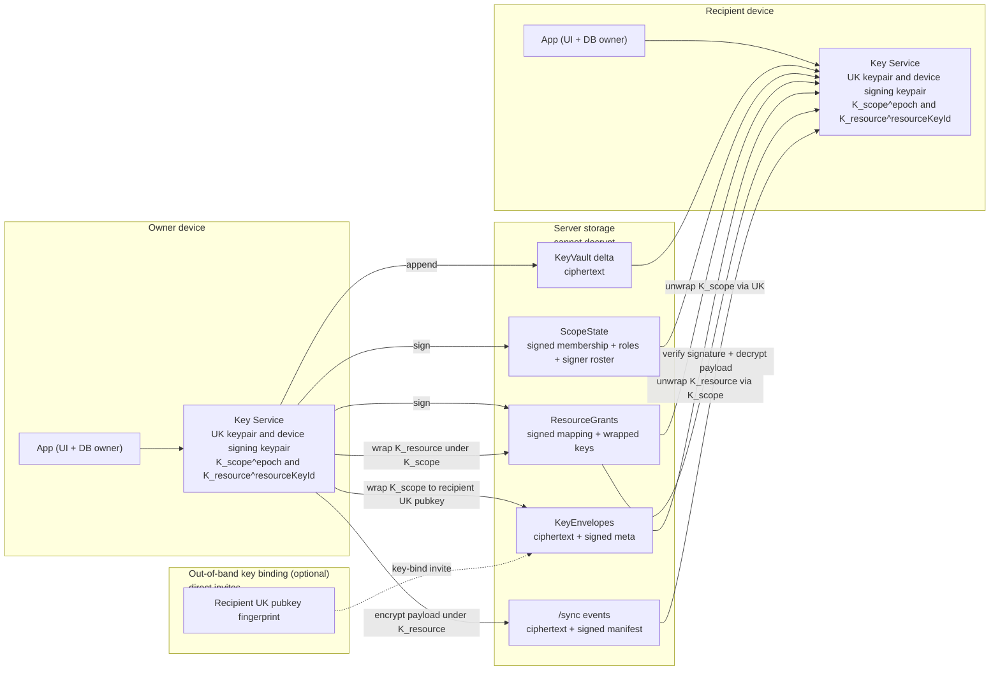
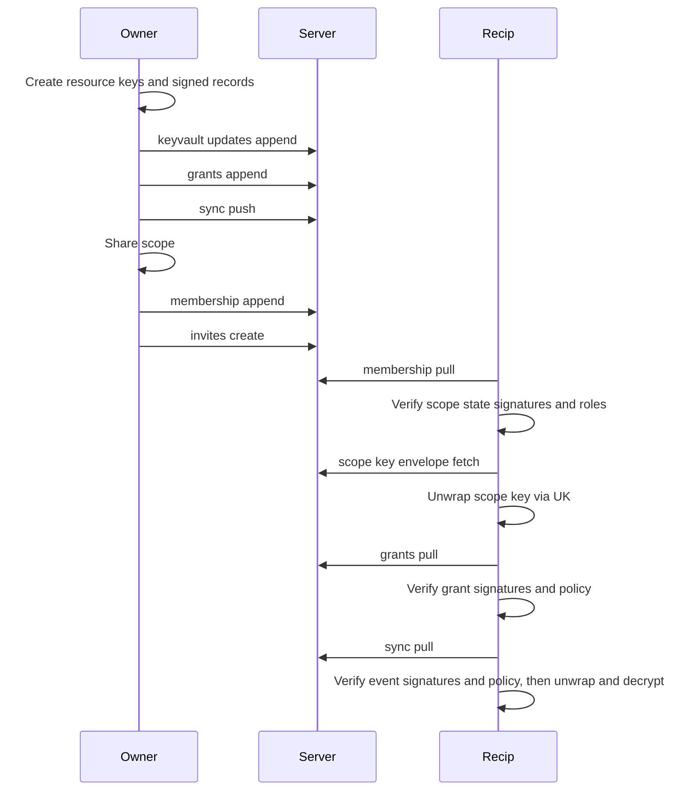

# RFC-20260107-key-scopes-and-sharing

**Status**: Draft
**Linear**: ALC-266, ALC-268
**Related**: ALC-258, ALC-299, ALC-332
**Created**: 2026-01-07
**Last Updated**: 2026-01-08

## Scope

Define a scalable key hierarchy and sharing model that:

- supports **multi-user sharing** (invites) and **multi-device** access for recipients,
- avoids “key explosion” as we add BCs like **Documents**, **Memories**, and **Money**,
- keeps the server outside the decryption boundary (ZK encryption boundary),
- separates **consistency boundaries** (DDD aggregates) from **sharing boundaries** (resources).

This RFC replaces the outdated invite PRDs in `ALC-266` / `ALC-268`.

## Compatibility and rollout (pre-prod breaking change)

This RFC assumes the KeyVault-based Key Service described in `docs/rfcs/rfc-20260107-key-service-core.md`.

We are **pre-production** and are intentionally taking a **breaking change** posture:

- No backward compatibility or in-place migration is required from the current (pre-sharing) model:
  - per-aggregate keys stored in `IndexedDBKeyStore`,
  - the legacy sync record shape (which includes `keyringUpdate` and `epoch`),
  - legacy invite schema (`access.invites`).
- Rollout expectation: local identities and local ciphertext may need to be reset and re-onboarded under the new KeyVault + sharing model.

### Legacy Access schema (`access.invites`)

The API currently contains a legacy schema created early in the project:

- `access.invites(aggregate_id, token, permission, wrapped_key, expires_at, ...)` (`apps/api/src/access/infrastructure/migrations/access/0001_access_schema.ts`)

This schema is **not referenced by any application code today** (only the migration/types exist). The sharing model in this RFC supersedes it.

**Plan (Phase 1)**:

- Introduce a new Access/Sharing persistence schema aligned to this RFC (scopes, signed scope state, signed grants, key envelopes, KeyVault record containers).
- Remove (or leave unused and then remove) `access.invites` once the new schema is in place.
  - Because we are pre-prod, we can treat this as a clean cutover rather than a data migration.

## Trust model

- **Confidentiality**: server cannot decrypt payloads (ZK boundary).
- **Truthfulness**: server may lie or omit data; clients must not assume honest responses.
- **Sequencing**:
  - `/sync`: server is the canonical sequencer (assigns `globalSequence`).
  - Scope-local signed streams (ScopeState + ResourceGrants): ordering is **owner-authored** and signed (`scopeStateSeq`, `grantSeq`, and `prevHash`), so the server cannot reorder without detection by existing devices.
  - Signatures prevent forgery/tampering, but do not prevent withholding or selective delivery.
- **Availability/Durability**: depends on the operator. Users who do not keep independent backups implicitly trust their chosen server not to rug-pull or lose data.

## Controls matrix (Phase 1 proposal)

This table is the “security practitioner” mapping of **surfaces → threats → controls** for this RFC. It is intentionally explicit about what is enforced on the client vs server.

### Client-side controls (browser)

| Surface                          | Threat                                               | Control (Phase 1)                                                                                                                                                 | Enforced by                                |
| -------------------------------- | ---------------------------------------------------- | ----------------------------------------------------------------------------------------------------------------------------------------------------------------- | ------------------------------------------ |
| Payload bytes (events)           | Server compromise, network observer                  | Payloads are encrypted client-side under `K_resource^{resourceKeyId}`. (Snapshots are local-only in Phase 1 and not part of `/sync`.)                            | Client AEAD + AAD                          |
| Payload integrity                | Cross-resource swaps / replay                        | Event ciphertext is integrity-bound by AEAD AAD (`INV-013`) and by the signed domain event manifest binding `{resourceId, resourceKeyId, scopeStateRef, grantId}` to the ciphertext bytes              | Client signature verification + AEAD checks |
| Key distribution                 | Wrong key material / swapped envelopes/slots         | KeyEnvelopes and ResourceGrants are canonical CBOR with detached signatures; AAD binds them to `(scopeId, epoch, resourceId, resourceKeyId, ciphersuites)`       | Client signature verification + AAD checks |
| Authorization (write)            | “Keys imply write” fallacy                           | Mutations are signed by author device keys and validated against verified ScopeState + ResourceGrants at `scopeStateRef` before applying                            | Client verification-before-decrypt/apply   |
| Revocation ordering              | Offline writer continues publishing after revocation | Every published mutation carries `scopeStateRef`; stale writers are rejected by the server and must pull the latest ScopeState                                    | Server conflict + client retry             |
| New relationships                | Key substitution on first contact                    | Direct invites are key-bound via out-of-band `recipientUkPubFingerprint`; scope owner signer keys are TOFU unless pinned out-of-band (warn on key changes)       | Client policy                              |
| New devices                      | Withholding/rollback/fork on first sync              | New device onboarding must be anchored out-of-band (KeyVault export import, or QR transfer of `(seq, headHash)`); without an anchor the device is TOFU           | Client policy                              |
| Recovery                         | Rug-pull / migration / device loss                   | Portability artifacts: KeyVault export + eventstore export; restore requires passphrase                                                                           | Client backup/restore flows                |

### Server-side controls (API + storage)

| Surface               | Threat                                           | Control (Phase 1)                                                                                                                           | Enforced by                              |
| --------------------- | ------------------------------------------------ | ------------------------------------------------------------------------------------------------------------------------------------------- | ---------------------------------------- |
| Sync correctness      | Divergent ordering across devices                | Canonical server sequencing for `/sync` (`globalSequence`) and signed owner-authored ordering for scope streams (`scopeStateSeq`, `grantSeq`) | Server storage + client verification     |
| Duplicate/replay      | Duplicate insertion                              | Idempotency by `eventId`                                                                                                                    | Server write contract                    |
| “Keyless ciphertext”  | Ciphertext published without required keys/state | Dependency-checked push: domain event manifest references required `scopeStateRef` + `grantId`; server rejects missing deps                   | Server referential integrity checks      |
| Revocation ordering   | Accepting writes under stale auth state          | Server rejects mutations whose `scopeStateRef` is not the current ScopeState head (`stale_scope_state`)                                     | Server conflict policy                   |
| Key escrow regression | Server learns keys                               | Server never receives user keys; stores only ciphertext + signed manifests                                                                  | Protocol boundary (`INV-006`, `INV-017`) |

## Non-goals

- Final UI/UX flows (copy link, preview page, etc.).
- Full metadata privacy (traffic pattern leakage, membership graph obfuscation) beyond baseline minimization.
- Cryptographic revocation of historical ciphertext (epochs are forward-only in Phase 1).
- Forward secrecy for key distribution against later passphrase/UK compromise (ratcheting/MLS-class protocols).
- MLS / Double Ratchet for live messaging (future enhancement for specific scopes only).
- Post-quantum bulk encryption (out of scope; bulk stays symmetric).

## Terminology (passphrase vs backups)

- **Passphrase**: user-entered secret used to derive the **KEK** (via a KDF) for decrypting the KeyVault on any device.
- **Backups**: encrypted portability artifacts (KeyVault export + eventstore export) that users can store offline or migrate between servers. Backups are ciphertext; in Phase 1 they require the passphrase to decrypt.
- **Recovery secret** (future): a separate offline secret distinct from the daily passphrase. Not introduced in Phase 1; we reserve this term for a future recovery-kit capability.

## Problem

### 1) Aggregate keys + sharing does not scale to future BCs

Per-aggregate DEKs work for Goals/Projects. For Documents/Memories/Money, users share sets (folders, albums, ledgers) and sometimes individual items. A single aggregate is not always the correct share unit.

### 2) MasterKey-derived distribution breaks sharing

The current distribution artifact is decryptable only via the owner’s passphrase-derived master key. Recipients cannot recover shared keys on a new device, forcing “store and backup every shared DEK locally.” This is brittle and scales poorly.

### 3) We need subset sharing without key explosion

Users share a folder (scope) but may also share a single file within that folder to a different group. We need a model that supports **multi-scope access to a single item** without duplicating ciphertext or inventing per-BC crypto schemes.

## Proposed Solution (Phase 1)

### Why “Phase 1”

We use “Phase 1” framing to be explicit about what we are committing to ship now vs what is intentionally deferred. This avoids bloat and keeps the architecture evolvable: versioned formats, explicit non-goals, and clear upgrade paths.

### A) Concepts and ownership boundaries

- **Aggregate**: DDD consistency boundary (event sourcing, commands, projections).
- **Resource**: encryption and sharing *unit* (what is encrypted together under one `K_resource^{resourceKeyId}` and can be granted to other principals).
  - A resource can map to a single aggregate (Goal), multiple aggregates (Project + Tasks), or a subtree/collection (Folder + Files).
- **Scope**: a membership group *over resources* (who has access), with roles, epoch rotation, and an epoch-based scope key.
- **ResourceGrant**: a signed record that maps a resource to a scope (catalog/policy) and carries the wrapped resource key bytes that let members decrypt the resource.
  - In Phase 1 this merges what would otherwise be separate “binding” + “keyslot” records into a single stream and a single dependency (`grantId`) for ciphertext events.

**Ownership model (Phase 1)**:

- Each scope has exactly one **owner** (the creator).
- Only the scope owner can:
  - mutate ScopeState (membership/roles/epoch rotation),
  - mutate ResourceGrants (resource↔scope membership/policy + wrapped keys),
  - mint KeyEnvelopes.
- Other members may be writers of domain events (depending on policy), but cannot grant access or rotate keys.

The **Sharing BC** owns:

- `Resource`, `Scope`, and `ResourceGrant`

Domain BCs interact via commands (no bespoke crypto logic), e.g.:

- `GrantResourceToScope(resourceId, scopeId)`
- `RevokeResourceFromScope(resourceId, scopeId)`
- `RotateScopeEpoch(scopeId)`

### A1) Sharing BC domain model (Phase 1)

This section defines the DDD model that backs the protocol streams.

#### Aggregate: `Scope`

**Purpose**: membership, roles, signer roster, and epoch rotation for a single sharing group.

**Identity**: `scopeId`

**State (projection)**:

- `ownerUserId`
- `scopeEpoch`
- `members: Map<userId, { role }>`
- `signers: Map<deviceId, { userId, sigSuite, pubKeys }>` (scope-local signer roster used to verify signatures for this scope)

**Events (illustrative)**:

- `ScopeCreated(scopeId, ownerUserId, initialEpoch, ownerSignerKeys)`
- `ScopeMemberInvited(scopeId, recipientUkPubFingerprint, role)` (optional: if invites are first-class facts; otherwise an invite is just a transport artifact)
- `ScopeMemberAdded(scopeId, memberUserId, role, memberSignerKeys?)`
- `ScopeMemberRoleChanged(scopeId, memberUserId, newRole)`
- `ScopeMemberRemoved(scopeId, memberUserId)` (triggers `ScopeEpochRotated`)
- `ScopeEpochRotated(scopeId, newEpoch, reason)`

Notes:

- Scope events are signed by the scope owner device key.
- If the scope supports non-owner writers, verifiers need member signer keys. In Phase 1 we model those signer keys as scope-local facts carried in scope state (no global directory).

#### Aggregate: `ScopeResourceGrant`

**Purpose**: declare that a resource is in a scope (catalog/policy) and provide the wrapped key material required to decrypt it.

**Identity**: `(scopeId, resourceId)` (or a `grantId` if we need multiple grant versions)

**State (projection)**:

- `scopeId`, `resourceId`
- `status: active | revoked`
- `scopeEpoch` (epoch whose scope key wraps this grant)
- `resourceKeyId` (active key version for the resource stream within this scope)
- `wrappedKey` (ciphertext of `K_resource^{resourceKeyId}` under `K_scope^{scopeEpoch}`)
- `policy` (optional; future: inheritance/subtree semantics)

**Events (illustrative)**:

- `ResourceGranted(scopeId, resourceId, scopeEpoch, resourceKeyId, wrappedKey, policy?)`
- `ResourceGrantRevoked(scopeId, resourceId)`

Notes:

- Grant events are signed by the scope owner device key.
- Introducing a new `resourceKeyId` for a resource is done by issuing a new `ResourceGranted(...)` event carrying the new `resourceKeyId` + `wrappedKey` (no separate rotation record in Phase 1).

### Diagrams

#### Keys and boundaries



Diagram notes:

- Encryption keys grant confidentiality only. Integrity and authorization are enforced by signature verification and role/grant validation.
- The server stores ciphertext and plaintext signed metadata/manifests needed for dependency checks, but clients treat the server as untrusted for truthfulness.
- Key lifecycle (passphrase → KEK → KeyVault), session/device anchors, and “non-extractable” key handling are specified in `docs/rfcs/rfc-20260107-key-service-core.md` (see “Key layering”).

#### Protocol flow



### B) Envelope encryption everywhere (no owner-derived keys)

Each resource has a resource-stream key that may rotate over time.

- Each resource has one active symmetric **Resource DEK**: `K_resource^{resourceKeyId}` (a “resource epoch”).
- Resource event payloads are encrypted with the active `K_resource^{resourceKeyId}`. (Snapshots are local-only in Phase 1.)
- Sharing is performed by **wrapping `K_resource^{resourceKeyId}`** to scope keys via ResourceGrants.

No keys are derived from the owner master key.

**Decision**: we do not create a new DEK per event. A resource uses one `K_resource^{resourceKeyId}` for its stream until it rotates (new `resourceKeyId`).

**Resource key rotation control (Phase 1)**:

- A new `resourceKeyId` MUST NOT be treated as valid just because it appears in ciphertext.
- Introducing a new `resourceKeyId` is done by issuing a new signed ResourceGrant that carries the new `resourceKeyId` + wrapped key bytes under the current `K_scope^epoch`.
- Clients MUST refuse ResourceGrants/events referencing an unknown `resourceKeyId` unless a verified ResourceGrant exists for it.

### C) Keys and wrapping

**Resource encryption**

- Event payload ciphertext continues to use the existing sync-boundary AAD (`INV-013`): `aad = UTF8("${aggregateType}:${aggregateId}:${version}")`.
- The sharing context (`resourceId`, `resourceKeyId`, `scopeStateRef`, `grantId`) is bound by the signed domain event manifest (see “Protocol-level atomicity”).

**ResourceGrant**

- Each scope has a symmetric **Scope Key** for a given epoch: `K_scope^epoch`.
- A ResourceGrant grants a scope access to a specific resource key version and is also the catalog fact that the resource is in the scope:
  - `wrappedKey = AEAD_Encrypt(K_scope^epoch, K_resource^{resourceKeyId}, aad = AadResourceGrantWrapV1)`
  - ResourceGrants include both `resourceKeyId` and `wrappedKey` so clients can cache/rotate/debug unambiguously.
  - Shape (illustrative):
    - `ResourceGrant = { grantId, scopeId, grantSeq, prevHash, scopeStateRef, scopeEpoch, resourceId, resourceKeyId, wrappedKey, policy? }`

**Grant update semantics (Phase 1)**

- ResourceGrants are immutable records. “Updating” a grant (e.g., rotating to a new `resourceKeyId`, changing policy, or re-keying under a new `scopeEpoch`) is done by issuing a new signed `ResourceGranted(...)` record with a new `grantId`.
- The server maintains a **current active grant head** per `(scopeId, resourceId)` (the latest non-revoked grant by canonical ordering).
- **Write path**: every pushed mutation MUST reference the current active `grantId` for `(scopeId, resourceId)`; the server rejects stale `grantId` (`stale_grant`).
- **Read/history path**: older grants may remain necessary to decrypt historical ciphertext (e.g., data encrypted under an older `resourceKeyId`). Clients may keep historical grants/keys locally and fetch older grants as needed for history access, subject to history policy.

**Default AAD (integrity binding)**

- ResourceGrant wrapping uses `AadResourceGrantWrapV1` (canonical CBOR bytes; defined in `docs/rfcs/rfc-20260107-key-service-core.md`).
- KeyEnvelope wrapping uses `AadKeyEnvelopeWrapV1` (canonical CBOR bytes; defined in `docs/rfcs/rfc-20260107-key-service-core.md`).
- Event payload AEAD AAD remains `INV-013` in Phase 1 (UTF-8 string AAD); the sharing context is bound by signatures.

Rationale:

- ResourceGrant AAD prevents swapping grants between resources/scopes.
- Resource payload AAD prevents swapping ciphertext blobs between resources/aggregates while still producing “valid” decryptions.

**Who can mint ResourceGrants (Phase 1)**:

- A ResourceGrant MUST be signed by the **scope owner**.
- Verifiers MUST validate that the signer is the scope owner for the referenced scope (via verified signed ScopeState).

**Confidentiality vs integrity**: possession of `K_scope` / `K_resource` must never be treated as authorization to mutate data.

- All resource mutations (events/commands) MUST be signed by an authorized device key.
- Readers MUST verify the signature and validate the author’s role against verified signed scope state for the referenced `scopeStateRef` (authorization base) before applying mutations.

**Minimum signature coverage**:

- Domain events are signed by the author device key. The signature must cover at least:
  - `eventId`, `resourceId`, `resourceKeyId`
  - the event payload AEAD AAD bytes (`INV-013`, exact bytes)
  - the event ciphertext bytes (or a hash of them)
  - optional: `prevHash` / hash-chain links if we choose hash-chaining for event integrity
- ScopeState events (membership / roles / epoch rotations) are signed by the **scope owner** device key.
- ResourceGrant events are signed by the **scope owner** device key.
- For signed ScopeState records, the signature must cover the canonical ordering metadata (`scopeStateSeq`, `prevHash`) in addition to the payload, so the server cannot reorder without detection by existing devices.
- For signed ResourceGrant records, the signature must cover the canonical ordering metadata (`grantSeq`, `prevHash`) in addition to the payload, so the server cannot reorder without detection by existing devices.

**Verification order (Phase 1)**:

1. Verify signed ScopeState / Grant records (roles + policy) before accepting them as truth.
2. Resolve signer public keys from the verified ScopeState membership snapshot referenced by `scopeStateRef` (scope-local signer roster; no global directory).
3. Verify the domain event signature over the signed manifest + ciphertext (or hash) and validate dependency refs exist before using/decrypting the payload.
4. Only then unwrap keys, decrypt, and apply; refuse to display/apply plaintext that has not passed signature + policy verification.

### D) Identity-bound distribution across devices (don’t fan out to device keys by default)

We replace masterKey-based recovery with identity-bound distribution:

- Each user has a per-user **User Key** (UK) used for decrypting key envelopes across devices.
- Scope keys are wrapped to `UserPubKey` and stored server-side as encrypted envelopes.
- The first device that opens an envelope persists `K_scope^epoch` into the user’s KeyVault so all devices receive it via KeyVault sync.

Device keys exist for **auth + signing** (and optionally “hard mode” per-device distribution), not as the default key fanout mechanism.

**Post-quantum requirement**: UK envelopes MUST be PQ-safe against “harvest now, decrypt later”.

Key lifecycle and hardening (passphrase → KEK, KeyVault format/integrity, session TTL/auto-lock, device anchors, and “non-extractable” handling) are specified in `docs/rfcs/rfc-20260107-key-service-core.md`.

Notes (Phase 1):

- UK private key material is stored encrypted inside the KeyVault and is only usable while a session is unlocked.
- Passphrase compromise is total compromise for confidentiality (keys are recoverable by design). Defense-in-depth reduces the exposure window but does not protect against runtime compromise while unlocked.
- Envelope formats are versioned and use a ciphersuite registry owned by the Key Service (see the Key Service RFC).

### E) KeyVault (recovery + multi-device consistency)

KeyVault is the user-private, append-only encrypted key log used for:

- recovery (backup/restore),
- cross-device key sync (UK, device keys, scope keys, resource keys).

KeyVault record containers are encrypted under a per-vault `K_vault` (wrapped under a passphrase-derived KEK) and synced as ciphertext delta:

- `GET /keyvault/updates?since=cursor&limit=n`

KeyVault integrity, anti-rollback/fork posture, and the concrete KeyVault format are specified in `docs/rfcs/rfc-20260107-key-service-core.md`.

### E1) Scope-local signer roster (no global directory in Phase 1)

Signature verification requires a trustworthy source of signer public keys (deviceId → public keys). In Phase 1 we do not introduce a global searchable directory; signer keys are learned from the scope itself.

**ScopeState membership includes signer keys**:

- ScopeState membership records MUST include (at minimum):
  - the scope owner’s signing public key(s) (classical + PQ) required to verify ScopeState/ResourceGrants/KeyEnvelopes.
  - if the scope allows non-owner writers: each writer member’s signing public key(s) (classical + PQ) required to verify their domain mutations.
- Verifiers MUST resolve `authorDeviceId` by looking it up in the verified ScopeState membership snapshot referenced by `scopeStateRef` (no out-of-band “search” required).
- Key changes (adding/removing signer keys) are represented as signed ScopeState events and must extend the verified scope chain.

Trust model:

- The first-contact problem still exists for signer keys: without an out-of-band anchor, the server can substitute the scope owner signer key on first contact (TOFU).
- For direct invites, recipients MAY pin the inviter’s signer fingerprint out-of-band. If not pinned, signer-key authenticity is TOFU and clients must warn on later key changes.

### E2) Account recovery flows (Phase 1)

We support two recovery modes. Both recover the *same* user identity (same UK + KeyVault), and both require the user to prove knowledge of the passphrase (or an equivalent future recovery secret).

1. **Local backup restore (current flow)**
   - User imports an encrypted KeyVault export (and optionally an encrypted eventstore export) from local storage.
   - User enters passphrase to unlock the KeyVault and resume work.

2. **Server-based recovery (new flow)**
   - User logs into the server (authn).
   - Client downloads the user’s encrypted KeyVault delta from the server (`GET /keyvault/updates?...`) and attempts unlock using the passphrase.
   - If unlock succeeds, the client can continue by pulling encrypted domain data and decrypting locally.

Important: server-based recovery requires the server to store KeyVault ciphertext for the user account. This does not grant the server decryption capability.

### E3) Identity conflict on login (must be explicit)

If a browser has already created a fresh local identity (new `storeId` + new UK + new KeyVault) and the user later logs into an existing cloud account, there are **two different identities**. They must not be silently mixed.

**Decision (Phase 1)**: on login, the app must force an explicit choice:

- **Switch to cloud identity (recommended)**:
  - offer local export (KeyVault + eventstore) for the currently-open local identity,
  - wipe local identity state,
  - perform server-based recovery for the logged-in account (download KeyVault ciphertext + unlock with passphrase),
  - then pull encrypted domain data and continue.
- **Stay local**: do not attach the current local identity to the cloud account.

### E4) Server identity and sync-state partitioning (Phase 1)

We must distinguish “same identity, different server” from “same server” in a way that is not tied to a mutable URL.

**Decision (Phase 1)**: each server has a long-lived **server identity keypair** (`serverIdKey`). Clients pin a stable `serverKeyId = fingerprint(serverIdKey.publicKey)` and use it as the namespace for remote state:

- Any remote cursor/sync state MUST be keyed by `(storeId, serverKeyId)` (not `baseUrl`).
- If `baseUrl` changes but `serverKeyId` is unchanged, treat it as the same server.
- If `serverKeyId` changes, treat it as a different server; require an explicit “migrate / reset sync state” action before re-push.

**How clients learn `serverKeyId` (Phase 1)**:

- The server exposes `serverKeyId` via an authenticated and signed endpoint (e.g., `/health`), and clients pin it on first use (TOFU).

**Signed continuity story (deferred)**:

- Server key rotation is treated as “new server” unless the server can prove continuity (future work).

### F) Verifiable membership & epoch rotation (server may lie)

Because the server is untrusted for truthfulness, clients must be able to verify key material provenance.

**Phase 1 (cheap and effective)**:

- Scope membership changes and epoch rotations are represented as **signed events** by the **scope owner**.
- Clients verify signatures before accepting any membership/epoch updates and before accepting any key envelopes that claim to correspond to them.
- Server is a transport and storage layer; it cannot forge valid key state without failing client verification.

**Bind key envelopes to signed scope state**:

- Scope-key envelopes must reference (and be AAD-bound to) the specific signed membership/rotation event that authorized them (e.g., event hash/id).
- Clients must refuse envelopes that do not match verified scope state.

**Out-of-order delivery policy (Phase 1)**:

- Clients must not accept an envelope unless the referenced `scopeStateRef` is already verified.
- If an envelope arrives before its referenced ScopeState record, the client MUST:
  - buffer it with a strict cap (bounded memory), and/or
  - request the missing ScopeState records first, and
  - drop the envelope if the reference cannot be resolved within a bounded retry window.

**Post-quantum requirement**: signatures MUST be PQ-safe against “harvest now, forge later”.

- Use a hybrid signature ciphersuite for signed membership/rotation events (e.g., `hybrid-sig-1`). Concrete algorithm mapping lives in a ciphersuite registry/config (candidate: `Ed25519` + `ML-DSA`).
- Verification SHOULD require both signatures to be valid (hybrid-AND) to avoid weakening to the least secure algorithm.

**Limitations**:

- Signatures prevent forgery/tampering but do not prevent withholding (omitting newer data). Withholding detection requires stronger mechanisms (e.g., key transparency), out of scope for Phase 1.
- Minimal mitigation for existing devices: each device persists the last seen `ScopeStateHead` (hash/seq) per scope and rejects/alerts on older scope state being served (“rollback”). This does not protect new devices without an external anchor.

### G) Resource creation and crash-safety (must be recoverable)

On create:

1. Creator generates `K_resource^{resourceKeyId}`.
2. Creator writes a **self-share** ResourceGrant into an owning scope:
   - `Grant_self.wrappedKey = AEAD_Encrypt(K_scope^epoch, K_resource^{resourceKeyId}, aad = AadResourceGrantWrapV1)`
3. Creator persists new key material to the synced KeyVault.
4. KeyVault append and ResourceGrant creation must both be durable (local) before any ciphertext/events reference them.
5. Ciphertext/events must not be published to other principals until the required ResourceGrant(s) are durably synced/available (avoid “keyless ciphertext” on other devices).

This prevents “crash between creating a key and backing it up” from causing permanent loss.

### H) Invites and policies

**Direct invites (Phase 1)**:

- Inviter and invitee exchange `recipientUkPubFingerprint` out-of-band.
- Inviter creates an invite that targets that fingerprint.
- Recipient authenticates; server returns recipient-specific scope-key envelope(s) (wrapped to `UserPubKey`) that are AAD-bound to `recipientUkPubFingerprint`.
- Recipient verifies `recipientUkPubFingerprint` before accepting and persisting `K_scope^epoch` into KeyVault.

There are no bearer/capability links in Phase 1.

**Invite expiry (cryptographic, not server-enforced)**:

- If invites can expire, the expiry (`notAfter`) must be part of the signed invite/membership artifact and enforced by clients.
- Server-enforced expiry alone is not verifiable under this trust model.
- Expiry does not claw back access after a recipient has obtained keys and decrypted data.
- A malicious client can ignore expiry checks; expiry is a policy for honest clients and UX, not a cryptographic revocation mechanism.

## First contact and TOFU (Phase 1)

The “server may lie” trust model implies a **first-contact risk**: without an out-of-band anchor, a malicious server can substitute keys (“key substitution”) during first contact.

Phase 1 posture:

- Direct invites are **key-bound** using an out-of-band verified fingerprint:
  - Inviter obtains the invitee’s UK public key fingerprint out-of-band (QR / safety number).
  - Invite records and the resulting KeyEnvelopes MUST be AAD-bound to that fingerprint.
  - Recipient verifies the fingerprint before accepting the scope key.
- Signer keys are learned from ScopeState and are TOFU unless pinned out-of-band (warn on key changes).
- New device onboarding is also a first-contact event:
  - A new device MUST be provisioned from user-controlled material (KeyVault export import, or QR transfer of the KeyVault head `(seq, headHash)` from an existing trusted device).
  - Without an out-of-band anchor, a new device is TOFU about server-provided KeyVault/scope heads and cannot reliably detect withholding/fork attacks.

This makes “server issued the envelope to the wrong recipient key” detectable by the recipient.

Bootstrap note:

- The first ScopeState record for a scope and the initial scope owner device key are an implicit trust anchor.
- In Phase 1, recipient key authenticity is established via key-binding (`recipientUkPubFingerprint`). Scope owner signer-key authenticity is TOFU unless pinned out-of-band.
- New device onboarding is anchored via a user-controlled KeyVault head (imported backup, or QR transfer) as specified in the Key Service RFC.

### I) Epochs and revocation (forward-only)

- Membership changes rotate the scope epoch (`K_scope^{e+1}`).
- New resource data under that scope uses the new epoch.
- Historical ciphertext is **not** re-encrypted in Phase 1.

Forward-only means:

- Removing a member prevents decrypting **new** epoch ciphertext.
- Old ciphertext remains decryptable to ex-members unless we re-encrypt history.

### Rotation scalability (avoid O(N) rewrites)

Epoch rotation must not require rewriting ResourceGrants for all resources in a scope.

**Decision (Phase 1)**: lazy rekey.

- Rotating a scope creates a new `scopeEpoch = e+1` (new `K_scope^{e+1}`).
- Existing resources do not change immediately. Historical ResourceGrants remain under the old `K_scope^e`.
- Only new/modified resource data after the rotation uses a new `resourceKeyId` and produces new ResourceGrants under the new scope epoch.

Consequence: remaining members must retain (and new devices must be able to obtain) old scope keys to read history, subject to history access policy.

**Transition behavior (Phase 1)**:

- An offline member may temporarily be unable to decrypt “new epoch” data until they fetch the missing envelope(s) and ResourceGrants.
- This is expected: epoch rotation is the mechanism that gates future access.
- Clients must surface this as a clear “needs to sync membership/keys” state, not as silent data loss.

### History access policy (join semantics)

When a member joins at epoch `e+1`, we must explicitly choose what history they receive:

- **No history**: issue only `K_scope^{e+1}` (member can read only new data).
- **Full history**: issue `K_scope^{0..e+1}` (member can read full history).
- **Selective history**: issue a subset of epochs or per-resource keys based on binding policy.

**Decision (Phase 1)**: full history by default for scopes that are shareable, unless the domain policy explicitly opts into “no history” (e.g., certain Money-like scopes).

### J) Storage and API contract (batch/delta required)

Key distribution is intentionally separate from `/sync` to avoid coupling event sync with membership/key distribution mechanics.

Scope key envelopes:

- `POST /scopes/{scopeId}/invites` — create invite; store recipient envelope.
- `GET /scopes/{scopeId}/key` — return caller’s envelope(s) for required epoch(s).
- `DELETE /scopes/{scopeId}/members/{id}` — revoke (triggers epoch rotation).
- `GET /scopes/{scopeId}/membership?since=cursor&limit=n` — signed membership/rotation event stream (delta).
  - This stream includes the scope-local signer roster (deviceId → signing public keys) required to verify signatures for that scope.
- `GET /scopes/{scopeId}/grants?since=cursor&limit=n` — signed resource grants stream (delta; includes catalog/policy + wrapped keys).

**Delta stream ordering and idempotency**:

- ScopeState records are ordered by `scopeStateSeq` (owner-authored, monotonically increasing per `scopeId`) and each record is signed including the ordering metadata.
- ResourceGrant records are ordered by `grantSeq` (owner-authored, monotonically increasing per `scopeId`) and each record is signed including the ordering metadata.
- Both streams use hash-chaining (`prevHash`) to make reordering/omission detectable for existing devices. Clients persist the last seen `(seq, headHash)` per stream and scope.
- Idempotency rule: clients must ignore duplicate records (same `(scopeId, scopeStateSeq)` / `(scopeId, grantSeq)` or same record hash) and apply only records that extend the verified hash-chain.

**Server acceptance rules (Phase 1)**:

- The server MUST enforce that only the scope owner can append ScopeState and ResourceGrant records for that scope.
- The server MUST enforce monotonic append semantics to prevent forks in the canonical storage:
  - ScopeState append must extend the current head: `scopeStateSeq = head.scopeStateSeq + 1` and `prevHash = head.scopeStateRef` (genesis allowed).
  - ResourceGrant append must extend the current head: `grantSeq = head.grantSeq + 1` and `prevHash = head.grantHash` (genesis allowed).
- The server does not verify signatures (it may not have keys); it enforces structure and ownership, while clients enforce signature validity.

Integer-width guidance:

- `scopeStateSeq` and `grantSeq` are `u64` in the core formats. They must not be represented as JS `number` once they may exceed `2^53 - 1`.
- API endpoints should use opaque cursors for pagination; if a sequence must be surfaced for diagnostics, represent it as `bigint` (preferred) or as a decimal string.

**Authorization base ordering (Phase 1)**:

We treat ScopeState as the canonical truth stream for authorization. In Phase 1 it is **owner-authored** and signed.

- ScopeState records are ordered by `scopeStateSeq` (owner-authored, monotonically increasing per scope).
- Every domain event that mutates a resource under a scope MUST include `scopeStateRef` as an optimistic concurrency token for “authorization base”.
- On push, the server MUST reject domain events whose `scopeStateRef` does not equal the server’s current ScopeState head for that scope (conflict: `stale_scope_state`).
  - This mirrors optimistic concurrency: offline/stale writers can create events locally but cannot publish them until they pull the latest ScopeState and are still authorized.
  - This prevents “revoked but still writing” races from becoming committed facts in the canonical stream.
- Every domain event that mutates a resource under a scope MUST also include `grantId` as an optimistic concurrency token for “resource-in-scope + policy + key base”.
- On push, the server MUST reject domain events whose `grantId` does not equal the current active grant head for `(scopeId, resourceId)` (conflict: `stale_grant`).
  - This prevents writes to resources that were removed from the scope (or whose policy/key version changed) from becoming committed facts.

Offline recipients:

- The server MUST retain scope key envelopes and ResourceGrants required for members to decrypt ciphertext the server still serves, consistent with the scope’s history policy.
- In Phase 1 (full-history by default), the practical posture is “retain indefinitely while the scope exists” (or until explicit scope deletion).
- Future: if we introduce aggressive retention, it must be explicit and user-visible because it can cause unrecoverable history loss for long-offline devices.

## Protocol-level atomicity: key dependencies (no keyless ciphertext)

To prevent “keyless ciphertext” (ciphertext published without the required key material/state), pushes must be dependency-checked at the protocol level.

### Key dependencies for pushed ciphertext

Every pushed ciphertext event MUST carry its key dependencies as a plaintext, signed manifest (“DomainEventManifest”):

- `scopeId`
- `resourceId`
- `grantId` (the ResourceGrant that authorizes membership/policy and provides the wrapped key bytes to open `K_resource^{resourceKeyId}`)
- `scopeStateRef` (32-byte hash of the signed `ScopeStateV1` record; derivation defined in `docs/rfcs/rfc-20260107-key-service-core.md`)
- `authorDeviceId` (to resolve the signer key from the scope-local signer roster in ScopeState at `scopeStateRef`)

### Server-side invariant (hard reject)

On push, the server MUST validate existence and referential integrity of dependencies:

- referenced `ScopeState` exists and matches `scopeStateRef`,
- referenced `ResourceGrant` exists and matches `grantId`,
- referenced `ResourceGrant` is the current active grant head for `(scopeId, resourceId)` (otherwise conflict: `stale_grant`),

Because the server cannot decrypt, it cannot prove AEAD AAD correctness. Therefore:

- ResourceGrants MUST be stored with detached plaintext metadata (the fields that are AAD-bound) and a signature by an authorized principal.
- Events MUST be stored with a plaintext manifest and a signature by the author device key.

If any dependency is missing, the server MUST reject the push with a conflict response (e.g., `409 MissingDeps`) and return the missing dependency identifiers.

### Client-side crypto outbox (causal ordering)

Clients maintain a “crypto outbox” that pushes artifacts in causal order:

1. Signed `ScopeState`
2. Signed `ResourceGrant` (wrap `K_resource^{resourceKeyId}` under `K_scope^{scopeEpoch}`)
3. Ciphertext events

If the server rejects with `MissingDeps`, the client pushes the missing deps first and retries the ciphertext.

### Invites / envelopes are separate from data push

Per-user scope-key envelopes are handled at invite acceptance and epoch rotation time:

- Scope owner uploads `KeyEnvelope(UserPubKey → K_scope^{scopeEpoch})` for the new member.
- Server may reject “member added” if the envelope is missing (policy dependent).

Data push depends only on ScopeState and ResourceGrants, not on per-user envelopes.

### “Membership-blind” clarification

“Membership-blind” means `/sync` does not contain membership lists or per-user envelopes. It may still carry resource and dependency identifiers (`resourceId`, `scopeId`, refs) required for dependency checks and integrity validation.

## Sync boundary integration: revised `record_json` shape (breaking change)

This RFC extends the existing `/sync` contract by **revising** the `record_json` shape. We keep `recordVersion: 1` (no parallel versions) but this is still an intentional **breaking change** (pre-prod posture).

Goals:

- Keep the existing “byte preservation” contract (`INV-004`): the server stores `record_json` and returns it as-is.
- Add enough plaintext metadata for dependency checks and stale-ref rejection (`scopeStateRef`, `grantId`, etc.).
- Avoid JSON-canonicalization pitfalls by signing a **canonical CBOR manifest** that binds the plaintext refs to the ciphertext bytes.
- Compose cleanly with `docs/rfcs/rfc-20260106-serialized-event-envelope.md` (payload remains an encrypted EventEnvelope).

### Shape: `SyncRecord` (Phase 1)

`record_json` is a JSON object with stable property order:

```ts
export type SyncRecord = Readonly<{
  recordVersion: 1;

  // Existing sync routing/order keys (server-visible)
  aggregateType: string;
  aggregateId: string;
  version: number;

  // Ciphertext (server-visible bytes, not decryptable)
  payloadCiphertext: string; // base64url(iv||ciphertext||tag)

  // Sharing/dependency refs (server-visible)
  scopeId: string;
  resourceId: string;
  resourceKeyId: string;
  grantId: string;
  scopeStateRef: string; // base64url(32 bytes)
  authorDeviceId: string;

  // Signature over a canonical CBOR manifest (server-visible, verifiable by clients)
  sigSuite: string; // e.g. "hybrid-sig-1"
  signature: string; // base64url(signature bytes)
}>;
```

### Encoding rules (JSON fields)

Unless stated otherwise:

- UUIDs are encoded as canonical UUID strings.
- `payloadCiphertext`, `scopeStateRef`, and `signature` use **base64url** encoding per RFC 4648 URL-safe alphabet (`-` and `_`) and **MUST be emitted without padding** (`=`).
  - This matches the existing implementation in `packages/sync-engine/src/base64url.ts` (`encodeBase64Url` strips padding; `decodeBase64Url` accepts padded or unpadded input).

Notes:

- `payloadCiphertext` decrypts (locally) to `EventEnvelopeV1` per `rfc-20260106-serialized-event-envelope` (eventType/occurredAt/actorId stay inside ciphertext).
- This is a breaking change. It replaces the legacy sync record shape (which included `epoch` and `keyringUpdate`) by relying on the Sharing + KeyVault model (ResourceGrants + KeyEnvelopes + Key Service) for key resolution.

### Manifest bytes (what is signed)

The signature is computed over canonical bytes to avoid JSON signing ambiguity.

Define `DomainEventManifestV1` (canonical CBOR map, signed by the author device key):

- `toBeSigned = CBOR_EncodeCanonical({`
  - `0: "mo-domain-event-manifest-v1",`
  - `1: eventId,`
  - `2: scopeId,`
  - `3: resourceId,`
  - `4: resourceKeyId,`
  - `5: grantId,`
  - `6: scopeStateRef,` // raw bytes (32)
  - `7: authorDeviceId,`
  - `8: payloadAad,` // exact AEAD AAD bytes (`INV-013`)
  - `9: payloadCiphertextHash` // SHA-256(payloadCiphertext bytes)
  - `})`

Where:

- `payloadAad = UTF8("${aggregateType}:${aggregateId}:${version}")` (exact bytes; `INV-013`)
- `payloadCiphertextHash = SHA-256(decodeBase64Url(payloadCiphertext))`

Clients must verify:

1. signature over the manifest bytes using the signer key from verified ScopeState (at `scopeStateRef`),
2. the AEAD decrypt using `payloadAad`,
3. and only then apply the event.

The server does not verify signatures, but may enforce:

- `scopeStateRef` is current for the scope (`stale_scope_state`),
- `grantId` is current for `(scopeId, resourceId)` (`stale_grant`),
- and referenced objects exist (`MissingDeps`).

## Retention, tombstones, and compaction (Phase 1)

Append-only streams require explicit retention and tombstone semantics.

- Membership and grants streams should use signed tombstones for removals (do not delete history).
- ResourceGrant/envelope garbage collection must be conservative: old epochs are required for history access and for offline devices to catch up.
- KeyVault compaction must preserve correctness:
  - compact only after a newer record supersedes an older one,
  - keep a verifiable audit trail (e.g., hash-chain), and
  - never compact in a way that breaks rollback detection for existing devices.

## Truth sources (avoid circularity)

This architecture has multiple feeds. Each has a single responsibility and a defined “source of truth” role:

- **ScopeState stream (signed)** (`/scopes/{scopeId}/membership?...`): membership, roles, epoch rotations, and the scope-local signer roster (deviceId → signing public keys) required to verify signatures within the scope. This is the authority for authorization decisions.
- **ResourceGrant stream (signed)** (`/scopes/{scopeId}/grants?...`): which resources belong to the scope (catalog/policy) and the wrapped key bytes required to decrypt them. This is the authority for “what’s in this scope?” for Phase 1.
- **KeyEnvelope stream** (`/scopes/{scopeId}/key`): encrypted distribution artifacts for `K_scope^epoch`, referencing verified ScopeState events (bound by AAD).
- **KeyVault stream** (`/keyvault/updates?...`): append-only user-level key material; authenticated + monotonic for rollback detection.
- **Event sync (`/sync`)**: encrypted domain events for the local-first store; it must not be treated as the authority for membership/roles.

## Portability and backups

Even with E2EE, server choice matters for availability/durability. A hosted server can rug-pull or lose data; users should be able to move servers.

Minimum portability artifact (encrypted; safe to store anywhere):

- Encrypted eventstore export (OPFS SQLite dump or equivalent ciphertext package)
- KeyVault snapshot or append-only export (ciphertext + cursor/hash)
- A small manifest (store id, cursors, algorithm/envelope versions)

Importing these into a new server should be sufficient to recover state, subject to the user possessing their passphrase.

## Compromise & rotation (runbook sketch)

Forward-only revocation means we can protect future data, not retroactively revoke plaintext already obtained by recipients.

- **Device lost**: remove device from device list; rotate user/device keys as required; re-issue envelopes to remaining devices.
- **User passphrase compromised**: rotate passphrase and re-encrypt KeyVault.
- **User Key (UK) compromised**: rotate UK, re-issue scope key envelopes, and rotate affected scopes (new epochs) to protect future data.
- **Scope key compromised**: rotate scope epoch; re-issue ResourceGrants as needed; historical ciphertext remains exposed to the attacker.
- **Server compromise**: confidentiality holds if keys remain secret; assume withholding/rollback risk and migrate servers using exports; consider rotating scopes for forward protection.

## Use cases (resource mapping)

### Photo backup + galleries (future BC)

- **Resource**: photo
- **Backup scope**: owner-only scope for the ingest stream
- **Gallery scope**: shareable scope per gallery

Flow:

1. Ingest photo → create `K_resource_photo` → store `grant_backup.wrappedKey = Wrap(K_backup, K_resource_photo)`.
2. Add photo to gallery → add `grant_gallery.wrappedKey = Wrap(K_gallery, K_resource_photo)`.
3. Share gallery → distribute `K_gallery` via identity-bound invites.

Result: backup remains private, galleries are shareable overlays (no re-encryption).

### Projects + tasks

- **Resource**: project (default), task (optional)
- **Project scope**: `K_project`

Default mapping:

- Tasks in a project share `K_project` via ResourceGrants.
- Sharing a project = sharing `K_project`.
- Optional: share an individual task by issuing an additional ResourceGrant for that task’s resource key to another scope (without sharing the whole project).

### Calendar + events

- **Resource**: event
- **Calendar scope**: `K_calendar`

Default mapping:

- Events in a calendar inherit `K_calendar` via ResourceGrants.
- Sharing a calendar = sharing `K_calendar`.
- Sharing a single event (rare) uses an additional ResourceGrant for that event.

### Accounts + transactions

- **Resource**: account/ledger (default), transaction (exception)
- **Account/ledger scope**: `K_account`

Default mapping:

- Transactions in an account are encrypted under the account’s active `K_resource^{resourceKeyId}` and shared via ResourceGrants in the account scope.
- Sharing an account = sharing `K_account`.
- Sharing a single transaction without sharing the account requires treating that transaction as its own resource key (re-encrypt/migrate) and issuing a ResourceGrant to the target scope. For Money-like BCs this is policy-gated (step-up) and likely disallowed by default in Phase 1.

## Scenarios to test (Phase 1)

These scenarios are the minimum “protocol invariants as tests” suite. Prefer e2e tests for multi-device ordering and authorization corner cases.

### End-to-end user flows

1. **Initial identity creation & working offline**: user creates an identity and works offline; resources can be created/updated; keys and events persist locally; no sync required.
2. **Full backup & restore in a new browser (offline)**: user makes a full backup (KeyVault/keys + local DB), restores into a new browser; app state matches; user can continue working offline.
3. **Cloud sign-up and sync (first device)**: user signs up / signs in to cloud; device pushes local history; pull/push converge; server head advances.
4. **Cloud sign-in after full restore (second device)**: user restores a full backup first, then signs in to an existing cloud account:
   - If local identity matches the cloud identity: device pulls missing events, rebases pending if needed, then pushes local-only events; both devices converge.
   - If local identity does not match: app MUST block with an explicit identity-conflict UX (see “Identity conflict on login”).
5. **Restore keys only (no DB) + cloud sign-in**: user restores KeyVault/keys without local DB, then signs in; device pulls encrypted events from cloud and materializes local state; user can continue work.
6. **Restore from cloud (no local backup)**: user chooses “Restore from cloud”, signs in to an existing cloud account, enters passphrase to unlock the KeyVault (downloaded as ciphertext), then the device pulls data and becomes fully operational (no separate “new identity” should be created before restore completes).
7. **Server migration via full restore**: user restores a full backup, points the app at a different server (different `serverKeyId`), and signs up/signs in there; device uses “Reset Sync State” (debug) to treat the new server as empty and re-push full history; server becomes fully operational and additional devices can join normally.

### Standard sharing flows

- **Create scope + self-share grant**: owner creates a scope and issues the initial `ResourceGrant` for a resource under that scope (owner can decrypt and read immediately).
- **Direct invite (OOB fingerprint bound)**: owner invites a recipient by `recipientUkPubFingerprint`; recipient refuses any envelope that does not match the expected fingerprint.
- **Recipient bootstrap**: recipient persists accepted scope keys into KeyVault and can decrypt resources referenced by `ResourceGrant`s for scopes they are a member of.
- **Revocation / epoch rotation**: owner revokes a member; epoch rotates; new writes must reference the new `scopeStateRef`; revoked member cannot decrypt new epoch data.
- **Lazy rekey**: scope epoch rotation does not rewrite all history; only new/modified resource data after rotation produces new grants/keys as needed.

### Authorization + ordering

- **Revocation + offline writer (still-member)**: writer is offline during epoch rotation, writes under stale `scopeStateRef`, reconnects; server rejects `stale_scope_state`; client pulls ScopeState, rewrites pending events (update `scopeStateRef`, re-sign, re-encrypt if needed), then re-pushes; all devices converge.
- **Revocation + offline writer (revoked member)**: revoked member cannot obtain `K_scope^{e+1}`; cannot rewrite under current state; push remains rejected; UI surfaces “no longer has access”.
- **Grant revoked + offline writer**: writer is offline while the grant is revoked (or grant policy/key version changes), writes under stale `grantId`, reconnects; server rejects `stale_grant`; client pulls grants and either rewrites (if still granted) or surfaces “no longer has access”.
- **Ordering vs writes**: server must never accept writes referencing a non-current `scopeStateRef` or `grantId` once it has observed a newer scope/grant head (stale writers must pull).

### Key dependencies (no keyless ciphertext)

- **Missing deps reject**: server rejects a ciphertext push that references a missing `grantId` / `scopeStateRef` (returns missing deps list); client pushes deps first, then retries ciphertext.
- **Out-of-order delivery**: client receives KeyEnvelope or ResourceGrant before referenced `scopeStateRef`; client buffers with bounded cap and requests missing ScopeState; drops unresolved artifacts after a bounded retry window.

### Key rotation and re-encryption

- **Lazy rekey**: epoch rotation does not require O(N) rewrites; only new/modified resources after rotation produce new ResourceGrants.
- **Resource key rotation**: introducing a new `resourceKeyId` requires a verified ResourceGrant for that `(scopeId, resourceId, scopeEpoch, resourceKeyId)`; clients refuse unknown `resourceKeyId` without it.

### First contact / TOFU policy

- **Direct invite is key-bound**: inviter binds invite to `recipientUkPubFingerprint`; recipient refuses envelope if fingerprint mismatch (server key substitution attempt).
- **Self-share is locally anchored**: scopes created locally (owner-only or newly created scopes) do not require any server-provided envelope to establish the initial keys; the first ScopeState and initial grants are authored locally by the owner device and are therefore anchored in the local identity. First-contact risks apply primarily when learning *other* principals’ keys via the server.

## Consequences / trade-offs

- The server learns the scope membership graph (`scopeId` ↔ `userId`) because it must authenticate members to serve `/membership` and deliver per-user envelopes (it necessarily persists membership state and per-user `KeyEnvelope` rows keyed by `(scopeId, recipientUserId)`). It can also infer scope↔resource mapping (`scopeId` ↔ `resourceId`) from ResourceGrant storage and the delta endpoints, even though it cannot decrypt payloads.
- Domain event manifests include signer identification (e.g., `authorDeviceId`) so recipients can efficiently resolve verification keys; this leaks per-event authorship metadata to the server. Phase 1 accepts this; future work could reduce it (key ids, key hashes, or trial verification).
- Scope-local signer rosters mean device key rotation is “N scopes to update” (a user who rotates a signing key must update every scope they write in). This is acceptable for Phase 1 but motivates a higher-level device directory or automation in a later phase.
- ResourceGrant and KeyVault delta endpoints become foundational infrastructure (must scale).
- Signatures prevent forgery but not withholding; key transparency is the upgrade path.
- Single-owner scopes (Phase 1) are not “trustless collaboration”: the scope owner is an authority who can always revoke access or rotate keys. This is acceptable for Phase 1.

## Key Invariants

1. [INV-KEY-01] Crash-safe creation: KeyVault append + required ResourceGrant(s) must be durable before any ciphertext/event references them; ciphertext must not be published to other principals until corresponding ResourceGrants are available.
2. [INV-KEY-02] Resources are the sharing boundary; aggregates are the consistency boundary.
3. [INV-KEY-03] Resource ciphertext is encrypted with random `K_resource^{resourceKeyId}` and shared via ResourceGrants (no owner-derived keys).
4. [INV-KEY-04] ResourceGrant wrapping and resource payload encryption bind integrity via AAD (prevents cross-resource swaps).
5. [INV-KEY-05] Cross-device recovery is identity-bound via User Key + KeyVault sync (per-device envelopes optional).
6. [INV-KEY-06] Revocation is epoch-based and forward-only in Phase 1.
7. [INV-KEY-07] KeyVault updates are authenticated and monotonic; existing devices detect rollback.
8. [INV-KEY-08] Key envelopes are bound to verified signed scope state (membership/rotation events).
9. [INV-KEY-09] Authorization base refs: every published mutation MUST reference the current `scopeStateRef` (scope auth base) and the current `grantId` for `(scopeId, resourceId)`; the server rejects stale refs and clients verify roles/policy before applying.
10. [INV-KEY-10] Encryption is not authorization: all mutations are signed and validated against verified scope roles/grants for the relevant epoch before being applied.
11. [INV-KEY-11] Signer keys are sourced from signed scope state: signature verification uses signer public keys from the verified ScopeState membership snapshot referenced by `scopeStateRef` (not unauthenticated server responses).

## Decisions (Phase 1)

- **Envelope fanout**: default is **UK-only** scope-key envelopes (cross-device via KeyVault). Per-device envelopes are a future “hard mode” option.
- **Server-visible metadata**: we accept that the server learns the scope membership graph (`scopeId` ↔ `userId`) and scope-resource bindings needed to operate the sharing system, but cannot decrypt payloads.
- **Resource keying**: resources use a single active `K_resource^{resourceKeyId}` for their stream and rotate explicitly; we do not create per-event DEKs. ResourceGrants carry `resourceKeyId` + `wrappedKey`.
- **Grants semantics**: the signed grants stream is the source of truth for membership of resources in scopes (catalog + policy), and also carries the wrapped key bytes to open resources.
  - Supports explicit grants and (future) inheritance/subtree policies. Listing uses the grants stream (and/or decrypted container metadata).
- **Integrity/authorization**: encryption keys grant confidentiality only; mutations are signed and validated against verified roles/grants before being applied.

## Future enhancements (explicitly out of scope)

- MLS / Double Ratchet for live messaging-style scopes.
- Key transparency for identity keys.
- Cryptographic revocation of historical ciphertext (re-encrypt history).
- PQ agility upgrades beyond Phase 1 (new ciphersuites, migration strategies).
  - Bulk encryption remains symmetric (AES-256-GCM / XChaCha20-Poly1305); PQ focus is envelope/wrap, not payload.
  - Envelope formats remain versioned for cryptographic agility (Phase 1 starts hybrid):
    - `KeyEnvelopeV1`: `hybrid-kem-1` (hybrid KEM; concrete mapping in the ciphersuite registry)
    - `KeyEnvelopeV2+`: future ciphersuites / migrations (optionally store multiple envelopes per recipient during rollout)
    - Example shape:
      ```ts
      export type KeyEnvelope =
        | Readonly<{
            version: 1;
            ciphersuite: 'hybrid-kem-1';
            ciphertext: Uint8Array;
          }>
        | Readonly<{
            version: 2;
            ciphersuite: 'hybrid-kem-2';
            ciphertext: Uint8Array;
          }>;
      ```
