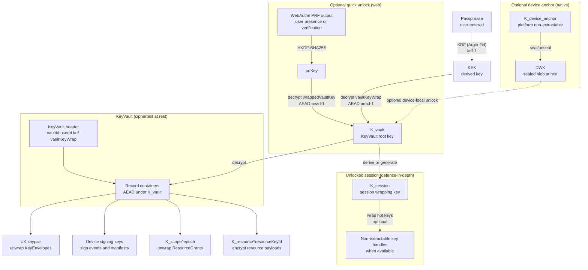

# RFC-20260107-key-service-core

**Status**: Draft
**Linear**: ALC-299
**Related**: ALC-266, ALC-268, ALC-332
**Created**: 2026-01-07
**Last Updated**: 2026-01-08

## Scope

Define a portable **Key Service** architecture that:

- implements crypto and policy once (Rust core),
- runs in web via a WASM wrapper (called from a Worker) and on native via a thin host binding,
- exposes a single cross-platform RPC/IDL,
- enforces security policy in the Key Service (not in React/native UI),
- supports the sharing model in `docs/rfcs/rfc-20260107-key-scopes-and-sharing.md`.

## Non-goals

- Final UX details (PIN/biometric prompts, screens) beyond required unlock/lock signals.
- Full “anti-withholding” (key transparency) in Phase 1.
- Protecting against fully compromised runtime while unlocked (impossible).
- Migration/back-compat with the current TypeScript `IndexedDBKeyStore` + JSON key backup formats (intentional breaking change; see “Compatibility and rollout”).

## Problem

Today crypto is implemented directly in TypeScript and callable from the UI thread. As we move to:

- an HSM Worker boundary (`ALC-299`),
- signed truth streams (ScopeState / ResourceGrants),
- PQ requirements for envelopes + signatures,
- and eventually native apps,

we need a single, auditable crypto/policy core with identical behavior across platforms.

## Compatibility and rollout (pre-prod breaking change)

This RFC is **intentionally a breaking change** (we are pre-production).

- We do **not** support an in-place migration from:
  - the current passphrase→PBKDF2-derived “master key” (`IndexedDBKeyStore`) or
  - the current JSON key backup envelope format(s)
  into the KeyVault model defined here.
- Rollout expectation: existing local identities and local ciphertext may need to be **reset** and re-onboarded under the new KeyVault-based Key Service.
- Backward compatibility for older KDFs (PBKDF2) is out of scope for Phase 1; new vaults use `kdf-1` (`Argon2id`) with explicit parameters in the header.

Rationale:

- Early-stage: avoiding “forever support” for legacy formats prevents long-term complexity and security footguns.
- The Key Service introduces new invariants (sessions, step-up gating, KeyVault sequencing) that are easiest to adopt as a clean cutover.

## Proposed solution

### 1) Rust core + platform wrappers

- `mo-key-service-core` (Rust): canonical formats + crypto + policy engine.
- `mo-key-service-wasm` (Rust): WASM wrapper for web (called from a Worker).
- Native wrapper(s): minimal FFI/binding layer (e.g., Swift/Kotlin/TS) that speaks the same RPC/IDL.

Candidate Rust crates (non-normative):

- Classical: `ed25519-dalek`, `x25519-dalek`
- Hash/KDF: `sha2`, `hkdf`, `argon2`
- AEAD: `aes-gcm` (and optionally `chacha20poly1305`)
- PQ: `ml-kem`, `ml-dsa` (FIPS 203/204) or equivalent WASM-safe implementations

Core responsibilities:

- KeyVault record format + multi-device merge rules (append-only, server-sequenced, idempotent).
- ResourceGrant / KeyEnvelope parsing and generation (with detached signed metadata).
- AEAD + AAD builders.
- KDF/HKDF.
- PQ KEM + PQ signatures (via versioned ciphersuites).
  - The ciphersuite registry is defined in this RFC (and referenced by the sharing RFC).
- Policy enforcement (sessions, step-up, “Money requires step-up”, etc.).

### 2) Thin platform adapters

The core depends on small host adapters:

- Storage adapter: read/write ciphertext records and cursors (IndexedDB/OPFS on web, SQLite/filesystem on native).
- UI/Unlock adapter: passphrase/PIN/biometric gating + idle/lock events (signals only).
- WebAuthn PRF adapter (web-only): optional “quick unlock” path that derives a device-/platform-protected secret via WebAuthn PRF to unwrap an unlock secret (see “WebAuthn PRF quick unlock” below).
- Optional platform crypto adapter: allow the host to provide **non-extractable key handles** for supported primitives (WebCrypto / Android Keystore); default is “all crypto in core”.
- Secure hardware / device anchor adapter: optional device-bound anchor (generate-only) to seal device-local secrets (defense-in-depth).

### 3) One API surface everywhere (RPC/IDL)

Expose a single request/response IDL used by:

- web `Worker` (Comlink or message-based),
- native module (direct FFI or RPC),
- tests (in-proc).

Keys are **handles**, never exported as raw bytes.

## Key extraction protection (defense-in-depth)

The Key Service’s goal is **defense-in-depth**, not perfect protection against every threat.

We explicitly distinguish three layers:

1. **Portable recovery layer** (required)
   - The KeyVault is encrypted under a per-vault **Vault Key** (`K_vault`) and is portable across devices/servers via backup/restore.
   - The passphrase-derived `KEK` is used to unwrap `K_vault` (it is not used directly for KeyVault record encryption).
2. **Session hardening layer** (recommended)
   - While unlocked, the Key Service should prefer **non-extractable key handles** when the platform supports them (e.g., WebCrypto `CryptoKey(extractable: false)`).
   - When algorithms are not supported as non-extractable handles (e.g., PQ keys today), keep key material in bytes **only inside the Key Service**, and optionally wrap it under a session-scoped wrapping key (`K_session`) to reduce raw-key lifetime in memory.
3. **Device anchor layer** (optional)
   - Some platforms can create a persistent, device-bound key handle (“device anchor”).
   - The device anchor can seal a **Device Wrapping Key (DWK)** or other device-local secrets used for quick unlock, `K_cache`, and other non-portable hardening.
   - This must not be required for recovery: losing the device anchor must not brick user data.

Important clarifications:

- “Non-extractable” is a **platform property**. Rust/WASM cannot guarantee non-extractability on its own; it can only avoid exporting bytes via the API (`INV-KS-01`).
- Wrapping PQC private keys under a device anchor improves **at-rest** protection (stolen profile), but PQ operations still require unsealing into memory unless the platform can perform PQ operations in hardware (not expected in Phase 1).
- None of these techniques protect against arbitrary code execution while unlocked (XSS/MiTB can still call decrypt/sign APIs).

### Key protection summary (Phase 1)

| Element | Where it lives | Protection | Portability | Notes |
|--------|-----------------|------------|-------------|-------|
| `passphrase` | user memory | not stored | portable | never persisted |
| `KEK` | Key Service session | derived from passphrase | portable | unwraps `K_vault`; should be short-lived; prefer non-extractable handle when possible |
| `K_vault` (KeyVault root key) | Key Service session | random 32 bytes | portable | decrypts KeyVault record containers; is wrapped under KEK (and optionally under WebAuthn PRF) |
| KeyVault ciphertext | storage + server | AEAD under `K_vault` | portable | canonical CBOR containers + hash-chain |
| UK private key bytes | inside KeyVault | AEAD under `K_vault` | portable | decrypted only while unlocked; used to unwrap KeyEnvelopes |
| PQC private key bytes (if any) | inside KeyVault | AEAD under `K_vault` | portable | may be additionally sealed by device anchor as defense-in-depth |
| `K_session` (session wrapping key) | Key Service session | non-extractable platform handle when available | not portable | wraps hot key bytes/handles; rotated on unlock |
| `K_device_anchor` (device anchor) | platform keystore | non-extractable platform handle | not portable | generate-only; used to seal DWK/quick unlock tokens |
| `DWK` (device wrapping key) | storage | sealed by device anchor | not portable | optional: device-local hardening only |
| WebAuthn PRF-wrapped `K_vault` | storage | sealed by WebAuthn-derived PRF key | depends | optional: web quick unlock; still requires user presence |

### Key layering (portable vs device-local)

This diagram shows the key relationships and “wrapping layers” the Key Service manages.



### WebAuthn PRF quick unlock (web)

We can use **WebAuthn PRF** as a high-UX, defense-in-depth unlock mechanism for the browser:

- After the user unlocks once with the passphrase, the app can enroll a WebAuthn credential that supports the PRF extension.
- On subsequent unlocks, instead of re-entering the passphrase, the app obtains PRF output (user presence / verification) and derives a symmetric key to unwrap an **unlock secret**.

Recommended posture:

- WebAuthn PRF unlock is an **optional convenience**, not the recovery mechanism. Passphrase unlock remains the baseline for onboarding/recovery and for moving to a new browser profile without the WebAuthn credential.
- The “unlock secret” is **`K_vault`** (the KeyVault root key) wrapped under a key derived from PRF output. This avoids storing the passphrase or derived `KEK` and makes passphrase rotation independent from PRF unlock.

Important nuance:

- WebAuthn credentials may be **device-bound** or **synced** (e.g., passkeys). For our threat model, treat PRF as “platform-protected” rather than strictly “device-only”. It is still valuable: exfiltrated IndexedDB/OPFS does not enable offline brute force without the authenticator.

Lifecycle integration:

- On passphrase change (KEK rotation), `K_vault` does not change, so PRF unlock remains valid.
- If we ever rotate `K_vault`, the PRF-wrapped `K_vault` must be re-wrapped (requires authenticator presence).
- PRF unlock must respect the same session TTL/auto-lock rules as passphrase unlock.

#### PRF data model (Phase 1)

WebAuthn PRF state is stored **outside** the KeyVault so it is available while locked.

`WebAuthnPrfUnlockV1` (canonical CBOR map, stored in local storage):

| Key | Name | Type | Notes |
|-----|------|------|-------|
| 0 | `v` | uint | must be `1` |
| 1 | `credentialId` | bstr | WebAuthn credential id (not secret) |
| 2 | `saltV` | uint | salt version (must be `1` in Phase 1) |
| 3 | `aead` | text | e.g. `aead-1` |
| 4 | `nonce` | bstr | AEAD nonce for `wrappedVaultKey` |
| 5 | `wrappedVaultKey` | bstr | AEAD ciphertext of `K_vault` |

Salt derivation (Phase 1):

- `prfSalt = SHA-256("mo-webauthn-prf|salt-v1" || vaultId || userId)`
- `vaultId` and `userId` are read from the KeyVault header (unencrypted).

Note:

- `prfSalt` is derived from public values and is therefore predictable. This is acceptable: the security of PRF unlock rests on the authenticator-protected PRF output, not on the salt being secret. A predictable salt does not enable offline unlock without the authenticator.

Key derivation (Phase 1):

- `prfKey = HKDF-SHA256(prfOutput, info="mo-webauthn-prf|unwrap-k-vault|v1", len=32)`
- `wrappedVaultKey = AEAD_Encrypt(prfKey, K_vault, aad = AadWebAuthnPrfWrapV1)` (see “AAD registry”)

#### Enrollment flow (Phase 1)

1. User unlocks with passphrase (Key Service derives `KEK` and unwraps `K_vault`).
2. Host creates a WebAuthn credential with PRF support (user presence/verification).
3. Host obtains `prfOutput` using `navigator.credentials.get` with `prfSalt`.
4. Key Service stores `WebAuthnPrfUnlockV1` by wrapping `K_vault` under the derived `prfKey`.

#### Unlock flow (Phase 1)

1. While locked, host reads `credentialId` from `WebAuthnPrfUnlockV1` and computes `prfSalt` from the KeyVault header.
2. Host obtains `prfOutput` using the authenticator.
3. Key Service derives `prfKey`, unwraps `K_vault`, and starts a normal or step-up session depending on policy.

#### Disable flow (Phase 1)

- Key Service deletes `WebAuthnPrfUnlockV1` from local storage. Passphrase unlock remains available.
- Disabling PRF unlock is a **local convenience** toggle, not a cryptographic revocation mechanism:
  - If an attacker already exfiltrated `WebAuthnPrfUnlockV1` *and* can obtain PRF output from the authenticator, they can still unwrap the (old) `K_vault`.
  - To cryptographically revoke a leaked PRF-wrapped vault key, rotate `K_vault` (future: a dedicated “rotate vault key” operation; today: treat as part of an identity recovery/rotation procedure).

## Diagrams

### Key Service boundary (web-first)

```mermaid
flowchart TB
  subgraph Host["Host app (UI thread)"]
    UI["UI + domain code"]
    Signals["Idle/blur/lock signals"]
  end

  subgraph Worker["Key Service worker"]
    API["Key Service API (IDL)"]
    Core["Rust core (WASM/native)"]
    Session["Session<br>K_session"]
  end

  subgraph Platform["Platform adapters"]
    Store["Storage adapter<br>IndexedDB/OPFS/FS"]
    Vault["KeyVault ciphertext<br>CBOR containers"]
    PCrypto["Platform crypto (optional)<br>non-extractable handles when available"]
    Anchor["Device anchor (optional)<br>keystore/secure enclave"]
  end

  UI -->|unlock(passphraseUtf8 or prfOutput)| API
  Signals --> API
  API --> Core
  Core --> Session
  Core <--> Store
  Store <--> Vault
  Core <--> PCrypto
  Core <--> Anchor

  API -->|KeyHandle| UI
```

Notes:

- The host never receives raw secret key bytes from the Key Service (`INV-KS-01`).
- When available, platform crypto/keystore keys provide true non-extractable handles. Otherwise, the Key Service relies on session TTL, worker isolation, and minimizing plaintext lifetime.

## Key Invariants

1. [INV-KS-01] No raw key export: the Key Service never returns raw secret key bytes to the host/UI; only opaque handles or ciphertext blobs.
2. [INV-KS-02] Session gating: all sensitive ops require an unlocked session; idle/blur triggers lock and best-effort clearing of in-memory secrets/handles (zeroization is not a guarantee in browsers/WASM).
3. [INV-KS-03] Policy is enforced inside Key Service (sessions, step-up thresholds, rate limits), not in UI code.
4. [INV-KS-04] Formats are versioned: KeyVault records, ResourceGrants, KeyEnvelopes, signatures, and ciphersuites are versioned for crypto agility.
5. [INV-KS-05] Crash safety: any newly created key material must be durably recorded (KeyVault record + required ResourceGrant/Envelope manifests) before ciphertext can be published/synced.
6. [INV-KS-06] KeyVault export is step-up gated: exporting a full KeyVault requires explicit user intent (backup flow) and a fresh step-up session; it must not be callable from “normal unlocked” sessions.

## Browser/WASM limitations (explicit)

- Best-effort “zeroization” in a browser/WASM environment does not provide a hard guarantee:
  - JS/WASM runtimes may keep copies of data (GC behavior, JIT, snapshots).
  - WASM linear memory may persist beyond expected lifetimes.
  - The browser may page/swap memory.
- Therefore, security relies primarily on:
  - minimizing plaintext lifetime (short sessions + auto-lock),
  - keeping keys out of the UI thread (Worker boundary),
  - step-up gating for high-risk operations,
  - and strong passphrase KDF parameters.

## Formats and ciphersuite registry (Phase 1)

### Encoding decision

**Decision**: use **canonical CBOR** for all Key Service formats that are signed or hash-chained.

Rationale:

- Deterministic bytes are mandatory for signatures and hash-chains (canonical CBOR gives a single encoding).
- Rust can own the canonical encoder/decoder (WASM + native share behavior), minimizing cross-language drift.
- CBOR natively supports byte strings (`Uint8Array`) and compact maps/arrays.

Guidelines:

- All “to-be-signed” bytes are `CBOR_EncodeCanonical(body)` where `body` is the unsigned CBOR map defined by the format.
- ID values in Phase 1 are encoded as UUID strings (same as the rest of the system). A future format version may switch to 16-byte UUIDs.

### AAD registry (Phase 1)

This RFC intentionally uses **two AAD styles**:

- **Key Service artifacts** (KeyVault, ScopeState, ResourceGrants, KeyEnvelopes): canonical CBOR bytes for AAD.
  - Rationale: these artifacts are signed and/or hash-chained; CBOR provides deterministic bytes across Rust/WASM/native.
- **Domain event payload ciphertext** (sync `/sync`): continues to use the existing UTF-8 string AAD (`INV-013`) for now.
  - Rationale: the current system already standardizes this and has tests; sharing semantics are enforced via signed manifests (see sharing RFC).

Unless stated otherwise, AAD bytes are `CBOR_EncodeCanonical(map)` where map keys are integers.

**AadKeyVaultKeyWrapV1** (bind `vaultKeyWrap` to the vault identity + KDF configuration):

- `aad = CBOR_EncodeCanonical({`
  - `0: "mo-keyvault-keywrap-aad-v1",`
  - `1: vaultId,`
  - `2: userId,`
  - `3: kdf,`
  - `4: aead`
  - `})`

**AadKeyVaultRecordV1** (bind record containers to the vault identity):

- `aad = CBOR_EncodeCanonical({`
  - `0: "mo-keyvault-record-aad-v1",`
  - `1: vaultId,`
  - `2: userId,`
  - `3: aead,`
  - `4: recordId`
  - `})`

**AadKeyEnvelopeWrapV1** (bind wrapped scope keys to scope/epoch and (optionally) recipient fingerprint):

- `aad = CBOR_EncodeCanonical({`
  - `0: "mo-key-envelope-aad-v1",`
  - `1: scopeId,`
  - `2: scopeEpoch,`
  - `3: recipientUserId,`
  - `4: scopeStateRef,`
  - `5: kem,`
  - `6: aead,`
  - `7?: recipientUkPubFingerprint`
  - `})`

**AadResourceGrantWrapV1** (bind wrapped resource keys to scope/resource and key versions):

- `aad = CBOR_EncodeCanonical({`
  - `0: "mo-resource-grant-aad-v1",`
  - `1: scopeId,`
  - `2: resourceId,`
  - `3: scopeEpoch,`
  - `4: resourceKeyId,`
  - `5: aead`
  - `})`

**AadWebAuthnPrfWrapV1** (bind PRF-wrapped `K_vault` to the vault identity):

- `aad = CBOR_EncodeCanonical({`
  - `0: "mo-webauthn-prf-wrap-aad-v1",`
  - `1: vaultId,`
  - `2: userId,`
  - `3: saltV,`
  - `4: aead`
  - `})`

### Ciphersuite registry

We use small string identifiers as stable selectors. The Key Service owns the algorithm mapping.

**KDF**

- `kdf-1`: `Argon2id` (ALC-299 target)
  - Parameters are encoded in the KeyVault header and must be stable per vault:
    - `memoryKiB`, `iterations`, `parallelism`, `salt` (bytes)
  - Output length: 32 bytes (`KEK`).

**AEAD**

- `aead-1`: `AES-256-GCM`
  - Key length: 32 bytes
  - Nonce: 12 bytes, uniformly random per encryption
  - Tag: 16 bytes

Nonce requirements:

- Nonces MUST be unique per `(key, nonce)` pair. Reuse is catastrophic for AES-GCM.
- Phase 1 uses random 96-bit nonces generated by a CSPRNG inside the Key Service; callers never supply nonces.
- If we later introduce exceptionally high-volume resources under a long-lived `K_resource`, we can add a new AEAD id (e.g., XChaCha20-Poly1305) or a deterministic nonce derivation scheme in a versioned format.

**Hybrid KEM (for KeyEnvelopes)**

- `hybrid-kem-1`: `X25519` + `ML-KEM-768` combined via HKDF-SHA256
  - Compute two secrets:
    - `ss_x25519` from ephemeral X25519
    - `ss_mlkem` from ML-KEM-768
  - Combine:
    - `ikm = ss_x25519 || ss_mlkem`
    - `wrapKey = HKDF-SHA256(ikm, info = "mo-key-envelope|hybrid-kem-1", len = 32)`
  - Use `wrapKey` with `aead-1` to wrap `K_scope`.

**Hybrid signatures (for ScopeState / ResourceGrants / manifests)**

- `hybrid-sig-1`: `Ed25519` + `ML-DSA-65`
  - Signing produces two signatures.
  - Verification is hybrid-AND: both signatures MUST verify.
  - Verification MUST not short-circuit: verify both signatures, then AND the results (avoid timing differences as an oracle).

### Hybrid byte packing (Phase 1)

To avoid cross-language ambiguity, hybrid suites have an explicit byte packing.

**KEM encapsulation bytes** (`KeyEnvelopeV1.enc`)

- `enc` is bytes of `CBOR_EncodeCanonical([enc_x25519, enc_mlkem])` where:
  - `enc_x25519` is a `bstr` (the ephemeral X25519 public key bytes).
  - `enc_mlkem` is a `bstr` (the ML-KEM ciphertext bytes).
- Decoders MUST reject:
  - wrong number of elements,
  - non-`bstr` elements,
  - and any element sizes that are invalid for the selected `kem` suite.

**Signature bytes** (the `signature` field for `hybrid-sig-1`)

- `signature` is bytes of `CBOR_EncodeCanonical([sig_ed25519, sig_mldsa])` where both elements are `bstr`.
- Decoders MUST verify both signatures and MUST NOT short-circuit (verify both, then AND).

### Binary formats

All formats below are **canonical CBOR maps**. Map keys are integers (stable field numbers). Optional fields are omitted.

#### ScopeState record (membership/roles/epoch/signers) — `ScopeStateV1`

Scope state is the signed authorization base for a scope and is consumed by both:

- the host (to decide whether to accept/apply mutations), and
- the Key Service (to build a trusted signer roster for verifying grants/envelopes and (optionally) domain event signatures).

Phase 1 assumes a **single writer**: the scope owner. Therefore, scope state ordering is **owner-authored** and included in the signature to prevent server reordering without detection by existing devices.

Unsigned body (to be signed):

| Key | Name             | Type  | Notes |
|-----|------------------|-------|-------|
| 0   | `v`              | uint  | must be `1` |
| 1   | `scopeId`        | text  | UUID |
| 2   | `scopeStateSeq`  | uint  | owner-authored monotonic `u64` seq per scope |
| 3   | `prevHash`       | bstr  | 32 bytes; `SHA-256(CBOR_EncodeCanonical(previousSignedRecord))`; genesis is 32 bytes of `0x00` |
| 4   | `scopeEpoch`     | uint  | current epoch after applying this record |
| 5   | `kind`           | uint  | record kind enum (membership/role/epoch/signer roster update) |
| 6   | `payload`        | map   | kind-specific payload |
| 7   | `signerDeviceId` | text  | UUID (scope owner device) |
| 8   | `sigSuite`       | text  | e.g. `hybrid-sig-1` |

Signature:

| Key | Name        | Type | Notes |
|-----|-------------|------|-------|
| 9   | `signature` | bstr | signature over `CBOR_EncodeCanonical(body)` |

`scopeStateRef`:

- `scopeStateRef = SHA-256(CBOR_EncodeCanonical(signedRecord))` where `signedRecord` is the full CBOR map including `signature`.
- This value is referenced by KeyEnvelopes, ResourceGrants, and domain event manifests (see sharing RFC).

Integer-width guidance:

- `scopeStateSeq` is `u64` in the core. Do **not** represent it as a JS `number` once it may exceed `2^53 - 1`.
- If the host needs to surface it (diagnostics/UI), expose it as `bigint` (preferred) or as a decimal string. API cursors should be opaque.

#### ResourceGrant (catalog + wrapped resource key) — `ResourceGrantV1`

Unsigned body (to be signed):

| Key | Name              | Type    | Notes |
|-----|-------------------|---------|-------|
| 0   | `v`               | uint    | must be `1` |
| 1   | `grantId`         | text    | UUID |
| 2   | `scopeId`         | text    | UUID |
| 3   | `grantSeq`        | uint    | owner-authored monotonic `u64` seq for the grants stream in this scope |
| 4   | `prevHash`        | bstr    | 32 bytes; hash-chain link over previous signed grant record (same rule as ScopeState) |
| 5   | `scopeStateRef`   | bstr    | `scopeStateRef` that authorizes this grant (must be verified) |
| 6   | `scopeEpoch`      | uint    | epoch whose `K_scope` wraps this grant |
| 7   | `resourceId`      | text    | UUID |
| 8   | `resourceKeyId`   | text    | UUID (resource key version id for this scope/resource) |
| 9   | `policy`          | map     | optional; catalog semantics (inheritance/subtree) |
| 10  | `aead`            | text    | e.g. `aead-1` |
| 11  | `nonce`           | bstr    | AEAD nonce used for `wrappedKey` |
| 12  | `wrappedKey`      | bstr    | AEAD ciphertext of `K_resource^{resourceKeyId}` |
| 13  | `signerDeviceId`  | text    | UUID (scope owner device) |
| 14  | `sigSuite`        | text    | e.g. `hybrid-sig-1` |

Signature:

| Key | Name         | Type | Notes |
|-----|--------------|------|-------|
| 15  | `signature`  | bstr | signature over `CBOR_EncodeCanonical(body)` |

Notes:

- `wrappedKey` is produced using `aead` with `K_scope^{scopeEpoch}` and `AadResourceGrantWrapV1` (derived from the body fields; see “AAD registry”).
- The server can validate existence of referenced ids and store indexes, but clients validate signature + AAD binding.
- `prevHash` chaining rule (Phase 1):
  - `grantHash = SHA-256(CBOR_EncodeCanonical(signedGrantRecord))` where `signedGrantRecord` is the full CBOR map including `signature`.
  - `prevHash` of record `n` is `grantHash` of record `n-1` (genesis uses 32 bytes of `0x00`).
 - `grantSeq` is `u64` in the core. Do **not** represent it as a JS `number` once it may exceed `2^53 - 1`. Prefer `bigint` or a decimal string for host-facing surfaces.

#### KeyEnvelope (wrapped scope key to a recipient UK) — `KeyEnvelopeV1`

Unsigned body (to be signed):

| Key | Name              | Type | Notes |
|-----|-------------------|------|-------|
| 0   | `v`               | uint | must be `1` |
| 1   | `envelopeId`      | text | UUID |
| 2   | `scopeId`         | text | UUID |
| 3   | `scopeEpoch`      | uint | |
| 4   | `recipientUserId` | text | UUID |
| 5   | `scopeStateRef`   | bstr | hash/id of the signed ScopeState event authorizing this epoch |
| 6   | `kem`             | text | e.g. `hybrid-kem-1` |
| 7   | `aead`            | text | e.g. `aead-1` |
| 8   | `enc`             | bstr | KEM encapsulation ciphertext (opaque) |
| 9   | `nonce`           | bstr | AEAD nonce used for `wrappedScopeKey` |
| 10  | `wrappedScopeKey` | bstr | AEAD ciphertext of `K_scope^{scopeEpoch}` |
| 11  | `signerDeviceId`  | text | UUID (scope owner device) |
| 12  | `sigSuite`        | text | e.g. `hybrid-sig-1` |
| 14  | `recipientUkPubFingerprint` | bstr | optional; 32 bytes; for out-of-band key-bound invites |

Signature:

| Key | Name        | Type | Notes |
|-----|-------------|------|-------|
| 13  | `signature` | bstr | signature over `CBOR_EncodeCanonical(body)` |

Notes:

- The recipient uses UK private key material to derive `wrapKey` (via `kem`) and decrypt `wrappedScopeKey`.
- `wrappedScopeKey` is produced using `aead` with `wrapKey` and `AadKeyEnvelopeWrapV1` (derived from the body fields; see “AAD registry”).
- `scopeStateRef` is AAD-bound and must match verified signed scope state (prevents server swapping envelopes across epochs/scopes).
- If present, `recipientUkPubFingerprint` MUST be AAD-bound and MUST match the recipient’s locally computed UK public key fingerprint before the envelope is accepted (key-bound invites for high-risk scopes).

#### KeyVault snapshot + records — `KeyVaultV1`

KeyVault is user-private ciphertext persisted locally and optionally synced as opaque bytes.

KeyVault is logically a **stream of encrypted record containers** (append-only). A “KeyVault snapshot export” is just a packaging of:

- a KeyVault header (KDF params + identifiers), and
- a sequence of encrypted record containers.

KeyVault header (unencrypted, to locate KDF params):

| Key | Name      | Type | Notes |
|-----|-----------|------|-------|
| 0   | `v`       | uint | must be `1` |
| 1   | `vaultId` | text | UUID; generated once at vault creation and immutable |
| 2   | `userId`  | text | UUID; the owning user/store id |
| 3   | `kdf`     | map  | (see below) |
| 4   | `aead`    | text | e.g. `aead-1` (for record encryption under `K_vault`) |
| 5   | `records` | array | array of encrypted record containers (snapshot packaging only) |
| 6   | `vaultKeyWrap` | map | wraps `K_vault` under `KEK` (see below) |

`kdf` map (canonical CBOR map):

| Key | Name    | Type | Notes |
|-----|---------|------|-------|
| 0   | `id`    | text | e.g. `kdf-1` |
| 1   | `salt`  | bstr | per-vault salt |
| 2   | `params`| map  | KDF params (shape depends on `id`) |

For `kdf-1` (`Argon2id`), `params` map:

| Key | Name           | Type | Notes |
|-----|----------------|------|-------|
| 0   | `memoryKiB`    | uint | e.g. `65536` |
| 1   | `iterations`   | uint | e.g. `3` |
| 2   | `parallelism`  | uint | e.g. `1` |

Vault Key wrap (under `KEK`)

`vaultKeyWrap` is a canonical CBOR map:

| Key | Name | Type | Notes |
|-----|------|------|-------|
| 0 | `aead` | text | e.g. `aead-1` |
| 1 | `nonce` | bstr | AEAD nonce |
| 2 | `ct` | bstr | AEAD ciphertext of `K_vault` (32 bytes) |

`vaultKeyWrap` AAD:

- `aad = AadKeyVaultKeyWrapV1` (see “AAD registry”)
- Rationale: binds the wrapped vault key to the specific vault identity and KDF configuration (anti-swap).

KeyVault record encryption key

- `K_vault` is a random 32-byte symmetric key used to encrypt all KeyVault record containers.
- `K_vault` is unwrapped via either:
  - passphrase unlock: derive `KEK` via KDF, decrypt `vaultKeyWrap.ct`, or
  - WebAuthn PRF unlock (optional): decrypt a PRF-wrapped copy of `K_vault` (see “WebAuthn PRF quick unlock”).

KeyVault records are encrypted under `K_vault`:

Record container (unencrypted):

| Key | Name     | Type | Notes |
|-----|----------|------|-------|
| 0   | `v`      | uint | must be `1` |
| 1   | `seq`     | uint | server-assigned monotonic `u64`, per-vault |
| 2   | `prevHash`| bstr | hash-chain link (32 bytes), computed over the previous record container |
| 3   | `recordId`| text | UUID, client-generated idempotency key |
| 4   | `nonce`   | bstr | AEAD nonce |
| 5   | `ct`      | bstr | AEAD ciphertext of the record plaintext |

Record AEAD AAD:

- `aad = AadKeyVaultRecordV1` (see “AAD registry”)
- This prevents cross-vault and cross-user record swaps even if two vaults accidentally share a vault key (should not happen).
- It also enables multi-device append without requiring re-encryption on server-assigned sequencing.

Record plaintext (inside `ct`, canonical CBOR map):

| Key | Name      | Type | Notes |
|-----|-----------|------|-------|
| 0   | `recordId`| text | must equal the container `recordId` |
| 1   | `kind`    | uint | record kind enum |
| 2   | `payload` | map  | kind-specific |

Hash-chain:

We hash-chain the ciphertext containers so ordering/tampering is detectable before decryption:

- `recordHash = SHA-256(CBOR_EncodeCanonical(recordContainer))`
- `prevHash` of record `n` is `recordHash` of record `n-1`
- existing devices persist the last seen `(seq, recordHash)` to detect rollback/truncation
- genesis: the first record uses `prevHash = 32 bytes of 0x00`

### KeyVault multi-device sync and merge (Phase 1)

KeyVault is multi-device and must support concurrent appends without data loss.

**Sequencing model (Phase 1)**:

- The server is the canonical sequencer for the KeyVault delta stream: it assigns the per-vault monotonic `seq` and maintains the `prevHash` chain for persisted record containers.
- Clients generate and encrypt records locally using a stable `recordId` (UUID) and upload ciphertext; the server appends them into the canonical sequence.
- Because record AEAD AAD binds to `{vaultId, userId, recordId}` (not `seq`), the server can assign `seq` without requiring clients to re-encrypt or rewrite record ciphertext.

**Idempotency and dedupe**:

- `recordId` is the idempotency key. The server MUST treat duplicate `recordId` uploads as idempotent.
  - If the duplicate upload is byte-identical to the already-stored record draft, the server MAY reply “no-op” (or return the existing container).
  - If the duplicate upload differs (same `recordId`, different `{nonce, ct}`), the server MUST return a conflict error and MUST return the already-accepted container bytes so the client can detect the mismatch and halt (this indicates corruption or a malicious client).

Threat note (Phase 1):

- The server is the canonical sequencer and can choose a submission order when assigning `seq`. This can reorder concurrently uploaded records relative to their client-local creation order. This is acceptable in Phase 1 because the KeyVault stream is a server-hosted append log; record kinds must have merge semantics that are robust to concurrent device activity. If we need “client-authored order” guarantees later, we must introduce signed client-side ordering anchors (future work).

**Merge semantics (runtime state)**:

- The Key Service derives runtime key material by folding authenticated records in increasing `seq` order.
- Each record kind defines an idempotent merge rule (e.g., “last-write-wins per identity key” for `(scopeId, scopeEpoch)` scope keys). Record kinds must be designed so order does not create correctness hazards under concurrent device activity.

**API contract (non-normative, matches sharing RFC)**:

- Download: `GET /keyvault/updates?since=cursor&limit=n` returns record containers in canonical `seq` order plus a new opaque cursor.
- Upload: a `POST /keyvault/append`-style endpoint can accept `{ recordId, nonce, ct }` record drafts; the response returns the assigned `seq`/`recordHash` head. Exact endpoint shapes are owned by the sharing RFC / API layer.

Minimum record kinds (Phase 1):

- `1` — `StoreUserKey`: `{ ukPriv: bstr, ukPub: bstr }`
- `2` — `StoreDeviceSigningKey`: `{ deviceId: text, priv: bstr, pub: bstr, sigSuite: text }`
- `3` — `StoreScopeKey`: `{ scopeId: text, scopeEpoch: uint, scopeKey: bstr }`
- `4` — `StoreResourceKey`: `{ resourceId: text, resourceKeyId: text, resourceKey: bstr }`

Rotation note (Phase 1):

- UK rotation is not implemented yet, but the KeyVault format is compatible:
  - `StoreUserKey` may be appended multiple times; the active UK is the last one by `seq`.
  - Rotating the UK requires re-issuing future scope key envelopes to the new UK public key (historical envelopes remain decryptable under the old UK unless we explicitly revoke them by re-encrypting history, out of scope).

Notes:

- KeyVault records are confidentiality+integrity protected by AEAD under `K_vault` (signatures are not required for KeyVault integrity; rollback detection is handled via the local head).
- The decrypted `recordPlain.recordId` MUST equal the container `recordId`; mismatch is corruption.
- `seq` is defined as `u64` in the core. Host code must not treat it as a JS number once it exceeds `2^53 - 1`; cursors should be opaque strings/bytes.
- This is a minimal Phase 1 set; future versions can add tombstones, compaction hints, and policy metadata.

Corruption handling (Phase 1):

- If a record container fails AEAD authentication/decryption, treat the KeyVault as corrupted:
  - stop processing subsequent records,
  - surface an explicit error to the user,
  - guide the user to restore from a backup (KeyVault export) or re-onboard from another trusted device.
- If the hash-chain link breaks (`prevHash` mismatch), treat it as corruption and stop at the first bad record.
- If an unknown `kind` is encountered, skip it (forward-compat) for runtime state, but keep the authenticated record container in storage and in encrypted exports. The Key Service MUST NOT surface unknown record payloads to the host as parsed data, and import must enforce strict size limits to prevent “record smuggling” via oversized unknown kinds.

Fork/partition note:

- A malicious server can serve different KeyVault heads to different devices (“fork”). Without an external anchor, device-local rollback checks do not detect forks.
- Phase 1 mitigation: new device onboarding should be anchored from user-controlled material (backup includes `(seq, headHash)` or a QR transfer from an existing device).

## Operational policy (Phase 1)

### Unlock policy and brute-force resistance

- The Key Service MUST implement exponential backoff on failed unlock attempts (in-process).
- The Key Service SHOULD persist a best-effort failure counter keyed by `(vaultId, userId)` in local device storage to survive reloads.
- Offline brute force against an exfiltrated KeyVault blob cannot be prevented by software rate limits. The primary defense is the KDF cost + passphrase strength.

### Account recovery (Phase 1)

We support two recovery paths; both recover the *same* user identity (same UK + KeyVault):

1. **Local backup restore**
   - Host imports an encrypted KeyVault export blob (and optionally eventstore export) from local storage.
   - Key Service unlocks via `unlock(method: 'passphrase')`, unwraps `K_vault`, verifies the KeyVault chain, then resumes normal operation.

2. **Server-based recovery**
   - Host authenticates to the server and downloads the encrypted KeyVault delta (`GET /keyvault/updates?since=...`).
   - Key Service unlocks via `unlock(method: 'passphrase')` and applies KeyVault updates after verifying integrity.
   - Once the KeyVault is unlocked, the host can proceed to pull encrypted domain data and decrypt locally.

Server identity note (Phase 1):

- The host should treat “which server” as a stable identity, not just a URL.
- The recommended anchor is a pinned `serverKeyId = fingerprint(serverIdKey.publicKey)` learned from a signed server endpoint (TOFU on first use).
- Any remote cursor/state (including KeyVault sync cursors) should be scoped by `(vaultId, serverKeyId)` to avoid mixing state across servers.
- A signed continuity/rotation story for `serverIdKey` is deferred; key rotation is treated as a “new server” unless continuity can be proven.

Identity safety rule (critical):

- The KeyVault header contains `userId`/`vaultId`. The host MUST NOT merge/apply KeyVault ciphertext from a different authenticated account into the currently open local identity.
- If the user logs into an account that does not match the local KeyVault identity, the app must require an explicit “switch identity” action (export local, wipe local, then recover from server).

### Session lifecycle

- Sessions are time-bounded and must expire.
- The Key Service SHOULD extend (“renew”) a normal session on activity, but step-up privileges must not be auto-renewed.

### Handle lifecycle

- Handles are session-scoped and MUST be invalidated on lock and session expiry.
- The Key Service SHOULD enforce a maximum number of concurrent handles per session (DoS protection).

### Import hardening

The Key Service MUST treat `importKeyVault` as untrusted input:

- enforce parsing limits (max depth, max byte lengths, max item counts),
- reject indefinite-length items,
- reject blobs over a configured maximum size,
- validate header fields (`vaultId`, `userId`, KDF params) and verify record chain consistency before accepting.

### Clock safety

- The Key Service must defend against non-monotonic clocks (best-effort):
  - reject large backward time jumps for session expiry,
  - use a monotonic source when available (e.g., `performance.now()` on web via host adapter) and track monotonicity internally.

### Passphrase / KEK rotation

- The Key Service MUST support passphrase change (KEK rotation):
  - derive a new `KEK` from the new passphrase (new salt + params),
  - re-wrap `K_vault` into `vaultKeyWrap` under the new `KEK`,
  - and update the KeyVault header (`kdf`, `vaultKeyWrap`) accordingly.

## Minimal IDL (TypeScript)

Message schema is intentionally boring (structural typing + `Uint8Array` for bytes). Host transport can be Comlink or a `{id, type, payload}` envelope.

```ts
export type SessionId = string & { readonly __brand: 'SessionId' };
export type KeyHandle = string & { readonly __brand: 'KeyHandle' };

export type UserId = string & { readonly __brand: 'UserId' };
export type DeviceId = string & { readonly __brand: 'DeviceId' };

export type ScopeId = string & { readonly __brand: 'ScopeId' };
export type ResourceId = string & { readonly __brand: 'ResourceId' };

export type ScopeEpoch = number & { readonly __brand: 'ScopeEpoch' };
export type ResourceKeyId = string & { readonly __brand: 'ResourceKeyId' };

export type AeadId = 'aead-1';

export type KemCiphersuiteId = 'hybrid-kem-1';
export type SigCiphersuiteId = 'hybrid-sig-1';

export type SessionKind = 'normal' | 'stepUp';
export type SessionAssurance = 'passphrase' | 'webauthnPrf';

export type UnlockRequest =
  | Readonly<{
      method: 'passphrase';
      passphraseUtf8: Uint8Array;
    }>
  | Readonly<{
      method: 'webauthnPrf';
      prfOutput: Uint8Array;
    }>;

export type UnlockResponse = Readonly<{
  sessionId: SessionId;
  issuedAtMs: number;
  expiresAtMs: number;
  kind: SessionKind;
  assurance: SessionAssurance;
}>;

export type StepUpRequest = Readonly<{
  sessionId: SessionId;
  passphraseUtf8: Uint8Array;
}>;

export type StepUpResponse = Readonly<{
  issuedAtMs: number;
  expiresAtMs: number;
  kind: 'stepUp';
  assurance: 'passphrase';
}>;

export type RenewSessionResponse = Readonly<{
  issuedAtMs: number;
  expiresAtMs: number;
}>;

export type GetWebAuthnPrfUnlockInfoResponse = Readonly<{
  enabled: boolean;
  credentialId: Uint8Array | null;
  prfSalt: Uint8Array;
  aead: AeadId;
}>;

export type EnableWebAuthnPrfUnlockRequest = Readonly<{
  sessionId: SessionId;
  credentialId: Uint8Array;
  prfOutput: Uint8Array;
}>;

export type DisableWebAuthnPrfUnlockRequest = Readonly<{
  sessionId: SessionId;
}>;

export type KeyEnvelopeRef = Readonly<{
  scopeId: ScopeId;
  scopeEpoch: ScopeEpoch;
  scopeStateRef: string;
  ciphersuite: KemCiphersuiteId;
}>;

export type ResourceGrantRef = Readonly<{
  grantId: string;
  scopeId: ScopeId;
  scopeEpoch: ScopeEpoch;
  resourceId: ResourceId;
  resourceKeyId: ResourceKeyId;
}>;

export type IngestScopeStateRequest = Readonly<{
  sessionId: SessionId;
  scopeStateCbor: Uint8Array;
  expectedOwnerSignerFingerprint: string | null;
}>;

export type IngestScopeStateResponse = Readonly<{
  scopeId: ScopeId;
  scopeStateRef: string;
}>;

export type IngestKeyEnvelopeRequest = Readonly<{
  sessionId: SessionId;
  keyEnvelopeCbor: Uint8Array;
}>;

export type IngestKeyEnvelopeResponse = Readonly<{
  scopeId: ScopeId;
  scopeEpoch: ScopeEpoch;
}>;

export type OpenResourceRequest = Readonly<{
  sessionId: SessionId;
  scopeKeyHandle: KeyHandle;
  grantCbor: Uint8Array;
}>;

export type CloseHandleRequest = Readonly<{
  sessionId: SessionId;
  keyHandle: KeyHandle;
}>;

export type ChangePassphraseRequest = Readonly<{
  sessionId: SessionId;
  newPassphraseUtf8: Uint8Array;
}>;

export type EncryptRequest = Readonly<{
  sessionId: SessionId;
  resourceKeyHandle: KeyHandle;
  aad: Uint8Array;
  plaintext: Uint8Array;
}>;

export type EncryptResponse = Readonly<{ ciphertext: Uint8Array }>;

export type DecryptRequest = Readonly<{
  sessionId: SessionId;
  resourceKeyHandle: KeyHandle;
  aad: Uint8Array;
  ciphertext: Uint8Array;
}>;

export type DecryptResponse = Readonly<{ plaintext: Uint8Array }>;

export type SignRequest = Readonly<{
  sessionId: SessionId;
  data: Uint8Array;
}>;

export type SignResponse = Readonly<{
  signature: Uint8Array;
  ciphersuite: SigCiphersuiteId;
}>;

export type VerifyRequest = Readonly<{
  scopeId: ScopeId;
  signerDeviceId: DeviceId;
  data: Uint8Array;
  signature: Uint8Array;
  ciphersuite: SigCiphersuiteId;
}>;

export type VerifyResponse = Readonly<{ ok: boolean }>;

export type KeyServiceRequest =
  | Readonly<{ type: 'unlock'; payload: UnlockRequest }>
  | Readonly<{ type: 'stepUp'; payload: StepUpRequest }>
  | Readonly<{ type: 'getWebAuthnPrfUnlockInfo'; payload: Readonly<{}> }>
  | Readonly<{ type: 'renewSession'; payload: Readonly<{ sessionId: SessionId }> }>
  | Readonly<{ type: 'lock'; payload: Readonly<{ sessionId: SessionId }> }>
  | Readonly<{ type: 'exportKeyVault'; payload: Readonly<{ sessionId: SessionId }> }>
  | Readonly<{ type: 'importKeyVault'; payload: Readonly<{ sessionId: SessionId; blob: Uint8Array }> }>
  | Readonly<{ type: 'changePassphrase'; payload: ChangePassphraseRequest }>
  | Readonly<{ type: 'enableWebAuthnPrfUnlock'; payload: EnableWebAuthnPrfUnlockRequest }>
  | Readonly<{ type: 'disableWebAuthnPrfUnlock'; payload: DisableWebAuthnPrfUnlockRequest }>
  | Readonly<{ type: 'ingestScopeState'; payload: IngestScopeStateRequest }>
  | Readonly<{ type: 'ingestKeyEnvelope'; payload: IngestKeyEnvelopeRequest }>
  | Readonly<{ type: 'openScope'; payload: Readonly<{ sessionId: SessionId; scopeId: ScopeId; scopeEpoch: ScopeEpoch }> }>
  | Readonly<{ type: 'openResource'; payload: OpenResourceRequest }>
  | Readonly<{ type: 'closeHandle'; payload: CloseHandleRequest }>
  | Readonly<{ type: 'encrypt'; payload: EncryptRequest }>
  | Readonly<{ type: 'decrypt'; payload: DecryptRequest }>
  | Readonly<{ type: 'sign'; payload: SignRequest }>
  | Readonly<{ type: 'verify'; payload: VerifyRequest }>;

export type KeyServiceResponse =
  | Readonly<{ type: 'unlock'; payload: UnlockResponse }>
  | Readonly<{ type: 'stepUp'; payload: StepUpResponse }>
  | Readonly<{ type: 'getWebAuthnPrfUnlockInfo'; payload: GetWebAuthnPrfUnlockInfoResponse }>
  | Readonly<{ type: 'renewSession'; payload: RenewSessionResponse }>
  | Readonly<{ type: 'lock'; payload: Readonly<{}> }>
  | Readonly<{ type: 'exportKeyVault'; payload: Readonly<{ blob: Uint8Array }> }>
  | Readonly<{ type: 'importKeyVault'; payload: Readonly<{}> }>
  | Readonly<{ type: 'changePassphrase'; payload: Readonly<{}> }>
  | Readonly<{ type: 'enableWebAuthnPrfUnlock'; payload: Readonly<{}> }>
  | Readonly<{ type: 'disableWebAuthnPrfUnlock'; payload: Readonly<{}> }>
  | Readonly<{ type: 'ingestScopeState'; payload: IngestScopeStateResponse }>
  | Readonly<{ type: 'ingestKeyEnvelope'; payload: IngestKeyEnvelopeResponse }>
  | Readonly<{ type: 'openScope'; payload: Readonly<{ scopeKeyHandle: KeyHandle }> }>
  | Readonly<{ type: 'openResource'; payload: Readonly<{ resourceKeyHandle: KeyHandle }> }>
  | Readonly<{ type: 'closeHandle'; payload: Readonly<{}> }>
  | Readonly<{ type: 'encrypt'; payload: EncryptResponse }>
  | Readonly<{ type: 'decrypt'; payload: DecryptResponse }>
  | Readonly<{ type: 'sign'; payload: SignResponse }>
  | Readonly<{ type: 'verify'; payload: VerifyResponse }>;
```

Notes:

- Trust boundary: the Key Service must not accept caller-supplied public keys for signature verification.
  - The Key Service MUST build a trusted scope-local signer roster by ingesting signed ScopeState records via `ingestScopeState`.
  - For a brand-new scope, `ingestScopeState` supports two modes:
    - **pinned**: the host provides `expectedOwnerSignerFingerprint` obtained out-of-band; the Key Service refuses the scope state if the owner signer does not match.
    - **TOFU**: `expectedOwnerSignerFingerprint = null`; the Key Service pins the first seen owner signer key for the scope and warns on later changes.
- `verify` MUST resolve the signer’s public key from the trusted scope-local signer roster (via `scopeId` + `signerDeviceId`). It must not accept arbitrary public keys from the caller.
- `ingestKeyEnvelope` MUST verify the KeyEnvelope signature internally (using the trusted scope owner signer key for the scope) before decrypting and persisting the scope key. It MUST also refuse envelopes that reference unknown/unverified `scopeStateRef`.
- If a KeyEnvelope includes `recipientUkPubFingerprint`, `ingestKeyEnvelope` MUST verify it against the local UK public key fingerprint before accepting.
- `openResource` MUST verify the ResourceGrant signature internally (using the trusted scope owner signer key for the referenced scope state) before unwrapping and returning a `resourceKeyHandle`.
- Role/grant/policy checks should be integrated as we wire in ScopeState + grants (Phase 1 can start with “verify signatures + basic role checks”).
- `passphraseUtf8` is bytes so callers can avoid retaining long-lived JS strings and can zeroize the byte buffer after unlock.
- `exportKeyVault` is an encrypted blob export, but it is still a high-impact operation. Key Service policy MUST require a step-up session (fresh passphrase re-entry via `stepUp`) and SHOULD rate-limit exports.
- `importKeyVault` MUST apply strict CBOR parsing limits (max depth/items/bytes; no indefinite-length items) and validate the KeyVault chain before accepting.
- `openScope` reads the scope key from the KeyVault (it does not ingest remote data). It MUST fail if the requested `(scopeId, scopeEpoch)` key is not present. Authorization is enforced at the protocol level by requiring correct `scopeStateRef`/`grantId` on mutations; `openScope` is a crypto primitive, not an authorization decision point.

## Adapter contracts (Rust)

Core should depend on small traits (host-provided) rather than platform APIs directly.

```rust
pub trait StorageAdapter {
  type Error;
  fn get(&self, namespace: &str, key: &str) -> Result<Option<Vec<u8>>, Self::Error>;
  fn put(&self, namespace: &str, key: &str, value: &[u8]) -> Result<(), Self::Error>;
  fn list_since(&self, namespace: &str, cursor: &str, limit: usize) -> Result<(Vec<(String, Vec<u8>)>, String), Self::Error>;
}

pub trait ClockAdapter {
  fn now_ms(&self) -> u64;
}

pub trait EntropyAdapter {
  fn random_bytes(&self, len: usize) -> Vec<u8>;
}

pub enum PlatformSignal {
  Idle,
  Blur,
}

/// Device-bound “anchor” used for defense-in-depth hardening (optional).
///
/// Semantics:
/// - The underlying platform key is generated and stored by the platform; it is not importable as raw bytes.
/// - `label` identifies (and may lazily create) the anchor key handle.
/// - The ciphertext returned by `seal` must be bound to the provided `aad` (anti-swap).
pub trait DeviceAnchorAdapter {
  type Error;
  fn seal(&self, label: &str, aad: &[u8], plaintext: &[u8]) -> Result<Vec<u8>, Self::Error>;
  fn unseal(&self, label: &str, aad: &[u8], ciphertext: &[u8]) -> Result<Vec<u8>, Self::Error>;
}
```

Signals are pushed into the core by the host (inversion of control), e.g. `key_service.handle_signal(PlatformSignal::Idle)`.

Notes:

- iOS Secure Enclave is “generate-only” and primarily supports asymmetric keys. Implementations may use an enclave keypair to derive or unwrap a symmetric DWK, then use that DWK for blob encryption.
- Android Keystore can provide symmetric keys directly (AES-GCM) and is also generate-only in practice for hardware-backed keys.
- WebCrypto can provide non-extractable `CryptoKey` handles, but they are not hardware-backed in the browser threat model. This is still useful as defense-in-depth against accidental export and some memory-dump classes.

## Next steps

1. Implement `mo-key-service-core` with:
   - KeyVault record merge + cursor model
   - session lifecycle + zeroization
   - AEAD + AAD builders
   - sign/verify
2. Wrap with `mo-key-service-wasm` and integrate into a Worker boundary for web (`ALC-299`).
