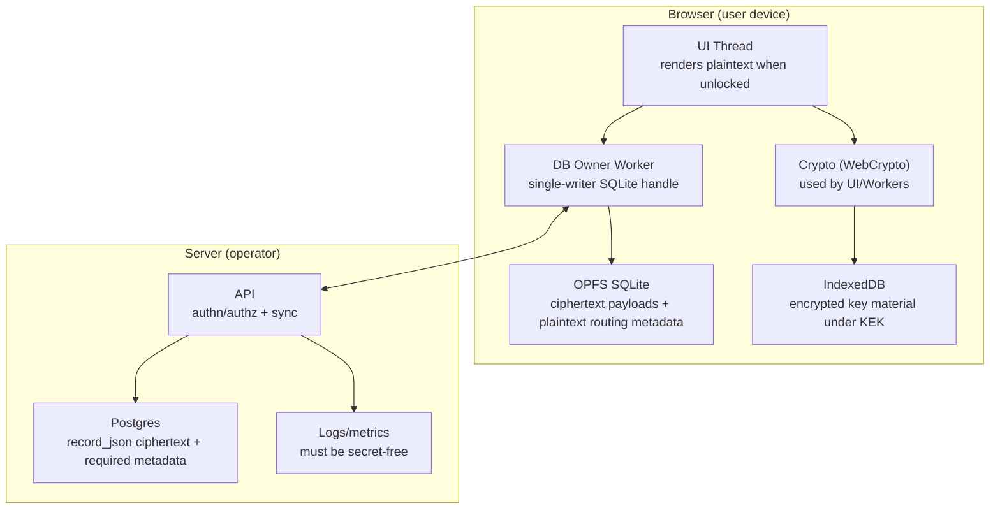

# Security Controls Matrix

**Status**: Living
**Linear**: ALC-334
**Created**: 2026-01-08
**Last Updated**: 2026-01-08

## Scope

This document is the “practitioner view” of MO Local security **as implemented today**: a concrete map of **security elements → threats → controls → evidence** across **client** and **server**.

It complements:

- `docs/security.md` (overview)
- `docs/security/threat-model.md` (assets + attacker models)

## Non-goals

- Claiming compliance with any specific framework (SOC2/ISO/etc).
- Detailing production infrastructure hardening (future AWS/multi-tenant ops).
- Solving “compromised unlocked runtime” (XSS/MiTB) beyond defense-in-depth.

## Status semantics

- **Implemented**: exists in code today (with at least one pointer to code/tests/docs).
- **Partially implemented**: present, but still relies on process/manual checks or has known gaps.

## Invariants

Relevant invariants in `docs/invariants.md`:

- `INV-006` — ZK encryption boundary
- `INV-007` — Single-writer local DB ownership
- `INV-008` — Idempotent sync facts by `eventId`
- `INV-009` — Server-assigned global ordering
- `INV-012` — Key backup enables payload recovery
- `INV-013` — Integrity binding via AES-GCM AAD
- `INV-014` — Keys are encrypted at rest under a KEK
- `INV-015` — Diagnostics are secret-free
- `INV-016` — Secure context required
- `INV-017` — Auth is not key escrow
- `INV-019` — Logs avoid plaintext domain content

## Diagram (security surfaces)

Notes:

- “ZK boundary” is the line where the server never receives user keys and cannot decrypt payloads (`INV-006`).
- Integrity and authorization are not provided by encryption alone; they are handled by AAD binding, ordering/idempotency contracts, and server-side authorization checks at API boundaries.

## Controls matrix

This matrix is intentionally concrete. Rows describe what exists today without implying “perfect security”.

### Client-side controls (browser)

| Area                | Control                                                                    | Threat mitigated                                  | Invariants | Evidence / pointers                                                                     | Status                     |
| ------------------- | -------------------------------------------------------------------------- | ------------------------------------------------- | ---------- | --------------------------------------------------------------------------------------- | -------------------------- |
| Encryption          | Client-side payload encryption (AES-GCM); ciphertext stored in OPFS SQLite | Server compromise, stolen server DB               | `INV-006`  | `packages/infrastructure/src/crypto/**`, `packages/eventstore-web/src/worker/sqlite.ts` | Implemented                |
| Integrity           | AAD binds ciphertext to `{aggregateType}:{aggregateId}:{version}`          | Cross-context replay/swap                         | `INV-013`  | `packages/infrastructure/__tests__/eventing/aad.test.ts`                                | Implemented                |
| Keys at rest        | Key material encrypted at rest under passphrase-derived KEK (IndexedDB)    | Stolen browser profile (at-rest)                  | `INV-014`  | `docs/security/key-management.md`                                                       | Implemented                |
| Storage safety      | Single writer for OPFS SQLite (SharedWorker/WebLocks)                      | Local corruption, multi-tab races                 | `INV-007`  | `apps/e2e/tests/eventstore-web-worker.test.ts`                                          | Implemented                |
| Diagnostics hygiene | Diagnostics bundles are secret-free by construction                        | Accidental secret leakage during support          | `INV-015`  | `docs/security/incident-response-and-recovery.md`                                       | Partially implemented      |
| Logging hygiene     | Logs avoid plaintext domain content; log only safe metadata                | Accidental plaintext leakage to console/telemetry | `INV-019`  | `.github/pull_request_template.md`                                                      | Partially implemented      |
| Secure context      | Require secure context for WebCrypto/OPFS guarantees                       | Browser API downgrade/insecure origins            | `INV-016`  | `docs/security/browser-security.md`                                                     | Implemented (ops contract) |

### Server-side controls (API + DB)

| Area            | Control                                                                            | Threat mitigated                              | Invariants           | Evidence / pointers                                                    | Status                           |
| --------------- | ---------------------------------------------------------------------------------- | --------------------------------------------- | -------------------- | ---------------------------------------------------------------------- | -------------------------------- |
| Auth vs keys    | Server authenticates and authorizes sync, but never receives user keys             | Key escrow regression                         | `INV-017`, `INV-006` | `docs/security/auth-and-identity.md`                                   | Implemented                      |
| Sync storage    | Persist opaque `record_json` bytes; never rewrite ciphertext                       | Determinism breaks, corruption                | `INV-004`            | `apps/api/src/sync/infrastructure/migrations/sync/0001_sync_schema.ts` | Implemented                      |
| Ordering        | Server assigns canonical `globalSequence`                                          | Forky ordering, non-deterministic convergence | `INV-009`            | `docs/security/sync-boundary.md`                                       | Implemented                      |
| Idempotency     | Append is idempotent by `eventId`                                                  | Duplicate insertion, replay                   | `INV-008`            | `apps/api/__tests__/sync/kysely-sync-event.repository.test.ts`         | Implemented                      |
| Logging hygiene | Server logs avoid plaintext payloads (no access) and avoid secret-bearing metadata | Data leakage via logs                         | `INV-019`            | PR checklist; `docs/security/threat-model.md`                          | Implemented (must remain true)   |
| Transport       | TLS assumed (browser-default validation); no cert pinning                          | Network attacker (passive/active)             | (assumption)         | `docs/security/threat-model.md`                                        | Implemented via platform + infra |

### Cross-cutting controls (process + assurance)

| Area               | Control                                                                 | Threat mitigated                   | Invariants           | Evidence / pointers                                                                   | Status      |
| ------------------ | ----------------------------------------------------------------------- | ---------------------------------- | -------------------- | ------------------------------------------------------------------------------------- | ----------- |
| Backups            | Key backup + DB export/restore flows                                    | Rug-pull / migration / device loss | `INV-012`            | `docs/runbooks/backup-and-restore.md` (if present), `docs/security/key-management.md` | Implemented |
| Tests-as-assurance | Invariants linked to tests / e2e where feasible                         | “We think it’s secure” drift       | (registry)           | `docs/invariants.md` (Verified By column)                                             | Ongoing     |
| Change review      | PR checklist includes security hygiene items (no secrets in logs, etc.) | Regression                         | `INV-019`, `INV-015` | `.github/pull_request_template.md`                                                    | Implemented |

## Operational guidance (how to use this)

- When changing crypto/storage/sync/auth: update the relevant row(s) and add evidence pointers.
- When adding a new invariant: add a row here (or update an existing one) and link to a test/runbook where possible.

## Code pointers

- Security overview: `docs/security.md`
- Threat model: `docs/security/threat-model.md`
- Invariants registry: `docs/invariants.md`
- Sync boundary details: `docs/security/sync-boundary.md`
- Key management: `docs/security/key-management.md`
