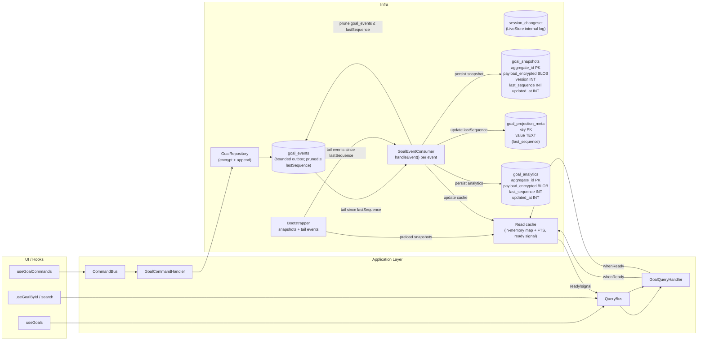

# Goals POC – Product Requirements Document

**Version**: 2.1  
**Status**: In progress  
**Last Updated**: 2025-12-01

## 1. Objective
Build a local-first proof of concept that demonstrates:

- A clean separation between **Domain**, **Application**, **Infrastructure**, and **Interface** layers.
- **Event-sourced storage** with LiveStore (SQLite+OPFS) so every state change is captured as an immutable goal event.
- **Per-aggregate encryption**: each goal has its own symmetric key managed in the browser keystore and never leaves the device in plaintext.
- A React experience that works fully offline, including onboarding, unlock, goal CRUD, and encrypted backups.
- A foundation we can extend with sync + sharing once the backend exists.

## 2. Scope and Phases

| Area | Status | Notes |
| --- | --- | --- |
| Balanced Wheel Goal domain | ✅ Implemented | Aggregate + value objects enforced via fluent `Assert` DSL. |
| Goal command handling (create/update/delete) | ✅ Implemented | Validated commands routed through `GoalApplicationService`. |
| Per-goal encryption & key storage | ✅ Implemented | `IndexedDBKeyStore` stores identity + aggregate keys encrypted with KEK. |
| LiveStore persistence | ✅ Implemented | Browser adapter writes encrypted events to OPFS-backed SQLite. |
| React UI (onboarding, unlock, dashboard, backups) | ✅ Implemented | `AppProvider` wires services + state machine. |
| Tests (Vitest) | ✅ Implemented | Domain, application, infrastructure, and web suites run via `yarn test`. |
| Backend APIs (NestJS + Postgres) | 🔜 Planned | `apps/api` is a placeholder; server and sync endpoints are the next phase after the offline POC. |
| Sync + multi-device replication | 🔜 Planned | No push/pull transport yet. Backups currently move keys only, not event logs. |
| Sharing / invites / wrapped key distribution | 🔜 Planned | Domain events and crypto helpers exist; flows are not exposed in UI or infrastructure yet. |
| Docker Compose dev stack | 🔜 Planned | Documented as future work to support full-stack + E2E; not present in repo yet. |

### 2.1 In-scope (POC)

| Area            | Details                                                                                                  |
| --------------- | -------------------------------------------------------------------------------------------------------- |
| Frontend        | React + TypeScript + Vite + shadcn/ui                                                                    |
| Architecture    | Clean Architecture (4 layers)                                                                            |
| Bounded Context | Goals BC only                                                                                            |
| Domain          | Balanced Wheel with 8 slices: Health, Family, Relationships, Work, Money, Learning, Mindfulness, Leisure |
| Views           | Wheel view, Timeline view (design reference; current UI focuses on list/dashboard)                       |
| Local Storage   | LiveStore (SQLite via OPFS/wa-sqlite)                                                                    |
| Encryption      | Per-aggregate keys (`K_goal`), wrapped by user identity keys                                             |
| Multi-device    | Same user on multiple devices via key backup/import (using exported key bundles)                         |

### 2.2 Out of scope (for POC)

| Area                                 | Rationale                                                     |
| ------------------------------------ | ------------------------------------------------------------- |
| Email verification / OAuth           | POC uses key-based identity only                              |
| Mobile / React Native                | Web-only for POC                                              |
| MLS-style group crypto               | Pragmatic per-aggregate key scheme instead                    |
| Complex conflict resolution          | LiveStore's default last-write-wins with rebasing             |
| Goal hierarchies / sub-goals / tasks | Simple flat goal model for POC                                |
| Full key rotation on revocation      | Documented limitation; revoked users retain historical access |

## 3. Architecture Overview

### 3.1 Monorepo layout

```
mo-local/
├── apps/
│   ├── web/                # React + Vite client
│   └── api/                # Placeholder for future NestJS backend
├── packages/
│   ├── domain/             # Balanced Wheel aggregate + value objects
│   ├── application/        # Command validation, handlers, ports
│   └── infrastructure/     # LiveStore adapters, crypto, key stores
├── docs/                   # Additional design notes (e.g., materializer plan)
└── goals-poc-prd-v2.md     # This document
```

### 3.2 Layer boundaries

```
Interface (React hooks/components)
        ↓
Application (commands + handlers + ports)
        ↓
Domain (Goal aggregate, VOs, events)
        ↑
Infrastructure (LiveStore, crypto, key store implementations)
```

- **Domain** has zero external dependencies. All invariants rely on the internal `Assert` DSL. We have a "no primitive types" obsession!
- **Application** depends on Domain only and defines the ports (`IGoalRepository`, `ICryptoService`, `IKeyStore`, `IEventStore`, etc.).
- **Infrastructure** implements those ports, translates domain events to encrypted LiveStore payloads, and exposes browser-friendly wiring (`createBrowserServices`).
- **Interface** (apps/web) consumes the services through React context and hooks.

## 4. Domain Layer

- **Aggregate**: `Goal` (`packages/domain/src/goals/Goal.ts`). Emits:
  - `GoalCreated`
  - `GoalSummaryChanged`
  - `GoalSliceChanged`
  - `GoalTargetChanged`
  - `GoalPriorityChanged`
  - `GoalDeleted`
  - `GoalAccessGranted`
  - `GoalAccessRevoked`
- **Value Objects**:
  - `Slice` (eight Balanced Wheel slices, strongly typed)
  - `Priority` (`must`, `should`, `maybe` with comparison helpers)
  - `Month` (YYYY-MM arithmetic & comparison)
  - `Summary` (non-empty text)
  - `GoalId`/`UserId` (UUIDv7 / opaque string) and `Timestamp`
- **Fluent Assertions**: `Assert` provides chainable validators (`isNonEmpty`, `isOneOf`, `isBetween`, etc.) to keep the domain expressive without branching logic.
- **Event sourcing**: Aggregates are reconstructed via `Goal.reconstitute(id, events)`. `AggregateRoot` keeps uncommitted events and versions for optimistic concurrency.

## 5. Application Layer

- **Commands** (`packages/application/src/commands`): `CreateGoal`, `ChangeGoalSummary`, `ChangeGoalSlice`, `ChangeGoalTargetMonth`, `ChangeGoalPriority`, `DeleteGoal`, `GrantGoalAccess`, `RevokeGoalAccess`, `RegisterUser`, `ImportUserKeys`.
- **Validation**: Each command has a `validate*` function that returns a typed `CommandResult`, ensuring domain objects are constructed before handlers run.
- **Handlers**:
  - `GoalCommandHandler` orchestrates loading, domain mutations, persistence, key lookups, and event publication.
  - `UserCommandHandler` handles onboarding/backup import (publishing a `UserRegistered` event placeholder for future infra).
- **Ports**: `IGoalRepository`, `IEventStore`, `ICryptoService`, `IKeyStore`, `ISyncProvider`, and `IEventBus` define the infrastructure seams.
- **Services**: `GoalApplicationService` is the entry point used by the UI. It selects the command validator + handler and wraps errors as `CommandResult` failures.

## 6. Infrastructure Layer

- **LiveStore schema**: `packages/infrastructure/src/browser/schema.ts` defines the `goal_events` table and `goal.event` stream. Each row stores encrypted event payloads plus versions and timestamps. For the next phase we will add a per‑BC `*_snapshots` table holding encrypted aggregate snapshots (see `docs/materializer-plan.md`).
- **Adapters**:
  - `DomainToLiveStoreAdapter` encrypts serialized domain event payloads using AES-GCM with additional authenticated data `aggregateId:eventType:version`.
  - `LiveStoreToDomainAdapter` decrypts rows, validates payloads with Zod, and instantiates domain event classes.
- **Event stores**:
  - `BrowserLiveStoreEventStore` (OPFS/worker) enforces version sequencing and retries writes.
  - Test-only `LiveStoreEventStore`/`WaSqliteEventStore` keep parity across environments.
- **Crypto**:
  - `WebCryptoService` implements `ICryptoService` for browsers (AES-GCM, PBKDF2 (600k iterations), HKDF, ECDH/ECDSA helpers, ECIES envelope helpers).
  - `NodeCryptoService` mirrors functionality for future backend services.
  - `SharingCrypto` and `AggregateKeyManager` are ready for invite flows but not exposed in UI yet.
- **Key storage**: `IndexedDBKeyStore` stores identity + aggregate keys encrypted with the passphrase-derived KEK. Export/import helpers enable backups.
- **Browser wiring**: `createBrowserServices` hands back `{ crypto, keyStore, store, eventStore, eventBus, goalRepo, goalService, goalQueries }` used by `AppProvider`.
- **Projection runtime (planned)**:
  - Each BC (starting with Goals) gets a worker-based projection runtime that:
    - Bootstraps from encrypted events + snapshots stored in LiveStore.
    - Maintains clear‑text projections and indices in worker memory (including FTS and facet indices).
    - Maintains BC-specific **analytical rollups** (e.g. `goals_monthly_totals`, `goals_category_rollups`) so queries like “goals per slice per year” do not require scanning the entire event log.
  - Exposes a typed DAL (`GoalQueries`/`TaskQueries`/…) to the main thread for list/filter/search operations.
  - The current POC still uses a simpler log‑replay `GoalQueries` implementation; the worker‑backed runtime is specified in `docs/materializer-plan.md` and will replace it as we scale.

### 6.1 LiveStore integration (browser)

At runtime, the stack integrates LiveStore as follows:

1. `AppProvider` calls `createBrowserServices({ adapter })`, where the adapter is created via `@livestore/adapter-web` with OPFS storage and a shared worker. This bootstraps the LiveStore store with the `goal_events` schema.
2. The `BrowserLiveStoreEventStore` implementation of `IEventStore` writes encrypted events into the `goal_events` table, enforcing monotonically increasing versions per aggregate and retrying on transient failures.
3. `GoalRepository` and `GoalQueries` both depend on the same event store plus the crypto/key-store adapters. Writes go through `GoalRepository` (domain events → encrypted LiveStore events). Reads reconstruct aggregates or lightweight projections by decrypting the per-aggregate event streams.
4. The React hooks (`useGoals`, `useGoalById`) subscribe to LiveStore table counts (`tables.goal_events.count()`) so that any commit triggers a refresh and projections stay current without manual reloads.
5. LiveStore uses OPFS under the hood (via the web adapter and worker). This gives us a durable, per-origin SQLite database that works across modern browsers, including Safari with the shared-worker integration.

## 7. Interface Layer (apps/web)

### 7.1 Providers & hooks
- `AppProvider` bootstraps LiveStore, tracks session state (`needs-onboarding` → `locked` → `ready`), and exposes onboarding/unlock/backup helpers plus the services.
- `useGoalCommands` maps component actions to application commands and handles optimistic UI states.
- `useGoals` + `useGoalById` rebuild projections by decrypting events through `GoalQueries` whenever LiveStore notifies `goal_events` changes.

### 7.2 Components
- **Onboarding** (`components/auth/Onboarding.tsx`): passphrase entry, key generation, backup restore.
- **Unlock**: prompts for passphrase and unlocks keys.
- **GoalDashboard**: goal form, cards, backup modal, and LiveStore debug panel (DEV only).
- **BackupModal**: exports encrypted JSON envelope containing identity + aggregate keys, plus salt metadata.

### 7.3 User flows
1. **Onboard**
   - Generate UUIDv7 `userId`.
   - Derive KEK via PBKDF2 using `deriveSaltForUser(userId)` (currently SHA-256(userId); see limitations).
   - Generate signing + encryption keypairs, store encrypted in IndexedDB, persist metadata in `localStorage`.
2. **Unlock**
   - Load metadata, derive KEK, decrypt identity keys, load goal projections.
3. **Goal CRUD**
   - UI dispatches commands → `GoalApplicationService` validates → `GoalCommandHandler` mutates aggregate → encrypted events appended to LiveStore → the DAL updates projections (currently via event replay; later via worker‑based projection runtime).
4. **Backup / Restore**
   - Export: decrypt keystore, base64 encode identity + aggregate keys, encrypt with KEK, provide `cipher + salt` JSON blob for download/copy. This is a **key backup only**; event logs and goal data stay on the device until sync/log export exists.
   - Restore: upload blob, derive KEK using provided salt, decrypt payload, clear IndexedDB entries, rehydrate keys, update metadata. Without the original event log, restored keys alone will not bring goals onto a new device.

## 8. Developer Workflow

### Installation & dev
1. `yarn install`
2. `yarn dev`
3. Visit `http://localhost:5173`

### Testing & quality
- `yarn test` – runs Vitest suites in `apps/web`, `packages/domain`, `packages/application`, and `packages/infrastructure`.
- `yarn lint` – ESLint flat config across repo.
- `yarn typecheck` – `tsc --noEmit` for every workspace.
- `yarn format` / `yarn format:check` – Prettier for TS/TSX/JSON/MD.

### Data reset recipe
```
indexedDB.deleteDatabase('mo-local-keys');
localStorage.removeItem('mo-local-user');
```
Then reload the app, onboard again, and (optionally) restore a backup. Clearing browser site data resets the LiveStore OPFS database as well.

### Tooling notes
- Vite dev server with React SWC transforms.
- LiveStore worker (`packages/infrastructure/src/browser/worker.ts`) is bundled via `?worker` imports.
- No Docker Compose or backend processes yet; `apps/api` is empty.

## 9. Current Limitations & Follow-ups

1. **Event bus never receives goal events**: `GoalCommandHandler` publishes *after* `GoalRepository.save` marks events as committed. Subscribers (e.g., background sync) therefore see an empty array. Fix by capturing pending events before persistence or having the repository return the appended events.
2. **Goal creation can orphan data**: We append encrypted events to LiveStore *before* persisting `K_goal` in the key store. If `IndexedDBKeyStore.saveAggregateKey` fails, the events are stored forever with no key to decrypt them.
3. **Backups do not include event logs**: Export/restore flows only move identity + aggregate keys (`apps/web/src/components/goals/BackupModal.tsx`). Without separate OPFS export or sync server, "multi-device support" is limited to reusing the same identity on the same browser profile.
4. **Deterministic password salt**: `deriveSaltForUser` hashes `userId`, and metadata never stores a random salt (`apps/web/src/providers/AppProvider.tsx`). This makes KEKs predictable per user and prevents us from rotating salts later.
5. **Backend + sync + sharing**: No HTTP APIs, invites, or wrapped key distribution exist yet. `AggregateKeyManager`, `SharingCrypto`, and ISyncProvider ports are unused.
6. **LiveStore projections**: Queries currently replay every event for every aggregate on each refresh. `docs/materializer-plan.md` now specifies a worker‑based projection runtime per BC with encrypted events + snapshots and in‑memory projections/indices; that design is not yet implemented.
7. **Docker documentation is aspirational**: Section 11.2 from the previous PRD described a Docker Compose stack that does not exist. Keep this noted as future infrastructure work.

## 10. Next Steps
- Wire the backend (NestJS + Postgres) and implement the sync provider described in earlier revisions.
- Fix the event bus + key persistence ordering bugs so downstream services can react to events safely.
- Extend backups to include encrypted event snapshots or ship sync before advertising multi-device support.
- Introduce random per-user salts (store them in metadata and backups) to harden passphrase derivation.
- Implement the worker‑based projection runtime + encrypted snapshots per BC (as in `docs/materializer-plan.md`) to avoid replaying the entire log on every `useGoals` refresh and to support FTS + facet search efficiently.

## 11. Goals Projection Runtime (diagram + key facts)

The Goals BC uses an event-sourced pipeline with encrypted storage and in-memory reads. This mirrors the plan in `docs/materializer-plan.md` and is the reference for future BCs.



Key facts:

- LiveStore’s canonical log is `session_changeset`; `goal_events` remains a local bounded outbox until the `events()` API ships, after which it can be dropped.
- Snapshots (`goal_snapshots`) and analytics (`goal_analytics`) are encrypted and local-only; they keep catch-up fast and let the outbox be pruned to `lastSequence`.
- The read path is in-memory (projection + FTS) seeded from snapshots + tail events, with a “ready” signal gating queries.
- Bootstrap and live updates share the same consumer (`GoalEventConsumer`) so behavior is identical for catch-up and steady state.
- Sync will append encrypted events to the canonical log; projections react via LiveStore notifications rather than bespoke in-process buses.
