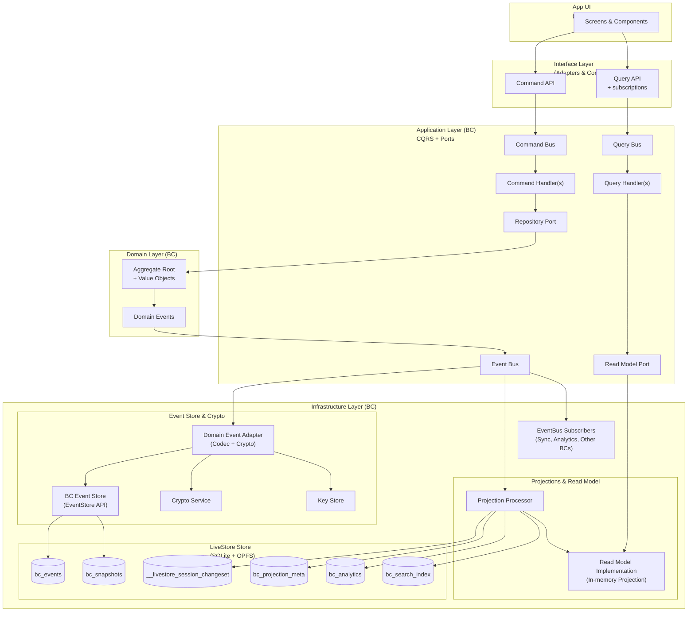

# Goals POC – Product Requirements Document

**Version**: 2.1  
**Status**: In progress  
**Last Updated**: 2025-12-01

## 1. Objective

Build a local-first proof of concept that demonstrates:

- A clean separation between **Domain**, **Application**, **Infrastructure**, and **Interface** layers.
- **Event-sourced storage** with LiveStore (SQLite+OPFS) so every state change is captured as an immutable goal event.
- **Per-aggregate encryption**: each goal has its own symmetric key managed in the browser keystore and never leaves the device in plaintext.
- A React experience that works fully offline, including onboarding, unlock, goal CRUD, and encrypted backups.
- A foundation we can extend with sync + sharing once the backend exists.

## 2. Scope and Phases

| Area                                              | Status         | Notes                                                                                            |
| ------------------------------------------------- | -------------- | ------------------------------------------------------------------------------------------------ |
| Balanced Wheel Goal domain                        | ✅ Implemented | Aggregate + value objects enforced via fluent `Assert` DSL.                                      |
| Goal command handling (create/update/archive)     | ✅ Implemented | Validated commands routed through `GoalApplicationService`.                                      |
| Per-goal encryption & key storage                 | ✅ Implemented | `IndexedDBKeyStore` stores identity + aggregate keys encrypted with KEK.                         |
| LiveStore persistence                             | ✅ Implemented | Browser adapter writes encrypted events to OPFS-backed SQLite.                                   |
| React UI (onboarding, unlock, dashboard, backups) | ✅ Implemented | `AppProvider` wires services + state machine.                                                    |
| Tests (Vitest)                                    | ✅ Implemented | Domain, application, infrastructure, and web suites run via `yarn test`.                         |
| Backend APIs (NestJS + Postgres)                  | 🔜 Planned     | `apps/api` is a placeholder; server and sync endpoints are the next phase after the offline POC. |
| Sync + multi-device replication                   | 🔜 Planned     | No push/pull transport yet. Backups currently move keys only, not event logs.                    |
| Sharing / invites / wrapped key distribution      | 🔜 Planned     | Domain events and crypto helpers exist; flows are not exposed in UI or infrastructure yet.       |
| Docker Compose dev stack                          | 🔜 Planned     | Documented as future work to support full-stack + E2E; not present in repo yet.                  |

### 2.1 In-scope (POC)

| Area            | Details                                                                                                  |
| --------------- | -------------------------------------------------------------------------------------------------------- |
| Frontend        | React + TypeScript + Vite + shadcn/ui                                                                    |
| Architecture    | Clean Architecture (4 layers)                                                                            |
| Bounded Context | Goals + Projects BCs (Projects shares the same architecture pattern; UI is still Goals‑centric for now) |
| Domain          | Balanced Wheel with 8 slices: Health, Family, Relationships, Work, Money, Learning, Mindfulness, Leisure |
| Views           | Wheel view, Timeline view (design reference; current UI focuses on list/dashboard)                       |
| Local Storage   | LiveStore (SQLite via OPFS/wa-sqlite)                                                                    |
| Encryption      | Per-aggregate keys (`K_goal`), wrapped by user identity keys                                             |
| Multi-device    | Same user on multiple devices via key backup/import (using exported key bundles)                         |

### 2.2 Out of scope (for POC)

| Area                                 | Rationale                                                     |
| ------------------------------------ | ------------------------------------------------------------- |
| Email verification / OAuth           | POC uses key-based identity only                              |
| Mobile / React Native                | Web-only for POC                                              |
| MLS-style group crypto               | Pragmatic per-aggregate key scheme instead                    |
| Complex conflict resolution          | LiveStore's default last-write-wins with rebasing             |
| Goal hierarchies / sub-goals / tasks | Simple flat goal model for POC                                |
| Full key rotation on revocation      | Documented limitation; revoked users retain historical access |

## 3. Architecture Overview

### 3.1 Monorepo layout

```
mo-local/
├── apps/
│   ├── web/                # React + Vite client (composition root + UI)
│   └── api/                # Placeholder for future backend
├── packages/
│   ├── domain/             # Goals, Projects, Identity aggregates + value objects
│   ├── application/        # CQRS types, handlers, ports
│   ├── infrastructure/     # LiveStore schema/adapters, crypto, key stores, BC wiring
│   └── interface/          # React-facing context + hooks per BC
├── goals-poc-prd-v2.md     # This document (PRD)
└── README.md               # Repo-level overview
```

### 3.2 Layer boundaries

```
Interface (React hooks/components)
        ↓
Application (commands + handlers + ports)
        ↓
Domain (Goals + Projects aggregates, VOs, events)
        ↑
Infrastructure (LiveStore, crypto, key store implementations, projections)
```

- **Domain** has zero external dependencies. All invariants rely on the internal `Assert` DSL, and we keep the "no primitive types" obsession across Goals and Projects.
- **Application** depends on Domain only and defines CQRS types and ports: generic `Repository` / `ReadModel` plus per-BC ports such as `IGoalRepository`, `IGoalReadModel`, `IProjectRepository`, `IProjectReadModel`, alongside `ICryptoService`, `IKeyStore`, `IEventStore`, `IEventBus`, and `ISyncProvider`.
- **Infrastructure** implements those ports, translates domain events to encrypted LiveStore payloads, runs projection processors and read models per BC, and exposes browser-friendly wiring functions (`bootstrapGoalBoundedContext`, `bootstrapProjectBoundedContext`) instead of owning a global composition root.
- **Presentation** is split between `packages/presentation` (BC-agnostic React context/hooks over command/query buses + projection ports) and `apps/web` (composition root + screens).

## 4. Domain Layer

- **Aggregate**: `Goal` (`packages/domain/src/goals/Goal.ts`). Emits:
  - `GoalCreated`
  - `GoalSummaryChanged`
  - `GoalSliceChanged`
  - `GoalTargetChanged`
  - `GoalPriorityChanged`
  - `GoalArchived`
  - `GoalAccessGranted`
  - `GoalAccessRevoked`
- **Value Objects**:
  - `Slice` (eight Balanced Wheel slices, strongly typed)
  - `Priority` (`must`, `should`, `maybe` with comparison helpers)
  - `Month` (YYYY-MM arithmetic & comparison)
  - `Summary` (non-empty text)
  - `GoalId`/`UserId` (UUIDv7 / opaque string) and `Timestamp`
- **Fluent Assertions**: `Assert` provides chainable validators (`isNonEmpty`, `isOneOf`, `isBetween`, etc.) to keep the domain expressive without branching logic.
- **Event sourcing**: Aggregates are reconstructed via `Goal.reconstitute(id, events)`. `AggregateRoot` keeps uncommitted events and versions for optimistic concurrency.

## 5. Application Layer

- **CQRS primitives** (`packages/application/src/shared/ports`):
  - `BaseCommand`, `BaseCommandHandler`, `IBus`, `CommandResult`, `Repository<TAggregate, TId>`, and `ReadModel<TDto, TFilter, TSearchFilter>`.
  - Cross-cutting ports: `ICryptoService`, `IKeyStore`, `IEventStore`, `IEventBus`, and `ISyncProvider`.
- **Goal BC** (`packages/application/src/goals`):
  - Commands (`.../goals/commands`): `CreateGoal`, `ChangeGoalSummary`, `ChangeGoalSlice`, `ChangeGoalTargetMonth`, `ChangeGoalPriority`, `ArchiveGoal`, `GrantGoalAccess`, `RevokeGoalAccess`.
  - `GoalCommandHandler` (extends `BaseCommandHandler`) orchestrates loading, domain mutations, persistence, key lookups, and event publication through `IEventBus` + `IEventStore`.
  - `GoalQueryHandler` depends only on the `IGoalReadModel` port, which is implemented in infrastructure.
- **Project BC** (`packages/application/src/projects`):
  - Commands (`.../projects/commands`): `CreateProject`, `ChangeProjectStatus`, `ChangeProjectDates`, `ChangeProjectName`, `ChangeProjectDescription`, `AddProjectGoal`, `RemoveProjectGoal`, `AddProjectMilestone`, `ChangeProjectMilestoneTargetDate`, `ChangeProjectMilestoneName`, `ArchiveProjectMilestone`, `ArchiveProject`.
  - `ProjectCommandHandler` mirrors the goals pattern (extends `BaseCommandHandler`, uses `IProjectRepository`, `IKeyStore`, `ICryptoService`, `IEventBus`).
  - `ProjectQueryHandler` depends on `IProjectReadModel`.
- **Identity** (`packages/application/src/identity`):
  - Commands: `RegisterUserCommand`, `ImportUserKeysCommand`.
  - `UserCommandHandler` drives onboarding/backup import and will publish identity events when the backend exists.
- **Buses**:
  - `SimpleBus` implementations for commands/queries are created per BC in infra wiring and exposed to the interface layer; there is no monolithic `GoalApplicationService` anymore.

## 6. Infrastructure Layer

- **LiveStore schema**: `packages/infrastructure/src/goals/schema.ts` defines the SQLite schema shared by the Goals and Projects BCs: event tables (`goal_events`, `project_events`), snapshot tables (`goal_snapshots`, `project_snapshots`), projection meta tables (`goal_projection_meta`, `project_projection_meta`), analytics (`goal_analytics`), and search indices (`goal_search_index`, `project_search_index`). LiveStore's internal `__livestore_session_changeset` table remains the canonical append-only log.
- **Event codecs & adapters**:
  - `GoalEventCodec` / `ProjectEventCodec` convert domain events to versioned wire payloads and back.
  - `DomainToLiveStoreAdapter` uses those codecs plus `ICryptoService` to encrypt payloads into `EncryptedEvent` envelopes.
  - `LiveStoreToDomainAdapter` decrypts `EncryptedEvent` rows, delegates payload validation/upcasting to the codecs, and returns domain events.
- **Event stores**:
  - `BrowserLiveStoreEventStore` is a LiveStore-backed implementation of `IEventStore` with optimistic concurrency checks and retry logic; it is instantiated twice in browser wiring: once for `goal_events` / `goal_snapshots` and once for `project_events` / `project_snapshots`.
- **Crypto**:
  - `WebCryptoService` implements `ICryptoService` for browsers (AES-GCM, PBKDF2 (600k iterations), HKDF, ECDH/ECDSA helpers, ECIES envelope helpers).
  - `NodeCryptoService` mirrors functionality for future backend services.
  - `SharingCrypto` and `AggregateKeyManager` are ready for invite flows but not exposed in UI yet.
- **Key storage**: `IndexedDBKeyStore` stores identity + aggregate keys encrypted with the passphrase-derived KEK. Export/import helpers enable backups.
- **Projections & read models**:
  - `GoalProjectionProcessor` / `ProjectProjectionProcessor` consume encrypted events from the BC event stores, maintain encrypted snapshots + analytics/search tables in LiveStore, and expose in-memory projections.
  - `GoalReadModel` / `ProjectReadModel` wrap those processors and implement the `IGoalReadModel` / `IProjectReadModel` ports consumed by the application query handlers.
- **BC wiring**:
  - `packages/infrastructure/src/browser/wiring/store.ts` configures the LiveStore `Store` and per-BC event stores from a browser adapter.
  - `bootstrapGoalBoundedContext` / `bootstrapProjectBoundedContext` (under `packages/infrastructure/src/goals` and `.../projects`) compose repositories, projection processors, read models, and command/query buses for each BC.

### 6.1 LiveStore integration (browser)

At runtime, the web app integrates LiveStore as follows:

1. `AppProvider` obtains a browser adapter (`apps/web/src/providers/LiveStoreAdapter.ts`) backed by `@livestore/adapter-web` (OPFS + shared worker) and calls `createAppServices({ adapter, storeId, contexts: ['goals', 'projects'] })`.
2. `createAppServices` uses `createStoreAndEventStores` to create a single LiveStore `Store` plus two `BrowserLiveStoreEventStore` instances (`goalEventStore`, `projectEventStore`), and wires `WebCryptoService`, `IndexedDBKeyStore`, `InMemoryEventBus`, and `LiveStoreToDomainAdapter`.
3. For each enabled BC, infra wiring (`bootstrapGoalBoundedContext`, `bootstrapProjectBoundedContext`) composes:
   - a repository (`GoalRepository` / `ProjectRepository`) that uses the BC event store + adapters,
   - a projection processor (`GoalProjectionProcessor` / `ProjectProjectionProcessor`) that maintains snapshots, analytics, and search indices in LiveStore,
   - a read model (`GoalReadModel` / `ProjectReadModel`) implementing the application `*ReadModel` ports,
   - and typed command/query buses (`goalCommandBus` / `goalQueryBus`, `projectCommandBus` / `projectQueryBus`).
4. `AppProvider` exposes these buses and projection ports to the presentation layer via `InterfaceProvider` from `@mo/presentation/react`, and uses the underlying `Store` only for diagnostics/debug UI in DEV.
5. LiveStore uses OPFS under the hood; all event, snapshot, analytics, and search tables live in the same per-origin SQLite database.

### 6.2 Event versioning & migrations

- Domain events are deliberately version-agnostic: they expose a single canonical payload shape per event type and do not carry payload-level versions.
- Versioning is handled exclusively in infrastructure through per-BC codecs:
  - `GoalEventCodec` and `ProjectEventCodec` define the latest payload version per event and the upcast steps from older versions.
  - `DomainToLiveStoreAdapter` wraps serialized payloads in `{ payloadVersion, data }` envelopes before encryption.
  - `LiveStoreToDomainAdapter` unwraps envelopes, applies any configured upcasters (e.g. v1 → v2), and only then hydrates domain events.
- Legacy events without a `payloadVersion` wrapper are treated as `payloadVersion = 1` with the raw JSON payload passed directly to the codec; tests cover this compatibility path.
- When a breaking change is required:
  - Introduce a new payload schema and bump the latest version for the affected event type in the codec.
  - Add explicit upcast functions from each older version to the new shape.
  - Do not change domain event constructors or `toJSON`/`fromJSON`; migrations live entirely at the persistence boundary.

## 7. Interface Layer (apps/web)

### 7.1 Providers & hooks

- `AppProvider` (in `apps/web`) is the app composition root: it bootstraps LiveStore + BC wiring via `createAppServices`, tracks session state (`needs-onboarding` → `locked` → `ready`), and wires the `InterfaceProvider`.
- `InterfaceProvider` (in `packages/presentation`) exposes an `InterfaceContext` with:
  - per-BC command/query buses, and
  - projection ports (`goalProjection`, `projectProjection`) that provide `whenReady()` + `subscribe()` for reactive UI updates.
- Hooks in `packages/presentation/src/hooks` (`useGoalCommands`, `useGoals`, `useGoalById`, `useGoalSearch`, `useProjects`, `useProjectCommands`) talk only to the application layer via those buses/ports; they never touch LiveStore or crypto directly.

### 7.2 Components

- **Onboarding** (`components/auth/Onboarding.tsx`): passphrase entry, key generation, backup restore.
- **Unlock**: prompts for passphrase and unlocks keys.
- **GoalDashboard**: goal form, cards, backup modal, and LiveStore debug panel (DEV only).
- **ProjectsPage**: project list and form, with optional linkage to goals and milestone management, powered by `useProjects` + `useProjectCommands`.
- **BackupModal**: exports encrypted JSON envelope containing identity + aggregate keys, plus salt metadata.

### 7.3 User flows

1. **Onboard**
   - Generate UUIDv7 `userId`.
   - Generate a random per-user salt (stored in metadata/backups) and derive KEK via PBKDF2.
   - Generate signing + encryption keypairs, store encrypted in IndexedDB, persist metadata (includes salt) in `localStorage`.
2. **Unlock**
   - Load metadata, derive KEK, decrypt identity keys, load goal projections.
3. **Goal & Project CRUD**
   - Interface hooks dispatch typed commands onto the per-BC command buses → `GoalCommandHandler` / `ProjectCommandHandler` parse VOs and mutate aggregates → encrypted events are appended to the BC event stores → projection processors update snapshots/analytics/search and refresh the in-memory read models consumed by queries.
4. **Backup / Restore**
   - Export: decrypt keystore, base64 encode identity + aggregate keys, encrypt with KEK, provide `cipher + salt` JSON blob for download/copy (salt is persisted for unlock on fresh devices).
   - Restore: upload blob, derive KEK using provided salt (or migrate legacy backups to a fresh random salt), decrypt payload, clear IndexedDB entries, rehydrate keys, update metadata. This is a **key backup only**; event logs and goal data stay on the device until sync/log export exists.

## 8. Developer Workflow

### Installation & dev

1. `yarn install`
2. `yarn dev`
3. Visit `http://localhost:5173`

### Testing & quality

- `yarn test` – runs Vitest suites in `apps/web`, `packages/domain`, `packages/application`, and `packages/infrastructure`.
- `yarn lint` – ESLint flat config across repo.
- `yarn typecheck` – `tsc --noEmit` for every workspace.
- `yarn format` / `yarn format:check` – Prettier for TS/TSX/JSON/MD.

### Data reset recipe

```
indexedDB.deleteDatabase('mo-local-keys');
localStorage.removeItem('mo-local-user');
```

Then reload the app, onboard again, and (optionally) restore a backup. Clearing browser site data resets the LiveStore OPFS database as well.

### Tooling notes

- Vite dev server with React SWC transforms.
- LiveStore worker (`packages/infrastructure/src/browser/worker.ts`) is bundled via `?worker` imports.
- No Docker Compose or backend processes yet; `apps/api` is empty.

## 9. Current Limitations & Follow-ups

1. **Backups do not include event logs**: Export/restore flows only move identity + aggregate keys (`apps/web/src/components/goals/BackupModal.tsx`). Without separate OPFS export or sync server, "multi-device support" is limited to reusing the same identity on the same browser profile.
2. **Legacy backups without salt**: Old `.backup` files lacking a `salt` still need existing metadata to derive the legacy deterministic salt; first unlock/restore now rewraps keys with a random per-user salt and saves it to metadata/backups.
3. **Backend + sync + sharing**: No HTTP APIs, invites, or wrapped key distribution exist yet. `AggregateKeyManager`, `SharingCrypto`, and `ISyncProvider` ports are unused.
4. **Projection runtime still runs on the main thread**: `GoalProjectionProcessor` / `ProjectProjectionProcessor` are main-thread consumers triggered by LiveStore subscriptions. Worker-based execution and cross-tab coordination are future work.
5. **Docker documentation is aspirational**: A Docker Compose stack for full-stack + E2E is still planned but not present in the repo.

## 10. Next Steps

- Wire the backend (NestJS + Postgres) and implement the sync provider described in earlier revisions.
- Extend backups to include encrypted event snapshots or ship sync before advertising multi-device support.
- Implement a worker‑based projection runtime per BC (mirroring the current processors) to keep the UI responsive under heavier loads and to support cross-tab processing.
- Add a Docker Compose/dev stack once the backend and sync flows are in place.

## 11. BC Projection Runtime (diagram + key facts)

Goals and Projects BCs now share the same event-sourced pipeline with encrypted storage and in-memory reads. The diagram below shows the generic pattern; in code we instantiate it once per BC (with concrete tables like `goal_events` / `project_events`).



Key facts:

- LiveStore’s canonical append-only log is `__livestore_session_changeset`; per-BC event stores (`bc_events`) are materialized tables (`goal_events`, `project_events`, …) driven by LiveStore materializers.
- Snapshots (`bc_snapshots`) and analytics (`bc_analytics`) are encrypted and local-only; they keep catch-up fast and let the BC event tables be pruned based on `bc_projection_meta.last_sequence`.
- The read path is in-memory (projection + search index) seeded from snapshots + tail events, with a “ready” signal exposed via the projection ports used by the interface layer.
- EventBus subscribers are the hook for future sync, cross-BC reactions, and analytics without coupling the domain to infrastructure details.
- In the current POC, this pattern is instantiated for both Goals and Projects; additional BCs can reuse the same structure with their own codecs and tables.
- Projection processors are idempotent: they only advance `last_sequence` after successful processing and can safely be restarted or forced to rebuild from snapshots plus tail events.
- If a per-aggregate key is missing during catch-up (`MissingKeyError`), the processor logs a warning and stops; once the key is available (e.g., after key import), the next run will resume from the same `last_sequence`.
- In a multi-tab setup, each tab hosts its own projection processors; LiveStore arbitrates concurrent writes to the underlying SQLite store, but cross-tab coordination (e.g. leader election, worker offload) is future work.
- A lightweight performance budget is enforced in code: if a projection run takes longer than ~100ms, a structured warning is logged with the duration and configured budget, so we can track when work should be moved off the main thread.
