# Goals POC – Product Requirements Document

**Version**: 2.1  
**Status**: In progress  
**Last Updated**: 2025-12-25

> Architecture note: the long-lived architecture reference (layers + key ADRs) is `docs/architecture.md`. This PRD remains a product/workflow WIP doc and will be retired once the architecture doc is complete.

## 1. Objective

Build a local-first proof of concept that demonstrates:

- A clean separation between **Domain**, **Application**, **Infrastructure**, and **Interface** layers.
- **Event-sourced storage** with LiveStore (SQLite+OPFS) so every state change is captured as an immutable goal event.
- **Per-aggregate encryption**: each goal has its own symmetric key managed in the browser keystore and never leaves the device in plaintext.
- A React experience that works fully offline, including onboarding, unlock, goal CRUD, and encrypted backups.
- A foundation we can extend with sharing and richer collaboration on top of the current sync backend.

## 2. Scope and Phases

| Area                                              | Status         | Notes                                                                                                                               |
| ------------------------------------------------- | -------------- | ----------------------------------------------------------------------------------------------------------------------------------- |
| Balanced Wheel Goal domain                        | ✅ Implemented | Aggregate + value objects enforced via fluent `Assert` DSL.                                                                         |
| Goal command handling (create/update/archive)     | ✅ Implemented | Validated commands routed through `GoalApplicationService`.                                                                         |
| Per-goal encryption & key storage                 | ✅ Implemented | `IndexedDBKeyStore` stores identity + aggregate keys encrypted with KEK.                                                            |
| LiveStore persistence                             | ✅ Implemented | Browser adapter writes encrypted events to OPFS-backed SQLite.                                                                      |
| React UI (onboarding, unlock, dashboard, backups) | ✅ Implemented | `AppProvider` wires services + state machine.                                                                                       |
| Tests (Vitest + Playwright)                       | ✅ Implemented | Unit suites run via `yarn test`; Playwright e2e runs via `yarn e2e` (stack required).                                               |
| Backend APIs (NestJS + Postgres)                  | ✅ Implemented | `apps/api` server, access and sync endpoints.                                                                                       |
| Sync + multi-device replication                   | ✅ Implemented | LiveStore-driven push/pull via `CloudSyncBackend` → `/sync/push` + `/sync/pull`, with server-ahead conflict detection and rebasing. |
| Sharing / invites / wrapped key distribution      | 🔜 Planned     | Domain events and crypto helpers exist; flows are not exposed in UI or infrastructure yet.                                          |
| Docker Compose dev stack                          | ✅ Implemented | Local dev stack for Postgres + Kratos + API + Web (used by Playwright e2e).                                                         |

### 2.1 In-scope (POC)

| Area            | Details                                                                                                  |
| --------------- | -------------------------------------------------------------------------------------------------------- |
| Frontend        | React + TypeScript + Vite + shadcn/ui                                                                    |
| Architecture    | Clean Architecture (4 layers)                                                                            |
| Bounded Context | Goals + Projects BCs (Projects shares the same architecture pattern; UI is still Goals‑centric for now)  |
| Domain          | Balanced Wheel with 8 slices: Health, Family, Relationships, Work, Money, Learning, Mindfulness, Leisure |
| Views           | Wheel view, Timeline view (design reference; current UI focuses on list/dashboard)                       |
| Local Storage   | LiveStore (SQLite via OPFS/wa-sqlite)                                                                    |
| Encryption      | Per-aggregate keys (`K_goal`), wrapped by user identity keys                                             |
| Multi-device    | Same user on multiple devices via key backup/import (using exported key bundles)                         |

### 2.2 Out of scope (for POC)

| Area                                 | Rationale                                                     |
| ------------------------------------ | ------------------------------------------------------------- |
| Email verification / OAuth           | POC uses key-based identity only                              |
| Mobile / React Native                | Web-only for POC                                              |
| MLS-style group crypto               | Pragmatic per-aggregate key scheme instead                    |
| Complex conflict resolution          | LiveStore's default last-write-wins with rebasing             |
| Goal hierarchies / sub-goals / tasks | Simple flat goal model for POC                                |
| Full key rotation on revocation      | Documented limitation; revoked users retain historical access |

## 3. Architecture Overview

### 3.1 Monorepo layout

```
mo-local/
├── apps/
│   ├── web/                # React + Vite client (composition root + UI)
│   └── api/                # NestJS API (auth + sync backend)
├── packages/
│   ├── domain/             # Goals, Projects, Identity aggregates + value objects
│   ├── application/        # CQRS types, handlers, ports
│   ├── infrastructure/     # LiveStore schema/adapters, crypto, key stores, BC wiring
│   └── interface/          # React-facing context + hooks per BC
├── goals-poc-prd-v2.md     # This document (PRD)
└── README.md               # Repo-level overview
```

### 3.2 Layer boundaries

```
Interface (React hooks/components)
        ↓
Application (commands + handlers + ports)
        ↓
Domain (Goals + Projects aggregates, VOs, events)
        ↑
Infrastructure (LiveStore, crypto, key store implementations, projections)
```

- **Domain** has zero external dependencies. All invariants rely on the internal `Assert` DSL, and we keep the "no primitive types" obsession across Goals and Projects.
- **Application** depends on Domain only and defines CQRS types and ports: generic `Repository` / `ReadModel` plus per-BC ports such as `GoalRepositoryPort`, `GoalReadModelPort`, `ProjectRepositoryPort`, `ProjectReadModelPort`, alongside `CryptoServicePort`, `KeyStorePort`, `EventStorePort`, `EventBusPort`, and `SyncProviderPort`.
- **Infrastructure** implements those ports, translates domain events to encrypted LiveStore payloads, runs projection processors and read models per BC, and exposes browser-friendly wiring functions (`bootstrapGoalBoundedContext`, `bootstrapProjectBoundedContext`) instead of owning a global composition root.
- **Presentation** is split between `packages/presentation` (BC-agnostic React context/hooks over command/query buses + projection ports) and `apps/web` (composition root + screens).

### 3.3 Identity, store, and sync identifiers

The system deliberately separates the **local-first root of trust** from server and client/session identifiers:

```text
userId (= storeId)              ← LOCAL-FIRST ROOT OF TRUST
    │                             Cryptographic identity, owns keys
    │                             Exists before any server
    │
    ├── identityId               ← Server concern (Kratos)
    │                             Only for sync/sharing auth
    │                             Maps TO userId, not the other way
    │
    ├── clientId "y7ucs"         ← Device: Laptop
    │       ├── sessionId           Tab 1
    │       └── sessionId           Tab 2
    │
    └── clientId "bGyre"         ← Device: Phone
            └── sessionId           Tab
```

- `userId` is generated on onboarding in the browser and anchors everything else: it owns the key material and, by design, is also the `storeId` used for LiveStore + sync. It exists independently of any backend and remains stable across devices when restored from backup.
- `identityId` is a Kratos identity that authenticates sync/sharing requests on the server. It maps to a `userId` (and therefore to a `storeId`) but is not itself the local source of truth.
- `clientId` is a LiveStore concept that identifies a device/browser profile acting on behalf of a given `userId`. It is stable for that profile and is useful for diagnostics and per-device analysis.
- `sessionId` is scoped to a single LiveStore `Store` instance (tab/session) and gives fine-grained auditability for which tab produced which events.

Design-wise, **`userId`/`storeId` is the anchor** for local-first state and sync; server-side identities and LiveStore client/session identifiers are subordinate and can be rotated or reissued without changing the underlying goal/project history.

## 4. Domain Layer

- **Aggregate**: `Goal` (`packages/domain/src/goals/Goal.ts`). Emits:
  - `GoalCreated`
  - `GoalRefined`
  - `GoalRecategorized`
  - `GoalRescheduled`
  - `GoalPrioritized`
  - `GoalAchieved`
  - `GoalUnachieved`
  - `GoalArchived`
  - `GoalAccessGranted`
  - `GoalAccessRevoked`
- **Value Objects**:
  - `Slice` (eight Balanced Wheel slices, strongly typed)
  - `Priority` (`must`, `should`, `maybe` with comparison helpers)
  - `Month` (YYYY-MM arithmetic & comparison)
  - `Summary` (non-empty text)
  - `GoalId`/`UserId` (UUIDv7 / opaque string) and `Timestamp`
- **Fluent Assertions**: `Assert` provides chainable validators (`isNonEmpty`, `isOneOf`, `isBetween`, etc.) to keep the domain expressive without branching logic.
- **Event sourcing**: Aggregates are reconstructed via `Goal.reconstitute(id, events)`. `AggregateRoot` keeps uncommitted events and versions for optimistic concurrency.

## 5. Application Layer

- **CQRS primitives** (`packages/application/src/shared/ports`):
  - `BaseCommand`, `BaseCommandHandler`, `BusPort`, `CommandResult`, `Repository<TAggregate, TId>`, and `ReadModel<TDto, TFilter, TSearchFilter>`.
  - Cross-cutting ports: `CryptoServicePort`, `KeyStorePort`, `EventStorePort`, `EventBusPort`, and `SyncProviderPort`.
- **Goal BC** (`packages/application/src/goals`):
  - Commands (`.../goals/commands`): `CreateGoal`, `ChangeGoalSummary`, `ChangeGoalSlice`, `ChangeGoalTargetMonth`, `ChangeGoalPriority`, `AchieveGoal`, `UnachieveGoal`, `ArchiveGoal`, `GrantGoalAccess`, `RevokeGoalAccess`.
  - `GoalCommandHandler` (extends `BaseCommandHandler`) orchestrates loading, domain mutations, persistence, and key lookups; publication is treated as a post-commit concern driven from LiveStore (see commit boundary rules below).
  - `GoalQueryHandler` depends only on the `GoalReadModelPort` port, which is implemented in infrastructure.
- **Project BC** (`packages/application/src/projects`):
  - Commands (`.../projects/commands`): `CreateProject`, `ChangeProjectStatus`, `ChangeProjectDates`, `ChangeProjectName`, `ChangeProjectDescription`, `AddProjectGoal`, `RemoveProjectGoal`, `AddProjectMilestone`, `ChangeProjectMilestoneTargetDate`, `ChangeProjectMilestoneName`, `ArchiveProjectMilestone`, `ArchiveProject`.
  - `ProjectCommandHandler` mirrors the goals pattern (extends `BaseCommandHandler`, uses `ProjectRepositoryPort`, `KeyStorePort`, `CryptoServicePort`; publication is post-commit).
  - `ProjectQueryHandler` depends on `ProjectReadModelPort`.
- **Identity** (`packages/application/src/identity`):
  - Commands: `RegisterUserCommand`, `ImportUserKeysCommand`.
  - `UserCommandHandler` drives onboarding/backup import and will publish identity events when the backend exists.
- **Buses**:
  - `SimpleBus` implementations for commands/queries are created per BC in infra wiring and exposed to the interface layer; there is no monolithic `GoalApplicationService` anymore.

## 6. Infrastructure Layer

- **LiveStore schema**: `packages/infrastructure/src/goals/schema.ts` defines the SQLite schema shared by the Goals and Projects BCs: event tables (`goal_events`, `project_events`), snapshot tables (`goal_snapshots`, `project_snapshots`), projection meta tables (`goal_projection_meta`, `project_projection_meta`), analytics (`goal_analytics`), and search indices (`goal_search_index`, `project_search_index`). LiveStore's internal `__livestore_session_changeset` table remains the canonical append-only log.
- **Event codecs & adapters**:
  - Domain events are encrypted at rest; LiveStore stores only ciphertext (`payload_encrypted`) in the per-BC tables.
  - `DomainToLiveStoreAdapter` encrypts payload envelopes and writes them to the event store.
  - `LiveStoreToDomainAdapter` decrypts payload envelopes and hydrates domain events.
  - Serialization/versioning/upcasting rules are standardized into a single `packages/infrastructure/src/eventing/` runtime + registry (replacing per-BC codecs).
- **Event stores**:
  - `BrowserLiveStoreEventStore` is a LiveStore-backed implementation of `EventStorePort` with optimistic concurrency checks and retry logic; it is instantiated twice in browser wiring: once for `goal_events` / `goal_snapshots` and once for `project_events` / `project_snapshots`.
- **Crypto**:
  - `WebCryptoService` implements `CryptoServicePort` for browsers (AES-GCM, PBKDF2 (600k iterations), HKDF, ECDH/ECDSA helpers, ECIES envelope helpers).
  - `NodeCryptoService` mirrors functionality for future backend services.
  - `SharingCrypto` and `AggregateKeyManager` are ready for invite flows but not exposed in UI yet.
- **Key storage**: `IndexedDBKeyStore` stores identity + aggregate keys encrypted with the passphrase-derived KEK. Export/import helpers enable backups.
- **Projections & read models**:
  - `GoalProjectionProcessor` / `ProjectProjectionProcessor` consume encrypted events from the BC event stores, maintain encrypted snapshots + analytics/search tables in LiveStore, and expose in-memory projections.
  - `GoalReadModel` / `ProjectReadModel` wrap those processors and implement the `GoalReadModelPort` / `ProjectReadModelPort` ports consumed by the application query handlers.
- **Sync (browser + API)**:
  - LiveStore’s `ClientSessionSyncProcessor` orchestrates push/pull against a `SyncBackend` implementation.
  - `CloudSyncBackend` implements that contract in the browser and calls the NestJS sync API (`POST /sync/push`, `GET /sync/pull`), mapping HTTP 409 responses into LiveStore’s `InvalidPushError` so the client can rebase when the server is ahead.
  - On the server, `SyncController` delegates to `SyncService`, which persists events and store ownership via `KyselySyncEventRepository` / `KyselySyncStoreRepository` into the `sync.events` and `sync.stores` tables.
- **BC wiring**:
  - `packages/infrastructure/src/browser/wiring/store.ts` configures the LiveStore `Store` and per-BC event stores from a browser adapter.
  - `bootstrapGoalBoundedContext` / `bootstrapProjectBoundedContext` (under `packages/infrastructure/src/goals` and `.../projects`) compose repositories, projection processors, read models, and command/query buses for each BC.

### 6.1 LiveStore integration (browser)

At runtime, the web app integrates LiveStore as follows:

1. `AppProvider` obtains a browser adapter (`apps/web/src/providers/LiveStoreAdapter.ts`) backed by `@livestore/adapter-web` (OPFS + shared worker) and calls `createAppServices({ adapter, storeId, contexts: ['goals', 'projects'] })`.
2. `createAppServices` uses `createStoreAndEventStores` to create a single LiveStore `Store` plus two `BrowserLiveStoreEventStore` instances (`goalEventStore`, `projectEventStore`), and wires `WebCryptoService`, `IndexedDBKeyStore`, `InMemoryEventBus`, and `LiveStoreToDomainAdapter`.
3. For each enabled BC, infra wiring (`bootstrapGoalBoundedContext`, `bootstrapProjectBoundedContext`) composes:
   - a repository (`GoalRepository` / `ProjectRepository`) that uses the BC event store + adapters,
   - a projection processor (`GoalProjectionProcessor` / `ProjectProjectionProcessor`) that maintains snapshots, analytics, and search indices in LiveStore,
   - a read model (`GoalReadModel` / `ProjectReadModel`) implementing the application `*ReadModel` ports,
   - and typed command/query buses (`goalCommandBus` / `goalQueryBus`, `projectCommandBus` / `projectQueryBus`).
4. `AppProvider` exposes these buses and projection ports to the presentation layer via `InterfaceProvider` from `@mo/presentation/react`, and uses the underlying `Store` only for diagnostics/debug UI in DEV.
5. LiveStore uses OPFS under the hood; all event, snapshot, analytics, and search tables live in the same per-origin SQLite database.

### 6.2 Event serialization, versioning & migrations (contract)

**Goals**

- One unified, type-safe event serialization path for both Goals and Projects.
- Domain stays version-agnostic (no upcasters in domain).
- Infrastructure owns payload versions and migrations.

**Rules**

1. **Domain events**
   - immutable facts, VO-based members, stable `eventType` discriminator.
   - no `toJSON`/`fromJSON` methods on events.
2. **Latest mapping spec (domain)**
   - each event co-locates a “latest-only” mapping spec (`PayloadEventSpec`) defining how to encode/decode its VO fields.
   - specs are pure and contain no versioning/upcasting logic.
3. **Versions + upcasting (infrastructure)**
   - infra defines `latestVersionOf(eventType)` and migration plans per event type.
   - decode path is: decrypt → decode envelope → upcast payload → hydrate domain event.
4. **Payload envelope (inside ciphertext)**
   - the encrypted plaintext is JSON of the form `{ payloadVersion, data }`.
   - envelope is JSON-only (no `undefined`) and uses a stable property order when constructed.
5. **Registry**
   - infra builds a registry of event specs from an explicit `allSpecs` export (manual in POC, codegen later).
   - no Vite-only `import.meta.glob` in packages (keeps `tsc`/Vitest/Node compatible).

This contract is implemented by (target) `packages/infrastructure/src/eventing/` and replaces per-BC codecs over time.

**Contract versioning (POC-friendly)**
Because the POC does not require backward compatibility, we treat the event contract as versioned:

- LiveStore synced event name is versioned (`event.vN`). The current contract uses a single synced event name **`event.v1`** for both Goals and Projects (`packages/infrastructure/src/goals/schema.ts`), reducing metadata leakage compared to per-BC event names.
- When we make a breaking change (event set, `eventType` strings, or payload shapes), we bump `vN` (and/or bump `storeId`) so we never mix histories across contracts, and we reset any existing local/server data for the old contract.

### 6.3 Sync byte-preservation contract (server)

LiveStore sync compares encoded events strictly. The server must not change the byte-level representation of event args for already-synced sequence numbers.

**Rule**

- Persist `sync.events.args` as **TEXT containing JSON** (not `jsonb`) and treat it as order-sensitive/opaque.
- “Byte-preservation” here is defined as: `serializeArgs(args) === JSON.stringify(args)` at push time, and the same string is derivable after pull (`JSON.stringify(pulled.args) === storedText`), not that we store raw HTTP request bytes.

**Implementation grounding**

- Migration: `apps/api/src/sync/infrastructure/migrations/sync/0003_sync_args_text.ts`
- Repository persists `serializeArgs(args)` (currently `JSON.stringify(args)`) and rehydrates via `parseArgs` to avoid key-order changes.

**Tests**

- Ensure `args` round-trips with identical bytes (`storedText === JSON.stringify(incomingArgs)`).

### 6.4 Conflict model (local OCC vs sync LWW)

We have two distinct “conflict” layers:

1. **Local optimistic concurrency control (OCC)** (implemented):
   - commands carry `knownVersion` (aggregate version the UI believes it edited).
   - handlers reject with `ConcurrencyError` if the aggregate version changed (prevents silent overwrites on the same device / between tabs).
2. **Cross-device sync resolution** (LiveStore default):
   - server assigns global sequence numbers (total ordering).
   - server-ahead is detected on push (HTTP 409 with `minimumExpectedSeqNum`/`providedSeqNum`), and the client rebases by pulling missing events then replaying local commits.
   - convergence behaves like last-write-wins by global ordering: if two devices emit conflicting domain events, whichever is later in the global order is what projections reflect.

User-facing implication: OCC conflicts are surfaced immediately at command time; sync “conflicts” resolve by ordering/rebase and may overwrite an older offline edit.

### 6.5 Commit boundary (durability + publication)

LiveStore `commit()` is the durable boundary on-device. Anything else (event bus publication, projections) must be derivable from committed data and be replayable after reloads/crashes.

Implemented rule:

- Do not publish “pending events” from command handlers as an external side effect of persistence.
- Publish from a post-commit stream (materialized event tables ordered by `sequence`) with dedupe via persisted cursor (`CommittedEventPublisher`).

## 7. Interface Layer (apps/web)

### 7.1 Providers & hooks

- `AppProvider` (in `apps/web`) is the app composition root: it bootstraps LiveStore + BC wiring via `createAppServices`, tracks session state (`needs-onboarding` → `locked` → `ready`), and wires the `InterfaceProvider`.
- `InterfaceProvider` (in `packages/presentation`) exposes an `InterfaceContext` with:
  - per-BC command/query buses, and
  - projection ports (`goalProjection`, `projectProjection`) that provide `whenReady()` + `subscribe()` for reactive UI updates.
- Hooks in `packages/presentation/src/hooks` (`useGoalCommands`, `useGoals`, `useGoalById`, `useGoalSearch`, `useProjects`, `useProjectCommands`) talk only to the application layer via those buses/ports; they never touch LiveStore or crypto directly.

### 7.2 Components

- **Onboarding** (`components/auth/Onboarding.tsx`): passphrase entry, key generation, backup restore.
- **Unlock**: prompts for passphrase and unlocks keys.
- **GoalDashboard**: goal form, cards, backup modal, and LiveStore debug panel (DEV only).
- **ProjectsPage**: project list and form, with optional linkage to goals and milestone management, powered by `useProjects` + `useProjectCommands`.
- **BackupModal**: exports encrypted JSON envelope containing identity + aggregate keys, plus salt metadata.

### 7.3 User flows

1. **Onboard**
   - Generate UUIDv7 `userId`.
   - Generate a random per-user salt (stored in metadata/backups) and derive KEK via PBKDF2.
   - Generate signing + encryption keypairs, store encrypted in IndexedDB, persist metadata (includes salt) in `localStorage`.
2. **Unlock**
   - Load metadata, derive KEK, decrypt identity keys, load goal projections.
3. **Goal & Project CRUD**
   - Interface hooks dispatch typed commands onto the per-BC command buses → `GoalCommandHandler` / `ProjectCommandHandler` parse VOs and mutate aggregates → encrypted events are appended to the BC event stores → projection processors update snapshots/analytics/search and refresh the in-memory read models consumed by queries.
4. **Backup / Restore**

- Export: decrypt keystore, base64 encode identity + aggregate keys, encrypt with KEK, provide `cipher + salt` JSON blob for download/copy (salt is persisted for unlock on fresh devices).
- Restore: upload blob, derive KEK using provided salt (or migrate legacy backups to a fresh random salt), decrypt payload, clear IndexedDB entries, rehydrate keys, update metadata. This is a **key backup only**; event logs and goal data are not part of the backup payload and instead flow via LiveStore + the sync backend when enabled.

## 8. Developer Workflow

### Installation & dev

1. `yarn install`
2. `yarn dev`
3. Visit `http://localhost:5173`

### Testing & quality

- `yarn test` – runs unit tests (Vitest) across packages/apps.
- `yarn test:integration` – runs API integration tests (requires the dev stack).
- `yarn e2e` – runs Playwright tests (requires the dev stack).
- `yarn lint` – ESLint flat config across repo.
- `yarn typecheck` – `tsc --noEmit` for every workspace.
- `yarn format` / `yarn format:check` – Prettier for TS/TSX/JSON/MD.

### Data reset recipe

```
indexedDB.deleteDatabase('mo-local-keys');
localStorage.removeItem('mo-local-user');
```

Then reload the app, onboard again, and (optionally) restore a backup. Clearing browser site data resets the LiveStore OPFS database as well.

### Tooling notes

- Vite dev server with React SWC transforms.
- LiveStore worker (`packages/infrastructure/src/browser/worker.ts`) is bundled via `?worker` imports.
- Docker Compose dev stack is available via `yarn dev:stack`; `apps/api` provides health + auth endpoints.

## 9. Current Limitations & Follow-ups

1. **Backups do not include event logs**: Export/restore flows only move identity + aggregate keys (`apps/web/src/components/goals/BackupModal.tsx`). Event logs live in LiveStore (`__livestore_session_changeset` + BC tables) and, when sync is enabled, in the `sync.events` table; the backup format does not include either, so restoring a backup does not by itself replay past goal/project history.
2. **Legacy backups without salt**: Old `.backup` files lacking a `salt` still need existing metadata to derive the legacy deterministic salt; first unlock/restore now rewraps keys with a random per-user salt and saves it to metadata/backups.
3. **Sharing + wrapped key distribution**: Sync APIs (`/sync/push`, `/sync/pull`) and server-side persistence (`sync.events`, `sync.stores`) are implemented and exercised by integration + Playwright tests, but cross-user sharing and wrapped key distribution are not. `AggregateKeyManager`, `SharingCrypto`, and the application-level `SyncProviderPort` port are defined for future flows but not yet wired into the UI or backend.
4. **Store identity vs. user identity**: `storeId` is now derived from `userId` (local-first root of trust) on onboarding/unlock/restore, so the same user syncs to the same logical store across devices. Existing per-device stores created before this change are not auto-migrated; restoring a key backup on a fresh device will bind sync to the `userId`-based `storeId`.
5. **Projection runtime still runs on the main thread**: `GoalProjectionProcessor` / `ProjectProjectionProcessor` are main-thread consumers triggered by LiveStore subscriptions. Worker-based execution and cross-tab coordination are future work.
6. **Docker stack docs need consolidation**: the Docker Compose dev stack exists (`docker-compose.yml`, `yarn dev:stack`), but documentation still lives across README/scripts and should be consolidated as the stack grows.
7. **ZK is payload-only (metadata leakage)**: while domain payloads are encrypted, LiveStore sync necessarily transmits event name and args in plaintext; today that includes `aggregateId`, `eventType`, `version`, and `occurredAt` (see `packages/infrastructure/src/goals/schema.ts`). We already reduce one leakage vector by using a single synced event name (`event.v1`), but args-based leakage remains; accepted for the POC and tracked as future hardening.

## 10. Next Steps

- Sharing between user devices & with other users.
- Implement a worker‑based projection runtime per BC (mirroring the current processors) to keep the UI responsive under heavier loads and to support cross-tab processing.

## 11. BC Projection Runtime (diagram + key facts)

Goals and Projects BCs now share the same event-sourced pipeline with encrypted storage and in-memory reads. The diagram below shows the generic pattern; in code we instantiate it once per BC (with concrete tables like `goal_events` / `project_events`).

```mermaid
flowchart TB

  subgraph App["App UI<br>(Web / React)"]
    UI["Screens & Components"]
  end

  subgraph Interface["Interface Layer<br>(Adapters & Context)"]
    IF_CommandAPI["GoalCommand API (hooks)"]
    IF_QueryAPI["GoalQuery API (hooks + subscriptions)"]
  end

  subgraph Application["Application Layer (Goals BC)<br>CQRS + Ports"]
    CmdBus["Command Bus (BusPort&lt;GoalCommand&gt;)"]
    QryBus["Query Bus (BusPort&lt;GoalQuery&gt;)"]
    CmdHandler["GoalCommandHandler"]
    QryHandler["GoalQueryHandler"]
    Saga["GoalAchievementSaga<br>(cross-BC)"]
    RepoPort["GoalRepositoryPort (port)"]
    ReadModelPort["GoalReadModelPort (port)"]
    EventBus["EventBusPort (port)"]
  end

  subgraph Domain["Domain Layer (Goals BC)<br>Aggregates + Events"]
    GoalAgg["Goal<br>(Aggregate Root)"]
    GoalEvents["Domain Events:<br>GoalEventType (eventType strings)"]
  end

  subgraph Infra["Infrastructure Layer (Goals BC)"]

    subgraph Eventing["Event Store & Crypto (browser, custom)"]
      EventStoreAdapter["DomainToLiveStoreAdapter"]
      ToDomainAdapter["LiveStoreToDomainAdapter"]
      CommittedPublisher["CommittedEventPublisher"]
      LiveStoreEventStore["BrowserLiveStoreEventStore"]
      CryptoService["WebCryptoService"]
      KeyStore["IndexedDBKeyStore"]
      InMemoryEventBus["InMemoryEventBus"]
      SimpleBusImpl["SimpleBus&lt;GoalCommand&gt; / SimpleBus&lt;GoalQuery&gt;"]
      GoalRepoImpl["GoalRepository"]
    end

    subgraph Projections["Projections & Read Model (browser, custom)"]
      ProjectionProcessor["GoalProjectionProcessor"]
      ReadModelImpl["GoalReadModel"]
    end

    subgraph LiveStoreStore["LiveStore Store<br>(SQLite + OPFS, browser DB)"]
      LSChangeset[(__livestore_session_changeset)]
      LSEvents[(goal_events)]
      LSSnapshots[(goal_snapshots)]
      LSGoalAchState[(goal_achievement_state)]
      LSGoalAchProjects[(goal_achievement_projects)]
      LSProjectionMeta[(goal_projection_meta)]
      LSAnalytics[(goal_analytics)]
      LSSearch[(goal_search_index)]
      LSSyncProc["ClientSessionSyncProcessor"]
    end

    subgraph SyncClient["Sync (browser, HTTP client)"]
      CloudSyncBackend["CloudSyncBackend"]
    end

    Subscribers["Other EventBus Subscribers<br>(sagas, analytics, other BCs)"]
  end

  subgraph SyncServer["Sync Backend (NestJS + Postgres)"]
    subgraph SyncPresentation["Presentation<br>/sync API"]
      SyncController["SyncController<br>POST /sync/push, GET /sync/pull"]
    end

    subgraph SyncApplication["Application Layer (Sync)"]
      SyncService["SyncService"]
    end

    subgraph SyncInfra["Persistence<br>sync schema (Postgres)"]
      SyncEventRepo["KyselySyncEventRepository"]
      SyncStoreRepo["KyselySyncStoreRepository"]
      SyncEvents[(sync.events)]
      SyncStores[(sync.stores)]
    end
  end

  %% App ‚Üî Interface ‚Üî Application
  UI --> IF_CommandAPI
  UI --> IF_QueryAPI

  IF_CommandAPI --> CmdBus
  IF_QueryAPI --> QryBus

  CmdBus --> CmdHandler
  QryBus --> QryHandler

  %% Command handler ‚Üí domain + ports
  CmdHandler --> GoalAgg
  CmdHandler --> RepoPort

  %% Query handler ‚Üí read model port
  QryHandler --> ReadModelPort

  %% Saga subscribes post-commit and dispatches commands
  EventBus --> Saga
  Saga -- "dispatch AchieveGoal" --> CmdBus
  Saga -- "persist saga state" --> LSGoalAchState
  Saga -- "persist saga state" --> LSGoalAchProjects

  %% Domain events
  GoalAgg --> GoalEvents

  %% EventBus fan-out into subscribers (post-commit publication)
  EventBus --> Subscribers

  %% Event store & crypto wiring
  GoalRepoImpl --> EventStoreAdapter
  EventStoreAdapter --> LiveStoreEventStore
  EventStoreAdapter --> CryptoService
  EventStoreAdapter --> KeyStore

  LiveStoreEventStore --> LSEvents
  LiveStoreEventStore --> LSSnapshots

  %% Projections ‚Üí browser DB + in-memory read model
  ProjectionProcessor --> LiveStoreEventStore
  ProjectionProcessor --> ToDomainAdapter
  ProjectionProcessor --> KeyStore
  ProjectionProcessor --> LSProjectionMeta
  ProjectionProcessor --> LSAnalytics
  ProjectionProcessor --> LSSearch
  ProjectionProcessor --> ReadModelImpl

  %% Post-commit publication ‚Üí EventBus
  CommittedPublisher --> LiveStoreEventStore
  CommittedPublisher --> ToDomainAdapter
  CommittedPublisher --> KeyStore
  CommittedPublisher --> EventBus

  %% Ports implemented in Infra (dashed)
  RepoPort -. "implemented by" .-> GoalRepoImpl
  ReadModelPort -. "implemented by" .-> ReadModelImpl
  EventBus -. "implemented by" .-> InMemoryEventBus
  CmdBus -. "implemented by" .-> SimpleBusImpl
  QryBus -. "implemented by" .-> SimpleBusImpl

  %% LiveStore sync loop over browser DB shapes
  LSChangeset <--> LSSyncProc

  %% Sync loop – client side (LiveStore → CloudSyncBackend)
  LSSyncProc -- "SyncBackend.push / pull" --> CloudSyncBackend

  %% Sync loop – HTTP transport (client → server)
  CloudSyncBackend -- "PUSH (POST /sync/push)" --> SyncController
  CloudSyncBackend -- "PULL (GET /sync/pull)" --> SyncController

  SyncController --> SyncService
  SyncService --> SyncEventRepo --> SyncEvents
  SyncService --> SyncStoreRepo --> SyncStores

  %% ========= STYLING =========
  classDef ls fill:#E0F4FF,stroke:#007ACC,stroke-width:1px,color:#000;
  class LSChangeset,LSEvents,LSSnapshots,LSProjectionMeta,LSAnalytics,LSSearch,LSSyncProc ls;

  classDef port fill:#FFFFFF,stroke:#555555,stroke-width:1px,stroke-dasharray:4 3;
  class CmdBus,QryBus,EventBus,RepoPort,ReadModelPort port;
```



Key facts:

- LiveStore’s canonical append-only log is `__livestore_session_changeset`; per-BC event stores (`bc_events`) are materialized tables (`goal_events`, `project_events`, …) driven by LiveStore materializers.
- Snapshots (`bc_snapshots`) and analytics (`bc_analytics`) are encrypted and local-only; they keep catch-up fast and let the BC event tables be pruned based on `bc_projection_meta.last_sequence`.
- The read path is in-memory (projection + search index) seeded from snapshots + tail events, with a “ready” signal exposed via the projection ports used by the interface layer.
- EventBus subscribers are the hook for cross-BC reactions and analytics without coupling the domain to infrastructure details; sync itself is handled by LiveStore’s `ClientSessionSyncProcessor` + `CloudSyncBackend`.
- In the current POC, this pattern is instantiated for both Goals and Projects; additional BCs can reuse the same structure with their own codecs and tables.
- Projection processors are idempotent: they only advance `last_sequence` after successful processing and can safely be restarted or forced to rebuild from snapshots plus tail events.
- If a per-aggregate key is missing during catch-up (`MissingKeyError`), the processor logs a warning and stops; once the key is available (e.g., after key import), the next run will resume from the same `last_sequence`.
- In a multi-tab setup, each tab hosts its own projection processors; LiveStore arbitrates concurrent writes to the underlying SQLite store, but cross-tab coordination (e.g. leader election, worker offload) is future work.
- A lightweight performance budget is enforced in code: if a projection run takes longer than ~100ms, a structured warning is logged with the duration and configured budget, so we can track when work should be moved off the main thread.
